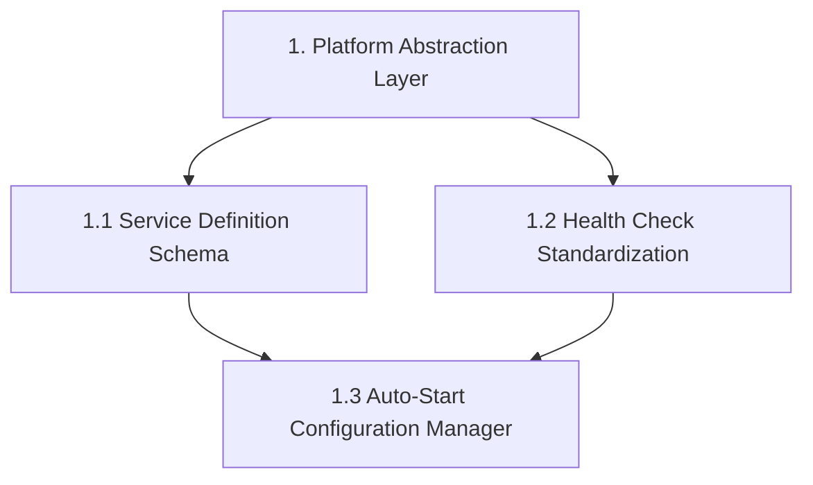
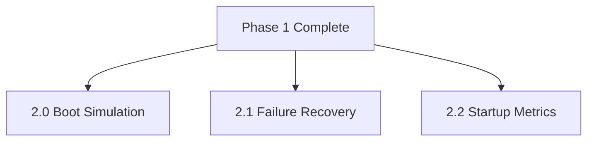
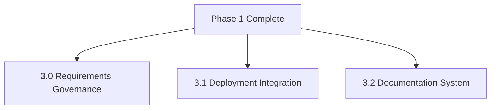
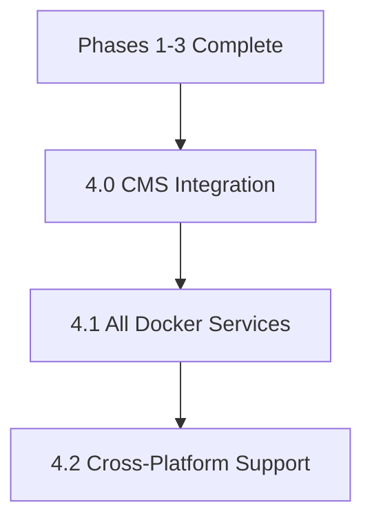
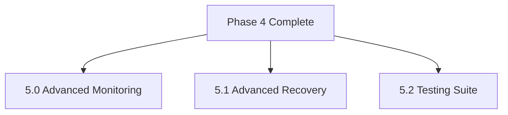
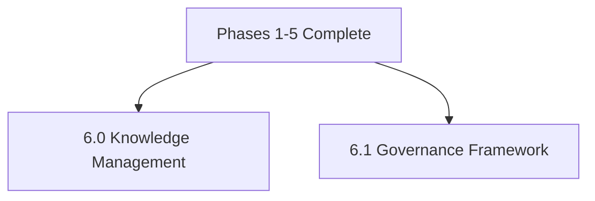
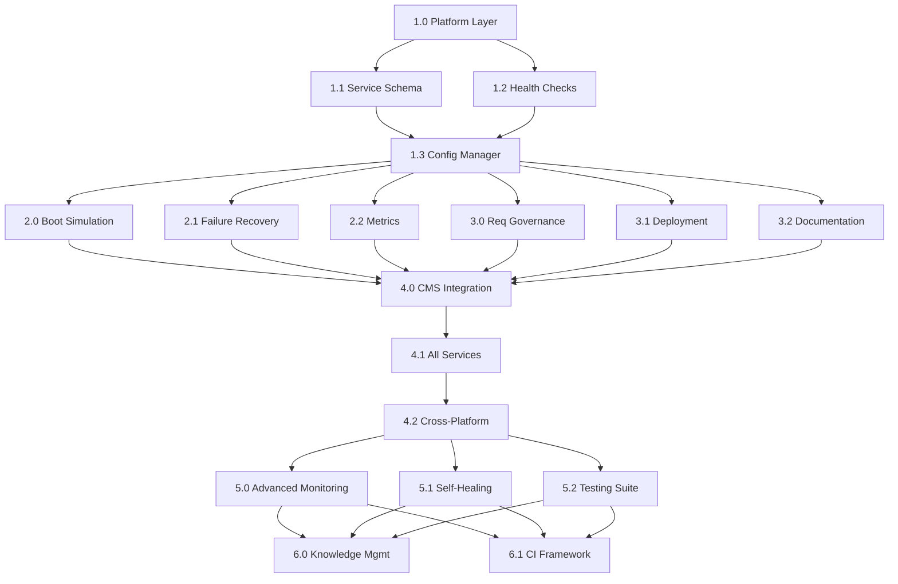

# Service Auto-Start Governance - DAG Execution Plan

**Specification:** `.kiro/specs/service-auto-start-governance/`
**Created:** 2025-10-03
**Status:** Ready for DAG Execution
**Context:** Mitigation report findings (MITIGATION_REPORT_20251003.md)

---

## Executive Summary

This DAG execution plan implements the Service Auto-Start Governance framework based on critical issues identified in the system health mitigation report. The framework addresses the requirements-to-implementation gap that caused services to be configured but never automatically started.

### Critical Issues Addressed

From `MITIGATION_REPORT_20251003.md`:
1. ✅ Cloudflare Tunnel - Needs auto-restart policy
2. ✅ Google Workspace MCP - Needs auto-restart policy
3. ✅ Directus CMS - Health check misconfiguration (IPv6/IPv4)
4. ✅ Observatory Engagement - Missing /metrics endpoint
5. ✅ Prometheus Exporters - Not deployed or misconfigured

---

## DAG Structure

### Phase 1: Foundation (Tasks 1.x) - 4 Tasks
**Dependencies:** None
**Execution Mode:** Sequential (some parallel opportunities)

**Tasks:**
- 1.0: Platform Detection and Abstraction Layer
- 1.1: Service Definition Schema and Registry
- 1.2: Health Check Standardization System
- 1.3: Auto-Start Configuration Manager

**Deliverables:**
- `src/system_architecture/autostart/platform_adapter.py`
- `src/system_architecture/autostart/service_registry.py`
- `src/system_architecture/autostart/health_check.py`
- `src/system_architecture/autostart/config_manager.py`

---

### Phase 2: Testing & Resilience (Tasks 2.x) - 3 Tasks
**Dependencies:** Phase 1 complete
**Execution Mode:** Parallel after Phase 1

**Tasks:**
- 2.0: Boot Simulation Testing System
- 2.1: Failure Recovery and Resilience
- 2.2: Startup Metrics and Monitoring

**Deliverables:**
- `src/system_architecture/autostart/boot_simulator.py`
- `src/system_architecture/autostart/recovery_manager.py`
- `src/system_architecture/autostart/metrics_collector.py`

---

### Phase 3: Governance & Documentation (Tasks 3.x) - 3 Tasks
**Dependencies:** Phase 1 complete
**Execution Mode:** Parallel with Phase 2

**Tasks:**
- 3.0: Requirements Specification Governance
- 3.1: Deployment Integration and Verification
- 3.2: Comprehensive Documentation System

**Deliverables:**
- `src/system_architecture/autostart/requirements_validator.py`
- `src/system_architecture/autostart/deployment_integrator.py`
- `src/system_architecture/autostart/doc_generator.py`

---

### Phase 4: Integration & Validation (Tasks 4.x) - 3 Tasks
**Dependencies:** Phases 1, 2, 3 complete
**Execution Mode:** Sequential (validates each service type)

**Tasks:**
- 4.0: Integrate with CMS Service (Validation)
- 4.1: Extend to All Docker Compose Services
- 4.2: Cross-Platform Support and Migration

**Deliverables:**
- Updated `docker-compose.directus-fixed.yml` with proper health checks
- LaunchAgent configurations for all services
- Service registry with all existing services
- Cross-platform migration tools

---

### Phase 5: Advanced Features (Tasks 5.x) - 3 Tasks
**Dependencies:** Phase 4 complete
**Execution Mode:** Parallel (optimization phase)

**Tasks:**
- 5.0: Advanced Monitoring and Observability
- 5.1: Advanced Failure Recovery and Self-Healing
- 5.2: Comprehensive Testing and Validation Suite

---

### Phase 6: Knowledge Management (Tasks 6.x) - 2 Tasks
**Dependencies:** All previous phases
**Execution Mode:** Parallel (documentation and training)

**Tasks:**
- 6.0: Knowledge Management and Training
- 6.1: Continuous Improvement and Governance

---

## Dependency Graph (Complete)

---

## Task Breakdown for DAG Execution

### 1.0: Platform Detection and Abstraction Layer
**Priority:** P0 (Foundation)
**Estimated Time:** 4 hours
**Dependencies:** None

**Implementation Steps:**
1. Create `src/system_architecture/autostart/__init__.py`
2. Define `PlatformAdapter` abstract base class
3. Implement `MacOSLaunchAgentAdapter`
4. Implement `LinuxSystemdAdapter`
5. Implement `DockerComposeAdapter`
6. Create platform detection logic
7. Write unit tests for each adapter

**Acceptance Criteria:**
- [ ] All platform adapters pass unit tests
- [ ] Platform detection correctly identifies macOS/Linux/Docker
- [ ] Each adapter can generate, install, and verify configurations

**Files Created:**
- `src/system_architecture/autostart/platform_adapter.py`
- `src/system_architecture/autostart/platforms/__init__.py`
- `src/system_architecture/autostart/platforms/macos.py`
- `src/system_architecture/autostart/platforms/linux.py`
- `src/system_architecture/autostart/platforms/docker.py`
- `tests/unit/system_architecture/autostart/test_platforms.py`

---

### 1.1: Service Definition Schema and Registry
**Priority:** P0 (Foundation)
**Estimated Time:** 3 hours
**Dependencies:** 1.0 (needs PlatformAdapter interface)

**Implementation Steps:**
1. Define `ServiceDefinition` dataclass
2. Create `ServiceRegistry` class
3. Implement dependency resolution algorithm
4. Add service validation logic
5. Create serialization/deserialization methods
6. Write unit tests

**Acceptance Criteria:**
- [ ] ServiceDefinition includes all required fields
- [ ] ServiceRegistry can register and retrieve services
- [ ] Dependency resolution produces correct startup order
- [ ] Validation catches incomplete service definitions

**Files Created:**
- `src/system_architecture/autostart/models.py`
- `src/system_architecture/autostart/service_registry.py`
- `tests/unit/system_architecture/autostart/test_service_registry.py`

---

### 1.2: Health Check Standardization System
**Priority:** P0 (Foundation)
**Estimated Time:** 4 hours
**Dependencies:** 1.1 (needs ServiceDefinition)

**Implementation Steps:**
1. Create `ContainerToolDetector` class
2. Implement health check templates for each tool
3. Build health check generation logic with fallbacks
4. Add health check validation system
5. Create structured health response format
6. Write integration tests

**Acceptance Criteria:**
- [ ] Tool detection works for common container images
- [ ] Health checks generated with appropriate tool fallbacks
- [ ] Health check validation catches misconfigurations
- [ ] IPv6/IPv4 compatibility issues prevented

**Files Created:**
- `src/system_architecture/autostart/health_check.py`
- `src/system_architecture/autostart/health_templates.py`
- `tests/integration/system_architecture/autostart/test_health_checks.py`

---

### 1.3: Auto-Start Configuration Manager
**Priority:** P0 (Foundation)
**Estimated Time:** 5 hours
**Dependencies:** 1.0, 1.1, 1.2 (all Phase 1 components)

**Implementation Steps:**
1. Create `AutoStartManager` class (ReflectiveModule)
2. Implement configuration generation for all platforms
3. Add configuration installation methods
4. Build verification system
5. Create rollback functionality
6. Write end-to-end tests

**Acceptance Criteria:**
- [ ] Can generate configs for macOS, Linux, Docker
- [ ] Configuration installation succeeds on target platform
- [ ] Verification confirms auto-start will work
- [ ] Rollback restores previous state on failure

**Files Created:**
- `src/system_architecture/autostart/config_manager.py`
- `tests/integration/system_architecture/autostart/test_config_manager.py`

---

### 2.0: Boot Simulation Testing System
**Priority:** P1 (Critical for validation)
**Estimated Time:** 6 hours
**Dependencies:** Phase 1 complete

**Implementation Steps:**
1. Create `BootSimulationEngine` class
2. Implement clean boot simulation
3. Add dependency ordering tests
4. Build failure scenario testing
5. Create comprehensive reporting
6. Write integration tests

**Acceptance Criteria:**
- [ ] Boot simulation stops and restarts all services correctly
- [ ] Dependency ordering verified
- [ ] Failure scenarios tested (5+ scenarios)
- [ ] Reports include timing and success metrics

**Files Created:**
- `src/system_architecture/autostart/boot_simulator.py`
- `src/system_architecture/autostart/test_scenarios.py`
- `tests/integration/system_architecture/autostart/test_boot_simulation.py`

---

### 2.1: Failure Recovery and Resilience
**Priority:** P1 (Critical for production)
**Estimated Time:** 5 hours
**Dependencies:** Phase 1 complete

**Implementation Steps:**
1. Implement exponential backoff retry logic
2. Create dependency waiting system
3. Add resource constraint handling
4. Build configuration validation
5. Create maintenance mode logic
6. Write resilience tests

**Acceptance Criteria:**
- [ ] Retry logic uses exponential backoff (1s, 2s, 4s...)
- [ ] Dependency waiting times out appropriately
- [ ] Resource constraints handled gracefully
- [ ] Maintenance mode activated after retry limits

**Files Created:**
- `src/system_architecture/autostart/recovery_manager.py`
- `src/system_architecture/autostart/retry_policies.py`
- `tests/unit/system_architecture/autostart/test_recovery.py`

---

### 2.2: Startup Metrics and Monitoring
**Priority:** P1 (Observability)
**Estimated Time:** 4 hours
**Dependencies:** Phase 1 complete

**Implementation Steps:**
1. Create `StartupMetricsCollector` with Prometheus
2. Implement metrics for duration, success, failures
3. Build `StartupLogAggregator`
4. Add pattern analysis
5. Create alerting integration
6. Write monitoring tests

**Acceptance Criteria:**
- [ ] Metrics exported to Prometheus
- [ ] Logs aggregated from all platforms
- [ ] Pattern analysis identifies issues
- [ ] Alerts triggered on failures

**Files Created:**
- `src/system_architecture/autostart/metrics_collector.py`
- `src/system_architecture/autostart/log_aggregator.py`
- `tests/unit/system_architecture/autostart/test_metrics.py`

---

### 3.0: Requirements Specification Governance
**Priority:** P2 (Process improvement)
**Estimated Time:** 4 hours
**Dependencies:** Phase 1 complete

**Implementation Steps:**
1. Create requirements validation system
2. Build requirements templates
3. Implement WHO/WHEN/HOW/WHAT checking
4. Add platform-specific requirements generation
5. Create acceptance test generation
6. Write validation tests

**Acceptance Criteria:**
- [ ] Passive voice flagged in requirements
- [ ] WHO/WHEN/HOW/WHAT completeness verified
- [ ] Templates generate proper requirements
- [ ] Acceptance tests auto-generated

**Files Created:**
- `src/system_architecture/autostart/requirements_validator.py`
- `src/system_architecture/autostart/requirements_templates.py`
- `tests/unit/system_architecture/autostart/test_requirements.py`

---

### 3.1: Deployment Integration and Verification
**Priority:** P1 (DevOps integration)
**Estimated Time:** 5 hours
**Dependencies:** Phase 1 complete

**Implementation Steps:**
1. Create deployment checklist generator
2. Build Makefile target generation
3. Implement deployment verification
4. Add service discovery integration
5. Create documentation generation
6. Write deployment tests

**Acceptance Criteria:**
- [ ] Checklists include auto-start verification
- [ ] Makefile targets work (start/stop/status/logs)
- [ ] Deployment verification catches issues
- [ ] Documentation accurate and complete

**Files Created:**
- `src/system_architecture/autostart/deployment_integrator.py`
- `src/system_architecture/autostart/makefile_generator.py`
- `tests/integration/system_architecture/autostart/test_deployment.py`

---

### 3.2: Comprehensive Documentation System
**Priority:** P2 (Enablement)
**Estimated Time:** 4 hours
**Dependencies:** Phase 1 complete

**Implementation Steps:**
1. Create platform-specific setup docs
2. Build troubleshooting guide generator
3. Implement dependency documentation
4. Add inline configuration commenting
5. Create runbook generation
6. Write documentation tests

**Acceptance Criteria:**
- [ ] Setup docs accurate for each platform
- [ ] Troubleshooting covers common issues
- [ ] Dependencies clearly documented
- [ ] Runbooks provide step-by-step procedures

**Files Created:**
- `src/system_architecture/autostart/doc_generator.py`
- `src/system_architecture/autostart/templates/` (doc templates)
- `tests/unit/system_architecture/autostart/test_documentation.py`

---

### 4.0: Integrate with CMS Service (Validation)
**Priority:** P0 (Proves framework)
**Estimated Time:** 6 hours
**Dependencies:** Phases 1, 2, 3 complete

**Implementation Steps:**
1. Apply framework to Directus CMS
2. Fix IPv6/IPv4 health check issue
3. Generate LaunchAgent configuration
4. Register CMS in service registry
5. Run boot simulation tests
6. Validate all components

**Acceptance Criteria:**
- [ ] CMS auto-starts on system boot
- [ ] Health check uses 127.0.0.1 not localhost
- [ ] Boot simulation passes
- [ ] Metrics collected properly

**Files Modified:**
- `docker-compose.directus-fixed.yml`
- Service registry configuration

**Files Created:**
- `config/autostart/directus-cms.json` (service definition)
- `~/Library/LaunchAgents/com.beastmode.directus-cms.plist`

---

### 4.1: Extend to All Docker Compose Services
**Priority:** P1 (Production readiness)
**Estimated Time:** 8 hours
**Dependencies:** 4.0 complete

**Implementation Steps:**
1. Inventory all Docker Compose services
2. Create service definitions for each
3. Generate auto-start configurations
4. Implement multi-service boot simulation
5. Add comprehensive monitoring
6. Create service dashboard

**Acceptance Criteria:**
- [ ] All services registered in registry
- [ ] Auto-start configs generated for all
- [ ] Multi-service boot simulation passes
- [ ] Dashboard shows all service status

**Services to Configure:**
- beast-mode-observatory
- observatory-engagement-manager
- observatory-grafana
- observatory-prometheus
- observatory-jaeger
- observatory-cloudflare-tunnel
- directus_cms_fixed
- directus_postgres_fixed
- directus_redis_fixed
- msp-ssl-redis
- google_workspace_mcp

---

### 4.2: Cross-Platform Support and Migration
**Priority:** P2 (Future-proofing)
**Estimated Time:** 10 hours
**Dependencies:** 4.1 complete

**Implementation Steps:**
1. Implement Kubernetes adapter
2. Implement Docker Swarm adapter
3. Create configuration migration tools
4. Add platform feature detection
5. Build migration testing
6. Create migration documentation

**Acceptance Criteria:**
- [ ] Kubernetes deployments generated
- [ ] Docker Swarm configs generated
- [ ] Migration tools work between platforms
- [ ] Feature detection handles differences

**Files Created:**
- `src/system_architecture/autostart/platforms/kubernetes.py`
- `src/system_architecture/autostart/platforms/swarm.py`
- `src/system_architecture/autostart/migration_tools.py`

---

### Tasks 5.0-6.1: Advanced Features
**Priority:** P3-P4 (Enhancements)
**Estimated Time:** 20+ hours total
**Dependencies:** Phase 4 complete

These tasks represent advanced features and can be executed as time/resources permit after core functionality is proven.

---

## Execution Strategy

### Immediate Priority (MVP - Minimum Viable Product)
**Goal:** Fix current mitigation report issues
**Timeline:** 1-2 weeks

Execute in order:
1. **Phase 1** (Tasks 1.0-1.3): Foundation - 16 hours
2. **Task 4.0**: CMS Integration - 6 hours
3. **Task 2.2**: Monitoring - 4 hours (for observability)
4. **Task 3.1**: Deployment Integration - 5 hours

**Total MVP:** ~31 hours (4 business days)

**MVP Deliverables:**
- ✅ Directus CMS health check fixed (127.0.0.1 vs localhost)
- ✅ Cloudflare tunnel auto-restart configured
- ✅ Google Workspace MCP auto-restart configured
- ✅ Framework proven with real service
- ✅ Basic monitoring in place

### Short-term Goals (Full Production)
**Goal:** All services under governance
**Timeline:** 3-4 weeks

After MVP, execute:
1. **Phase 2** (Tasks 2.0-2.1): Testing & Recovery - 11 hours
2. **Task 4.1**: All Docker Services - 8 hours
3. **Phase 3** (Tasks 3.0, 3.2): Governance & Docs - 8 hours

**Total Short-term:** +27 hours (MVP + 27 = ~58 hours / 7.5 business days)

### Long-term Goals (Advanced Features)
**Goal:** Self-healing, cross-platform, continuous improvement
**Timeline:** 2-3 months

Execute as resources allow:
1. **Task 4.2**: Cross-platform - 10 hours
2. **Phase 5**: Advanced features - 15+ hours
3. **Phase 6**: Knowledge management - 8+ hours

---

## Risk Mitigation

### Technical Risks
| Risk | Mitigation | Owner |
|------|-----------|-------|
| Platform incompatibility | Test on all target platforms before rollout | DevOps |
| Health check tool unavailability | Multi-tool fallback strategy | Development |
| Service dependency complexity | Gradual rollout, start with simple services | Architecture |
| Performance impact | Monitoring from day 1, optimization built in | Operations |

### Operational Risks
| Risk | Mitigation | Owner |
|------|-----------|-------|
| Team adoption resistance | Prove value with CMS first, clear benefits | Management |
| Existing service disruption | Rollback procedures, careful migration | DevOps |
| Documentation drift | Automated generation where possible | Development |
| Knowledge transfer gaps | Training materials, comprehensive docs | Team Lead |

---

## Success Metrics

### MVP Success Criteria
- [ ] Directus CMS auto-starts on boot without manual intervention
- [ ] Health check passes (no IPv6/IPv4 issues)
- [ ] Cloudflare tunnel auto-restarts on failure
- [ ] Google Workspace MCP auto-starts on boot
- [ ] Boot simulation test passes for CMS
- [ ] Startup metrics visible in Prometheus

### Full Production Success Criteria
- [ ] All 11 Docker services auto-start reliably
- [ ] Multi-service boot completes in <120 seconds
- [ ] Zero manual intervention required for service availability
- [ ] Comprehensive monitoring dashboards operational
- [ ] Deployment checklists include auto-start verification

### Long-term Success Criteria
- [ ] Cross-platform deployment capability (K8s, Swarm)
- [ ] Self-healing reduces manual intervention by 90%
- [ ] Complete audit trails for compliance
- [ ] Team fully trained and adopting framework
- [ ] Continuous improvement process established

---

## Next Steps

### Immediate Actions (Today)
1. **Create DAG orchestrator script** for automated execution
2. **Set up project structure** (`src/system_architecture/autostart/`)
3. **Create initial test framework** structure
4. **Validate mitigation report** issues map to tasks

### This Week
1. **Execute Phase 1** (Tasks 1.0-1.3) - Foundation
2. **Execute Task 4.0** - CMS Integration (MVP validation)
3. **Execute Task 2.2** - Monitoring (observability)
4. **Review progress** and adjust timeline

### Next Week
1. **Execute Phase 2** - Testing & Recovery
2. **Execute Task 4.1** - All Docker Services
3. **Execute Phase 3 (partial)** - Governance & Docs
4. **Production readiness review**

---

## Appendix: Task Dependencies Matrix

| Task | Depends On | Blocks | Parallel With |
|------|-----------|--------|---------------|
| 1.0 | None | 1.1, 1.2 | None |
| 1.1 | 1.0 | 1.3 | 1.2 |
| 1.2 | 1.0 | 1.3 | 1.1 |
| 1.3 | 1.0, 1.1, 1.2 | Phase 2, 3 | None |
| 2.0 | 1.3 | 4.0 | 2.1, 2.2, Phase 3 |
| 2.1 | 1.3 | 4.0 | 2.0, 2.2, Phase 3 |
| 2.2 | 1.3 | 4.0 | 2.0, 2.1, Phase 3 |
| 3.0 | 1.3 | 4.0 | 3.1, 3.2, Phase 2 |
| 3.1 | 1.3 | 4.0 | 3.0, 3.2, Phase 2 |
| 3.2 | 1.3 | 4.0 | 3.0, 3.1, Phase 2 |
| 4.0 | Phase 1-3 | 4.1 | None |
| 4.1 | 4.0 | 4.2 | None |
| 4.2 | 4.1 | Phase 5 | None |
| 5.0 | 4.2 | Phase 6 | 5.1, 5.2 |
| 5.1 | 4.2 | Phase 6 | 5.0, 5.2 |
| 5.2 | 4.2 | Phase 6 | 5.0, 5.1 |
| 6.0 | Phase 5 | None | 6.1 |
| 6.1 | Phase 5 | None | 6.0 |

---

**Document Status:** Ready for DAG Execution
**Last Updated:** 2025-10-03
**Next Review:** After MVP completion
