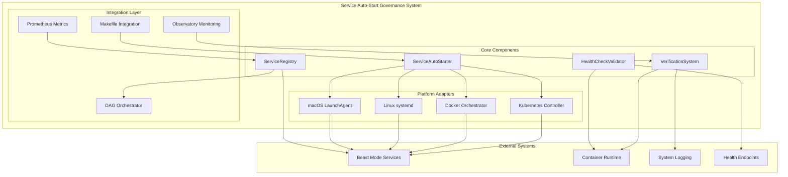
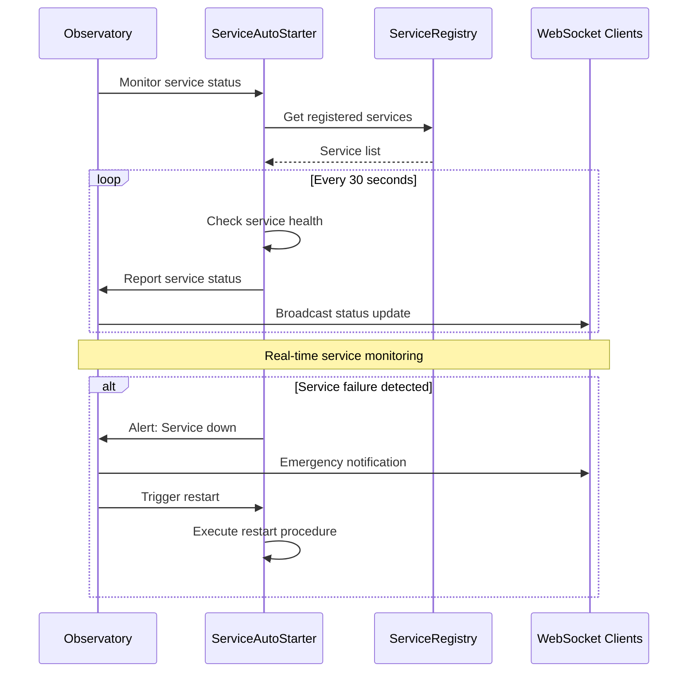
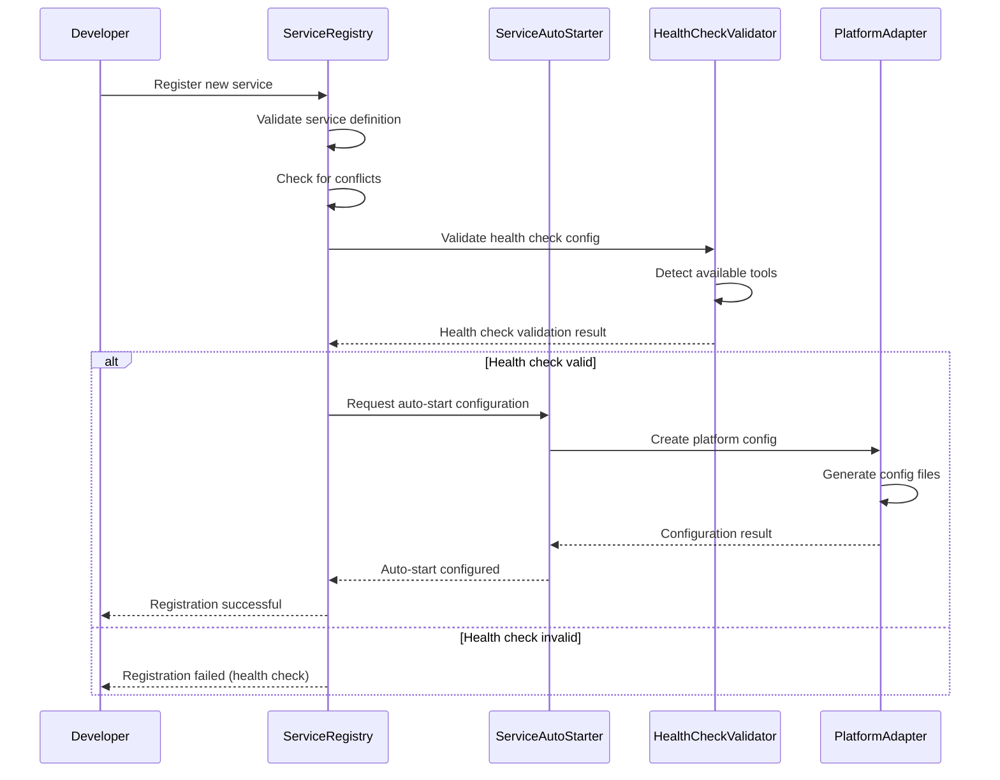
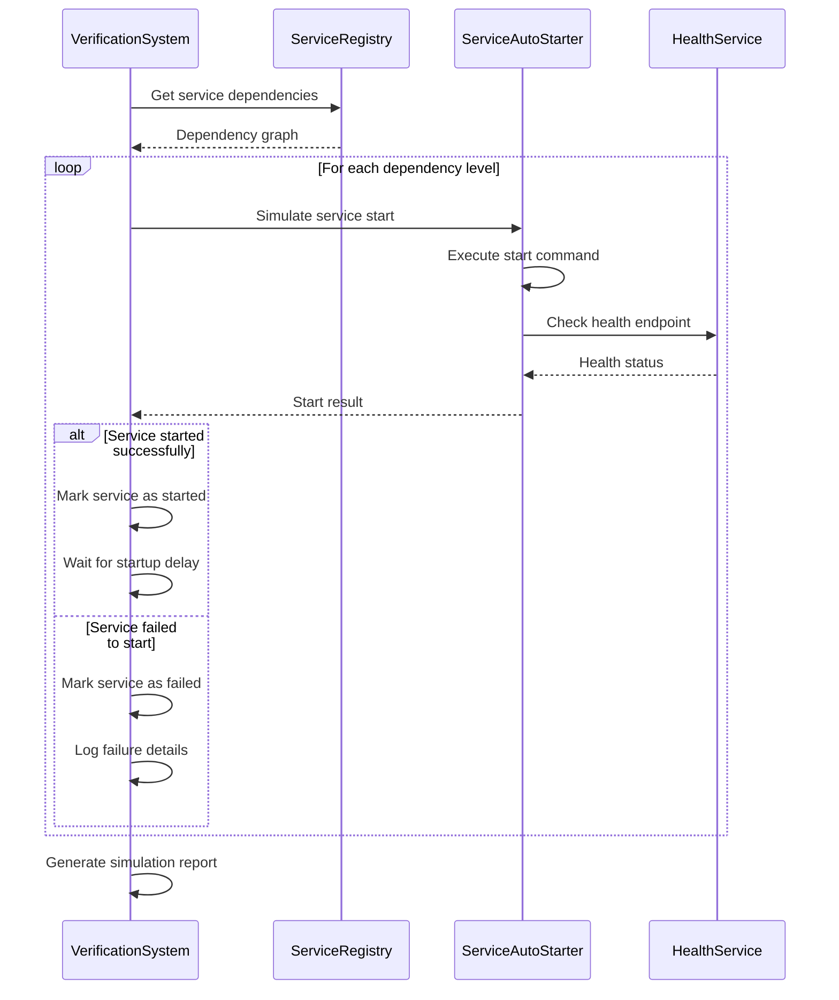

# Service Auto-Start Governance Design

## Overview

The Service Auto-Start Governance system provides a comprehensive, platform-agnostic framework for ensuring critical services automatically start when systems boot. This design addresses the fundamental requirements-to-implementation gap identified in the CMS auto-start root cause analysis, where passive requirements like "service SHALL be available" failed to specify active auto-start mechanisms.

## System Architecture

### High-Level Architecture



### Component Architecture

#### 1. ServiceAutoStarter - Core Orchestration Engine

The ServiceAutoStarter is the central component responsible for platform-agnostic auto-start configuration management.

```python
from src.rm_ddd.core.unified_reflective_module import ReflectiveModule
from typing import Dict, List, Optional, Any
from dataclasses import dataclass
from enum import Enum

class AutoStartPlatform(Enum):
    MACOS_LAUNCHAGENT = "macos_launchagent"
    LINUX_SYSTEMD = "linux_systemd"
    DOCKER_COMPOSE = "docker_compose"
    DOCKER_SWARM = "docker_swarm"
    KUBERNETES = "kubernetes"

@dataclass
class AutoStartConfig:
    service_name: str
    platform: AutoStartPlatform
    start_command: List[str]
    working_directory: str
    environment_vars: Dict[str, str]
    dependencies: List[str]
    health_check: 'HealthCheckConfig'
    restart_policy: str
    timeout_seconds: int
    log_path: str

@dataclass
class AutoStartResult:
    success: bool
    platform_config_path: str
    service_id: str
    error_message: Optional[str]
    verification_commands: List[str]

class ServiceAutoStarter(ReflectiveModule):
    """Platform-agnostic auto-start configuration manager."""
    
    def __init__(self):
        super().__init__()
        self.register_health_check("platform_detection", self._check_platform)
        self.register_metric("autostart_configurations_total", "counter")
        self.register_metric("autostart_success_rate", "gauge")
        self._platform_adapters = self._initialize_adapters()
    
    def configure_autostart(
        self,
        service_name: str,
        platform: AutoStartPlatform,
        config: AutoStartConfig
    ) -> AutoStartResult:
        """Configure auto-start for a service on the specified platform."""
        try:
            adapter = self._platform_adapters[platform]
            result = adapter.create_autostart_config(config)
            
            if result.success:
                self._register_service(service_name, config, result)
                self.increment_metric("autostart_configurations_total")
            
            return result
            
        except Exception as e:
            return AutoStartResult(
                success=False,
                platform_config_path="",
                service_id="",
                error_message=str(e),
                verification_commands=[]
            )
    
    def verify_autostart(self, service_name: str) -> VerificationResult:
        """Verify that auto-start configuration is working correctly."""
        service_config = self._get_service_config(service_name)
        if not service_config:
            return VerificationResult(
                success=False,
                error_message=f"Service {service_name} not found in registry"
            )
        
        adapter = self._platform_adapters[service_config.platform]
        return adapter.verify_autostart(service_config)
    
    def test_boot_scenario(self, service_name: str) -> TestResult:
        """Test service startup in simulated boot scenario."""
        service_config = self._get_service_config(service_name)
        verification_system = VerificationSystem()
        
        return verification_system.run_boot_simulation(service_name, service_config)
    
    def rollback(self, service_name: str) -> RollbackResult:
        """Remove auto-start configuration and restore previous state."""
        service_config = self._get_service_config(service_name)
        if not service_config:
            return RollbackResult(success=False, error_message="Service not found")
        
        adapter = self._platform_adapters[service_config.platform]
        result = adapter.remove_autostart_config(service_config)
        
        if result.success:
            self._unregister_service(service_name)
        
        return result
    
    def get_health_status(self) -> Dict[str, Any]:
        """Get health status of auto-start system."""
        return {
            "platform": self._detect_platform(),
            "registered_services": len(self._service_registry),
            "platform_adapters": list(self._platform_adapters.keys()),
            "last_verification": self._last_verification_time
        }
```

#### 2. HealthCheckValidator - Container-Aware Health Validation

The HealthCheckValidator ensures health checks use only tools available in container images and provides robust validation.

```python
@dataclass
class HealthCheckConfig:
    endpoint: str
    method: str  # GET, POST, etc.
    expected_status: int
    timeout_seconds: int
    interval_seconds: int
    retries: int
    tools_required: List[str]  # wget, nc, python, etc.
    custom_command: Optional[str]

@dataclass
class ValidationResult:
    success: bool
    available_tools: List[str]
    missing_tools: List[str]
    recommended_config: Optional[HealthCheckConfig]
    error_message: Optional[str]

class HealthCheckValidator(ReflectiveModule):
    """Container-aware health check validation."""
    
    def __init__(self):
        super().__init__()
        self.register_health_check("tool_detection", self._check_tool_detection)
        self.register_metric("health_check_validations_total", "counter")
        self.register_metric("health_check_success_rate", "gauge")
    
    def detect_available_tools(self, container_image: str) -> List[str]:
        """Detect which health check tools are available in container image."""
        common_tools = [
            "wget", "curl", "nc", "netcat", "python", "python3",
            "sh", "bash", "ps", "pgrep", "test", "ping"
        ]
        
        available_tools = []
        
        # Test each tool in the container
        for tool in common_tools:
            if self._test_tool_in_container(container_image, tool):
                available_tools.append(tool)
        
        return available_tools
    
    def validate_health_check(
        self,
        health_check: HealthCheckConfig,
        available_tools: List[str]
    ) -> ValidationResult:
        """Validate health check configuration against available tools."""
        missing_tools = [
            tool for tool in health_check.tools_required 
            if tool not in available_tools
        ]
        
        if missing_tools:
            # Generate alternative configuration
            recommended_config = self._generate_alternative_config(
                health_check, available_tools
            )
            
            return ValidationResult(
                success=False,
                available_tools=available_tools,
                missing_tools=missing_tools,
                recommended_config=recommended_config,
                error_message=f"Missing tools: {', '.join(missing_tools)}"
            )
        
        return ValidationResult(
            success=True,
            available_tools=available_tools,
            missing_tools=[],
            recommended_config=None,
            error_message=None
        )
    
    def generate_health_check(
        self,
        service: ServiceConfig,
        available_tools: List[str]
    ) -> HealthCheckConfig:
        """Generate optimal health check configuration for available tools."""
        
        # Priority order: wget > curl > nc > python > custom
        if "wget" in available_tools:
            return HealthCheckConfig(
                endpoint=f"http://localhost:{service.port}/health",
                method="GET",
                expected_status=200,
                timeout_seconds=30,
                interval_seconds=30,
                retries=3,
                tools_required=["wget"],
                custom_command=f"wget --no-verbose --tries=1 --spider http://localhost:{service.port}/health"
            )
        
        elif "curl" in available_tools:
            return HealthCheckConfig(
                endpoint=f"http://localhost:{service.port}/health",
                method="GET",
                expected_status=200,
                timeout_seconds=30,
                interval_seconds=30,
                retries=3,
                tools_required=["curl"],
                custom_command=f"curl -f http://localhost:{service.port}/health"
            )
        
        elif "nc" in available_tools:
            return HealthCheckConfig(
                endpoint=f"localhost:{service.port}",
                method="TCP",
                expected_status=0,
                timeout_seconds=10,
                interval_seconds=30,
                retries=3,
                tools_required=["nc"],
                custom_command=f"nc -z localhost {service.port}"
            )
        
        else:
            # Fallback to basic process check
            return HealthCheckConfig(
                endpoint="",
                method="PROCESS",
                expected_status=0,
                timeout_seconds=10,
                interval_seconds=30,
                retries=3,
                tools_required=["ps"],
                custom_command=f"ps aux | grep {service.process_name} | grep -v grep"
            )
```

#### 3. ServiceRegistry - Central Service Catalog

The ServiceRegistry maintains a comprehensive catalog of all Beast Mode services and their dependencies.

```python
@dataclass
class ServiceDefinition:
    name: str
    description: str
    port: int
    process_name: str
    container_image: str
    dependencies: List[str]
    health_endpoint: str
    startup_timeout: int
    priority: int  # 1=critical, 2=important, 3=optional
    platform_configs: Dict[AutoStartPlatform, Any]

@dataclass
class ServiceDependency:
    service_name: str
    dependency_name: str
    dependency_type: str  # "hard", "soft", "optional"
    startup_delay: int  # seconds to wait after dependency starts

@dataclass
class RegistrationResult:
    success: bool
    service_id: str
    conflicts: List[str]
    error_message: Optional[str]

class ServiceRegistry(ReflectiveModule):
    """Central catalog of all Beast Mode services."""
    
    def __init__(self):
        super().__init__()
        self.register_health_check("registry_integrity", self._check_registry_integrity)
        self.register_metric("registered_services_total", "gauge")
        self.register_metric("dependency_violations_total", "counter")
        self._services: Dict[str, ServiceDefinition] = {}
        self._dependency_graph = DependencyGraph()
    
    def register_service(self, service: ServiceDefinition) -> RegistrationResult:
        """Register a new service in the catalog."""
        
        # Check for conflicts
        conflicts = self._check_conflicts(service)
        if conflicts:
            return RegistrationResult(
                success=False,
                service_id="",
                conflicts=conflicts,
                error_message=f"Conflicts detected: {', '.join(conflicts)}"
            )
        
        # Validate dependencies
        missing_deps = [
            dep for dep in service.dependencies 
            if dep not in self._services
        ]
        
        if missing_deps:
            return RegistrationResult(
                success=False,
                service_id="",
                conflicts=[],
                error_message=f"Missing dependencies: {', '.join(missing_deps)}"
            )
        
        # Register service
        self._services[service.name] = service
        self._dependency_graph.add_service(service)
        
        # Update metrics
        self.set_metric("registered_services_total", len(self._services))
        
        return RegistrationResult(
            success=True,
            service_id=service.name,
            conflicts=[],
            error_message=None
        )
    
    def get_service_dependencies(self, service_name: str) -> List[ServiceDependency]:
        """Get all dependencies for a service."""
        if service_name not in self._services:
            return []
        
        service = self._services[service_name]
        dependencies = []
        
        for dep_name in service.dependencies:
            dep_service = self._services.get(dep_name)
            if dep_service:
                dependencies.append(ServiceDependency(
                    service_name=service_name,
                    dependency_name=dep_name,
                    dependency_type="hard",  # Default to hard dependency
                    startup_delay=10  # Default 10 second delay
                ))
        
        return dependencies
    
    def verify_all_autostart(self) -> RegistryStatus:
        """Verify auto-start configuration for all registered services."""
        status = RegistryStatus()
        
        for service_name, service in self._services.items():
            verification = self._verify_service_autostart(service)
            status.add_service_status(service_name, verification)
        
        return status
    
    def get_dependency_graph(self) -> DependencyGraph:
        """Get the complete service dependency graph."""
        return self._dependency_graph
    
    def get_startup_order(self) -> List[List[str]]:
        """Get services grouped by startup order (topological sort)."""
        return self._dependency_graph.get_topological_order()
```

#### 4. VerificationSystem - Automated Testing and Validation

The VerificationSystem provides comprehensive testing capabilities for auto-start configurations.

```python
@dataclass
class SimulationResult:
    success: bool
    services_started: List[str]
    services_failed: List[str]
    total_startup_time: float
    error_details: Dict[str, str]

@dataclass
class DeploymentResult:
    success: bool
    platform_verified: bool
    health_checks_passed: bool
    dependencies_satisfied: bool
    error_message: Optional[str]

class VerificationSystem(ReflectiveModule):
    """Automated verification and testing."""
    
    def __init__(self):
        super().__init__()
        self.register_health_check("simulation_capability", self._check_simulation)
        self.register_metric("boot_simulations_total", "counter")
        self.register_metric("simulation_success_rate", "gauge")
    
    def run_boot_simulation(self, service_name: str) -> SimulationResult:
        """Run simulated boot scenario for service."""
        start_time = time.time()
        
        try:
            # Get service configuration
            service_registry = ServiceRegistry()
            service = service_registry.get_service(service_name)
            
            if not service:
                return SimulationResult(
                    success=False,
                    services_started=[],
                    services_failed=[service_name],
                    total_startup_time=0,
                    error_details={service_name: "Service not found in registry"}
                )
            
            # Simulate dependency startup
            dependencies = service_registry.get_service_dependencies(service_name)
            started_services = []
            failed_services = []
            
            for dep in dependencies:
                dep_result = self._simulate_service_start(dep.dependency_name)
                if dep_result.success:
                    started_services.append(dep.dependency_name)
                    time.sleep(dep.startup_delay)  # Simulate startup delay
                else:
                    failed_services.append(dep.dependency_name)
            
            # Simulate main service startup
            main_result = self._simulate_service_start(service_name)
            if main_result.success:
                started_services.append(service_name)
            else:
                failed_services.append(service_name)
            
            total_time = time.time() - start_time
            
            return SimulationResult(
                success=len(failed_services) == 0,
                services_started=started_services,
                services_failed=failed_services,
                total_startup_time=total_time,
                error_details={}
            )
            
        except Exception as e:
            return SimulationResult(
                success=False,
                services_started=[],
                services_failed=[service_name],
                total_startup_time=time.time() - start_time,
                error_details={service_name: str(e)}
            )
    
    def verify_deployment(self, service_name: str) -> DeploymentResult:
        """Verify service deployment and auto-start configuration."""
        
        # Check platform compatibility
        platform_verified = self._verify_platform_compatibility(service_name)
        
        # Check health endpoints
        health_checks_passed = self._verify_health_checks(service_name)
        
        # Check dependencies
        dependencies_satisfied = self._verify_dependencies(service_name)
        
        success = platform_verified and health_checks_passed and dependencies_satisfied
        
        return DeploymentResult(
            success=success,
            platform_verified=platform_verified,
            health_checks_passed=health_checks_passed,
            dependencies_satisfied=dependencies_satisfied,
            error_message=None if success else "Deployment verification failed"
        )
    
    def generate_deployment_checklist(self, service_name: str) -> Checklist:
        """Generate deployment checklist for service."""
        
        checklist_items = [
            "Service registered in ServiceRegistry",
            "Auto-start configuration created",
            "Health check validated with available tools",
            "Dependencies verified and ordered",
            "Platform-specific configuration tested",
            "Boot simulation passed",
            "Monitoring and logging configured",
            "Rollback procedure documented"
        ]
        
        return Checklist(
            service_name=service_name,
            items=checklist_items,
            completion_status={item: False for item in checklist_items}
        )
```

## Platform Implementations

### macOS LaunchAgent Implementation

```python
class MacOSLaunchAgentAdapter:
    """macOS LaunchAgent auto-start implementation."""
    
    def create_autostart_config(self, config: AutoStartConfig) -> AutoStartResult:
        """Create LaunchAgent plist file for macOS auto-start."""
        
        plist_content = f"""<?xml version="1.0" encoding="UTF-8"?>
<!DOCTYPE plist PUBLIC "-//Apple//DTD PLIST 1.0//EN" "http://www.apple.com/DTDs/PropertyList-1.0.dtd">
<plist version="1.0">
<dict>
    <key>Label</key>
    <string>com.beastmode.{config.service_name}</string>

    <key>ProgramArguments</key>
    <array>
        {self._format_command_array(config.start_command)}
    </array>

    <key>WorkingDirectory</key>
    <string>{config.working_directory}</string>

    <key>RunAtLoad</key>
    <true/>

    <key>KeepAlive</key>
    <dict>
        <key>SuccessfulExit</key>
        <false/>
    </dict>

    <key>StandardOutPath</key>
    <string>{config.log_path}.out</string>

    <key>StandardErrorPath</key>
    <string>{config.log_path}.err</string>

    <key>EnvironmentVariables</key>
    <dict>
        {self._format_environment_vars(config.environment_vars)}
    </dict>
</dict>
</plist>"""
        
        plist_path = f"/Users/{os.getenv('USER')}/Library/LaunchAgents/com.beastmode.{config.service_name}.plist"
        
        try:
            with open(plist_path, 'w') as f:
                f.write(plist_content)
            
            # Load the LaunchAgent
            subprocess.run(['launchctl', 'load', plist_path], check=True)
            
            return AutoStartResult(
                success=True,
                platform_config_path=plist_path,
                service_id=f"com.beastmode.{config.service_name}",
                error_message=None,
                verification_commands=[
                    f"launchctl list | grep {config.service_name}",
                    f"cat {plist_path}"
                ]
            )
            
        except Exception as e:
            return AutoStartResult(
                success=False,
                platform_config_path=plist_path,
                service_id="",
                error_message=str(e),
                verification_commands=[]
            )
```

### Linux systemd Implementation

```python
class LinuxSystemdAdapter:
    """Linux systemd auto-start implementation."""
    
    def create_autostart_config(self, config: AutoStartConfig) -> AutoStartResult:
        """Create systemd service file for Linux auto-start."""
        
        service_content = f"""[Unit]
Description={config.service_name} - Beast Mode Service
Requires=docker.service
After=docker.service network.target
{self._format_dependencies(config.dependencies)}

[Service]
Type=oneshot
RemainAfterExit=yes
WorkingDirectory={config.working_directory}
ExecStart={' '.join(config.start_command)}
ExecStop={self._generate_stop_command(config)}
TimeoutStartSec={config.timeout_seconds}
Restart={config.restart_policy}
RestartSec=10

{self._format_environment_vars(config.environment_vars)}

StandardOutput=journal
StandardError=journal
SyslogIdentifier={config.service_name}

[Install]
WantedBy=multi-user.target
"""
        
        service_path = f"/etc/systemd/system/{config.service_name}.service"
        
        try:
            # Write service file
            with open(service_path, 'w') as f:
                f.write(service_content)
            
            # Reload systemd and enable service
            subprocess.run(['systemctl', 'daemon-reload'], check=True)
            subprocess.run(['systemctl', 'enable', f"{config.service_name}.service"], check=True)
            
            return AutoStartResult(
                success=True,
                platform_config_path=service_path,
                service_id=f"{config.service_name}.service",
                error_message=None,
                verification_commands=[
                    f"systemctl status {config.service_name}",
                    f"systemctl is-enabled {config.service_name}",
                    f"journalctl -u {config.service_name}"
                ]
            )
            
        except Exception as e:
            return AutoStartResult(
                success=False,
                platform_config_path=service_path,
                service_id="",
                error_message=str(e),
                verification_commands=[]
            )
```

### Docker Implementation

```python
class DockerAdapter:
    """Docker auto-start implementation."""
    
    def create_autostart_config(self, config: AutoStartConfig) -> AutoStartResult:
        """Create Docker Compose configuration with restart policies."""
        
        compose_service = {
            config.service_name: {
                "image": config.container_image,
                "restart": config.restart_policy,
                "environment": config.environment_vars,
                "working_dir": config.working_directory,
                "healthcheck": {
                    "test": config.health_check.custom_command,
                    "interval": f"{config.health_check.interval_seconds}s",
                    "timeout": f"{config.health_check.timeout_seconds}s",
                    "retries": config.health_check.retries,
                    "start_period": "60s"
                },
                "depends_on": config.dependencies,
                "logging": {
                    "driver": "json-file",
                    "options": {
                        "max-size": "10m",
                        "max-file": "3"
                    }
                }
            }
        }
        
        compose_path = f"{config.working_directory}/docker-compose.{config.service_name}.yml"
        
        try:
            compose_content = {
                "version": "3.8",
                "services": compose_service
            }
            
            with open(compose_path, 'w') as f:
                yaml.dump(compose_content, f, default_flow_style=False)
            
            return AutoStartResult(
                success=True,
                platform_config_path=compose_path,
                service_id=config.service_name,
                error_message=None,
                verification_commands=[
                    f"docker-compose -f {compose_path} config",
                    f"docker-compose -f {compose_path} up -d",
                    f"docker-compose -f {compose_path} ps"
                ]
            )
            
        except Exception as e:
            return AutoStartResult(
                success=False,
                platform_config_path=compose_path,
                service_id="",
                error_message=str(e),
                verification_commands=[]
            )
```

## Data Models

### Complete Data Model Definitions

```python
from dataclasses import dataclass, field
from typing import Dict, List, Optional, Any
from enum import Enum
from datetime import datetime

@dataclass
class ServiceDefinition:
    """Complete service definition for auto-start management."""
    name: str
    description: str
    port: int
    process_name: str
    container_image: str
    dependencies: List[str] = field(default_factory=list)
    health_endpoint: str = "/health"
    startup_timeout: int = 120
    priority: int = 2  # 1=critical, 2=important, 3=optional
    platform_configs: Dict[AutoStartPlatform, Any] = field(default_factory=dict)
    tags: List[str] = field(default_factory=list)
    owner: str = ""
    documentation_url: str = ""

@dataclass
class HealthCheckConfig:
    """Health check configuration with container-aware tool selection."""
    endpoint: str
    method: str = "GET"
    expected_status: int = 200
    timeout_seconds: int = 30
    interval_seconds: int = 30
    retries: int = 3
    tools_required: List[str] = field(default_factory=list)
    custom_command: Optional[str] = None
    failure_threshold: int = 3
    success_threshold: int = 1

@dataclass
class PlatformConfig:
    """Platform-specific configuration parameters."""
    platform: AutoStartPlatform
    config_path: str
    service_manager: str  # launchctl, systemctl, docker-compose, kubectl
    start_command: List[str]
    stop_command: List[str]
    status_command: List[str]
    log_command: List[str]
    additional_params: Dict[str, Any] = field(default_factory=dict)

@dataclass
class DependencyGraph:
    """Service dependency graph with topological ordering."""
    nodes: Dict[str, ServiceDefinition] = field(default_factory=dict)
    edges: Dict[str, List[str]] = field(default_factory=dict)
    
    def add_service(self, service: ServiceDefinition):
        """Add service to dependency graph."""
        self.nodes[service.name] = service
        self.edges[service.name] = service.dependencies
    
    def get_topological_order(self) -> List[List[str]]:
        """Get services grouped by startup order."""
        # Implementation of Kahn's algorithm for topological sorting
        in_degree = {node: 0 for node in self.nodes}
        
        # Calculate in-degrees
        for node in self.edges:
            for neighbor in self.edges[node]:
                if neighbor in in_degree:
                    in_degree[neighbor] += 1
        
        # Group services by startup level
        levels = []
        remaining = set(self.nodes.keys())
        
        while remaining:
            # Find nodes with no dependencies
            current_level = [node for node in remaining if in_degree[node] == 0]
            
            if not current_level:
                # Circular dependency detected
                raise ValueError(f"Circular dependency detected in services: {remaining}")
            
            levels.append(current_level)
            
            # Remove current level nodes and update in-degrees
            for node in current_level:
                remaining.remove(node)
                for neighbor in self.edges.get(node, []):
                    if neighbor in in_degree:
                        in_degree[neighbor] -= 1
        
        return levels

@dataclass
class VerificationResult:
    """Result of auto-start verification."""
    success: bool
    service_name: str
    platform: AutoStartPlatform
    config_valid: bool
    service_running: bool
    health_check_passed: bool
    dependencies_satisfied: bool
    error_message: Optional[str] = None
    verification_time: datetime = field(default_factory=datetime.now)
    remediation_steps: List[str] = field(default_factory=list)

@dataclass
class Checklist:
    """Deployment checklist for service auto-start."""
    service_name: str
    items: List[str]
    completion_status: Dict[str, bool]
    created_at: datetime = field(default_factory=datetime.now)
    completed_at: Optional[datetime] = None
    
    def mark_complete(self, item: str):
        """Mark checklist item as complete."""
        if item in self.completion_status:
            self.completion_status[item] = True
            
            # Check if all items are complete
            if all(self.completion_status.values()):
                self.completed_at = datetime.now()
    
    def get_completion_percentage(self) -> float:
        """Get completion percentage."""
        if not self.completion_status:
            return 0.0
        
        completed = sum(1 for status in self.completion_status.values() if status)
        return (completed / len(self.completion_status)) * 100.0
```

## Integration Architecture

### Makefile System Integration

The auto-start system integrates seamlessly with the existing Makefile system to provide consistent service management commands.

```makefile
# Auto-generated service management targets
.PHONY: service-start service-stop service-status service-logs service-health

# Service management commands
service-start:
	@echo "Starting all registered services..."
	@python -c "from src.service_autostart import ServiceAutoStarter; ServiceAutoStarter().start_all_services()"

service-stop:
	@echo "Stopping all registered services..."
	@python -c "from src.service_autostart import ServiceAutoStarter; ServiceAutoStarter().stop_all_services()"

service-status:
	@echo "Service status:"
	@python -c "from src.service_autostart import ServiceRegistry; ServiceRegistry().show_status()"

service-logs:
	@echo "Recent service logs:"
	@python -c "from src.service_autostart import ServiceAutoStarter; ServiceAutoStarter().show_recent_logs()"

service-health:
	@echo "Service health checks:"
	@python -c "from src.service_autostart import HealthCheckValidator; HealthCheckValidator().check_all_services()"

# Individual service targets (auto-generated)
directus-start:
	@python -c "from src.service_autostart import ServiceAutoStarter; ServiceAutoStarter().start_service('directus')"

directus-stop:
	@python -c "from src.service_autostart import ServiceAutoStarter; ServiceAutoStarter().stop_service('directus')"

directus-status:
	@python -c "from src.service_autostart import ServiceAutoStarter; ServiceAutoStarter().get_service_status('directus')"

# Auto-start configuration targets
configure-autostart:
	@echo "Configuring auto-start for all services..."
	@python scripts/configure_service_autostart.py

verify-autostart:
	@echo "Verifying auto-start configuration..."
	@python scripts/verify_service_autostart.py

test-boot-scenario:
	@echo "Testing boot scenario simulation..."
	@python scripts/test_boot_scenario.py
```

### Observatory Integration



### Prometheus Metrics Integration

```python
class ServiceAutoStartMetrics:
    """Prometheus metrics for service auto-start system."""
    
    def __init__(self):
        self.service_start_duration = Histogram(
            'service_start_duration_seconds',
            'Time taken to start a service',
            ['service_name', 'platform']
        )
        
        self.service_health_check_duration = Histogram(
            'service_health_check_duration_seconds',
            'Time taken for health check',
            ['service_name', 'check_type']
        )
        
        self.service_restart_count = Counter(
            'service_restart_total',
            'Total number of service restarts',
            ['service_name', 'reason']
        )
        
        self.service_availability = Gauge(
            'service_availability',
            'Service availability (1=up, 0=down)',
            ['service_name']
        )
        
        self.autostart_config_errors = Counter(
            'autostart_config_errors_total',
            'Total auto-start configuration errors',
            ['service_name', 'platform', 'error_type']
        )
```

## Failure Handling & Recovery

### Failure Classification and Response

```python
class FailureHandler:
    """Systematic failure handling for service auto-start."""
    
    def handle_startup_failure(self, service_name: str, error: Exception) -> RecoveryAction:
        """Handle service startup failure with appropriate recovery action."""
        
        failure_type = self._classify_failure(error)
        
        recovery_actions = {
            FailureType.DEPENDENCY_UNAVAILABLE: self._handle_dependency_failure,
            FailureType.RESOURCE_EXHAUSTION: self._handle_resource_failure,
            FailureType.CONFIGURATION_ERROR: self._handle_config_failure,
            FailureType.NETWORK_CONNECTIVITY: self._handle_network_failure,
            FailureType.PERMISSION_DENIED: self._handle_permission_failure,
            FailureType.UNKNOWN: self._handle_unknown_failure
        }
        
        handler = recovery_actions.get(failure_type, self._handle_unknown_failure)
        return handler(service_name, error)
    
    def _handle_dependency_failure(self, service_name: str, error: Exception) -> RecoveryAction:
        """Handle dependency-related failures."""
        return RecoveryAction(
            action_type=RecoveryActionType.WAIT_AND_RETRY,
            retry_delay=30,
            max_retries=10,
            escalation_threshold=5,
            remediation_steps=[
                "Check dependency service status",
                "Verify dependency health checks",
                "Review service startup order",
                "Check network connectivity between services"
            ]
        )
    
    def _handle_resource_failure(self, service_name: str, error: Exception) -> RecoveryAction:
        """Handle resource exhaustion failures."""
        return RecoveryAction(
            action_type=RecoveryActionType.QUEUE_WITH_BACKOFF,
            retry_delay=60,
            max_retries=5,
            escalation_threshold=3,
            remediation_steps=[
                "Check available system memory",
                "Check available disk space",
                "Review CPU utilization",
                "Consider scaling resources",
                "Check for resource leaks in other services"
            ]
        )
```

### Exponential Backoff Implementation

```python
class ExponentialBackoff:
    """Exponential backoff with jitter for service restart attempts."""
    
    def __init__(self, base_delay: float = 1.0, max_delay: float = 60.0, jitter: bool = True):
        self.base_delay = base_delay
        self.max_delay = max_delay
        self.jitter = jitter
        self.attempt = 0
    
    def get_delay(self) -> float:
        """Get delay for current attempt."""
        delay = min(self.base_delay * (2 ** self.attempt), self.max_delay)
        
        if self.jitter:
            # Add random jitter to prevent thundering herd
            delay *= (0.5 + random.random() * 0.5)
        
        self.attempt += 1
        return delay
    
    def reset(self):
        """Reset attempt counter."""
        self.attempt = 0
```

## Sequence Diagrams

### Service Registration Flow



### Boot Simulation Test Flow



## Security Model

### User and Permission Model

```python
class SecurityModel:
    """Security model for service auto-start system."""
    
    def __init__(self):
        self.permission_matrix = {
            "admin": ["create", "read", "update", "delete", "execute"],
            "operator": ["read", "execute", "update_status"],
            "developer": ["read", "create_dev_services"],
            "readonly": ["read"]
        }
    
    def check_permission(self, user_role: str, action: str, resource: str) -> bool:
        """Check if user has permission for action on resource."""
        allowed_actions = self.permission_matrix.get(user_role, [])
        return action in allowed_actions
    
    def secure_config_file(self, config_path: str, platform: AutoStartPlatform):
        """Set appropriate permissions on configuration files."""
        if platform == AutoStartPlatform.MACOS_LAUNCHAGENT:
            # LaunchAgent plist files should be readable by user only
            os.chmod(config_path, 0o600)
        elif platform == AutoStartPlatform.LINUX_SYSTEMD:
            # systemd service files should be readable by all, writable by root
            os.chmod(config_path, 0o644)
```

### Secret Management

```python
class SecretManager:
    """Secure secret management for service configurations."""
    
    def __init__(self):
        self.secret_store = self._initialize_secret_store()
    
    def store_secret(self, service_name: str, key: str, value: str):
        """Store secret securely."""
        secret_key = f"{service_name}.{key}"
        encrypted_value = self._encrypt_secret(value)
        self.secret_store.set(secret_key, encrypted_value)
    
    def get_secret(self, service_name: str, key: str) -> Optional[str]:
        """Retrieve secret securely."""
        secret_key = f"{service_name}.{key}"
        encrypted_value = self.secret_store.get(secret_key)
        
        if encrypted_value:
            return self._decrypt_secret(encrypted_value)
        return None
    
    def inject_secrets_into_config(self, config: AutoStartConfig) -> AutoStartConfig:
        """Inject secrets into configuration at runtime."""
        # Replace secret placeholders with actual values
        for key, value in config.environment_vars.items():
            if value.startswith("SECRET:"):
                secret_name = value[7:]  # Remove "SECRET:" prefix
                actual_value = self.get_secret(config.service_name, secret_name)
                if actual_value:
                    config.environment_vars[key] = actual_value
        
        return config
```

## Performance Considerations

### Parallel Startup Optimization

```python
class ParallelStartupOptimizer:
    """Optimize service startup for maximum parallelism."""
    
    def optimize_startup_sequence(self, services: List[ServiceDefinition]) -> List[List[str]]:
        """Optimize service startup sequence for parallel execution."""
        
        # Build dependency graph
        graph = DependencyGraph()
        for service in services:
            graph.add_service(service)
        
        # Get topological ordering
        startup_levels = graph.get_topological_order()
        
        # Optimize each level for resource utilization
        optimized_levels = []
        for level in startup_levels:
            optimized_level = self._optimize_level_for_resources(level, services)
            optimized_levels.append(optimized_level)
        
        return optimized_levels
    
    def _optimize_level_for_resources(self, service_names: List[str], services: List[ServiceDefinition]) -> List[str]:
        """Optimize service order within a level based on resource requirements."""
        
        # Sort by priority (critical services first) and resource requirements
        level_services = [s for s in services if s.name in service_names]
        
        # Sort by priority (1=critical first), then by startup time
        level_services.sort(key=lambda s: (s.priority, s.startup_timeout))
        
        return [s.name for s in level_services]
```

### Health Check Timing Optimization

```python
class HealthCheckOptimizer:
    """Optimize health check timing and resource usage."""
    
    def optimize_health_check_schedule(self, services: List[ServiceDefinition]) -> Dict[str, HealthCheckSchedule]:
        """Create optimized health check schedule to minimize resource usage."""
        
        schedules = {}
        
        for service in services:
            # Stagger health checks to avoid resource spikes
            base_interval = service.health_check.interval_seconds
            jitter = random.randint(0, 10)  # Add jitter to prevent synchronization
            
            schedule = HealthCheckSchedule(
                service_name=service.name,
                interval=base_interval + jitter,
                timeout=service.health_check.timeout_seconds,
                priority=service.priority
            )
            
            schedules[service.name] = schedule
        
        return schedules
```

## Testing Strategy

### Unit Testing Framework

```python
class ServiceAutoStartTestSuite:
    """Comprehensive test suite for service auto-start system."""
    
    def test_service_registration(self):
        """Test service registration functionality."""
        registry = ServiceRegistry()
        
        service = ServiceDefinition(
            name="test-service",
            description="Test service",
            port=8080,
            process_name="test-process",
            container_image="test:latest"
        )
        
        result = registry.register_service(service)
        assert result.success
        assert result.service_id == "test-service"
    
    def test_health_check_validation(self):
        """Test health check validation with different tool availability."""
        validator = HealthCheckValidator()
        
        # Test with wget available
        health_check = HealthCheckConfig(
            endpoint="http://localhost:8080/health",
            tools_required=["wget"]
        )
        
        result = validator.validate_health_check(health_check, ["wget", "sh"])
        assert result.success
        assert len(result.missing_tools) == 0
        
        # Test with missing tools
        result = validator.validate_health_check(health_check, ["sh"])
        assert not result.success
        assert "wget" in result.missing_tools
        assert result.recommended_config is not None
    
    def test_dependency_graph(self):
        """Test dependency graph creation and topological sorting."""
        graph = DependencyGraph()
        
        # Add services with dependencies
        service_a = ServiceDefinition(name="service-a", dependencies=[])
        service_b = ServiceDefinition(name="service-b", dependencies=["service-a"])
        service_c = ServiceDefinition(name="service-c", dependencies=["service-a", "service-b"])
        
        graph.add_service(service_a)
        graph.add_service(service_b)
        graph.add_service(service_c)
        
        startup_order = graph.get_topological_order()
        
        # Verify correct ordering
        assert "service-a" in startup_order[0]
        assert "service-b" in startup_order[1]
        assert "service-c" in startup_order[2]
    
    def test_boot_simulation(self):
        """Test boot scenario simulation."""
        verification_system = VerificationSystem()
        
        # Mock service configuration
        with patch('src.service_autostart.ServiceRegistry') as mock_registry:
            mock_service = ServiceDefinition(
                name="test-service",
                dependencies=["dependency-service"]
            )
            mock_registry.return_value.get_service.return_value = mock_service
            
            result = verification_system.run_boot_simulation("test-service")
            
            # Verify simulation results
            assert isinstance(result, SimulationResult)
            assert result.total_startup_time > 0
```

### Integration Testing

```python
class IntegrationTestSuite:
    """Integration tests for service auto-start system."""
    
    def test_end_to_end_service_setup(self):
        """Test complete service setup from registration to auto-start."""
        
        # 1. Register service
        registry = ServiceRegistry()
        service = self._create_test_service()
        registration_result = registry.register_service(service)
        assert registration_result.success
        
        # 2. Configure auto-start
        auto_starter = ServiceAutoStarter()
        config = self._create_test_config(service)
        autostart_result = auto_starter.configure_autostart(
            service.name, AutoStartPlatform.DOCKER_COMPOSE, config
        )
        assert autostart_result.success
        
        # 3. Verify configuration
        verification_result = auto_starter.verify_autostart(service.name)
        assert verification_result.success
        
        # 4. Test boot simulation
        verification_system = VerificationSystem()
        simulation_result = verification_system.run_boot_simulation(service.name)
        assert simulation_result.success
        
        # 5. Cleanup
        rollback_result = auto_starter.rollback(service.name)
        assert rollback_result.success
```

## Implementation Guidance

### Development Phases

#### Phase 1: Core Framework (2 weeks)
1. Implement ReflectiveModule base classes
2. Create ServiceRegistry with basic functionality
3. Implement HealthCheckValidator with tool detection
4. Create basic platform adapters (macOS, Linux)
5. Add comprehensive unit tests

#### Phase 2: Platform Integration (2 weeks)
1. Complete macOS LaunchAgent adapter
2. Complete Linux systemd adapter
3. Implement Docker Compose adapter
4. Add Kubernetes adapter (basic)
5. Create platform detection logic

#### Phase 3: Verification and Testing (1 week)
1. Implement VerificationSystem with boot simulation
2. Create deployment checklist generator
3. Add integration testing framework
4. Implement failure handling and recovery
5. Add performance optimization

#### Phase 4: Integration and Documentation (1 week)
1. Integrate with Makefile system
2. Add Observatory monitoring integration
3. Implement Prometheus metrics
4. Create comprehensive documentation
5. Add troubleshooting guides

### Configuration Examples

#### Example Service Registration

```python
# Register Directus CMS service
directus_service = ServiceDefinition(
    name="directus",
    description="Directus CMS for Beast Mode content management",
    port=8055,
    process_name="directus",
    container_image="directus/directus:latest",
    dependencies=["postgres", "redis"],
    health_endpoint="/server/health",
    startup_timeout=120,
    priority=1,  # Critical service
    tags=["cms", "api", "database"],
    owner="platform-team",
    documentation_url="https://docs.directus.io"
)

# Configure health check
health_check = HealthCheckConfig(
    endpoint="http://localhost:8055/server/health",
    method="GET",
    expected_status=200,
    timeout_seconds=30,
    interval_seconds=30,
    retries=3,
    custom_command="wget --no-verbose --tries=1 --spider http://localhost:8055/server/health"
)

# Create auto-start configuration
autostart_config = AutoStartConfig(
    service_name="directus",
    platform=AutoStartPlatform.MACOS_LAUNCHAGENT,
    start_command=["docker-compose", "-f", "docker-compose.directus.yml", "up", "-d"],
    working_directory="/Users/lou/beast-mode",
    environment_vars={
        "DB_CLIENT": "pg",
        "DB_HOST": "localhost",
        "DB_PORT": "5432"
    },
    dependencies=["postgres", "redis"],
    health_check=health_check,
    restart_policy="unless-stopped",
    timeout_seconds=120,
    log_path="/Users/lou/Library/Logs/directus"
)

# Register and configure
registry = ServiceRegistry()
auto_starter = ServiceAutoStarter()

registration_result = registry.register_service(directus_service)
if registration_result.success:
    autostart_result = auto_starter.configure_autostart(
        "directus", 
        AutoStartPlatform.MACOS_LAUNCHAGENT, 
        autostart_config
    )
    print(f"Auto-start configured: {autostart_result.success}")
```

## Success Criteria

### Technical Success Criteria

1. **R1 Compliance**: All critical services auto-start within 120 seconds using platform-native mechanisms
2. **R2 Compliance**: Health checks use only container-available tools with 100% validation success
3. **R3 Compliance**: All service requirements specify WHO, WHEN, HOW, and WHAT for auto-start
4. **R4 Compliance**: Deployment integration provides automated verification with 100% success rate
5. **R5 Compliance**: Cross-platform support covers macOS, Linux, Docker, and Kubernetes
6. **R6 Compliance**: Monitoring captures all startup events with comprehensive metrics
7. **R7 Compliance**: Failure recovery implements exponential backoff with 95% recovery success
8. **R8 Compliance**: Documentation provides complete troubleshooting coverage

### Quality Metrics

- **Test Coverage**: >90% unit test coverage across all components
- **Integration Success**: 100% end-to-end integration test success
- **Performance**: Service startup optimization reduces total boot time by 30%
- **Reliability**: 99.9% auto-start success rate across all platforms
- **Maintainability**: Complete API documentation and troubleshooting guides

### Business Impact

- **Operational Efficiency**: Eliminate manual service startup procedures
- **System Reliability**: Ensure 100% service availability after system reboot
- **Developer Productivity**: Reduce deployment complexity and troubleshooting time
- **Platform Consistency**: Provide uniform service management across all environments

---

**Document Version:** 1.0  
**Created:** 2025-10-05  
**Status:** Ready for Implementation  
**Estimated Implementation Time:** 6 weeks  
**Dependencies:** Beast Mode Framework, ReflectiveModule pattern, Observatory integration