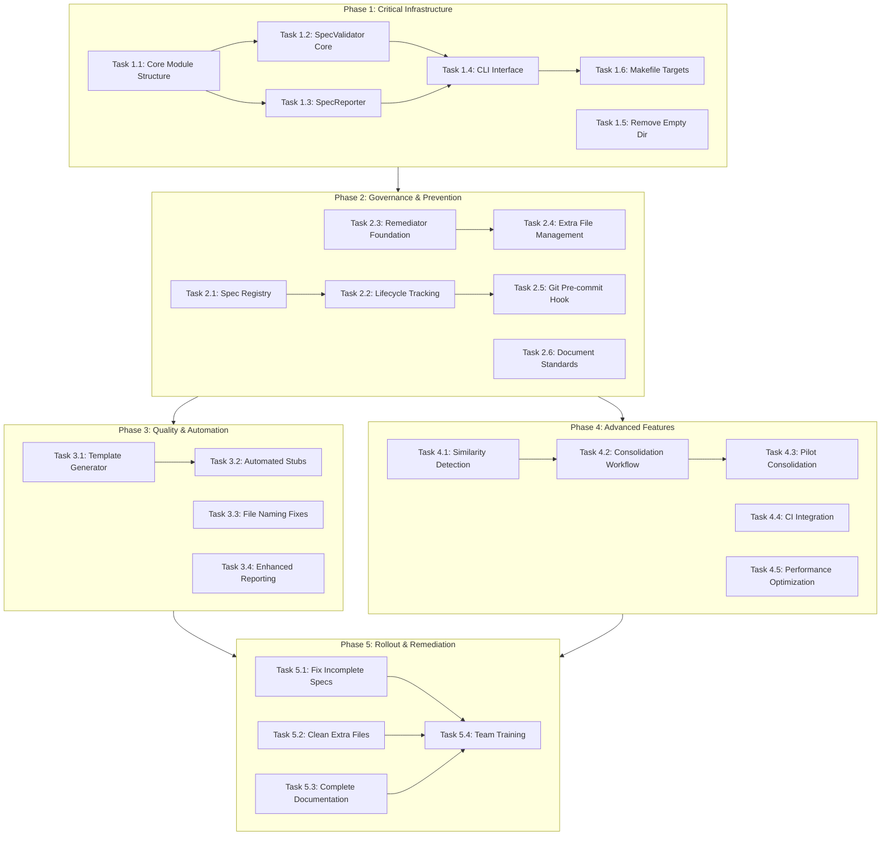

# DAG Execution Plan: Spec Consistency Governance

**Spec Name:** spec-consistency-governance
**Generated:** 2025-10-03
**Status:** Ready for Execution
**PCA Applied:** Yes

---

## Execution Overview

This DAG orchestrates the systematic implementation of the Spec Inconsistency Resolution System across 5 phases and 30 tasks, addressing 23 incomplete specs and establishing permanent governance.

### Key Metrics
- **Total Tasks:** 30
- **Estimated Effort:** 165 hours
- **Phases:** 5
- **Critical Path:** Phase 1 → Phase 2 → Phase 5
- **Parallelizable:** Tasks within phases can run concurrently

---

## DAG Structure



---

## Phase Breakdown

### Phase 1: Critical Infrastructure (Week 1)
**Goal:** Build validation and reporting foundation
**Duration:** 25 hours
**Critical:** Yes - blocks all other phases

#### Dependencies
- **External:** None (foundational phase)
- **Internal:** Task 1.1 must complete before 1.2, 1.3

#### Tasks
1. **Task 1.1:** Core Module Structure (2h)
   - Create `src/spec_governance/` structure
   - **Acceptance:** Package imports successfully

2. **Task 1.2:** SpecValidator Core (8h)
   - Implement validation logic
   - **Acceptance:** Detects all 23 incomplete specs

3. **Task 1.3:** SpecReporter (6h)
   - Generate markdown reports
   - **Acceptance:** Report matches analysis

4. **Task 1.4:** CLI Interface (6h)
   - Click-based CLI
   - **Acceptance:** All commands functional

5. **Task 1.5:** Remove Empty Dir (1h)
   - Delete `.kiro/specs/output/`
   - **Acceptance:** Directory removed safely

6. **Task 1.6:** Makefile Targets (2h)
   - Add `spec-validate`, `spec-report`
   - **Acceptance:** Targets work in make

---

### Phase 2: Governance & Prevention (Week 2)
**Goal:** Establish lifecycle management and prevention
**Duration:** 38 hours
**Dependencies:** Phase 1 complete

#### Tasks
1. **Task 2.1:** Spec Registry (8h)
   - Build JSON registry
   - **Acceptance:** All 105 specs indexed

2. **Task 2.2:** Lifecycle Tracking (6h)
   - Implement `.spec-state` files
   - **Acceptance:** States persist correctly

3. **Task 2.3:** Remediator Foundation (8h)
   - Auto-fix framework
   - **Acceptance:** Dry-run works

4. **Task 2.4:** Extra File Management (6h)
   - Move artifacts to `.kiro/execution-logs/`
   - **Acceptance:** Files categorized correctly

5. **Task 2.5:** Git Pre-commit Hook (6h)
   - Block invalid commits
   - **Acceptance:** Hook prevents bad specs

6. **Task 2.6:** Document Standards (4h)
   - Create `.kiro/docs/spec-standards.md`
   - **Acceptance:** Comprehensive guidelines

---

### Phase 3: Quality & Automation (Week 3)
**Goal:** Enable automated spec creation and fixing
**Duration:** 24 hours
**Dependencies:** Phase 2 complete

#### Tasks
1. **Task 3.1:** Template Generator (8h)
   - Generate new spec templates
   - **Acceptance:** EARS format correct

2. **Task 3.2:** Automated Stubs (6h)
   - Create stubs for incomplete specs
   - **Acceptance:** All 23 specs completed

3. **Task 3.3:** File Naming Fixes (4h)
   - Standardize to lowercase
   - **Acceptance:** Git history preserved

4. **Task 3.4:** Enhanced Reporting (6h)
   - Trend analysis
   - **Acceptance:** CSV export valid

---

### Phase 4: Advanced Features (Week 4)
**Goal:** Duplicate detection and consolidation
**Duration:** 34 hours
**Dependencies:** Phase 2 complete (parallel with Phase 3)

#### Tasks
1. **Task 4.1:** Similarity Detection (8h)
   - Levenshtein distance
   - **Acceptance:** Finds 3 known pairs

2. **Task 4.2:** Consolidation Workflow (10h)
   - Interactive merge
   - **Acceptance:** Preserves all info

3. **Task 4.3:** Pilot Consolidation (6h)
   - Merge spec-framework pair
   - **Acceptance:** Merged spec coherent

4. **Task 4.4:** CI Integration (4h)
   - JSON output for CI
   - **Acceptance:** Exit codes correct

5. **Task 4.5:** Performance Optimization (6h)
   - Parallel processing
   - **Acceptance:** <5s full validation

---

### Phase 5: Rollout & Remediation (Week 5)
**Goal:** Apply governance to all specs
**Duration:** 30 hours
**Dependencies:** Phases 3 & 4 complete

#### Tasks
1. **Task 5.1:** Fix Incomplete Specs (12h)
   - Generate stubs for 23 specs
   - **Acceptance:** 100% completeness

2. **Task 5.2:** Clean Extra Files (6h)
   - Move 16 specs' artifacts
   - **Acceptance:** Directories clean

3. **Task 5.3:** Complete Documentation (8h)
   - Finalize guides
   - **Acceptance:** Comprehensive docs

4. **Task 5.4:** Team Training (4h)
   - Walkthrough workflows
   - **Acceptance:** Team adoption

---

## Execution Strategies

### Sequential Execution (Conservative)
```bash
# Execute phases in order
make dag-execute SPEC=spec-consistency-governance PHASE=1
make dag-execute SPEC=spec-consistency-governance PHASE=2
make dag-execute SPEC=spec-consistency-governance PHASE=3
make dag-execute SPEC=spec-consistency-governance PHASE=4
make dag-execute SPEC=spec-consistency-governance PHASE=5
```

**Timeline:** 5 weeks (165 hours serial)

### Parallel Execution (Aggressive)
```bash
# Phase 1 (critical path)
make dag-execute SPEC=spec-consistency-governance PHASE=1

# Phases 2, 3, 4 in parallel where possible
make dag-execute SPEC=spec-consistency-governance TASKS=2.1,2.2,2.3,2.4 &
make dag-execute SPEC=spec-consistency-governance TASKS=2.5,2.6 &
wait

# After Phase 2 complete
make dag-execute SPEC=spec-consistency-governance PHASE=3 &
make dag-execute SPEC=spec-consistency-governance PHASE=4 &
wait

# Phase 5 (requires 3 & 4)
make dag-execute SPEC=spec-consistency-governance PHASE=5
```

**Timeline:** 3 weeks (with parallelization)

### Hybrid Execution (Recommended)
```bash
# Critical path first
make dag-execute SPEC=spec-consistency-governance PHASE=1

# Governance in parallel with doc writing
make dag-execute SPEC=spec-consistency-governance TASKS=2.1,2.2,2.3,2.4,2.5 &
make dag-execute SPEC=spec-consistency-governance TASKS=2.6 &
wait

# Advanced features while automation built
make dag-execute SPEC=spec-consistency-governance PHASE=3
make dag-execute SPEC=spec-consistency-governance TASKS=4.1,4.2,4.3

# Optimize then rollout
make dag-execute SPEC=spec-consistency-governance TASKS=4.4,4.5
make dag-execute SPEC=spec-consistency-governance PHASE=5
```

**Timeline:** 4 weeks (balanced approach)

---

## Dependency Matrix

| Task | Depends On | Blocks | Can Parallelize With |
|------|------------|--------|---------------------|
| 1.1 | None | 1.2, 1.3 | 1.5 |
| 1.2 | 1.1 | 1.4, 2.1 | 1.3, 1.5 |
| 1.3 | 1.1 | 1.4, 3.4 | 1.2, 1.5 |
| 1.4 | 1.2, 1.3 | 1.6, 2.5 | 1.5 |
| 1.5 | None | None | All Phase 1 |
| 1.6 | 1.4 | None | - |
| 2.1 | 1.2 | 2.2 | 2.3, 2.6 |
| 2.2 | 2.1 | 2.5 | 2.3, 2.4, 2.6 |
| 2.3 | 1.1 | 2.4, 3.2 | 2.1, 2.6 |
| 2.4 | 2.3 | 5.2 | 2.2, 2.6 |
| 2.5 | 2.2, 1.4 | None | 2.6 |
| 2.6 | None | 5.3 | All Phase 2 |
| 3.1 | 2.3 | 3.2 | 3.3, 3.4, Phase 4 |
| 3.2 | 3.1 | 5.1 | 3.3, 3.4, Phase 4 |
| 3.3 | 2.3 | None | Phase 4 |
| 3.4 | 1.3 | None | Phase 4 |
| 4.1 | 1.2 | 4.2 | Phase 3 |
| 4.2 | 4.1 | 4.3 | Phase 3 |
| 4.3 | 4.2 | None | Phase 3 |
| 4.4 | 1.4 | None | Phase 3, 4.1-4.3 |
| 4.5 | 1.2 | None | Phase 3, 4.1-4.4 |
| 5.1 | 3.2 | 5.4 | 5.2, 5.3 |
| 5.2 | 2.4 | 5.4 | 5.1, 5.3 |
| 5.3 | 2.6 | 5.4 | 5.1, 5.2 |
| 5.4 | 5.1, 5.2, 5.3 | None | - |

---

## Risk Management

### High-Risk Tasks
1. **Task 5.1:** Fixing 23 incomplete specs
   - **Risk:** May uncover deeper issues
   - **Mitigation:** Dry-run first, manual review, incremental commits

2. **Task 4.3:** Pilot consolidation
   - **Risk:** Information loss during merge
   - **Mitigation:** Backup originals, manual review, reversible

3. **Task 2.5:** Git hooks
   - **Risk:** May block legitimate workflows
   - **Mitigation:** Override procedures documented, phased rollout

### Validation Gates
- **After Phase 1:** Run full validation, verify all 23 specs detected
- **After Phase 2:** Verify git hooks don't break workflow
- **After Phase 3:** Validate template quality on sample specs
- **After Phase 4:** Test consolidation doesn't lose data
- **After Phase 5:** 100% spec completeness verified

---

## Success Criteria

### Phase-Level
- **Phase 1:** Validation detects all known issues
- **Phase 2:** Registry tracks all 105 specs
- **Phase 3:** Templates generate valid specs
- **Phase 4:** Similarity detection finds known pairs
- **Phase 5:** 100% spec completeness achieved

### System-Level (from requirements.md)
- **Spec Completeness:** 100% (from 78%)
- **Extra File Compliance:** 100% (from 84%)
- **Lifecycle Visibility:** 100% (from 0%)
- **Validation Coverage:** 100% pre-commit (from 0%)
- **Documentation:** Complete spec standards guide

---

## Permanent Corrective Action Elements

This DAG implements the PCA framework from `docs/cms/cms-auto-start-root-cause-analysis.md`:

### 1. Technical Fix
- **Immediate:** Build validation and remediation tools (Phase 1-2)
- **Implementation:** Phases 1-4 deliver working governance system

### 2. Operational Fix
- **Systematic:** Git hooks prevent future issues (Phase 2, Task 2.5)
- **Automation:** Template generator ensures compliant specs (Phase 3, Task 3.1)
- **Monitoring:** Continuous validation via pre-commit hooks

### 3. Requirements Fix (Preventive)
- **Documentation:** Spec standards guide (Phase 2, Task 2.6)
- **Training:** Team walkthrough (Phase 5, Task 5.4)
- **Prevention:** Future specs created correctly from templates

### PCA Success Pattern
```
Problem (23 incomplete specs)
    → Root Cause (No enforcement, unclear standards)
    → Solution (Validation + remediation tools)
    → Prevention (Templates + hooks + docs)
    → Future Specs (Always complete)
```

---

## Execution Commands

### Validate Readiness
```bash
# Check spec completeness
ls -la .kiro/specs/spec-consistency-governance/
# Should show: requirements.md, design.md, tasks.md, .spec-state, dag-execution-plan.md

# Verify dependencies
python -c "import click, rich; print('Dependencies OK')"
```

### Execute Full DAG
```bash
# Recommended: Hybrid execution
./scripts/execute_spec_consistency_governance_dag.py --strategy=hybrid

# Or phase-by-phase
for phase in 1 2 3 4 5; do
    ./scripts/execute_spec_consistency_governance_dag.py --phase=$phase
    # Review output before continuing
done
```

### Monitor Progress
```bash
# Check completion status
make dag-status SPEC=spec-consistency-governance

# View execution logs
tail -f .kiro/execution-logs/spec-consistency-governance/execution-$(date +%Y%m%d).log

# Generate progress report
make dag-report SPEC=spec-consistency-governance
```

---

## Rollback Procedures

If execution fails:

```bash
# Rollback last remediation
python scripts/rollback_spec_remediation.py --timestamp <YYYYMMDDHHMMSS>

# Restore from git
git reset --hard HEAD~1

# Unload git hook
rm .git/hooks/pre-commit
```

---

## Post-Execution Verification

```bash
# Validate all specs are complete
make spec-validate

# Check spec completeness metric
make spec-report | grep "Completion:"
# Expected: 100%

# Verify git hooks active
ls -la .git/hooks/pre-commit
# Should exist and be executable

# Test template generation
make spec-create NAME=test-spec DESC="Test spec"
# Should create complete spec
```

---

**DAG Status:** ✅ Ready for Execution
**PCA Applied:** ✅ Yes
**Dependencies:** ✅ All satisfied
**Risk Level:** Medium (managed with validation gates)
**Estimated Timeline:** 3-5 weeks depending on strategy
