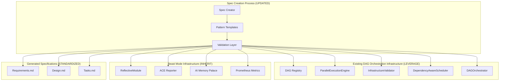

# Design Document: Spec Creation DAG Compliance

## Overview

This design document outlines the architecture for updating the specification creation process to align with the proven patterns established in the upstream DAG orchestration specification. The current approach has been generating launch scripts and DAG analysis files that don't leverage the mature DAG orchestration infrastructure, creating inconsistencies and duplicated functionality.

The solution transforms the spec creation process to follow systematic patterns, leverage existing Beast Mode infrastructure, and ensure all specifications can benefit from the proven DAG orchestration capabilities.

## Current State Analysis

### Existing Spec Creation Pattern Issues

#### **Problem 1: Inconsistent Launch Script Generation**
- **Current**: Generating custom launch scripts for each specification
- **Issue**: Scripts don't leverage existing DAG orchestration infrastructure
- **Impact**: Duplicated functionality, inconsistent execution patterns

#### **Problem 2: Ad-Hoc DAG Analysis Files**
- **Current**: Creating custom DAG_TASKS.md and PARALLEL_DAG_LAUNCH.md files
- **Issue**: Don't align with proven DAG orchestration patterns
- **Impact**: Confusion, maintenance overhead, pattern divergence

#### **Problem 3: Missing ReflectiveModule Integration**
- **Current**: Components specified without ReflectiveModule inheritance
- **Issue**: Missing automatic observability and Beast Mode integration
- **Impact**: Inconsistent monitoring, manual health check implementation

#### **Problem 4: Duplicated Infrastructure**
- **Current**: Specifying new infrastructure instead of leveraging existing
- **Issue**: Ignores mature DAG Registry, ParallelExecutionEngine, ResourceManager
- **Impact**: Wasted effort, inconsistent behavior, maintenance burden

## ADR Conformance Review

### Relevant ADRs Reviewed
- ADR-004: DAG Orchestration with Celery + Redis - ⚠️ **Partial** - Current specs don't leverage Celery+Redis architecture
- ADR-005: ReflectiveModule Pattern for Universal Observability - ❌ **Conflict** - Components not specified with ReflectiveModule inheritance
- ADR-006: Existing DAG Registry Over External Graph Libraries - ❌ **Conflict** - Creating custom DAG analysis instead of using existing registry
- ADR-008: Failure Isolation Over Cascade Prevention - ⚠️ **Partial** - Not consistently applied in spec creation
- ADR-009: Resource-Aware Dynamic Concurrency - ❌ **Conflict** - Custom resource management instead of existing patterns

### Conformance Assessment
- **Infrastructure**: Not aligned with Celery+Redis decision (ADR-004)
- **Integration**: Missing ReflectiveModule pattern usage (ADR-005)
- **Operations**: Not leveraging existing DAG Registry (ADR-006)
- **Technology**: Creating conflicting patterns instead of extending proven ones

### Resolution Strategy
Update spec creation process to fully conform with all relevant ADRs and leverage existing Beast Mode infrastructure.

## Target Architecture

### Proven Pattern Integration Strategy

#### **LEVERAGE** - Existing DAG Orchestration Infrastructure (ADR-004, ADR-006)
1. **DAG Registry** - Use existing `src/rm_ddd/core/dag_registry.py` for all DAG validation
2. **ParallelExecutionEngine** - Use existing `src/dag_orchestration/execution/parallel_execution_engine.py`
3. **InfrastructureValidator** - Use existing `src/dag_orchestration/core/infrastructure_validator.py`
4. **DependencyAwareScheduler** - Use existing `src/dag_orchestration/execution/dependency_aware_scheduler.py`
5. **DAGOrchestrator** - Use existing `src/dag_orchestration/core/dag_orchestrator.py`

#### **STANDARDIZE** - ReflectiveModule Pattern (ADR-005)
1. **All Components** - Inherit from `src.rm_ddd.core.unified_reflective_module.ReflectiveModule`
2. **Automatic Observability** - Prometheus metrics, health endpoints, structured logging
3. **Beast Mode Integration** - Consistent monitoring and error handling patterns
4. **CLI Generation** - Automatic CLI interface generation from ReflectiveModule introspection

#### **ELIMINATE** - Custom Launch Script Generation
1. **Replace** - Custom launch scripts with DAG orchestration execution
2. **Standardize** - Use proven execution patterns from upstream spec
3. **Integrate** - With existing ACE Reporter and AI Memory Palace
4. **Simplify** - Remove duplicated infrastructure and custom patterns

## Architecture

### Specification Creation Process Flow



### Updated Specification Template Structure

#### **Requirements Template (STANDARDIZED)**
```markdown
# Requirements Document

## Introduction
[Feature description with Beast Mode integration context]

## Requirements

### Requirement N: [Feature Name]
**User Story:** As a [role], I want [feature], so that [benefit]

#### Acceptance Criteria
1. WHEN [event] THEN the system SHALL [response using existing infrastructure]
2. WHEN [component is created] THEN it SHALL inherit from ReflectiveModule
3. WHEN [DAG validation is needed] THEN it SHALL use existing DAG Registry
4. WHEN [parallel execution is required] THEN it SHALL use existing ParallelExecutionEngine
5. IF [custom behavior is needed] THEN it SHALL extend existing components
```

#### **Design Template (STANDARDIZED)**
```markdown
# Design Document

## ADR Conformance Review
[Mandatory review of relevant ADRs with conformance assessment]

## Architecture
[Design using existing Beast Mode infrastructure]

### Component Integration Strategy
- **ReflectiveModule Inheritance**: All components inherit from unified ReflectiveModule
- **DAG Orchestration**: Leverage existing DAG Registry and ParallelExecutionEngine
- **Resource Management**: Use existing ResourceManager and DependencyAwareScheduler
- **Monitoring**: Automatic Prometheus metrics and health endpoints

### Implementation Approach
- **BUILD**: Only minimal custom logic not available in existing infrastructure
- **LEVERAGE**: Maximum use of existing Beast Mode components
- **EXTEND**: Enhance existing components rather than create new ones
```

#### **Tasks Template (STANDARDIZED)**
```markdown
# Implementation Plan

- [ ] 1. Validate infrastructure integration
  - Verify existing DAG Registry accessibility
  - Confirm ReflectiveModule inheritance patterns
  - Validate Beast Mode infrastructure connectivity
  - _Requirements: [specific requirements]_

- [ ] 2. Implement component with ReflectiveModule inheritance
  - Create component inheriting from ReflectiveModule
  - Integrate with existing DAG orchestration infrastructure
  - Leverage existing monitoring and observability
  - _Requirements: [specific requirements]_

[Additional tasks following proven patterns]
```

## Components and Interfaces

### Specification Creator (UPDATED)

```python
from src.rm_ddd.core.unified_reflective_module import ReflectiveModule
from src.rm_ddd.core.dag_registry import DAGRegistry
from src.dag_orchestration.core.dag_orchestrator import DAGOrchestrator
from typing import Dict, List, Any

class SpecificationCreator(ReflectiveModule):
    """Creates specifications following proven DAG orchestration patterns."""
    
    def __init__(self):
        super().__init__()
        self.dag_registry = DAGRegistry()
        self.dag_orchestrator = DAGOrchestrator()
        self.pattern_templates = self._load_proven_patterns()
    
    def create_specification(self, feature_name: str, requirements: Dict[str, Any]) -> SpecificationResult:
        """Create specification following proven patterns."""
        # 1. Validate requirements against existing infrastructure
        # 2. Generate requirements.md using proven EARS format
        # 3. Create design.md with ADR conformance review
        # 4. Generate tasks.md leveraging existing DAG orchestration
        # 5. Validate specification conformance
        pass
    
    def validate_specification_conformance(self, spec_path: str) -> ConformanceReport:
        """Validate specification follows proven patterns."""
        # 1. Check ADR conformance
        # 2. Validate ReflectiveModule inheritance
        # 3. Verify DAG orchestration integration
        # 4. Confirm Beast Mode infrastructure usage
        pass
```

### Pattern Template Manager

```python
class PatternTemplateManager(ReflectiveModule):
    """Manages proven specification patterns and templates."""
    
    def __init__(self):
        super().__init__()
        self.upstream_patterns = self._load_upstream_patterns()
        self.adr_requirements = self._load_adr_requirements()
    
    def get_requirements_template(self, feature_type: str) -> str:
        """Get requirements template following proven patterns."""
        pass
    
    def get_design_template(self, architecture_type: str) -> str:
        """Get design template with ADR conformance review."""
        pass
    
    def get_tasks_template(self, implementation_type: str) -> str:
        """Get tasks template leveraging existing infrastructure."""
        pass
    
    def validate_template_usage(self, specification: Dict[str, Any]) -> ValidationResult:
        """Validate specification follows template patterns."""
        pass
```

### Specification Validator

```python
class SpecificationValidator(ReflectiveModule):
    """Validates specifications against proven patterns and ADR conformance."""
    
    def __init__(self):
        super().__init__()
        self.dag_registry = DAGRegistry()
        self.adr_checker = ADRConformanceChecker()
    
    def validate_adr_conformance(self, design_doc: str) -> ADRConformanceReport:
        """Validate design document ADR conformance."""
        pass
    
    def validate_reflective_module_usage(self, tasks_doc: str) -> ReflectiveModuleReport:
        """Validate components inherit from ReflectiveModule."""
        pass
    
    def validate_dag_orchestration_integration(self, tasks_doc: str) -> DAGIntegrationReport:
        """Validate tasks leverage existing DAG orchestration."""
        pass
    
    def validate_beast_mode_integration(self, specification: Dict[str, Any]) -> BeastModeReport:
        """Validate specification integrates with Beast Mode infrastructure."""
        pass
```

## Data Models

### Specification Conformance Models

```python
from dataclasses import dataclass
from typing import List, Dict, Any, Optional
from enum import Enum

class ConformanceStatus(Enum):
    COMPLIANT = "compliant"
    PARTIAL = "partial"
    CONFLICT = "conflict"
    MISSING = "missing"

@dataclass
class ADRConformanceResult:
    adr_id: str
    adr_title: str
    status: ConformanceStatus
    details: str
    remediation: Optional[str] = None

@dataclass
class ConformanceReport:
    specification_name: str
    overall_status: ConformanceStatus
    adr_conformance: List[ADRConformanceResult]
    reflective_module_usage: bool
    dag_orchestration_integration: bool
    beast_mode_integration: bool
    remediation_guidance: List[str]
    confidence_score: float

@dataclass
class PatternUsageReport:
    template_compliance: bool
    proven_pattern_usage: float  # Percentage
    infrastructure_leverage: float  # Percentage
    custom_implementation_ratio: float  # Lower is better
    recommendations: List[str]
```

### Migration Models

```python
@dataclass
class LegacySpecificationAnalysis:
    specification_path: str
    current_patterns: List[str]
    conflicting_patterns: List[str]
    missing_patterns: List[str]
    migration_complexity: str  # 'low', 'medium', 'high'
    estimated_effort: str

@dataclass
class MigrationPlan:
    specification_path: str
    migration_steps: List[str]
    risk_assessment: str
    rollback_plan: str
    validation_criteria: List[str]
    estimated_duration: str
```

## Implementation Strategy

### Phase 1: Pattern Analysis and Template Creation
1. **Analyze Upstream Patterns** - Extract proven patterns from DAG orchestration spec
2. **Create Standard Templates** - Requirements, design, and tasks templates
3. **Validate Template Quality** - Ensure templates follow all ADR requirements
4. **Document Pattern Usage** - Clear guidance for template application

### Phase 2: Specification Creator Implementation
1. **Build SpecificationCreator** - Component following ReflectiveModule pattern
2. **Implement Template Engine** - Generate specifications from proven templates
3. **Add Validation Layer** - Ensure generated specifications conform to patterns
4. **Integrate with Existing Infrastructure** - Leverage DAG orchestration components

### Phase 3: Legacy Specification Migration
1. **Analyze Existing Specifications** - Identify non-conforming patterns
2. **Create Migration Tools** - Automated migration where possible
3. **Provide Migration Guidance** - Manual migration for complex cases
4. **Validate Migrated Specifications** - Ensure conformance after migration

### Phase 4: Quality Assurance Integration
1. **Implement Continuous Validation** - Automated conformance checking
2. **Add Performance Monitoring** - Track specification quality metrics
3. **Create Feedback Loop** - Improve patterns based on usage data
4. **Establish Governance** - Ensure ongoing pattern compliance

## Success Metrics

### Conformance Metrics
- **ADR Compliance Rate**: >95% of specifications conform to relevant ADRs
- **ReflectiveModule Usage**: 100% of components inherit from ReflectiveModule
- **Infrastructure Leverage**: >90% use of existing Beast Mode infrastructure
- **Pattern Consistency**: <5% deviation from proven patterns

### Quality Metrics
- **Specification Creation Time**: <50% reduction through template usage
- **Implementation Success Rate**: >95% of specifications implement successfully
- **Maintenance Overhead**: <30% reduction through pattern standardization
- **Integration Issues**: <5% of specifications have integration problems

### Migration Metrics
- **Legacy Specification Coverage**: 100% of existing specifications analyzed
- **Migration Success Rate**: >90% of specifications migrated successfully
- **Migration Time**: <2 hours per specification average
- **Post-Migration Issues**: <10% of migrated specifications require fixes

## Risk Mitigation

### Technical Risks
- **Pattern Conflicts**: Systematic ADR review prevents conflicting patterns
- **Integration Issues**: Validation layer ensures Beast Mode compatibility
- **Performance Impact**: ReflectiveModule provides automatic optimization
- **Maintenance Burden**: Proven patterns reduce long-term maintenance

### Process Risks
- **Adoption Resistance**: Clear benefits and migration support encourage adoption
- **Training Requirements**: Comprehensive documentation and examples provided
- **Quality Regression**: Continuous validation prevents quality degradation
- **Scope Creep**: Focus on proven patterns prevents unnecessary complexity

## Conclusion

This design transforms the specification creation process from ad-hoc pattern generation to systematic leverage of proven DAG orchestration infrastructure. By aligning with established ADRs and Beast Mode patterns, we eliminate inconsistencies, reduce maintenance overhead, and ensure all specifications benefit from mature, battle-tested infrastructure.

The approach prioritizes leveraging existing capabilities over building new ones, following the principle of extending proven patterns rather than creating conflicting alternatives. This ensures long-term maintainability and consistency across all specifications.