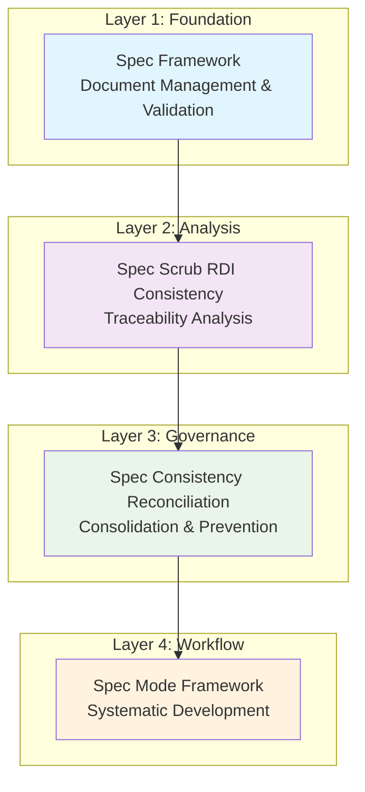
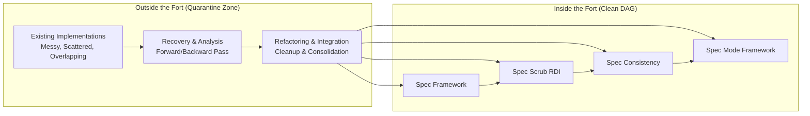

# Spec Ecosystem Integration Matrix

## Overview

This document provides a comprehensive view of how the four specification-related frameworks integrate with each other to provide a unified specification ecosystem. Each framework has a distinct responsibility while leveraging capabilities from the others.

## Clear Separation of Concerns

### Layer 1: Spec Framework (Foundation)
**Single Responsibility**: Document management and validation services
**Provides**: Document validation, DAG enforcement, lifecycle management
**Consumes**: Nothing (foundation layer)
**Serves**: All other layers

### Layer 2: Spec Scrub RDI Consistency (Analysis)
**Single Responsibility**: Requirements → Design → Implementation traceability analysis
**Provides**: RDI validation, gap analysis, traceability matrices
**Consumes**: Spec Framework document services
**Serves**: Spec Consistency Reconciliation

### Layer 3: Spec Consistency Reconciliation (Governance)
**Single Responsibility**: Specification consolidation and fragmentation prevention
**Provides**: Consolidated specs, terminology standardization, governance controls
**Consumes**: Spec Scrub RDI analysis services
**Serves**: Spec Mode Framework

### Layer 4: Spec Mode Framework (Workflow)
**Single Responsibility**: Systematic specification-driven development workflows
**Provides**: Development workflows, guided processes, quality assurance
**Consumes**: Spec Consistency governance services
**Serves**: End users and developers

## Clean DAG Integration Chain

| Layer | Framework | Uses Services From | Provides Services To | Key Requirements |
|-------|-----------|-------------------|---------------------|------------------|
| **1** | **Spec Framework** | None (Foundation) | All other layers | Document management, validation, DAG enforcement |
| **2** | **Spec Scrub RDI** | Spec Framework | Spec Consistency Reconciliation | RDI traceability analysis (Req 11.1-11.5) |
| **3** | **Spec Consistency** | Spec Scrub RDI | Spec Mode Framework | Consolidation and governance (Req 12.1-12.5) |
| **4** | **Spec Mode Framework** | Spec Consistency | End users/developers | Systematic development workflows (Req 13.1-13.5) |

## Clean DAG Architecture

### Clear Chain of Responsibilities

1. **Spec Framework** (Foundation) → Provides document services to all layers
2. **Spec Scrub RDI Consistency** (Analysis) → Uses document services, provides traceability analysis
3. **Spec Consistency Reconciliation** (Governance) → Uses traceability analysis, provides consolidation
4. **Spec Mode Framework** (Workflow) → Uses consolidated governance, provides development workflows

## Integration Benefits

### 1. Unified Specification Ecosystem
- **Single Source of Truth**: Spec Framework provides centralized document management
- **Consistent Quality**: Spec Scrub ensures all specs maintain RDI traceability
- **Prevented Fragmentation**: Spec Consistency Reconciliation eliminates overlaps
- **Systematic Development**: Spec Mode Framework provides guided workflows

### 2. Reduced Duplication
- **Shared Document Validation**: All frameworks use Spec Framework validation services
- **Shared RDI Validation**: All frameworks leverage Spec Scrub traceability validation
- **Shared Terminology**: Spec Consistency Reconciliation ensures consistent vocabulary
- **Shared Patterns**: Spec Mode Framework provides systematic development patterns

### 3. Enhanced Quality
- **Comprehensive Validation**: Multiple layers of validation ensure specification quality
- **Continuous Monitoring**: Real-time detection of consistency and traceability violations
- **Preventive Controls**: Automated prevention of fragmentation and RDI violations
- **Systematic Improvement**: Continuous learning and pattern refinement

### 4. Operational Efficiency
- **Automated Workflows**: Reduced manual effort through systematic automation
- **Clear Responsibilities**: Each framework has distinct, non-overlapping responsibilities
- **Seamless Integration**: Frameworks enhance each other rather than competing
- **Scalable Architecture**: Can handle large numbers of specifications efficiently

## Implementation Strategy

### Phase 1: Foundation (Spec Framework)
- Implement core document management and validation services
- Establish dependency DAG enforcement
- Create document lifecycle management

### Phase 2: Validation (Spec Scrub RDI Consistency)
- Implement RDI traceability validation
- Create gap analysis and remediation
- Establish continuous monitoring

### Phase 3: Consolidation (Spec Consistency Reconciliation)
- Implement overlapping functionality detection
- Create terminology standardization
- Establish preventive consistency controls

### Phase 4: Workflow (Spec Mode Framework)
- Implement systematic development workflows
- Create comprehensive documentation generation
- Establish quality assurance integration

### Phase 5: Integration
- Implement cross-framework integration points
- Validate integrated ecosystem functionality
- Establish unified operational procedures

## Success Metrics

### Quality Metrics
- **RDI Consistency**: 100% of specifications maintain complete Requirements → Design → Implementation traceability
- **Document Quality**: 100% of specifications pass Spec Framework validation
- **Terminology Consistency**: <1% variance in terminology usage across specifications
- **Fragmentation Prevention**: 0 new overlapping specifications created

### Efficiency Metrics
- **Development Speed**: 30% reduction in specification development time
- **Consolidation Effort**: 50% reduction in effort required for spec consolidation
- **Validation Time**: <10 seconds for complete specification validation
- **Integration Overhead**: <5% additional effort for framework integration

### Operational Metrics
- **Automated Prevention**: 95% of consistency violations prevented automatically
- **Continuous Monitoring**: Real-time detection of violations within 5 seconds
- **Quality Gates**: 100% compliance with quality gates before specification approval
- **Ecosystem Health**: Sustained improvement in specification quality over time

## Brownfield Recovery Strategy

### The Reality: Existing Implementations Outside the Fort

The clean DAG architecture represents the **target state** - the systematic "Fort" where everything is properly organized. However, we're operating in a brownfield environment with existing spec-related implementations that are likely:

- **Scattered across the codebase** in various directories and files
- **Implementing overlapping functionality** without coordination
- **Using inconsistent patterns** and terminology
- **Creating circular dependencies** and architectural debt
- **Partially implemented** with gaps and orphaned code

### Forward and Backward Pass Recovery

**Forward Pass (Requirements → Implementation)**:
1. **Discover existing spec-related code** through systematic scanning
2. **Analyze what functionality already exists** vs. what's specified
3. **Identify gaps** where requirements exist but implementation is missing
4. **Plan integration** of existing code into the clean DAG architecture

**Backward Pass (Implementation → Requirements)**:
1. **Catalog all existing spec-related implementations** regardless of documentation
2. **Reverse-engineer requirements** from working code
3. **Identify orphaned functionality** that exists but isn't specified
4. **Reconcile discovered capabilities** with the target architecture

### Working Both Ends Toward the Middle

The messy integration work happens in a **quarantine zone** outside the Fort:

### Recovery Task Categories

1. **Discovery Tasks**: Find and catalog existing spec-related implementations
2. **Analysis Tasks**: Understand what exists vs. what's needed
3. **Quarantine Tasks**: Extract and isolate existing functionality for cleanup
4. **Refactoring Tasks**: Clean up existing code to fit the DAG architecture
5. **Integration Tasks**: Bring cleaned code into the Fort
6. **Validation Tasks**: Ensure the integrated system maintains the clean DAG

This approach acknowledges that **the mess is necessary** during brownfield recovery, but it **stays outside the Fort** until it's been systematically cleaned up and can enter the clean architecture without contaminating it.

This integrated specification ecosystem provides comprehensive support for systematic specification-driven development while preventing the fragmentation and inconsistency that led to the need for consolidation in the first place.