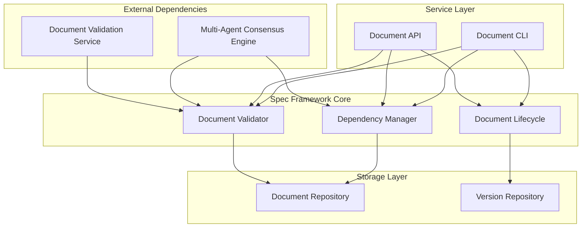

# Spec Framework Design

## Overview

The Spec Framework provides specification document management, validation, and dependency governance services. This component focuses exclusively on document structure validation, format compliance checking, and dependency DAG enforcement. It provides the foundational document management layer while delegating PDCA orchestration to Systematic PDCA Orchestrator, metrics to Systematic Metrics Engine, and parallel execution to Parallel DAG Orchestrator.

**Design Philosophy:** Single-responsibility document management that validates structure and enforces dependency governance without overreaching into orchestration or execution concerns.

## Architecture

### High-Level Architecture



### Component Architecture

The framework follows a simple layered architecture focused on document management:

1. **Core Layer**: Document validation, dependency management, and lifecycle
2. **Service Layer**: API and CLI interfaces for document operations
3. **Storage Layer**: Document and version persistence

## Components and Interfaces

### Core Components

#### 1. Document Validator
**Responsibility**: Validates specification document format, structure, and EARS compliance
**Interface**:
```python
class DocumentValidator:
    def validate_structure(self, spec_doc: SpecificationDocument) -> ValidationResult
    def validate_ears_format(self, requirements: List[Requirement]) -> ValidationResult
    def validate_completeness(self, spec_doc: SpecificationDocument) -> ValidationResult
    def generate_validation_report(self, spec_doc: SpecificationDocument) -> ValidationReport
```

#### 2. Dependency Manager
**Responsibility**: Manages specification dependencies and enforces DAG compliance
**Interface**:
```python
class DependencyManager:
    def analyze_dependencies(self, spec_doc: SpecificationDocument) -> DependencyGraph
    def validate_dag_compliance(self, graph: DependencyGraph) -> ValidationResult
    def detect_circular_dependencies(self, graph: DependencyGraph) -> List[CircularDependency]
    def generate_dependency_report(self, graph: DependencyGraph) -> DependencyReport
```

#### 3. Document Lifecycle Manager
**Responsibility**: Manages document versioning, change tracking, and lifecycle events
**Interface**:
```python
class DocumentLifecycleManager:
    def create_document(self, template: DocumentTemplate) -> SpecificationDocument
    def update_document(self, doc: SpecificationDocument, changes: ChangeSet) -> SpecificationDocument
    def version_document(self, doc: SpecificationDocument) -> VersionedDocument
    def track_changes(self, doc: SpecificationDocument) -> ChangeHistory
```

## Data Models

### Core Data Models

#### Specification Document Model
```python
@dataclass
class SpecificationDocument:
    id: str
    name: str
    version: SemanticVersion
    requirements_path: str
    design_path: Optional[str]
    tasks_path: Optional[str]
    dependencies: List[Dependency]
    created_at: datetime
    updated_at: datetime
    
    def validate_structure(self) -> ValidationResult: ...
    def get_dependencies(self) -> List[Dependency]: ...
```

#### Dependency Model
```python
@dataclass
class Dependency:
    source_spec: str
    target_spec: str
    dependency_type: DependencyType
    
    def validate_dag_compliance(self, graph: DependencyGraph) -> ValidationResult: ...
```

#### Validation Result Model
```python
@dataclass
class ValidationResult:
    is_valid: bool
    errors: List[ValidationError]
    warnings: List[ValidationWarning]
    
    def generate_report(self) -> ValidationReport: ...
```

#### Dependency Graph Model
```python
@dataclass
class DependencyGraph:
    nodes: List[str]  # spec names
    edges: List[Dependency]
    
    def is_acyclic(self) -> bool: ...
    def find_cycles(self) -> List[List[str]]: ...
```

## Error Handling

### Error Categories and Strategies

#### 1. Document Validation Errors
**Strategy**: Provide specific guidance for format and structure issues
- **Format Errors**: Specific EARS format correction guidance
- **Structure Errors**: Template-based correction suggestions
- **Completeness Errors**: Missing section identification and templates

#### 2. Dependency Errors
**Strategy**: Clear resolution guidance for DAG violations
- **Circular Dependencies**: Specific cycle-breaking recommendations
- **Missing Dependencies**: Dependency resolution suggestions
- **Invalid References**: Service interface correction guidance

#### 3. System Errors
**Strategy**: Graceful degradation with fallback mechanisms
- **Storage Failures**: Local caching and retry logic
- **Validation Service Unavailability**: Cached validation results
- **Performance Issues**: Timeout handling and queuing

## Testing Strategy

### Testing Approach

#### 1. Unit Testing (70%)
**Focus**: Individual component functionality
- **Document Validator**: Test format validation, structure checking, EARS compliance
- **Dependency Manager**: Test DAG validation, cycle detection
- **Lifecycle Manager**: Test document versioning and change tracking

#### 2. Integration Testing (20%)
**Focus**: Component interaction
- **Validator-Dependency Integration**: Test document validation with dependency checking
- **Storage Integration**: Test document persistence and retrieval
- **API Integration**: Test service layer interaction with core components

#### 3. End-to-End Testing (10%)
**Focus**: Complete document workflows
- **Document Creation Workflow**: Test complete creation from requirements to tasks
- **Document Update Workflow**: Test modification and dependency impact analysis
- **Validation Workflow**: Test automated format and dependency checking

## Implementation Approach

### Core Components Implementation
**Focus**: Document management fundamentals
- Document data models and file-based storage
- Structure and format validation engine
- DAG-compliant dependency management
- CLI interface for document operations

### Performance Targets
- **Document Validation**: Complete within 10 seconds for standard specifications
- **Dependency Analysis**: Complete within 5 seconds for graphs up to 100 specifications
- **Concurrent Operations**: Handle 20+ simultaneous document validations

### Security Considerations
- **Input Sanitization**: All document content sanitized before processing
- **File System Security**: Secure document storage with appropriate permissions
- **Audit Trails**: Track all document changes with timestamps