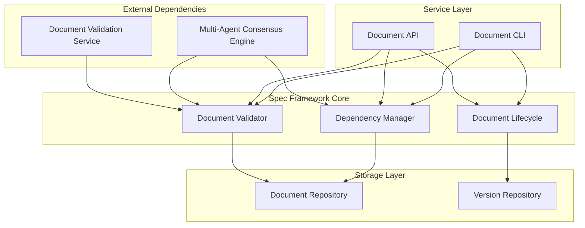
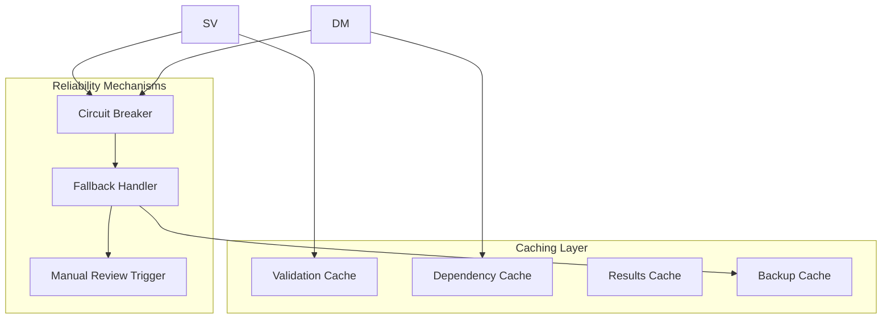

# Spec Framework Design

## Overview

The Spec Framework provides specification document management, validation, and dependency governance services. This component focuses exclusively on document structure validation, format compliance checking, and dependency DAG enforcement. It provides the foundational document management layer while delegating PDCA orchestration to Systematic PDCA Orchestrator, metrics to Systematic Metrics Engine, and parallel execution to Parallel DAG Orchestrator.

**Design Philosophy:** Single-responsibility document management that validates structure and enforces dependency governance without overreaching into orchestration or execution concerns.

## Architecture

### High-Level Architecture


```mermaid
graph TB
    subgraph "Spec Framework Core"
        SV[Document Validator]
        DM[Dependency Manager]
        DL[Document Lifecycle]
    end
    
    subgraph "External Dependencies"
        DVS[Document Validation Service]
        MACE[Multi-Agent Consensus Engine]
    end
    
    subgraph "Service Layer"
        API[Document API]
        CLI[Document CLI]
    end
    
    subgraph "Storage Layer"
        DR[Document Repository]
        VR[Version Repository]
    end
    
    DVS --> SV
    MACE --> SV
    MACE --> DM
    
    API --> SV
    API --> DM
    API --> DL
    CLI --> SV
    CLI --> DM
    CLI --> DL
    
    SV --> DR
    DM --> DR
    DL --> VR
```

### Component Architecture

The framework follows a layered architecture with caching and reliability mechanisms:

1. **Core Layer**: Document validation, dependency management, and lifecycle
2. **Service Layer**: API and CLI interfaces for document operations  
3. **Caching Layer**: Performance optimization and reliability fallbacks
4. **Storage Layer**: Document and version persistence

### Caching and Reliability Architecture


```mermaid
graph TB
    subgraph "Caching Layer"
        VC[Validation Cache]
        DC[Dependency Cache] 
        RC[Results Cache]
        BC[Backup Cache]
    end
    
    subgraph "Reliability Mechanisms"
        CB[Circuit Breaker]
        FB[Fallback Handler]
        MR[Manual Review Trigger]
    end
    
    SV --> VC
    DM --> DC
    SV --> CB
    DM --> CB
    CB --> FB
    FB --> MR
    FB --> BC
```

**Design Rationale**: Added caching layer to meet performance targets (10s validation, 5s dependency analysis) and reliability mechanisms to handle service failures gracefully (Derived Requirements 1 & 2).

## Components and Interfaces

### Core Components

#### 1. Document Validator
**Responsibility**: Validates specification document format, structure, and EARS compliance with specific remediation guidance
**Interface**:
```python
class DocumentValidator:
    def validate_structure(self, spec_doc: SpecificationDocument) -> ValidationResult
    def validate_ears_format(self, requirements: List[Requirement]) -> ValidationResult
    def validate_completeness(self, spec_doc: SpecificationDocument) -> ValidationResult
    def validate_workflow_compliance(self, spec_doc: SpecificationDocument) -> ValidationResult
    def generate_validation_report(self, spec_doc: SpecificationDocument) -> ValidationReport
    def generate_remediation_guidance(self, validation_result: ValidationResult) -> RemediationGuide
```

**Design Rationale**: Enhanced with workflow compliance validation to ensure Requirements → Design → Tasks progression (Requirement 3.1) and remediation guidance generation to provide specific examples and templates for validation failures (Requirements 1.4, 2.5).

#### 2. Dependency Manager
**Responsibility**: Manages specification dependencies, enforces DAG compliance, and provides dependency restructuring guidance
**Interface**:
```python
class DependencyManager:
    def analyze_dependencies(self, spec_doc: SpecificationDocument) -> DependencyGraph
    def validate_dag_compliance(self, graph: DependencyGraph) -> ValidationResult
    def detect_circular_dependencies(self, graph: DependencyGraph) -> List[CircularDependency]
    def validate_service_interfaces(self, spec_doc: SpecificationDocument) -> ValidationResult
    def generate_dependency_report(self, graph: DependencyGraph) -> DependencyReport
    def generate_restructuring_guidance(self, violations: List[DagViolation]) -> RestructuringGuide
    def analyze_impact(self, spec_doc: SpecificationDocument, changes: ChangeSet) -> ImpactAnalysis
```

**Design Rationale**: Added service interface validation to ensure proper interface usage between specs (Requirement 2.4), restructuring guidance for DAG violations (Requirement 2.5), and impact analysis for change tracking (Requirement 3.2).

#### 3. Document Lifecycle Manager
**Responsibility**: Manages document versioning, change tracking, lifecycle events, and systematic workflow enforcement
**Interface**:
```python
class DocumentLifecycleManager:
    def create_document(self, template: DocumentTemplate) -> SpecificationDocument
    def update_document(self, doc: SpecificationDocument, changes: ChangeSet) -> SpecificationDocument
    def version_document(self, doc: SpecificationDocument) -> VersionedDocument
    def track_changes(self, doc: SpecificationDocument) -> ChangeHistory
    def enforce_workflow(self, spec_doc: SpecificationDocument) -> WorkflowValidation
    def generate_migration_docs(self, deprecated_spec: SpecificationDocument) -> MigrationGuide
    def create_audit_trail(self, event: LifecycleEvent) -> AuditEntry
    def generate_changelog(self, from_version: SemanticVersion, to_version: SemanticVersion) -> Changelog
```

**Design Rationale**: Enhanced with workflow enforcement to ensure Requirements → Design → Tasks progression (Requirement 3.1), migration documentation generation for deprecated specs (Requirement 3.3), comprehensive audit trails (Requirement 3.5), and automated changelog generation (Requirement 3.4).

#### 4. Reliability and Performance Manager
**Responsibility**: Manages caching, fallback mechanisms, and performance optimization for reliable document operations
**Interface**:
```python
class ReliabilityManager:
    def cache_validation_result(self, spec_id: str, result: ValidationResult) -> None
    def get_cached_validation(self, spec_id: str) -> Optional[ValidationResult]
    def cache_dependency_analysis(self, graph_hash: str, analysis: DependencyGraph) -> None
    def get_cached_dependency_analysis(self, graph_hash: str) -> Optional[DependencyGraph]
    def trigger_manual_review(self, failure_context: FailureContext) -> ManualReviewRequest
    def create_local_backup(self, spec_doc: SpecificationDocument) -> BackupResult
    def handle_service_failure(self, service: str, operation: str) -> FallbackResult
    def monitor_performance(self, operation: str, duration: float) -> None
```

**Design Rationale**: Added to handle reliability requirements including cached validation results during service failures (Derived Requirement 2.1), manual review triggers (Derived Requirement 2.2), local backup mechanisms (Derived Requirement 2.3), and performance monitoring for the 10s/5s targets (Derived Requirement 1).

## Data Models

### Core Data Models

#### Specification Document Model
```python
@dataclass
class SpecificationDocument:
    id: str
    name: str
    version: SemanticVersion
    requirements_path: str
    design_path: Optional[str]
    tasks_path: Optional[str]
    dependencies: List[Dependency]
    workflow_stage: WorkflowStage  # Requirements, Design, Tasks, Complete
    approval_status: ApprovalStatus  # Draft, UnderReview, Approved, Deprecated
    created_at: datetime
    updated_at: datetime
    audit_trail: List[AuditEntry]
    
    def validate_structure(self) -> ValidationResult: ...
    def get_dependencies(self) -> List[Dependency]: ...
    def can_progress_to_stage(self, target_stage: WorkflowStage) -> bool: ...
```

**Design Rationale**: Added workflow_stage to track systematic progression (Requirement 3.1), approval_status for quality gates (Requirement 1.5), and audit_trail for comprehensive tracking (Requirement 3.5).

#### Dependency Model
```python
@dataclass
class Dependency:
    source_spec: str
    target_spec: str
    dependency_type: DependencyType
    
    def validate_dag_compliance(self, graph: DependencyGraph) -> ValidationResult: ...
```

#### Validation Result Model
```python
@dataclass
class ValidationResult:
    is_valid: bool
    errors: List[ValidationError]
    warnings: List[ValidationWarning]
    remediation_guidance: Optional[RemediationGuide]
    validation_timestamp: datetime
    
    def generate_report(self) -> ValidationReport: ...
    def has_blocking_errors(self) -> bool: ...
```

#### Remediation Guide Model
```python
@dataclass
class RemediationGuide:
    error_type: str
    specific_guidance: str
    examples: List[str]
    templates: List[DocumentTemplate]
    
    def generate_corrective_actions(self) -> List[str]: ...
```

**Design Rationale**: Enhanced ValidationResult with remediation guidance and timestamp for caching (Requirements 1.4, 2.1). Added RemediationGuide model to provide specific examples and templates for validation failures.

#### Dependency Graph Model
```python
@dataclass
class DependencyGraph:
    nodes: List[str]  # spec names
    edges: List[Dependency]
    
    def is_acyclic(self) -> bool: ...
    def find_cycles(self) -> List[List[str]]: ...
    def validate_service_interfaces(self) -> ValidationResult: ...
```

#### Workflow and Lifecycle Models
```python
@dataclass
class WorkflowStage(Enum):
    REQUIREMENTS = "requirements"
    DESIGN = "design" 
    TASKS = "tasks"
    COMPLETE = "complete"

@dataclass
class ApprovalStatus(Enum):
    DRAFT = "draft"
    UNDER_REVIEW = "under_review"
    APPROVED = "approved"
    DEPRECATED = "deprecated"

@dataclass
class AuditEntry:
    timestamp: datetime
    event_type: str
    user_id: str
    changes: ChangeSet
    correlation_id: str

@dataclass
class LifecycleEvent:
    event_type: str
    spec_id: str
    timestamp: datetime
    metadata: Dict[str, Any]

@dataclass
class ImpactAnalysis:
    affected_specs: List[str]
    breaking_changes: List[str]
    migration_required: bool
    risk_level: str
```

**Design Rationale**: Added comprehensive lifecycle and workflow models to support systematic document progression (Requirement 3.1), audit trails (Requirement 3.5), and impact analysis for changes (Requirement 3.2).

## Error Handling

### Error Categories and Strategies

#### 1. Document Validation Errors
**Strategy**: Provide specific guidance for format and structure issues with examples and templates
- **Format Errors**: Specific EARS format correction guidance with valid examples
- **Structure Errors**: Template-based correction suggestions with section templates
- **Completeness Errors**: Missing section identification with completion templates
- **Workflow Violations**: Clear guidance on Requirements → Design → Tasks progression

#### 2. Dependency Errors
**Strategy**: Clear resolution guidance for DAG violations with restructuring recommendations
- **Circular Dependencies**: Specific cycle-breaking recommendations with dependency restructuring guidance
- **Missing Dependencies**: Dependency resolution suggestions with service interface examples
- **Invalid References**: Service interface correction guidance with proper usage patterns
- **DAG Violations**: Automated prevention with clear resolution paths

#### 3. System Errors
**Strategy**: Graceful degradation with fallback mechanisms and reliability guarantees
- **Storage Failures**: Local backup mechanisms with work-in-progress preservation
- **Validation Service Unavailability**: Cached validation results with manual review triggers
- **Performance Issues**: Timeout handling with queuing and concurrent operation support
- **Framework Updates**: Backward compatibility maintenance with migration guidance

#### 4. Reliability and Performance Errors
**Strategy**: Maintain service availability and performance targets
- **Performance Degradation**: Circuit breakers and load shedding for concurrent operations
- **Cache Invalidation**: Smart caching with TTL and dependency-based invalidation
- **Concurrent Access**: Lock-free operations where possible with conflict resolution
- **Resource Exhaustion**: Resource monitoring with graceful degradation patterns

**Design Rationale**: Enhanced error handling to address reliability requirements (Derived Requirement 2) and performance requirements (Derived Requirement 1) with specific fallback mechanisms and user guidance.

## Testing Strategy

### Testing Approach

#### 1. Unit Testing (70%)
**Focus**: Individual component functionality
- **Document Validator**: Test format validation, structure checking, EARS compliance
- **Dependency Manager**: Test DAG validation, cycle detection
- **Lifecycle Manager**: Test document versioning and change tracking

#### 2. Integration Testing (20%)
**Focus**: Component interaction
- **Validator-Dependency Integration**: Test document validation with dependency checking
- **Storage Integration**: Test document persistence and retrieval
- **API Integration**: Test service layer interaction with core components

#### 3. End-to-End Testing (10%)
**Focus**: Complete document workflows
- **Document Creation Workflow**: Test complete creation from requirements to tasks
- **Document Update Workflow**: Test modification and dependency impact analysis
- **Validation Workflow**: Test automated format and dependency checking

## Implementation Approach

### Core Components Implementation
**Focus**: Document management fundamentals
- Document data models and file-based storage
- Structure and format validation engine
- DAG-compliant dependency management
- CLI interface for document operations

### Performance Targets
- **Document Validation**: Complete within 10 seconds for standard specifications (Derived Requirement 1.1)
- **Dependency Analysis**: Complete within 5 seconds for graphs up to 100 specifications (Derived Requirement 1.2)
- **Document Search**: Return results within 1 second for 95% of queries (Derived Requirement 1.3)
- **Validation Reports**: Generate within 5 seconds for standard documents (Derived Requirement 1.4)
- **Concurrent Operations**: Handle 20+ simultaneous document validations without degradation (Derived Requirement 1.5)

### Reliability Targets
- **Cached Validation**: Continue operations during service failures using cached results (Derived Requirement 2.1)
- **Manual Review Triggers**: Automatic fallback to manual processes when dependency analysis fails (Derived Requirement 2.2)
- **Local Backup**: Preserve work-in-progress during storage failures (Derived Requirement 2.3)
- **Backward Compatibility**: Maintain compatibility across framework updates (Derived Requirement 2.4)
- **Remediation Guidance**: Provide specific examples and templates for all validation errors (Derived Requirement 2.5)

### Security Considerations
- **Input Sanitization**: All document content sanitized before processing
- **File System Security**: Secure document storage with appropriate permissions
- **Audit Trails**: Track all document changes with timestamps