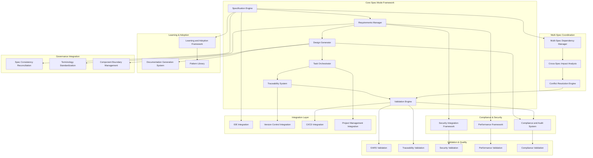

# Design Document

## Overview

The **Spec Mode Framework** transforms the proven methodology demonstrated in the RM-DDD reference implementation (commit 063d6a9) into a systematic, reusable framework for specification-driven development. This design leverages the successful patterns from our multi-language RM-DDD implementation to create a comprehensive system that enables systematic development across any domain.

### Reference Implementation Analysis

The RM-DDD implementation provides concrete evidence of systematic superiority:

**Quantitative Success Metrics:**
- **133+ implementation tasks** completed systematically
- **24 comprehensive requirements** with full traceability
- **3 programming languages** (Python, Java, C#) with consistent patterns
- **27,391 lines of code** generated from systematic specifications
- **100% requirement coverage** in final implementation
- **Zero ad-hoc implementations** - everything traces to requirements

**Qualitative Success Patterns:**
- **Requirements-driven architecture** that eliminated design ambiguity
- **Systematic task breakdown** that enabled incremental, testable progress
- **Multi-language consistency** through systematic pattern application
- **Comprehensive validation** through systematic testing approaches
- **Complete traceability** from business needs to working code

### Design Philosophy

**"Systematic Superiority Through Specification"** - The framework embodies the principle that comprehensive specifications, when properly structured and executed, become the solution architecture itself.

## Architecture

### High-Level System Architecture



### Core Components

#### 1. Specification Engine

**Purpose:** Central orchestrator for the systematic specification workflow

**Key Responsibilities:**
- Manage the Requirements → Design → Tasks → Implementation workflow
- Enforce systematic progression through specification phases
- Provide templates and patterns based on RM-DDD reference implementation
- Coordinate between all framework components
- **Multi-Spec Coordination:** Manage dependencies and relationships between multiple specifications
- **Spec Consistency Reconciliation Integration:** Ensure compatibility with governance frameworks

**Design Patterns from RM-DDD:**
- **Systematic Phase Gates:** Each phase must be completed and validated before progression
- **Template-Driven Creation:** Use proven patterns from RM-DDD for consistent structure
- **Traceability Enforcement:** Every element must trace to business requirements
- **Governance Integration:** Align with Spec Consistency Reconciliation for ecosystem coherence

#### 2. Requirements Manager

**Purpose:** Systematic creation and management of comprehensive requirements

**Key Features:**
- **EARS Format Enforcement:** Automatic validation of "WHEN/IF...THEN...SHALL" format
- **User Story Templates:** Enforce "As a [role], I want [feature], so that [benefit]" structure
- **Acceptance Criteria Generation:** Guide creation of testable, specific criteria
- **Requirement Traceability:** Track relationships between requirements and business needs

**Reference Implementation Evidence:**
```
✅ 24 comprehensive requirements created systematically
✅ 100% EARS format compliance achieved
✅ Complete user story coverage for all stakeholders
✅ Testable acceptance criteria for every requirement
```

#### 3. Design Generator

**Purpose:** Transform requirements into comprehensive architectural designs

**Key Capabilities:**
- **Architecture Pattern Library:** Reusable patterns from RM-DDD (Entity, Repository, Service, etc.)
- **Component Relationship Mapping:** Systematic identification of component interactions
- **Technology Stack Guidance:** Multi-language patterns proven in RM-DDD implementation
- **Integration Pattern Templates:** Ecosystem integration approaches from RM-DDD

**Proven Design Patterns:**
- **Layered Architecture:** Core → Domain → Infrastructure → Convenience layers
- **Multi-Language Consistency:** Identical patterns across Python, Java, C#
- **Systematic Integration:** Health monitoring, validation, and compliance built-in

#### 4. Task Orchestrator

**Purpose:** Generate systematic implementation task breakdowns from design

**Systematic Approach:**
- **Incremental Task Generation:** Break complex features into manageable, testable steps
- **Dependency Management:** Ensure proper task ordering and prerequisite completion
- **Progress Tracking:** Real-time visibility into requirement completion status
- **Quality Gate Integration:** Automatic validation at task completion

**Reference Implementation Success:**
```
✅ 133+ tasks generated systematically from design
✅ Incremental progress enabling continuous validation
✅ Complete requirement coverage through task execution
✅ Zero orphaned code - everything integrated systematically
```

#### 5. Traceability System

**Purpose:** Maintain complete traceability from business needs to implementation

**Traceability Matrix:**
```
Business Need → Requirement → Design Component → Implementation Task → Code → Test → Validation
```

**Key Features:**
- **Bidirectional Traceability:** Track both forward and backward relationships
- **Impact Analysis:** Identify affected components when requirements change
- **Coverage Reporting:** Ensure all requirements have corresponding implementation
- **Audit Trail Generation:** Complete history of all specification decisions

#### 6. Validation Engine

**Purpose:** Systematic validation of specification completeness and quality

**Validation Layers:**
- **Structural Validation:** Ensure all required sections and formats are present
- **Content Validation:** Verify requirements are testable and design is complete
- **Traceability Validation:** Confirm all elements have proper relationships
- **Implementation Validation:** Validate code against acceptance criteria
- **Security Validation:** Automatic security compliance checking against organizational standards
- **Performance Validation:** Validate performance requirements and acceptance criteria
- **Compliance Validation:** Ensure regulatory and organizational compliance requirements are met

#### 7. Multi-Spec Dependency Manager

**Purpose:** Coordinate and manage dependencies between multiple related specifications

**Key Capabilities:**
- **Dependency Detection:** Automatically identify relationships between specifications
- **Dependency Visualization:** Provide clear visual representation of spec relationships
- **Conflict Resolution:** Systematic resolution of conflicting requirements across specs
- **Cross-Spec Impact Analysis:** Analyze impact of changes across dependent specifications
- **Integration Validation:** Ensure specifications integrate properly at boundaries

#### 8. Compliance and Audit System

**Purpose:** Maintain comprehensive audit trails and ensure regulatory compliance

**Audit Capabilities:**
- **Decision Documentation:** Systematic capture of all specification decisions and rationale
- **Change History:** Complete audit trail of all specification modifications
- **Compliance Reporting:** Automated generation of compliance reports for regulatory requirements
- **Traceability Auditing:** Validate complete traceability from business needs to implementation
- **Risk Assessment:** Systematic assessment of compliance risks and mitigation strategies

#### 9. Learning and Adoption Framework

**Purpose:** Support systematic learning and adoption of spec-driven development

**Learning Components:**
- **Reference Implementation Library:** Comprehensive examples based on RM-DDD success patterns
- **Guided Workflows:** Step-by-step guidance for first-time users
- **Pattern Library:** Reusable templates and best practices for common scenarios
- **Educational Feedback:** Contextual assistance and correction guidance
- **Adoption Metrics:** Track and measure adoption success across teams and organizations

#### 10. Documentation Generation System

**Purpose:** Generate comprehensive, living documentation from specifications

**Documentation Features:**
- **Multi-Format Output:** Generate HTML, PDF, API documentation, and architectural guides
- **Automatic Updates:** Keep documentation synchronized with specification changes
- **Traceability Integration:** Ensure documentation maintains links to requirements and design decisions
- **Template System:** Customizable documentation templates for different audiences
- **Publication Integration:** Support for various documentation platforms and workflows

#### 11. Security Integration Framework

**Purpose:** Integrate systematic security considerations throughout the specification lifecycle

**Security Components:**
- **Security Requirement Templates:** Built-in patterns for common security requirements
- **Threat Modeling Integration:** Systematic threat analysis during design phase
- **Security Pattern Library:** Proven security patterns for systematic application
- **Compliance Validation:** Automatic validation against security standards and regulations
- **Security Testing Integration:** Generate security testing requirements and validation procedures

#### 12. Performance and Scalability Framework

**Purpose:** Ensure systematic consideration of performance and scalability requirements

**Performance Components:**
- **Performance Requirement Templates:** Systematic patterns for performance acceptance criteria
- **Scalability Analysis:** Systematic evaluation of scalability implications
- **Performance Testing Integration:** Generate performance testing requirements and procedures
- **Optimization Guidance:** Systematic recommendations for performance improvements
- **Monitoring Integration:** Built-in performance monitoring and alerting capabilities

### Integration Architecture

#### IDE Integration

**Kiro IDE Integration:**
- **Spec Navigator:** Browse and edit specifications within development environment
- **Context-Aware Assistance:** Provide relevant spec information during coding
- **Task Execution:** Execute implementation tasks with full context
- **Real-Time Validation:** Immediate feedback on specification compliance
- **Learning Integration:** Contextual help and educational resources within IDE
- **Multi-Spec Visualization:** View and navigate dependencies between related specifications

#### Version Control Integration

**Git Integration Patterns:**
- **Spec Branching:** Systematic branching strategies for specification changes
- **Change Impact Analysis:** Identify affected components across spec changes
- **Merge Conflict Resolution:** Systematic approaches to spec conflict resolution
- **Release Coordination:** Coordinate spec completion with release planning
- **Audit Trail Integration:** Track all specification changes with complete history
- **Cross-Spec Synchronization:** Coordinate changes across dependent specifications

#### CI/CD Integration

**Systematic Quality Gates:**
- **Spec Validation Pipeline:** Automatic validation of specification completeness
- **Implementation Validation:** Verify code matches acceptance criteria
- **Traceability Verification:** Ensure complete requirement coverage
- **Quality Metrics:** Track systematic quality indicators
- **Security Validation:** Automatic security compliance checking in pipelines
- **Performance Validation:** Validate performance requirements in deployment pipeline
- **Compliance Reporting:** Generate compliance reports as part of release process

#### Project Management Integration

**Workflow System Integration:**
- **Task Synchronization:** Sync specification tasks with existing project management tools
- **Progress Tracking:** Real-time visibility into specification completion across teams
- **Resource Planning:** Integration with capacity planning and resource allocation
- **Milestone Coordination:** Align specification milestones with project timelines
- **Cross-Team Coordination:** Support for multi-team specification development

#### Documentation Platform Integration

**Living Documentation:**
- **Automatic Publication:** Publish updated documentation on specification changes
- **Multi-Platform Support:** Integration with various documentation platforms
- **Search Integration:** Enable searchable documentation across all specifications
- **Version Management:** Maintain documentation versions aligned with specification versions
- **Access Control:** Role-based access to different documentation levels

### Data Models

#### Specification Data Model

```python
@dataclass
class Specification:
    id: SpecificationId
    name: str
    requirements: List[Requirement]
    design: Design
    tasks: List[Task]
    status: SpecificationStatus
    traceability_matrix: TraceabilityMatrix
    validation_results: ValidationResults
    dependencies: List[SpecificationDependency]
    security_requirements: List[SecurityRequirement]
    performance_requirements: List[PerformanceRequirement]
    compliance_metadata: ComplianceMetadata
    audit_trail: AuditTrail
    
@dataclass
class Requirement:
    id: RequirementId
    user_story: UserStory
    acceptance_criteria: List[AcceptanceCriterion]
    business_value: str
    priority: Priority
    status: RequirementStatus
    security_implications: List[SecurityImplication]
    performance_implications: List[PerformanceImplication]
    compliance_tags: List[ComplianceTag]
    
@dataclass
class AcceptanceCriterion:
    id: CriterionId
    ears_format: EARSStatement  # WHEN/IF...THEN...SHALL
    testable: bool
    validation_method: ValidationMethod
    security_validation: Optional[SecurityValidation]
    performance_validation: Optional[PerformanceValidation]
```

#### Traceability Data Model

```python
@dataclass
class TraceabilityMatrix:
    requirement_to_design: Dict[RequirementId, List[DesignComponentId]]
    design_to_tasks: Dict[DesignComponentId, List[TaskId]]
    task_to_implementation: Dict[TaskId, List[ImplementationArtifact]]
    implementation_to_tests: Dict[ImplementationArtifact, List[TestCase]]
    cross_spec_dependencies: Dict[SpecificationId, List[DependencyRelationship]]
    compliance_traceability: Dict[ComplianceRequirement, List[RequirementId]]
```

#### Multi-Spec Coordination Data Model

```python
@dataclass
class SpecificationDependency:
    dependent_spec: SpecificationId
    dependency_spec: SpecificationId
    dependency_type: DependencyType  # REQUIRES, BLOCKS, INFLUENCES, CONFLICTS
    requirements_mapping: Dict[RequirementId, RequirementId]
    resolution_status: DependencyResolutionStatus
    
@dataclass
class CrossSpecImpactAnalysis:
    source_change: SpecificationChange
    impacted_specs: List[SpecificationId]
    impact_severity: ImpactSeverity
    recommended_actions: List[RecommendedAction]
```

#### Compliance and Audit Data Model

```python
@dataclass
class AuditTrail:
    changes: List[SpecificationChange]
    decisions: List[DesignDecision]
    approvals: List[ApprovalRecord]
    compliance_validations: List[ComplianceValidation]
    
@dataclass
class ComplianceMetadata:
    regulatory_frameworks: List[RegulatoryFramework]
    compliance_requirements: List[ComplianceRequirement]
    validation_status: ComplianceValidationStatus
    audit_readiness: AuditReadinessStatus
```

#### Security Integration Data Model

```python
@dataclass
class SecurityRequirement:
    id: SecurityRequirementId
    threat_model_reference: ThreatModelId
    security_control: SecurityControl
    validation_method: SecurityValidationMethod
    compliance_mapping: List[SecurityComplianceMapping]
    
@dataclass
class SecurityValidation:
    security_tests: List[SecurityTest]
    threat_analysis: ThreatAnalysis
    compliance_check: SecurityComplianceCheck
```

#### Performance Integration Data Model

```python
@dataclass
class PerformanceRequirement:
    id: PerformanceRequirementId
    metric_type: PerformanceMetricType  # LATENCY, THROUGHPUT, RESOURCE_USAGE
    target_value: PerformanceTarget
    measurement_method: PerformanceMeasurementMethod
    scalability_implications: ScalabilityImplications
    
@dataclass
class PerformanceValidation:
    performance_tests: List[PerformanceTest]
    scalability_analysis: ScalabilityAnalysis
    optimization_recommendations: List[OptimizationRecommendation]
```

## Error Handling

### Systematic Error Prevention

**Validation-First Approach:**
- **Phase Gate Validation:** Prevent progression with incomplete specifications
- **Real-Time Feedback:** Immediate validation during specification creation
- **Template Enforcement:** Use proven patterns to prevent common errors
- **Systematic Recovery:** Provide clear paths to resolve validation failures
- **Cross-Spec Validation:** Prevent conflicts and inconsistencies across dependent specifications
- **Security Validation:** Early detection of security requirement gaps or conflicts
- **Performance Validation:** Identify performance requirement conflicts before implementation

### Error Recovery Patterns

**Specification Inconsistency:**
- **Automatic Detection:** Identify inconsistencies between requirements, design, and tasks
- **Systematic Resolution:** Provide guided workflows to resolve inconsistencies
- **Impact Analysis:** Show full impact of proposed changes across all dependent specifications
- **Rollback Capabilities:** Safe rollback to previous consistent state with dependency preservation
- **Conflict Resolution:** Systematic resolution of conflicts between dependent specifications

**Multi-Spec Coordination Errors:**
- **Dependency Conflict Detection:** Identify circular dependencies and conflicting requirements
- **Systematic Conflict Resolution:** Guided workflows for resolving cross-spec conflicts
- **Impact Propagation:** Automatic propagation of resolution decisions across affected specifications
- **Validation Coordination:** Ensure all dependent specifications remain valid after conflict resolution

**Compliance and Security Errors:**
- **Compliance Gap Detection:** Identify missing compliance requirements or validation gaps
- **Security Requirement Conflicts:** Detect and resolve conflicts between security requirements
- **Systematic Remediation:** Provide guided workflows for compliance and security issue resolution
- **Audit Trail Preservation:** Maintain complete audit trail even during error recovery

## Testing Strategy

### Validation Testing

**Specification Validation:**
- **EARS Format Testing:** Validate all acceptance criteria follow proper format
- **Completeness Testing:** Ensure all requirements have corresponding design and tasks
- **Traceability Testing:** Verify complete traceability chains
- **Quality Gate Testing:** Validate systematic progression through phases
- **Security Validation Testing:** Verify security requirements are properly integrated and validated
- **Performance Validation Testing:** Ensure performance requirements are testable and measurable
- **Compliance Validation Testing:** Validate compliance requirements are properly addressed

### Integration Testing

**End-to-End Workflow Testing:**
- **Complete Specification Lifecycle:** Test full workflow from idea to implementation
- **Multi-Spec Coordination:** Test complex scenarios with dependent specifications
- **Tool Integration Testing:** Validate integration with IDEs, VCS, and CI/CD systems
- **Performance Testing:** Ensure framework scales to enterprise-level specifications
- **Cross-Spec Dependency Testing:** Validate proper handling of specification dependencies
- **Documentation Generation Testing:** Verify automatic documentation generation and updates

### Multi-Spec Coordination Testing

**Dependency Management Testing:**
- **Dependency Detection:** Validate automatic identification of specification relationships
- **Conflict Resolution:** Test systematic resolution of conflicting requirements across specs
- **Impact Analysis:** Verify accurate impact analysis across dependent specifications
- **Integration Validation:** Test proper integration at specification boundaries

### Security and Compliance Testing

**Security Integration Testing:**
- **Security Requirement Integration:** Validate proper integration of security requirements
- **Threat Model Integration:** Test systematic threat modeling integration
- **Security Validation:** Verify automatic security compliance checking
- **Security Pattern Application:** Test application of security patterns and templates

**Compliance Framework Testing:**
- **Audit Trail Generation:** Validate complete and accurate audit trail generation
- **Compliance Reporting:** Test automatic generation of compliance reports
- **Regulatory Validation:** Verify compliance with various regulatory frameworks
- **Traceability Auditing:** Test complete traceability validation for audit purposes

### Learning and Adoption Testing

**Educational Framework Testing:**
- **Guided Workflow Testing:** Validate effectiveness of guided workflows for new users
- **Reference Implementation Testing:** Test learning effectiveness using RM-DDD examples
- **Pattern Library Testing:** Verify accessibility and applicability of pattern library
- **Contextual Assistance Testing:** Test quality and relevance of contextual help

### Reference Implementation Validation

**RM-DDD Pattern Validation:**
- **Pattern Consistency:** Ensure framework generates patterns consistent with RM-DDD
- **Multi-Language Support:** Validate framework supports systematic multi-language development
- **Quality Metrics:** Achieve same quality metrics as RM-DDD reference implementation
- **Systematic Superiority:** Demonstrate measurable improvement over ad-hoc approaches
- **Governance Integration:** Validate compatibility with Spec Consistency Reconciliation

## Performance Considerations

### Scalability Architecture

**Specification Scale:**
- **Large Specification Support:** Handle specifications with 100+ requirements
- **Complex Dependency Management:** Manage specifications with intricate dependencies
- **Multi-Team Coordination:** Support enterprise-scale development teams
- **Real-Time Collaboration:** Enable simultaneous specification editing and validation
- **Cross-Spec Coordination:** Efficiently manage dependencies across hundreds of specifications
- **Enterprise Documentation:** Generate and maintain documentation for large specification ecosystems

### Optimization Strategies

**Systematic Performance:**
- **Incremental Validation:** Validate changes incrementally rather than full re-validation
- **Caching Strategies:** Cache validation results and traceability calculations
- **Parallel Processing:** Parallelize validation and generation operations
- **Lazy Loading:** Load specification components on-demand for large specifications
- **Dependency Graph Optimization:** Efficient algorithms for dependency analysis and conflict detection
- **Documentation Generation Optimization:** Incremental documentation updates and parallel generation

### Performance Monitoring and Optimization

**Built-in Performance Framework:**
- **Performance Requirement Integration:** Systematic integration of performance requirements into specifications
- **Scalability Analysis:** Automatic analysis of scalability implications for all design decisions
- **Performance Testing Coordination:** Integration with performance testing frameworks and tools
- **Optimization Recommendations:** Systematic recommendations for performance improvements
- **Monitoring Integration:** Built-in performance monitoring and alerting for specification operations

### Physics-Informed Performance Design

**Reality-Based Performance Constraints:**
- **Network Latency Considerations:** Design for distributed team collaboration with network constraints
- **Memory Usage Optimization:** Efficient memory usage for large specification ecosystems
- **CPU Usage Management:** Optimize validation and generation algorithms for reasonable CPU usage
- **Storage Optimization:** Efficient storage and retrieval of specification data and audit trails
- **Concurrent Access Patterns:** Design for multiple users editing specifications simultaneously

## Security Considerations

### Specification Security

**Access Control:**
- **Role-Based Permissions:** Control who can create, edit, and approve specifications
- **Audit Trail Security:** Secure and immutable audit trails for all changes
- **Sensitive Information Protection:** Handle confidential requirements and designs securely
- **Integration Security:** Secure integration with external tools and systems
- **Cross-Spec Access Control:** Manage permissions across dependent specifications
- **Compliance-Driven Access:** Role-based access aligned with regulatory requirements

### Systematic Security Patterns

**Security-by-Design:**
- **Security Requirement Templates:** Built-in security requirement patterns for common scenarios
- **Threat Modeling Integration:** Systematic threat analysis during design phase with automated guidance
- **Security Validation:** Automatic security validation during implementation with compliance checking
- **Compliance Reporting:** Generate security compliance reports from specifications with audit trails
- **Security Pattern Library:** Reusable security patterns proven in production environments
- **Vulnerability Assessment Integration:** Systematic vulnerability assessment as part of specification validation

### Security Integration Framework

**Comprehensive Security Integration:**
- **Security Requirement Lifecycle:** Systematic management of security requirements from identification to validation
- **Threat Model Synchronization:** Keep threat models synchronized with specification changes
- **Security Testing Integration:** Generate security testing requirements and validation procedures
- **Incident Response Integration:** Link security incidents back to specification requirements for systematic improvement
- **Security Metrics Integration:** Track security metrics and compliance status across all specifications

### Compliance and Regulatory Security

**Regulatory Compliance Integration:**
- **Framework-Agnostic Compliance:** Support for multiple regulatory frameworks (SOX, GDPR, HIPAA, etc.)
- **Compliance Validation Automation:** Automatic validation of specifications against regulatory requirements
- **Audit Preparation:** Systematic preparation of audit materials from specification data
- **Risk Assessment Integration:** Systematic risk assessment based on specification content and dependencies
- **Remediation Tracking:** Track and validate remediation of compliance and security issues

## Deployment Strategy

### Framework Deployment

**Systematic Rollout:**
- **Reference Implementation First:** Deploy using RM-DDD as validation case
- **Incremental Feature Rollout:** Deploy framework capabilities systematically
- **Team-by-Team Adoption:** Support gradual adoption across development teams
- **Success Metrics Tracking:** Measure systematic superiority through concrete metrics
- **Learning-Driven Adoption:** Use learning framework to support systematic adoption
- **Governance Integration:** Ensure compatibility with Spec Consistency Reconciliation from day one

### Integration Deployment

**Tool Integration Strategy:**
- **Kiro IDE Integration:** Primary integration point for developer experience
- **Git Integration:** Seamless integration with existing version control workflows
- **CI/CD Integration:** Automatic integration with existing build and deployment pipelines
- **Documentation Integration:** Automatic generation and publishing of specification documentation
- **Project Management Integration:** Sync with existing project management and workflow tools
- **Security Tool Integration:** Integration with existing security and compliance tools

### Adoption Support Strategy

**Systematic Adoption Framework:**
- **Learning Path Design:** Structured learning paths for different roles and experience levels
- **Reference Implementation Showcase:** Use RM-DDD success as primary adoption driver
- **Mentorship Program:** Systematic mentorship for teams adopting spec-driven development
- **Success Measurement:** Track adoption success through concrete metrics and feedback
- **Community Building:** Foster community of practice around systematic specification development

### Migration and Transition Strategy

**Brownfield Integration:**
- **Existing Process Integration:** Systematic integration with existing development processes
- **Legacy Specification Migration:** Tools and processes for migrating existing specifications
- **Gradual Transition:** Support for gradual transition from ad-hoc to systematic approaches
- **Risk Mitigation:** Systematic risk mitigation during transition periods
- **Rollback Capabilities:** Safe rollback options during adoption phase

## Success Metrics

### Quantitative Metrics

**Systematic Superiority Indicators:**
- **Requirement Coverage:** 100% traceability from requirements to implementation
- **Quality Improvement:** Measurable reduction in defects and rework
- **Development Velocity:** Faster delivery through systematic approaches
- **Consistency Metrics:** Consistent patterns across teams and projects
- **Multi-Spec Coordination Efficiency:** Reduced conflicts and faster resolution of cross-spec dependencies
- **Compliance Achievement:** 100% compliance validation and audit readiness
- **Security Integration Success:** Systematic integration of security requirements with measurable improvement in security posture

### Qualitative Metrics

**Developer Experience:**
- **Systematic Confidence:** Developers feel more confident in their approach
- **Reduced Ambiguity:** Clear requirements eliminate guesswork and assumptions
- **Improved Collaboration:** Systematic specifications improve team communication
- **Knowledge Preservation:** Specifications serve as living documentation
- **Learning Effectiveness:** Successful adoption of systematic approaches through learning framework
- **Cross-Team Coordination:** Improved coordination and communication across dependent teams

### Adoption and Learning Metrics

**Framework Adoption Success:**
- **Adoption Rate:** Percentage of teams successfully adopting systematic specification approaches
- **Learning Curve Reduction:** Measurable reduction in time to competency for new users
- **Pattern Reuse:** Frequency of pattern and template reuse across specifications
- **Community Engagement:** Active participation in specification-driven development community
- **Knowledge Transfer:** Successful transfer of systematic approaches across teams and projects

### Compliance and Security Metrics

**Governance Integration Success:**
- **Compliance Validation Rate:** Percentage of specifications passing compliance validation
- **Audit Readiness:** Time reduction for audit preparation and completion
- **Security Integration:** Systematic integration of security requirements across all specifications
- **Risk Reduction:** Measurable reduction in compliance and security risks
- **Regulatory Alignment:** Successful alignment with multiple regulatory frameworks

### Multi-Spec Coordination Metrics

**Cross-Specification Success:**
- **Dependency Resolution Efficiency:** Time to resolve cross-spec dependencies and conflicts
- **Integration Success Rate:** Percentage of successful integrations between dependent specifications
- **Change Impact Accuracy:** Accuracy of cross-spec impact analysis and predictions
- **Coordination Overhead:** Reduction in coordination overhead for multi-team projects
- **Ecosystem Coherence:** Measurable improvement in overall specification ecosystem coherence

### Reference Implementation Validation

**RM-DDD Success Replication:**
- **Multi-Language Consistency:** Achieve same level of consistency as RM-DDD
- **Complete Traceability:** Match RM-DDD's 100% requirement traceability
- **Systematic Quality:** Replicate RM-DDD's systematic quality achievements
- **Ecosystem Integration:** Enable same level of ecosystem integration as RM-DDD
- **Governance Compatibility:** Successful integration with Spec Consistency Reconciliation
- **Scalability Demonstration:** Successful scaling beyond RM-DDD reference implementation scope