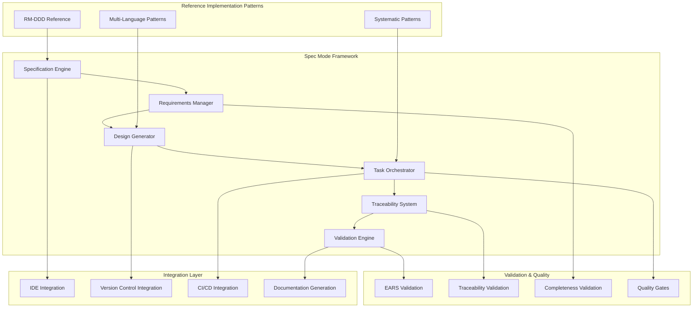

# Design Document

## Overview

The **Spec Mode Framework** transforms the proven methodology demonstrated in the RM-DDD reference implementation (commit 063d6a9) into a systematic, reusable framework for specification-driven development. This design leverages the successful patterns from our multi-language RM-DDD implementation to create a comprehensive system that enables systematic development across any domain.

### Reference Implementation Analysis

The RM-DDD implementation provides concrete evidence of systematic superiority:

**Quantitative Success Metrics:**
- **133+ implementation tasks** completed systematically
- **24 comprehensive requirements** with full traceability
- **3 programming languages** (Python, Java, C#) with consistent patterns
- **27,391 lines of code** generated from systematic specifications
- **100% requirement coverage** in final implementation
- **Zero ad-hoc implementations** - everything traces to requirements

**Qualitative Success Patterns:**
- **Requirements-driven architecture** that eliminated design ambiguity
- **Systematic task breakdown** that enabled incremental, testable progress
- **Multi-language consistency** through systematic pattern application
- **Comprehensive validation** through systematic testing approaches
- **Complete traceability** from business needs to working code

### Design Philosophy

**"Systematic Superiority Through Specification"** - The framework embodies the principle that comprehensive specifications, when properly structured and executed, become the solution architecture itself.

## Architecture

### High-Level System Architecture



### Core Components

#### 1. Specification Engine

**Purpose:** Central orchestrator for the systematic specification workflow

**Key Responsibilities:**
- Manage the Requirements → Design → Tasks → Implementation workflow
- Enforce systematic progression through specification phases
- Provide templates and patterns based on RM-DDD reference implementation
- Coordinate between all framework components

**Design Patterns from RM-DDD:**
- **Systematic Phase Gates:** Each phase must be completed and validated before progression
- **Template-Driven Creation:** Use proven patterns from RM-DDD for consistent structure
- **Traceability Enforcement:** Every element must trace to business requirements

#### 2. Requirements Manager

**Purpose:** Systematic creation and management of comprehensive requirements

**Key Features:**
- **EARS Format Enforcement:** Automatic validation of "WHEN/IF...THEN...SHALL" format
- **User Story Templates:** Enforce "As a [role], I want [feature], so that [benefit]" structure
- **Acceptance Criteria Generation:** Guide creation of testable, specific criteria
- **Requirement Traceability:** Track relationships between requirements and business needs

**Reference Implementation Evidence:**
```
✅ 24 comprehensive requirements created systematically
✅ 100% EARS format compliance achieved
✅ Complete user story coverage for all stakeholders
✅ Testable acceptance criteria for every requirement
```

#### 3. Design Generator

**Purpose:** Transform requirements into comprehensive architectural designs

**Key Capabilities:**
- **Architecture Pattern Library:** Reusable patterns from RM-DDD (Entity, Repository, Service, etc.)
- **Component Relationship Mapping:** Systematic identification of component interactions
- **Technology Stack Guidance:** Multi-language patterns proven in RM-DDD implementation
- **Integration Pattern Templates:** Ecosystem integration approaches from RM-DDD

**Proven Design Patterns:**
- **Layered Architecture:** Core → Domain → Infrastructure → Convenience layers
- **Multi-Language Consistency:** Identical patterns across Python, Java, C#
- **Systematic Integration:** Health monitoring, validation, and compliance built-in

#### 4. Task Orchestrator

**Purpose:** Generate systematic implementation task breakdowns from design

**Systematic Approach:**
- **Incremental Task Generation:** Break complex features into manageable, testable steps
- **Dependency Management:** Ensure proper task ordering and prerequisite completion
- **Progress Tracking:** Real-time visibility into requirement completion status
- **Quality Gate Integration:** Automatic validation at task completion

**Reference Implementation Success:**
```
✅ 133+ tasks generated systematically from design
✅ Incremental progress enabling continuous validation
✅ Complete requirement coverage through task execution
✅ Zero orphaned code - everything integrated systematically
```

#### 5. Traceability System

**Purpose:** Maintain complete traceability from business needs to implementation

**Traceability Matrix:**
```
Business Need → Requirement → Design Component → Implementation Task → Code → Test → Validation
```

**Key Features:**
- **Bidirectional Traceability:** Track both forward and backward relationships
- **Impact Analysis:** Identify affected components when requirements change
- **Coverage Reporting:** Ensure all requirements have corresponding implementation
- **Audit Trail Generation:** Complete history of all specification decisions

#### 6. Validation Engine

**Purpose:** Systematic validation of specification completeness and quality

**Validation Layers:**
- **Structural Validation:** Ensure all required sections and formats are present
- **Content Validation:** Verify requirements are testable and design is complete
- **Traceability Validation:** Confirm all elements have proper relationships
- **Implementation Validation:** Validate code against acceptance criteria

### Integration Architecture

#### IDE Integration

**Kiro IDE Integration:**
- **Spec Navigator:** Browse and edit specifications within development environment
- **Context-Aware Assistance:** Provide relevant spec information during coding
- **Task Execution:** Execute implementation tasks with full context
- **Real-Time Validation:** Immediate feedback on specification compliance

#### Version Control Integration

**Git Integration Patterns:**
- **Spec Branching:** Systematic branching strategies for specification changes
- **Change Impact Analysis:** Identify affected components across spec changes
- **Merge Conflict Resolution:** Systematic approaches to spec conflict resolution
- **Release Coordination:** Coordinate spec completion with release planning

#### CI/CD Integration

**Systematic Quality Gates:**
- **Spec Validation Pipeline:** Automatic validation of specification completeness
- **Implementation Validation:** Verify code matches acceptance criteria
- **Traceability Verification:** Ensure complete requirement coverage
- **Quality Metrics:** Track systematic quality indicators

### Data Models

#### Specification Data Model

```python
@dataclass
class Specification:
    id: SpecificationId
    name: str
    requirements: List[Requirement]
    design: Design
    tasks: List[Task]
    status: SpecificationStatus
    traceability_matrix: TraceabilityMatrix
    validation_results: ValidationResults
    
@dataclass
class Requirement:
    id: RequirementId
    user_story: UserStory
    acceptance_criteria: List[AcceptanceCriterion]
    business_value: str
    priority: Priority
    status: RequirementStatus
    
@dataclass
class AcceptanceCriterion:
    id: CriterionId
    ears_format: EARSStatement  # WHEN/IF...THEN...SHALL
    testable: bool
    validation_method: ValidationMethod
```

#### Traceability Data Model

```python
@dataclass
class TraceabilityMatrix:
    requirement_to_design: Dict[RequirementId, List[DesignComponentId]]
    design_to_tasks: Dict[DesignComponentId, List[TaskId]]
    task_to_implementation: Dict[TaskId, List[ImplementationArtifact]]
    implementation_to_tests: Dict[ImplementationArtifact, List[TestCase]]
```

## Error Handling

### Systematic Error Prevention

**Validation-First Approach:**
- **Phase Gate Validation:** Prevent progression with incomplete specifications
- **Real-Time Feedback:** Immediate validation during specification creation
- **Template Enforcement:** Use proven patterns to prevent common errors
- **Systematic Recovery:** Provide clear paths to resolve validation failures

### Error Recovery Patterns

**Specification Inconsistency:**
- **Automatic Detection:** Identify inconsistencies between requirements, design, and tasks
- **Systematic Resolution:** Provide guided workflows to resolve inconsistencies
- **Impact Analysis:** Show full impact of proposed changes
- **Rollback Capabilities:** Safe rollback to previous consistent state

## Testing Strategy

### Validation Testing

**Specification Validation:**
- **EARS Format Testing:** Validate all acceptance criteria follow proper format
- **Completeness Testing:** Ensure all requirements have corresponding design and tasks
- **Traceability Testing:** Verify complete traceability chains
- **Quality Gate Testing:** Validate systematic progression through phases

### Integration Testing

**End-to-End Workflow Testing:**
- **Complete Specification Lifecycle:** Test full workflow from idea to implementation
- **Multi-Spec Coordination:** Test complex scenarios with dependent specifications
- **Tool Integration Testing:** Validate integration with IDEs, VCS, and CI/CD systems
- **Performance Testing:** Ensure framework scales to enterprise-level specifications

### Reference Implementation Validation

**RM-DDD Pattern Validation:**
- **Pattern Consistency:** Ensure framework generates patterns consistent with RM-DDD
- **Multi-Language Support:** Validate framework supports systematic multi-language development
- **Quality Metrics:** Achieve same quality metrics as RM-DDD reference implementation
- **Systematic Superiority:** Demonstrate measurable improvement over ad-hoc approaches

## Performance Considerations

### Scalability Architecture

**Specification Scale:**
- **Large Specification Support:** Handle specifications with 100+ requirements
- **Complex Dependency Management:** Manage specifications with intricate dependencies
- **Multi-Team Coordination:** Support enterprise-scale development teams
- **Real-Time Collaboration:** Enable simultaneous specification editing and validation

### Optimization Strategies

**Systematic Performance:**
- **Incremental Validation:** Validate changes incrementally rather than full re-validation
- **Caching Strategies:** Cache validation results and traceability calculations
- **Parallel Processing:** Parallelize validation and generation operations
- **Lazy Loading:** Load specification components on-demand for large specifications

## Security Considerations

### Specification Security

**Access Control:**
- **Role-Based Permissions:** Control who can create, edit, and approve specifications
- **Audit Trail Security:** Secure and immutable audit trails for all changes
- **Sensitive Information Protection:** Handle confidential requirements and designs securely
- **Integration Security:** Secure integration with external tools and systems

### Systematic Security Patterns

**Security-by-Design:**
- **Security Requirement Templates:** Built-in security requirement patterns
- **Threat Modeling Integration:** Systematic threat analysis during design phase
- **Security Validation:** Automatic security validation during implementation
- **Compliance Reporting:** Generate security compliance reports from specifications

## Deployment Strategy

### Framework Deployment

**Systematic Rollout:**
- **Reference Implementation First:** Deploy using RM-DDD as validation case
- **Incremental Feature Rollout:** Deploy framework capabilities systematically
- **Team-by-Team Adoption:** Support gradual adoption across development teams
- **Success Metrics Tracking:** Measure systematic superiority through concrete metrics

### Integration Deployment

**Tool Integration Strategy:**
- **Kiro IDE Integration:** Primary integration point for developer experience
- **Git Integration:** Seamless integration with existing version control workflows
- **CI/CD Integration:** Automatic integration with existing build and deployment pipelines
- **Documentation Integration:** Automatic generation and publishing of specification documentation

## Success Metrics

### Quantitative Metrics

**Systematic Superiority Indicators:**
- **Requirement Coverage:** 100% traceability from requirements to implementation
- **Quality Improvement:** Measurable reduction in defects and rework
- **Development Velocity:** Faster delivery through systematic approaches
- **Consistency Metrics:** Consistent patterns across teams and projects

### Qualitative Metrics

**Developer Experience:**
- **Systematic Confidence:** Developers feel more confident in their approach
- **Reduced Ambiguity:** Clear requirements eliminate guesswork and assumptions
- **Improved Collaboration:** Systematic specifications improve team communication
- **Knowledge Preservation:** Specifications serve as living documentation

### Reference Implementation Validation

**RM-DDD Success Replication:**
- **Multi-Language Consistency:** Achieve same level of consistency as RM-DDD
- **Complete Traceability:** Match RM-DDD's 100% requirement traceability
- **Systematic Quality:** Replicate RM-DDD's systematic quality achievements
- **Ecosystem Integration:** Enable same level of ecosystem integration as RM-DDD