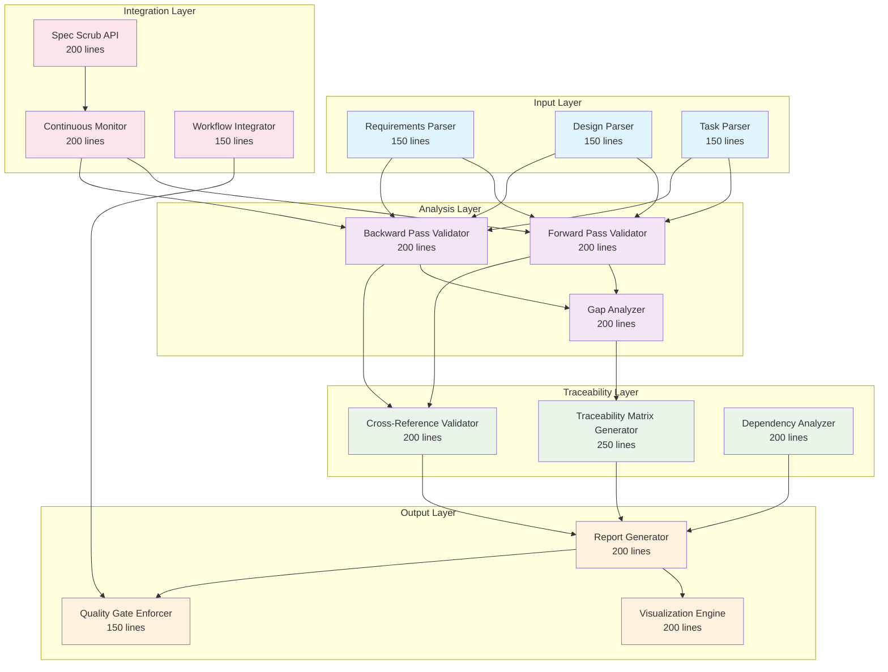

# Spec Scrub RDI Consistency Design

## Overview

The Spec Scrub RDI Consistency system provides systematic validation of Requirements → Design → Implementation (RDI) traceability through automated forward and backward pass analysis. The system ensures that every requirement has corresponding design elements and implementation tasks, while identifying orphaned capabilities and undocumented architectural decisions.

**Design Principles:**
- **Systematic Analysis**: Use proven parsing and analysis techniques for specification validation
- **Bidirectional Validation**: Forward pass (Requirements → Design → Implementation) and backward pass (Implementation → Design → Requirements)
- **Automated Quality Gates**: Integrate with development workflows to prevent RDI violations
- **Complete Traceability**: Maintain auditable traceability matrices for all specifications
- **Physics-Informed Architecture**: Design for real-world specification complexity and failure modes

## Architecture

### High-Level Architecture



## Components and Interfaces

### 1. Input Layer Components

#### Requirements Parser (150 lines)

```python
class RequirementsParser(ReflectiveModule):
    """Parses requirements documents to extract structured requirement data"""
    
    @monitored_operation
    def parse_requirements(self, requirements_path: Path) -> List[Requirement]:
        """
        Parse requirements document and extract structured requirements.
        
        Returns:
            List of Requirement objects with IDs, user stories, acceptance criteria
        """
        
    @monitored_operation
    def extract_requirement_metadata(self, requirement: Requirement) -> RequirementMetadata:
        """Extract metadata including dependencies, priorities, and categories"""
```

#### Design Parser (150 lines)

```python
class DesignParser(ReflectiveModule):
    """Parses design documents to extract architectural elements and decisions"""
    
    @monitored_operation
    def parse_design_elements(self, design_path: Path) -> List[DesignElement]:
        """
        Parse design document and extract components, interfaces, and decisions.
        
        Returns:
            List of DesignElement objects with component names, interfaces, decisions
        """
        
    @monitored_operation
    def extract_requirement_references(self, design_element: DesignElement) -> List[str]:
        """Extract requirement references from design elements"""
```

#### Task Parser (150 lines)

```python
class TaskParser(ReflectiveModule):
    """Parses task documents to extract implementation tasks and dependencies"""
    
    @monitored_operation
    def parse_implementation_tasks(self, tasks_path: Path) -> List[ImplementationTask]:
        """
        Parse tasks document and extract structured task information.
        
        Returns:
            List of ImplementationTask objects with task IDs, descriptions, dependencies
        """
        
    @monitored_operation
    def extract_design_references(self, task: ImplementationTask) -> List[str]:
        """Extract design element references from implementation tasks"""
```

### 2. Analysis Layer Components

#### Forward Pass Validator (200 lines)

```python
class ForwardPassValidator(ReflectiveModule):
    """Validates Requirements → Design → Implementation traceability"""
    
    @monitored_operation
    def validate_requirement_coverage(
        self, 
        requirements: List[Requirement],
        design_elements: List[DesignElement]
    ) -> RequirementCoverageReport:
        """
        Validate that all requirements have corresponding design elements.
        
        Returns:
            Coverage report with covered/uncovered requirements
        """
        
    @monitored_operation
    def validate_design_implementation(
        self,
        design_elements: List[DesignElement],
        tasks: List[ImplementationTask]
    ) -> DesignImplementationReport:
        """Validate that all design elements have implementation tasks"""
```

#### Backward Pass Validator (200 lines)

```python
class BackwardPassValidator(ReflectiveModule):
    """Validates Implementation → Design → Requirements traceability"""
    
    @monitored_operation
    def validate_task_traceability(
        self,
        tasks: List[ImplementationTask],
        design_elements: List[DesignElement]
    ) -> TaskTraceabilityReport:
        """
        Validate that all tasks trace to design elements.
        
        Returns:
            Traceability report with orphaned tasks
        """
        
    @monitored_operation
    def validate_design_requirements(
        self,
        design_elements: List[DesignElement],
        requirements: List[Requirement]
    ) -> DesignRequirementReport:
        """Validate that all design elements address requirements"""
```

#### Gap Analyzer (200 lines)

```python
class GapAnalyzer(ReflectiveModule):
    """Analyzes RDI gaps and recommends remediation"""
    
    @monitored_operation
    def identify_rdi_gaps(
        self,
        forward_report: RequirementCoverageReport,
        backward_report: TaskTraceabilityReport
    ) -> RDIGapAnalysis:
        """
        Identify all RDI consistency gaps and categorize them.
        
        Returns:
            Gap analysis with categorized gaps and remediation recommendations
        """
        
    @monitored_operation
    def recommend_remediation(self, gaps: List[RDIGap]) -> List[RemediationAction]:
        """Generate specific remediation actions for identified gaps"""
```

### 3. Traceability Layer Components

#### Traceability Matrix Generator (250 lines)

```python
class TraceabilityMatrixGenerator(ReflectiveModule):
    """Generates comprehensive RDI traceability matrices"""
    
    @monitored_operation
    def generate_rdi_matrix(
        self,
        requirements: List[Requirement],
        design_elements: List[DesignElement],
        tasks: List[ImplementationTask]
    ) -> TraceabilityMatrix:
        """
        Generate complete Requirements → Design → Implementation matrix.
        
        Returns:
            Traceability matrix with all RDI relationships
        """
        
    @monitored_operation
    def export_matrix(self, matrix: TraceabilityMatrix, format: str) -> str:
        """Export matrix in specified format (markdown, HTML, PDF)"""
        
    @monitored_operation
    def generate_visual_traceability(self, matrix: TraceabilityMatrix) -> str:
        """Generate graphical representations of RDI relationships and dependencies"""
        
    @monitored_operation
    def create_audit_documentation(self, matrix: TraceabilityMatrix) -> AuditReport:
        """Generate audit-ready documentation that proves RDI consistency"""

#### Cross-Reference Validator (200 lines)

```python
class CrossReferenceValidator(ReflectiveModule):
    """Validates cross-specification consistency and dependencies"""
    
    @monitored_operation
    def validate_cross_spec_dependencies(
        self,
        specifications: List[Specification]
    ) -> CrossSpecDependencyReport:
        """
        Validate dependencies and relationships between specifications.
        
        Returns:
            Report identifying cross-specification dependencies and conflicts
        """
        
    @monitored_operation
    def detect_specification_conflicts(
        self,
        specifications: List[Specification]
    ) -> ConflictReport:
        """Identify conflicting requirements or overlapping capabilities across specifications"""
        
    @monitored_operation
    def validate_foundation_references(
        self,
        dependent_spec: Specification,
        foundation_specs: List[Specification]
    ) -> FoundationReferenceReport:
        """Ensure dependent specifications properly reference foundation specifications"""

#### Dependency Analyzer (200 lines)

```python
class DependencyAnalyzer(ReflectiveModule):
    """Analyzes specification dependencies and impact relationships"""
    
    @monitored_operation
    def analyze_dependency_impact(
        self,
        changed_spec: Specification,
        all_specs: List[Specification]
    ) -> DependencyImpactReport:
        """
        Analyze impact of specification changes on dependent specifications.
        
        Returns:
            Impact analysis with recommendations for dependent specification updates
        """
        
    @monitored_operation
    def generate_dependency_graph(
        self,
        specifications: List[Specification]
    ) -> DependencyGraph:
        """Generate comprehensive dependency graph for all specifications"""

## Data Models

### Core Domain Models

```python
@dataclass
class Requirement:
    """Requirement entity with identity and traceability"""
    requirement_id: str
    user_story: str
    acceptance_criteria: List[str]
    priority: int
    category: str
    source_file: Path
    line_number: int

@dataclass
class DesignElement:
    """Design element with requirement references"""
    element_id: str
    element_type: str  # component, interface, decision
    description: str
    requirement_references: List[str]
    source_file: Path
    section: str

@dataclass
class ImplementationTask:
    """Implementation task with design references"""
    task_id: str
    description: str
    design_references: List[str]
    dependencies: List[str]
    status: str
    source_file: Path

@dataclass
class RDIGap:
    """RDI consistency gap with remediation"""
    gap_type: str  # missing_requirement, orphaned_design, untraced_task
    description: str
    affected_elements: List[str]
    severity: str
    remediation_action: str

@dataclass
class TraceabilityMatrix:
    """Complete RDI traceability matrix"""
    requirements: List[Requirement]
    design_elements: List[DesignElement]
    tasks: List[ImplementationTask]
    rdi_mappings: Dict[str, List[str]]
    coverage_metrics: Dict[str, float]
    gaps: List[RDIGap]
    version: str
    timestamp: datetime
    previous_version_changes: Optional[Dict[str, Any]]

@dataclass
class Specification:
    """Specification entity for cross-spec analysis"""
    spec_id: str
    name: str
    requirements_path: Path
    design_path: Path
    tasks_path: Path
    dependencies: List[str]
    version: str

@dataclass
class CrossSpecDependencyReport:
    """Report of cross-specification dependencies and relationships"""
    specification_dependencies: Dict[str, List[str]]
    circular_dependencies: List[List[str]]
    missing_dependencies: List[str]
    conflicting_capabilities: List[str]

@dataclass
class RDIConsistencyMetrics:
    """Metrics for tracking RDI consistency over time"""
    total_requirements: int
    covered_requirements: int
    orphaned_design_elements: int
    untraced_tasks: int
    consistency_score: float
    trend_direction: str
    improvement_recommendations: List[str]
```

## Error Handling

### Systematic Error Handling Strategy

```python
class SpecScrubError(Exception):
    """Base exception for spec scrub errors"""
    pass

class ParsingError(SpecScrubError):
    """Errors during specification parsing"""
    pass

class ValidationError(SpecScrubError):
    """Errors during RDI validation"""
    pass

class TraceabilityError(SpecScrubError):
    """Errors in traceability analysis"""
    pass

class ErrorRecoveryManager(ReflectiveModule):
    """Manages error recovery for spec scrub operations"""
    
    @monitored_operation
    def handle_parsing_error(self, error: ParsingError) -> RecoveryAction:
        """Recover from specification parsing failures"""
        
    @monitored_operation
    def handle_validation_error(self, error: ValidationError) -> RecoveryAction:
        """Recover from RDI validation failures"""
```

## Testing Strategy

### Comprehensive Testing Approach

```python
class TestSpecScrubSystem:
    """Comprehensive tests for spec scrub system"""
    
    def test_forward_pass_validation_complete_coverage(self):
        """Test forward pass with complete RDI coverage"""
        
    def test_backward_pass_validation_orphaned_elements(self):
        """Test backward pass with orphaned implementation tasks"""
        
    def test_gap_analysis_comprehensive_remediation(self):
        """Test gap analysis with comprehensive remediation recommendations"""
        
    def test_traceability_matrix_generation_accuracy(self):
        """Test traceability matrix generation accuracy"""
        
    def test_cross_specification_consistency_validation(self):
        """Test cross-specification RDI consistency validation"""
        
    def test_continuous_monitoring_real_time_detection(self):
        """Test real-time RDI violation detection during specification changes"""
        
    def test_quality_gate_enforcement_workflow_integration(self):
        """Test quality gate enforcement in specification review workflows"""
        
    def test_spec_framework_integration_document_validation(self):
        """Test integration with Spec Framework document validation services"""

class TestRDIConsistencyValidation:
    """Tests for RDI consistency validation"""
    
    def test_requirement_without_design_detection(self):
        """Test detection of requirements without design elements"""
        
    def test_design_without_implementation_detection(self):
        """Test detection of design elements without implementation"""
        
    def test_implementation_without_requirement_detection(self):
        """Test detection of implementation tasks without requirements"""
        
    def test_cross_specification_dependency_validation(self):
        """Test validation of dependencies between specifications"""
        
    def test_conflicting_requirements_detection(self):
        """Test detection of conflicting requirements across specifications"""
        
    def test_foundation_specification_reference_validation(self):
        """Test validation of proper foundation specification references"""

class TestReportingAndAnalytics:
    """Tests for reporting and analytics functionality"""
    
    def test_comprehensive_rdi_report_generation(self):
        """Test generation of detailed RDI consistency reports"""
        
    def test_traceability_matrix_export_formats(self):
        """Test export of traceability matrices in multiple formats"""
        
    def test_rdi_consistency_metrics_tracking(self):
        """Test tracking of RDI consistency metrics over time"""
        
    def test_specification_quality_pattern_analysis(self):
        """Test identification of specification quality patterns and improvements"""

## Integration Points

### Spec Framework Integration (Foundation Dependency)

```python
class SpecFrameworkIntegration(ReflectiveModule):
    """Integration with Spec Framework for document validation and lifecycle management"""
    
    @monitored_operation
    def validate_specification_structure(self, spec_path: Path) -> StructureValidationResult:
        """Use Spec Framework document validation services for structure validation"""
        
    @monitored_operation
    def enforce_dag_consistency(self, specifications: List[Specification]) -> DAGConsistencyResult:
        """Leverage Spec Framework DAG enforcement during RDI validation"""
        
    @monitored_operation
    def manage_specification_lifecycle(self, spec: Specification) -> LifecycleResult:
        """Integrate with Spec Framework document lifecycle management"""
        
    @monitored_operation
    def check_format_compliance(self, spec_path: Path) -> FormatComplianceResult:
        """Use Spec Framework format compliance checking with specific error reporting"""

### Beast Mode Integration

```python
class SpecScrubBeastModeIntegration(ReflectiveModule):
    """Integration with Beast Mode task execution system"""
    
    @monitored_operation
    def execute_spec_scrub_as_beast_mode_task(self, spec_path: Path) -> TaskResult:
        """Execute spec scrub as Beast Mode task with proper monitoring"""
        
    @monitored_operation
    def integrate_with_task_dag(self, scrub_tasks: List[SpecScrubTask]) -> DAGExecution:
        """Integrate spec scrub tasks with Beast Mode DAG execution"""

### RM-DDD Integration

```python
class SpecScrubRMDDDIntegration(ReflectiveModule):
    """Integration with RM-DDD for ReflectiveModule patterns"""
    
    @monitored_operation
    def implement_reflective_patterns(self, component: SpecScrubComponent) -> ReflectiveImplementation:
        """Leverage ReflectiveModule patterns for spec scrub component implementation"""
        
    @monitored_operation
    def apply_systematic_monitoring(self, operation: SpecScrubOperation) -> MonitoringResult:
        """Use RM-DDD monitoring patterns for spec scrub operations"""

### RCA Tools Integration

```python
class SpecScrubRCAIntegration(ReflectiveModule):
    """Integration with RCA tools for systematic investigation"""
    
    @monitored_operation
    def investigate_rdi_violations(self, violation: RDIViolation) -> RCAReport:
        """Use root cause analysis for systematic investigation of RDI consistency violations"""
        
    @monitored_operation
    def analyze_specification_quality_patterns(self, specs: List[Specification]) -> QualityPatternAnalysis:
        """Apply RCA techniques to identify specification quality improvement opportunities"""

### Ghostbusters Integration

```python
class SpecScrubGhostbustersIntegration(ReflectiveModule):
    """Integration with Ghostbusters for multi-perspective validation"""
    
    @monitored_operation
    def multi_perspective_rdi_analysis(self, spec: Specification) -> MultiPerspectiveReport:
        """Use multi-perspective validation for complex RDI consistency analysis"""
        
    @monitored_operation
    def collaborative_gap_remediation(self, gaps: List[RDIGap]) -> CollaborativeRemediationPlan:
        """Leverage Ghostbusters collaborative capabilities for gap remediation planning"""

### Workflow Integration

```python
class SpecScrubWorkflowIntegration(ReflectiveModule):
    """Integration with development workflows"""
    
    @monitored_operation
    def validate_specification_changes(self, changed_files: List[Path]) -> ValidationResult:
        """Validate specification changes for RDI consistency"""
        
    @monitored_operation
    def enforce_quality_gates(self, spec_changes: SpecificationChanges) -> QualityGateResult:
        """Enforce RDI consistency quality gates in development workflow"""
        
    @monitored_operation
    def provide_real_time_notifications(self, violations: List[RDIViolation]) -> NotificationResult:
        """Provide immediate notifications with specific violation details and remediation recommendations"""

## Continuous Monitoring and Quality Gates

### Real-Time Monitoring Architecture

```python
class ContinuousMonitor(ReflectiveModule):
    """Provides real-time RDI consistency monitoring"""
    
    @monitored_operation
    def monitor_specification_changes(self, file_watcher: FileWatcher) -> MonitoringResult:
        """Monitor specification files for changes and trigger automatic validation"""
        
    @monitored_operation
    def provide_real_time_dashboard(self) -> DashboardData:
        """Provide real-time dashboards showing RDI consistency status across all specifications"""
        
    @monitored_operation
    def track_consistency_trends(self, timeframe: str) -> TrendAnalysis:
        """Track RDI consistency metrics over time and identify improvement or degradation patterns"""
        
    @monitored_operation
    def send_violation_notifications(self, violations: List[RDIViolation]) -> NotificationResult:
        """Send immediate notifications with specific violation details and remediation recommendations"""

class QualityGateEnforcer(ReflectiveModule):
    """Enforces RDI consistency quality gates in development workflows"""
    
    @monitored_operation
    def validate_specification_submission(self, spec_changes: SpecificationChanges) -> QualityGateResult:
        """Require passing spec scrub validation before specification approval"""
        
    @monitored_operation
    def block_rdi_violations(self, proposed_changes: List[SpecificationChange]) -> BlockingResult:
        """Block specification changes that introduce RDI consistency violations"""
        
    @monitored_operation
    def handle_quality_exceptions(self, exception_request: QualityException) -> ExceptionResult:
        """Provide documented exception processes with explicit risk acceptance"""
        
    @monitored_operation
    def measure_compliance_metrics(self, timeframe: str) -> ComplianceMetrics:
        """Track RDI consistency compliance rates and improvement trends"""
```

### Analytics and Reporting Architecture

```python
class AnalyticsEngine(ReflectiveModule):
    """Provides comprehensive RDI consistency analytics and insights"""
    
    @monitored_operation
    def analyze_specification_quality_patterns(self, specifications: List[Specification]) -> QualityPatternReport:
        """Identify common RDI consistency violations and recommend systematic improvements"""
        
    @monitored_operation
    def benchmark_specification_quality(self, specifications: List[Specification]) -> BenchmarkReport:
        """Identify specifications with the highest RDI consistency and use them as quality examples"""
        
    @monitored_operation
    def generate_improvement_recommendations(self, analysis: QualityPatternReport) -> ImprovementPlan:
        """Provide actionable insights for improving specification development processes"""
        
    @monitored_operation
    def track_quality_evolution(self, historical_data: List[RDIConsistencyMetrics]) -> EvolutionReport:
        """Measure specification quality improvements through RDI consistency trends"""
```

## Performance Requirements

- **Parsing Performance**: Parse 100 specification files within 30 seconds
- **Validation Performance**: Complete RDI validation for 50 specifications within 60 seconds
- **Memory Usage**: Maintain memory usage under 1GB for repositories with 100+ specifications
- **Real-time Monitoring**: Detect RDI violations within 5 seconds of specification changes
- **Scalability**: Support horizontal scaling for large repositories with 500+ specifications
- **Dashboard Response**: Real-time dashboard updates within 2 seconds of specification changes
- **Quality Gate Performance**: Complete quality gate validation within 10 seconds for specification submissions

## Security Considerations

- **Access Control**: Implement role-based access for spec scrub operations
- **Audit Trails**: Maintain comprehensive audit logs for all RDI validation activities
- **Data Protection**: Protect specification content during analysis and reporting
- **Secure Integration**: Ensure secure integration with development workflows and tools