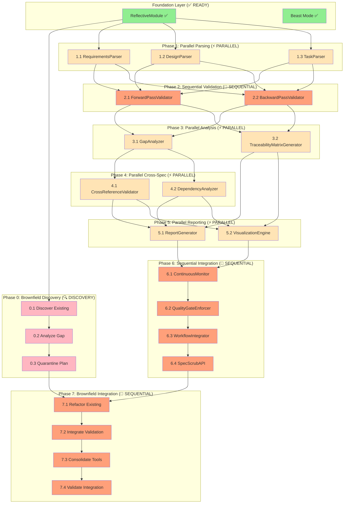

# Spec Scrub RDI Consistency Implementation Tasks

## Implementation Status

### ✅ FOUNDATION READY
- **ReflectiveModule Infrastructure**: Available for all components
- **Beast Mode DAG Executor**: Available for task execution
- **Existing Parsing Tools**: Can leverage existing specification parsing capabilities

### ❌ NOT IMPLEMENTED (12/12 COMPONENTS)
All spec scrub components need to be implemented from scratch.

## Implementation Plan

### Phase 0: Brownfield Discovery and Recovery 🔍 DISCOVERY

- [ ] 0.1 Discover Existing Spec-Related Implementations [desi-x1y2]
  - **Target**: Discovery and cataloging of existing spec functionality
  - **Location**: Repository-wide scan with results in `brownfield_analysis/`
  - **Dependencies**: None (foundation discovery)
  - Scan entire repository for existing spec parsing, validation, and management code
  - Identify scattered implementations of requirements parsing, design analysis, task management
  - Catalog existing terminology standardization and consistency checking logic
  - Document existing RDI traceability implementations (if any)
  - Create comprehensive inventory of spec-related functionality outside the clean DAG
  - **Integration Test**: Verify complete discovery of all spec-related code in repository
  - _Requirements: Forward Pass Discovery, Brownfield Reality Assessment_

- [ ] 0.2 Analyze Existing vs. Target Architecture [aeta-z3a4]
  - **Target**: Gap analysis between existing implementations and clean DAG architecture
  - **Location**: `brownfield_analysis/gap_analysis.md`
  - **Dependencies**: Discover Existing Implementations (0.1)
  - Perform forward pass analysis: Requirements → Design → Implementation gaps
  - Perform backward pass analysis: Implementation → Design → Requirements gaps
  - Identify overlapping functionality that needs consolidation
  - Map existing implementations to target DAG layers (Framework, Scrub, Consistency, Mode)
  - Document refactoring strategy for bringing existing code into the Fort
  - **Integration Test**: Verify comprehensive gap analysis covers all discovered implementations
  - _Requirements: Backward Pass Discovery, Architecture Reconciliation_

- [ ] 0.3 Create Quarantine and Refactoring Plan [cqrp-b5c6]
  - **Target**: Systematic plan for cleaning up existing implementations
  - **Location**: `brownfield_analysis/refactoring_plan.md`
  - **Dependencies**: Analyze Existing vs. Target (0.2)
  - Create quarantine strategy for isolating existing messy implementations
  - Design refactoring approach for each discovered implementation
  - Plan integration sequence to minimize disruption to working code
  - Establish validation criteria for bringing refactored code into the clean DAG
  - Document rollback procedures if refactoring introduces regressions
  - **Integration Test**: Verify refactoring plan addresses all discovered implementations
  - _Requirements: Systematic Recovery, Risk Mitigation_

### Phase 1: Core Parsing Infrastructure ⚡ PARALLEL EXECUTION

- [ ] 1.1 Implement RequirementsParser [rp-a1b2]
  - **Target**: RequirementsParser (150 lines)
  - **Location**: `src/spec_scrub/parsers/requirements_parser.py`
  - **Dependencies**: ReflectiveModule Infrastructure (✅ DONE)
  - Create RequirementsParser class inheriting from ReflectiveModule
  - Implement parse_requirements() method to extract structured requirement data
  - Implement extract_requirement_metadata() method for dependencies and priorities
  - Add markdown parsing with requirement ID extraction and acceptance criteria parsing
  - Write unit tests for requirements parsing functionality
  - **Integration Test**: Verify RequirementsParser can parse sample requirements documents
  - _Requirements: 1.1, 1.2, 10.1_

- [ ] 1.2 Implement DesignParser [dp-c3d4] ⚡ PARALLEL
  - **Target**: DesignParser (150 lines)
  - **Location**: `src/spec_scrub/parsers/design_parser.py`
  - **Dependencies**: ReflectiveModule Infrastructure (✅ DONE)
  - Create DesignParser class inheriting from ReflectiveModule
  - Implement parse_design_elements() method to extract components and interfaces
  - Implement extract_requirement_references() method to find requirement traceability
  - Add markdown parsing with component identification and requirement reference extraction
  - Write unit tests for design parsing functionality
  - **Integration Test**: Verify DesignParser can parse sample design documents
  - _Requirements: 1.1, 1.2, 10.1_

- [ ] 1.3 Implement TaskParser [tp-e5f6] ⚡ PARALLEL
  - **Target**: TaskParser (150 lines)
  - **Location**: `src/spec_scrub/parsers/task_parser.py`
  - **Dependencies**: ReflectiveModule Infrastructure (✅ DONE)
  - Create TaskParser class inheriting from ReflectiveModule
  - Implement parse_implementation_tasks() method to extract task structure
  - Implement extract_design_references() method to find design element traceability
  - Add markdown parsing with task ID extraction and dependency analysis
  - Write unit tests for task parsing functionality
  - **Integration Test**: Verify TaskParser can parse sample task documents
  - _Requirements: 1.1, 1.2, 10.1_

### Phase 2: RDI Validation Engine 🔄 SEQUENTIAL

- [ ] 2.1 Implement ForwardPassValidator [fpv-g7h8] 🔄 SEQUENTIAL (depends on 1.1, 1.2, 1.3)
  - **Target**: ForwardPassValidator (200 lines)
  - **Location**: `src/spec_scrub/validators/forward_pass_validator.py`
  - **Dependencies**: RequirementsParser (1.1), DesignParser (1.2), TaskParser (1.3)
  - Create ForwardPassValidator class inheriting from ReflectiveModule
  - Implement validate_requirement_coverage() method for Requirements → Design validation
  - Implement validate_design_implementation() method for Design → Implementation validation
  - Add comprehensive coverage analysis with gap identification
  - Write unit tests for forward pass validation functionality
  - **Integration Test**: Verify complete Requirements → Design → Implementation traceability validation
  - _Requirements: 1.1, 1.3, 4.1_

- [ ] 2.2 Implement BackwardPassValidator [bpv-i9j0] 🔄 SEQUENTIAL (depends on 1.1, 1.2, 1.3)
  - **Target**: BackwardPassValidator (200 lines)
  - **Location**: `src/spec_scrub/validators/backward_pass_validator.py`
  - **Dependencies**: RequirementsParser (1.1), DesignParser (1.2), TaskParser (1.3)
  - Create BackwardPassValidator class inheriting from ReflectiveModule
  - Implement validate_task_traceability() method for Implementation → Design validation
  - Implement validate_design_requirements() method for Design → Requirements validation
  - Add orphaned element detection with detailed reporting
  - Write unit tests for backward pass validation functionality
  - **Integration Test**: Verify complete Implementation → Design → Requirements traceability validation
  - _Requirements: 2.1, 2.3, 4.2_

### Phase 3: Gap Analysis and Remediation ⚡ PARALLEL EXECUTION

- [ ] 3.1 Implement GapAnalyzer [ga-k1l2] ⚡ PARALLEL (depends on 2.1, 2.2)
  - **Target**: GapAnalyzer (200 lines)
  - **Location**: `src/spec_scrub/analysis/gap_analyzer.py`
  - **Dependencies**: ForwardPassValidator (2.1), BackwardPassValidator (2.2)
  - Create GapAnalyzer class inheriting from ReflectiveModule
  - Implement identify_rdi_gaps() method to categorize all RDI consistency gaps
  - Implement recommend_remediation() method to generate specific remediation actions
  - Add gap severity assessment and prioritization
  - Write unit tests for gap analysis functionality
  - **Integration Test**: Verify comprehensive gap identification and remediation recommendations
  - _Requirements: 4.1, 4.2, 4.3_

- [ ] 3.2 Implement TraceabilityMatrixGenerator [tmg-m3n4] ⚡ PARALLEL (depends on 2.1, 2.2)
  - **Target**: TraceabilityMatrixGenerator (250 lines)
  - **Location**: `src/spec_scrub/traceability/matrix_generator.py`
  - **Dependencies**: ForwardPassValidator (2.1), BackwardPassValidator (2.2)
  - Create TraceabilityMatrixGenerator class inheriting from ReflectiveModule
  - Implement generate_rdi_matrix() method for complete RDI traceability matrices
  - Implement export_matrix() method with multiple format support (markdown, HTML, PDF)
  - Add visual traceability representation and audit-ready documentation
  - Write unit tests for traceability matrix generation
  - **Integration Test**: Verify accurate traceability matrix generation and export
  - _Requirements: 6.1, 6.2, 6.3_

### Phase 4: Cross-Specification Analysis ⚡ PARALLEL EXECUTION

- [ ] 4.1 Implement CrossReferenceValidator [crv-o5p6] ⚡ PARALLEL (depends on 3.1)
  - **Target**: CrossReferenceValidator (200 lines)
  - **Location**: `src/spec_scrub/validators/cross_reference_validator.py`
  - **Dependencies**: GapAnalyzer (3.1)
  - Create CrossReferenceValidator class inheriting from ReflectiveModule
  - Implement validate_cross_spec_references() method for inter-specification consistency
  - Implement detect_specification_conflicts() method for conflicting requirements
  - Add dependency relationship validation across specifications
  - Write unit tests for cross-reference validation functionality
  - **Integration Test**: Verify cross-specification consistency validation
  - _Requirements: 5.1, 5.2, 5.3_

- [ ] 4.2 Implement DependencyAnalyzer [da-q7r8] ⚡ PARALLEL (depends on 3.1)
  - **Target**: DependencyAnalyzer (200 lines)
  - **Location**: `src/spec_scrub/analysis/dependency_analyzer.py`
  - **Dependencies**: GapAnalyzer (3.1)
  - Create DependencyAnalyzer class inheriting from ReflectiveModule
  - Implement analyze_specification_dependencies() method for dependency mapping
  - Implement detect_circular_dependencies() method for circular dependency detection
  - Add dependency impact analysis for specification changes
  - Write unit tests for dependency analysis functionality
  - **Integration Test**: Verify comprehensive dependency analysis across specifications
  - _Requirements: 5.1, 5.4, 5.5_

### Phase 5: Reporting and Visualization ⚡ PARALLEL EXECUTION

- [ ] 5.1 Implement ReportGenerator [rg-s9t0] ⚡ PARALLEL (depends on 3.2, 4.1, 4.2)
  - **Target**: ReportGenerator (200 lines)
  - **Location**: `src/spec_scrub/reporting/report_generator.py`
  - **Dependencies**: TraceabilityMatrixGenerator (3.2), CrossReferenceValidator (4.1), DependencyAnalyzer (4.2)
  - Create ReportGenerator class inheriting from ReflectiveModule
  - Implement generate_rdi_consistency_report() method for comprehensive RDI reports
  - Implement generate_gap_analysis_report() method for detailed gap analysis
  - Add multiple report formats and stakeholder-specific views
  - Write unit tests for report generation functionality
  - **Integration Test**: Verify comprehensive RDI consistency reporting
  - _Requirements: 9.1, 9.2, 9.3_

- [ ] 5.2 Implement VisualizationEngine [ve-u1v2] ⚡ PARALLEL (depends on 3.2, 4.1, 4.2)
  - **Target**: VisualizationEngine (200 lines)
  - **Location**: `src/spec_scrub/visualization/visualization_engine.py`
  - **Dependencies**: TraceabilityMatrixGenerator (3.2), CrossReferenceValidator (4.1), DependencyAnalyzer (4.2)
  - Create VisualizationEngine class inheriting from ReflectiveModule
  - Implement generate_traceability_diagrams() method for visual RDI representation
  - Implement create_dependency_graphs() method for specification dependency visualization
  - Add interactive visualization capabilities and export options
  - Write unit tests for visualization functionality
  - **Integration Test**: Verify accurate visual representation of RDI relationships
  - _Requirements: 6.2, 9.4, 9.5_

### Phase 6: Integration and Automation 🔄 SEQUENTIAL

- [ ] 6.1 Implement ContinuousMonitor [cm-w3x4] 🔄 SEQUENTIAL (depends on 5.1, 5.2)
  - **Target**: ContinuousMonitor (200 lines)
  - **Location**: `src/spec_scrub/monitoring/continuous_monitor.py`
  - **Dependencies**: ReportGenerator (5.1), VisualizationEngine (5.2)
  - Create ContinuousMonitor class inheriting from ReflectiveModule
  - Implement monitor_specification_changes() method for real-time RDI monitoring
  - Implement trigger_automatic_validation() method for change-triggered validation
  - Add real-time dashboards and notification systems
  - Write unit tests for continuous monitoring functionality
  - **Integration Test**: Verify real-time RDI consistency monitoring
  - _Requirements: 7.1, 7.2, 7.3_

- [ ] 6.2 Implement QualityGateEnforcer [qge-y5z6] 🔄 SEQUENTIAL (depends on 6.1)
  - **Target**: QualityGateEnforcer (150 lines)
  - **Location**: `src/spec_scrub/quality/quality_gate_enforcer.py`
  - **Dependencies**: ContinuousMonitor (6.1)
  - Create QualityGateEnforcer class inheriting from ReflectiveModule
  - Implement enforce_rdi_consistency_gates() method for quality gate enforcement
  - Implement validate_specification_approval() method for approval workflow integration
  - Add exception handling and documented risk acceptance processes
  - Write unit tests for quality gate enforcement
  - **Integration Test**: Verify quality gate enforcement in specification workflows
  - _Requirements: 8.1, 8.2, 8.3_

- [ ] 6.3 Implement WorkflowIntegrator [wi-a7b8] 🔄 SEQUENTIAL (depends on 6.2)
  - **Target**: WorkflowIntegrator (150 lines)
  - **Location**: `src/spec_scrub/integration/workflow_integrator.py`
  - **Dependencies**: QualityGateEnforcer (6.2)
  - Create WorkflowIntegrator class inheriting from ReflectiveModule
  - Implement integrate_with_development_workflow() method for seamless workflow integration
  - Implement configure_automated_triggers() method for automatic spec scrub execution
  - Add Beast Mode integration and existing tool leveraging
  - Write unit tests for workflow integration functionality
  - **Integration Test**: Verify complete workflow integration with development processes
  - _Requirements: 10.1, 10.2, 10.3_

- [ ] 6.4 Implement SpecScrubAPI [ssa-c9d0] 🔄 SEQUENTIAL (depends on 6.3)
  - **Target**: SpecScrubAPI (200 lines)
  - **Location**: `src/spec_scrub/api/spec_scrub_api.py`
  - **Dependencies**: WorkflowIntegrator (6.3)
  - Create SpecScrubAPI class inheriting from ReflectiveModule
  - Implement execute_spec_scrub() method for programmatic spec scrub execution
  - Implement get_rdi_status() method for real-time RDI consistency status
  - Add comprehensive API endpoints for all spec scrub functionality
  - Write unit tests for API functionality
  - **Integration Test**: Verify complete API access to spec scrub capabilities
  - _Requirements: 7.5, 10.5_

### Phase 7: Brownfield Integration and Refactoring 🔄 SEQUENTIAL

- [ ] 7.1 Refactor Existing Spec Parsing Logic [resl-d1e2] 🔄 SEQUENTIAL (depends on 6.4, 0.3)
  - **Target**: Integration of existing spec parsing implementations
  - **Location**: Quarantine existing code, refactor into clean DAG components
  - **Dependencies**: SpecScrubAPI (6.4), Refactoring Plan (0.3)
  - Extract existing spec parsing logic from scattered locations
  - Refactor existing parsers to use RequirementsParser, DesignParser, TaskParser interfaces
  - Migrate existing parsing logic to clean ReflectiveModule patterns
  - Preserve working functionality while eliminating architectural debt
  - Validate that refactored parsers maintain compatibility with existing workflows
  - **Integration Test**: Verify refactored parsers handle all existing specification formats
  - _Requirements: Brownfield Recovery, Backward Compatibility_

- [ ] 7.2 Integrate Existing RDI Validation Logic [iervl-f3g4] 🔄 SEQUENTIAL (depends on 7.1)
  - **Target**: Integration of existing traceability and validation implementations
  - **Location**: Migrate existing validation logic into Spec Scrub components
  - **Dependencies**: Refactor Existing Parsing (7.1)
  - Identify and extract existing RDI traceability implementations
  - Integrate existing validation logic into ForwardPassValidator and BackwardPassValidator
  - Refactor existing gap analysis and reporting functionality
  - Ensure existing validation rules are preserved during integration
  - Migrate existing monitoring and alerting logic to continuous monitoring framework
  - **Integration Test**: Verify integrated validation maintains all existing quality checks
  - _Requirements: Functionality Preservation, Quality Continuity_

- [ ] 7.3 Consolidate Existing Spec Management Tools [cesmt-h5i6] 🔄 SEQUENTIAL (depends on 7.2)
  - **Target**: Consolidation of scattered spec management functionality
  - **Location**: Integrate existing tools into unified Spec Scrub ecosystem
  - **Dependencies**: Integrate Existing Validation (7.2)
  - Catalog existing spec management scripts and tools
  - Refactor existing tools to use unified Spec Scrub API
  - Consolidate overlapping functionality into single authoritative implementations
  - Migrate existing workflows to use clean DAG architecture
  - Preserve existing automation and integration points
  - **Integration Test**: Verify consolidated tools maintain all existing functionality
  - _Requirements: Tool Consolidation, Workflow Continuity_

- [ ] 7.4 Validate Brownfield Integration [vbi-j7k8] 🔄 SEQUENTIAL (depends on 7.3)
  - **Target**: Comprehensive validation of brownfield integration
  - **Location**: End-to-end validation of integrated system
  - **Dependencies**: Consolidate Existing Tools (7.3)
  - Validate that all existing spec-related functionality is preserved
  - Verify that clean DAG architecture is maintained despite integration
  - Test that existing workflows continue to work with refactored components
  - Validate performance and quality improvements from consolidation
  - Document migration success and any remaining technical debt
  - **Integration Test**: Verify complete system works with both new and legacy specifications
  - _Requirements: System Validation, Migration Success Criteria_

## Execution Dependencies

## Next Steps

### 🔍 BROWNFIELD REALITY - START WITH DISCOVERY

**Current Status**: Foundation infrastructure ready, but existing implementations need discovery and integration
**Immediate Priority**: Phase 0 brownfield discovery (0.1, 0.2, 0.3) - MUST execute first
**Critical Insight**: Cannot build clean architecture without understanding existing mess

**Brownfield-Aware Execution Strategy:**
1. **Phase 0**: Discover existing implementations and create refactoring plan (MANDATORY FIRST)
2. **Phase 1**: Execute parsing components in parallel (informed by discovery)
3. **Phase 2-6**: Execute clean architecture components (as originally planned)
4. **Phase 7**: Integrate existing implementations into clean architecture (working both ends toward middle)

**Forward and Backward Pass Approach**:
- **Forward Pass**: Requirements → Design → Implementation (Phases 1-6)
- **Backward Pass**: Existing Implementation → Analysis → Integration (Phase 0 + Phase 7)
- **Meet in the Middle**: Phase 7 brings existing code into the clean DAG architecture

**Quarantine Strategy**:
- **Outside the Fort**: Messy existing implementations stay in quarantine during cleanup
- **Inside the Fort**: Clean DAG architecture maintains systematic principles
- **Integration Gateway**: Phase 7 tasks act as the gateway for bringing cleaned code into the Fort

**Total Implementation**: 16 components, 8 phases (including brownfield), estimated 2,400+ lines of code plus refactoring effort

**Reality Check**: The clean architecture is the target, but we must systematically handle the existing brownfield implementations to get there.