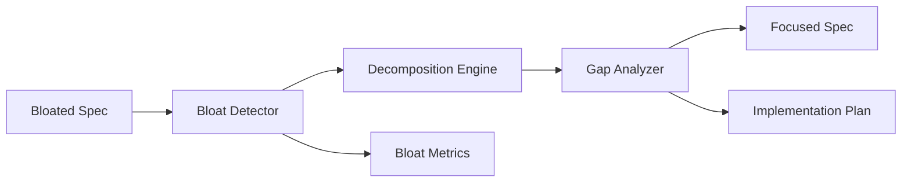

# Design Document

## Overview

This design implements a systematic approach to detect and remediate specification theater - the anti-pattern where perfect process compliance produces zero implementable value. The solution focuses on mathematical validation of requirements-to-implementation ratios and automated transformation of bloated specifications into focused, actionable requirements.

## Architecture

### Core Architecture Pattern



**Design Principle:** Simple pipeline with clear mathematical validation at each stage.

## Components and Interfaces

### 1. Specification Bloat Detector

**Purpose:** Mathematically detect when specifications have become theater instead of guidance.

**Core Algorithm:**
```python
bloat_score = (design_elements + acceptance_criteria) / implementation_tasks
theater_threshold = 2.0  # Empirically derived from perverse case analysis
```

**Interface:**
```python
class SpecBloatDetector(ReflectiveModule):
    def calculate_bloat_score(self, spec_path: str) -> float
    def detect_theater_patterns(self, spec_path: str) -> List[TheaterPattern]
    def suggest_decomposition(self, spec_path: str) -> DecompositionPlan
```

### 2. Requirements Decomposition Engine

**Purpose:** Transform bloated requirements into focused, implementable units.

**Decomposition Strategy:**
- Extract core behavioral expectations from bloated user stories
- Limit acceptance criteria to maximum 3 per requirement
- Ensure each requirement maps to specific implementation tasks
- Preserve business value while eliminating process theater

**Interface:**
```python
class RequirementsDecomposer(ReflectiveModule):
    def decompose_requirement(self, requirement: Requirement) -> List[FocusedRequirement]
    def validate_decomposition(self, original: Requirement, decomposed: List[FocusedRequirement]) -> ValidationResult
    def ensure_implementation_mapping(self, requirements: List[FocusedRequirement]) -> MappingResult
```

### 3. Implementation Gap Analyzer

**Purpose:** Identify disconnects between design complexity and implementation reality.

**Gap Detection Logic:**
- Compare design element count to implementation task count
- Estimate implementation effort based on actual code complexity
- Flag designs that exceed reasonable implementation scope
- Suggest either task addition or design simplification

**Interface:**
```python
class ImplementationGapAnalyzer(ReflectiveModule):
    def analyze_design_task_gap(self, spec_path: str) -> GapAnalysis
    def estimate_implementation_effort(self, design_elements: List[DesignElement]) -> EffortEstimate
    def suggest_gap_remediation(self, gap_analysis: GapAnalysis) -> RemediationSuggestion
```

### 4. Systematic Requirements Transformer

**Purpose:** Orchestrate the complete transformation from theater to systematic requirements.

**Transformation Process:**
1. Detect bloat and theater patterns
2. Decompose bloated requirements into focused units
3. Analyze implementation gaps
4. Generate focused specification with clear implementation path

**Interface:**
```python
class SystematicTransformer(ReflectiveModule):
    def transform_specification(self, bloated_spec_path: str) -> TransformationResult
    def validate_transformation(self, original_path: str, transformed_path: str) -> ValidationResult
    def measure_improvement(self, before: SpecMetrics, after: SpecMetrics) -> ImprovementMetrics
```

## Data Models

### Core Models

```python
@dataclass
class SpecMetrics:
    requirements_count: int
    acceptance_criteria_count: int
    design_elements_count: int
    implementation_tasks_count: int
    bloat_score: float
    coverage_ratio: float

@dataclass
class TheaterPattern:
    pattern_type: str  # "bloated_requirements", "over_engineering", "implementation_gap"
    severity: str
    description: str
    suggested_remediation: str

@dataclass
class FocusedRequirement:
    requirement_id: str
    user_story: str
    acceptance_criteria: List[str]  # Max 3 items
    implementation_tasks: List[str]
    testable_outcomes: List[str]

@dataclass
class TransformationResult:
    original_metrics: SpecMetrics
    transformed_metrics: SpecMetrics
    improvement_ratio: float
    theater_patterns_removed: List[TheaterPattern]
    implementation_feasibility_score: float
```

## Error Handling

### Theater Detection Errors
- Handle malformed specification documents gracefully
- Provide clear feedback when specifications cannot be parsed
- Suggest manual review for edge cases

### Transformation Errors
- Validate that transformation preserves business value
- Ensure decomposed requirements maintain traceability
- Rollback capability if transformation introduces errors

## Testing Strategy

### Validation Approach
1. **Perverse Case Testing:** Use rmi-rm-ddd-conformance-remediation as primary test case
2. **Transformation Validation:** Ensure business value preservation during decomposition
3. **Implementation Feasibility:** Validate that transformed specs are actually implementable
4. **Mathematical Validation:** Test bloat score calculations against known theater patterns

### Success Metrics
- Bloat score reduction from >2.0 to <1.5
- Requirements-to-tasks coverage >80%
- Implementation time reduction >50%
- Theater pattern elimination >90%

## Implementation Notes

### Key Design Decisions

1. **Mathematical Foundation:** Use quantitative metrics rather than subjective assessment
2. **Preservation of Value:** Maintain business intent while eliminating process theater
3. **Implementation Focus:** Every requirement must map to concrete implementation tasks
4. **Systematic Approach:** Leverage existing Beast Mode infrastructure for consistency

### Integration Points

- Leverage existing SpecScrubEngine for specification parsing
- Use Beast Mode ReflectiveModule pattern for health monitoring
- Integrate with existing validation framework for consistency checking
- Connect to practical demo system for real-world validation