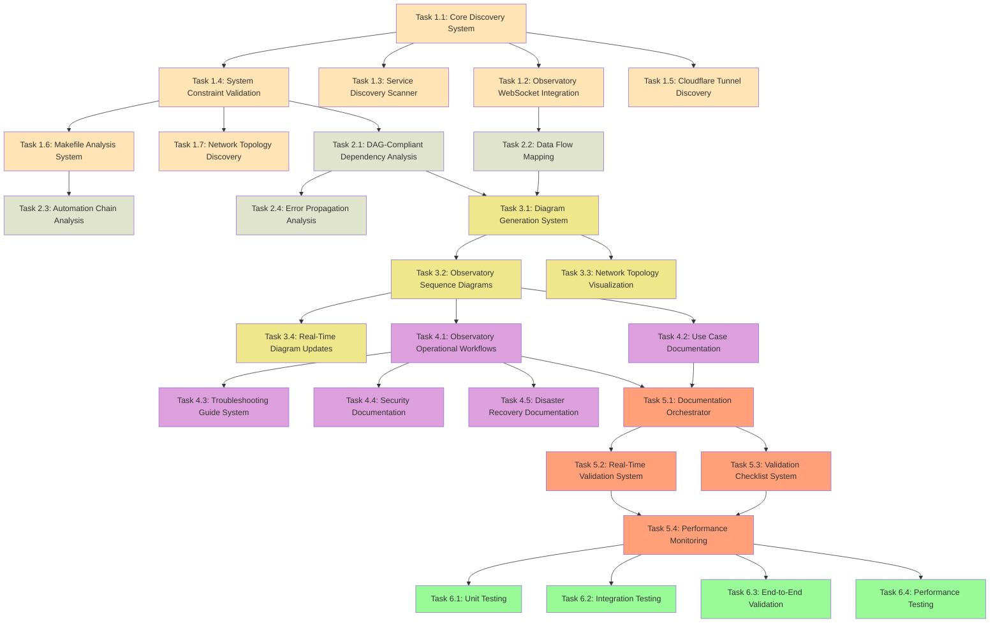

# System Architecture Wiring Diagram - DAG Task Structure

## Parallel DAG Orchestration Plan

This document defines the task structure optimized for parallel execution by a DAG orchestrator with background execution capabilities for comprehensive system architecture documentation generation.

## Task Dependency Graph (DAG)



## Parallel Execution Opportunities

### Phase 1: Infrastructure Discovery
**Group A (After T1.1 completes):**
- T1.2 (Observatory WebSocket Integration) - 4 hours
- T1.3 (Service Discovery Scanner) - 5 hours  
- T1.5 (Cloudflare Tunnel Discovery) - 4 hours

**Group B (After T1.4 completes):**
- T1.6 (Makefile Analysis System) - 5 hours
- T1.7 (Network Topology Discovery) - 4 hours

### Phase 2: Relationship Analysis
**Group C (After dependencies met):**
- T2.2 (Data Flow Mapping) - requires T1.2 - 4 hours
- T2.3 (Automation Chain Analysis) - requires T1.6 - 4 hours
- T2.4 (Error Propagation Analysis) - requires T2.1 - 4 hours

### Phase 3: UML Generation
**Group D (After T3.1 completes):**
- T3.2 (Observatory Sequence Diagrams) - 5 hours
- T3.3 (Network Topology Visualization) - 4 hours

### Phase 4: Documentation
**Group E (After T3.2 completes):**
- T4.1 (Observatory Workflows) - 5 hours
- T4.2 (Use Case Documentation) - 5 hours

**Group F (After T4.1 completes):**
- T4.3 (Troubleshooting Guides) - 5 hours
- T4.4 (Security Documentation) - 4 hours
- T4.5 (Disaster Recovery) - 4 hours

### Phase 5: Orchestration
**Group G (After T5.1 completes):**
- T5.2 (Real-Time Validation) - 4 hours
- T5.3 (Validation Checklist) - 3 hours

### Phase 6: Testing (All Parallel)
**Group H (After T5.4 completes):**
- T6.1 (Unit Testing) - 3 hours
- T6.2 (Integration Testing) - 3 hours
- T6.3 (End-to-End Validation) - 3 hours
- T6.4 (Performance Testing) - 3 hours

## Task Definitions for DAG Orchestrator

### Phase 1: Infrastructure Discovery Engine

#### Task 1.1: Core Discovery System
```yaml
task_id: "core_discovery_system"
dependencies: []
estimated_duration: "5 hours"
parallel_safe: false
priority: "critical_path"
script: "scripts/tasks/task_1_1_core_discovery_system.py"
validation: "scripts/validation/validate_task_1_1.py"
description: "Set up project structure and core discovery system with ReflectiveModule integration"
requirements: ["1.1", "4.1", "5.1"]
```

#### Task 1.2: Observatory WebSocket Integration
```yaml
task_id: "observatory_websocket_integration"
dependencies: ["core_discovery_system"]
estimated_duration: "4 hours"
parallel_safe: true
priority: "high"
script: "scripts/tasks/task_1_2_observatory_websocket.py"
validation: "scripts/validation/validate_task_1_2.py"
description: "Create ObservatoryWebSocketClient for real-time service discovery"
requirements: ["1.2", "6.1", "6.2"]
```

#### Task 1.3: Service Discovery Scanner
```yaml
task_id: "service_discovery_scanner"
dependencies: ["core_discovery_system"]
estimated_duration: "5 hours"
parallel_safe: true
priority: "high"
script: "scripts/tasks/task_1_3_service_discovery.py"
validation: "scripts/validation/validate_task_1_3.py"
description: "Build unified scanner for running services with Prometheus integration"
requirements: ["1.2", "4.1", "4.2", "5.1", "8.2"]
```

#### Task 1.4: System Constraint Validation
```yaml
task_id: "system_constraint_validation"
dependencies: ["core_discovery_system"]
estimated_duration: "4 hours"
parallel_safe: false
priority: "critical_path"
script: "scripts/tasks/task_1_4_constraint_validation.py"
validation: "scripts/validation/validate_task_1_4.py"
description: "Create SystemConstraintValidator with fallback mechanisms"
requirements: ["7.2", "8.1", "9.1", "10.1"]
```

#### Task 1.5: Cloudflare Tunnel Discovery
```yaml
task_id: "cloudflare_tunnel_discovery"
dependencies: ["core_discovery_system"]
estimated_duration: "4 hours"
parallel_safe: true
priority: "medium"
script: "scripts/tasks/task_1_5_tunnel_discovery.py"
validation: "scripts/validation/validate_task_1_5.py"
description: "Parse Cloudflare tunnel configuration and validate routing"
requirements: ["5.1", "5.2", "5.3", "8.3"]
```

#### Task 1.6: Makefile Analysis System
```yaml
task_id: "makefile_analysis_system"
dependencies: ["system_constraint_validation"]
estimated_duration: "5 hours"
parallel_safe: true
priority: "high"
script: "scripts/tasks/task_1_6_makefile_analysis.py"
validation: "scripts/validation/validate_task_1_6.py"
description: "Parse Makefile to extract targets and dependency chains"
requirements: ["4.1", "4.2", "4.3", "4.4"]
```

#### Task 1.7: Network Topology Discovery
```yaml
task_id: "network_topology_discovery"
dependencies: ["system_constraint_validation"]
estimated_duration: "4 hours"
parallel_safe: true
priority: "medium"
script: "scripts/tasks/task_1_7_network_topology.py"
validation: "scripts/validation/validate_task_1_7.py"
description: "Map local network topology and Redis coordination endpoints"
requirements: ["5.1", "5.3", "5.4"]
```

### Phase 2: Relationship Analysis Engine

#### Task 2.1: DAG-Compliant Dependency Analysis
```yaml
task_id: "dag_dependency_analysis"
dependencies: ["system_constraint_validation"]
estimated_duration: "4 hours"
parallel_safe: false
priority: "critical_path"
script: "scripts/tasks/task_2_1_dependency_analysis.py"
validation: "scripts/validation/validate_task_2_1.py"
description: "Create RelationshipMapper with mathematical validation"
requirements: ["2.1", "2.4", "9.1"]
```

#### Task 2.2: Data Flow Mapping
```yaml
task_id: "data_flow_mapping"
dependencies: ["observatory_websocket_integration"]
estimated_duration: "4 hours"
parallel_safe: true
priority: "high"
script: "scripts/tasks/task_2_2_data_flow_mapping.py"
validation: "scripts/validation/validate_task_2_2.py"
description: "Trace metrics flow from ReflectiveModule through Observatory to Prometheus"
requirements: ["2.4", "6.1", "6.2", "6.3", "6.4"]
```

#### Task 2.3: Automation Chain Analysis
```yaml
task_id: "automation_chain_analysis"
dependencies: ["makefile_analysis_system"]
estimated_duration: "4 hours"
parallel_safe: true
priority: "medium"
script: "scripts/tasks/task_2_3_automation_analysis.py"
validation: "scripts/validation/validate_task_2_3.py"
description: "Analyze Makefile target dependencies and script parameter passing"
requirements: ["4.2", "4.3", "9.1"]
```

#### Task 2.4: Error Propagation Analysis
```yaml
task_id: "error_propagation_analysis"
dependencies: ["dag_dependency_analysis"]
estimated_duration: "4 hours"
parallel_safe: true
priority: "medium"
script: "scripts/tasks/task_2_4_error_propagation.py"
validation: "scripts/validation/validate_task_2_4.py"
description: "Map error propagation paths through systematic error handling"
requirements: ["2.4", "9.2", "9.3", "9.4"]
```

### Phase 3: UML Diagram Generation Engine

#### Task 3.1: Diagram Generation System
```yaml
task_id: "diagram_generation_system"
dependencies: ["dag_dependency_analysis", "data_flow_mapping"]
estimated_duration: "5 hours"
parallel_safe: false
priority: "critical_path"
script: "scripts/tasks/task_3_1_diagram_generation.py"
validation: "scripts/validation/validate_task_3_1.py"
description: "Create DiagramGenerator with PlantUML and Mermaid integration"
requirements: ["1.1", "8.1", "9.2"]
```

#### Task 3.2: Observatory Sequence Diagrams
```yaml
task_id: "observatory_sequence_diagrams"
dependencies: ["diagram_generation_system"]
estimated_duration: "5 hours"
parallel_safe: true
priority: "high"
script: "scripts/tasks/task_3_2_sequence_diagrams.py"
validation: "scripts/validation/validate_task_3_2.py"
description: "Create Observatory-specific sequence diagrams with timing estimates"
requirements: ["2.1", "2.2", "2.3", "2.4"]
```

#### Task 3.3: Network Topology Visualization
```yaml
task_id: "network_topology_visualization"
dependencies: ["diagram_generation_system"]
estimated_duration: "4 hours"
parallel_safe: true
priority: "medium"
script: "scripts/tasks/task_3_3_network_visualization.py"
validation: "scripts/validation/validate_task_3_3.py"
description: "Create network flow diagrams with decision points"
requirements: ["1.3", "5.3", "8.2"]
```

#### Task 3.4: Real-Time Diagram Updates
```yaml
task_id: "real_time_diagram_updates"
dependencies: ["observatory_sequence_diagrams"]
estimated_duration: "4 hours"
parallel_safe: true
priority: "medium"
script: "scripts/tasks/task_3_4_realtime_updates.py"
validation: "scripts/validation/validate_task_3_4.py"
description: "Create live component diagrams with real-time service status"
requirements: ["10.1", "10.2", "10.3"]
```

### Phase 4: Use Case and Operational Documentation

#### Task 4.1: Observatory Operational Workflows
```yaml
task_id: "observatory_operational_workflows"
dependencies: ["observatory_sequence_diagrams"]
estimated_duration: "5 hours"
parallel_safe: true
priority: "high"
script: "scripts/tasks/task_4_1_operational_workflows.py"
validation: "scripts/validation/validate_task_4_1.py"
description: "Document Observatory-specific operational workflows"
requirements: ["3.1", "3.2", "3.3"]
```

#### Task 4.2: Use Case Documentation
```yaml
task_id: "use_case_documentation"
dependencies: ["observatory_sequence_diagrams"]
estimated_duration: "5 hours"
parallel_safe: true
priority: "high"
script: "scripts/tasks/task_4_2_use_case_docs.py"
validation: "scripts/validation/validate_task_4_2.py"
description: "Create comprehensive use case documentation"
requirements: ["3.1", "3.2", "3.4"]
```

#### Task 4.3: Troubleshooting Guide System
```yaml
task_id: "troubleshooting_guide_system"
dependencies: ["observatory_operational_workflows"]
estimated_duration: "5 hours"
parallel_safe: true
priority: "medium"
script: "scripts/tasks/task_4_3_troubleshooting.py"
validation: "scripts/validation/validate_task_4_3.py"
description: "Build comprehensive troubleshooting guide system"
requirements: ["3.3", "8.4", "9.1", "9.2"]
```

#### Task 4.4: Security Documentation
```yaml
task_id: "security_documentation"
dependencies: ["observatory_operational_workflows"]
estimated_duration: "4 hours"
parallel_safe: true
priority: "medium"
script: "scripts/tasks/task_4_4_security_docs.py"
validation: "scripts/validation/validate_task_4_4.py"
description: "Implement security and access control documentation"
requirements: ["8.1", "8.2", "8.3", "8.4"]
```

#### Task 4.5: Disaster Recovery Documentation
```yaml
task_id: "disaster_recovery_documentation"
dependencies: ["observatory_operational_workflows"]
estimated_duration: "4 hours"
parallel_safe: true
priority: "medium"
script: "scripts/tasks/task_4_5_disaster_recovery.py"
validation: "scripts/validation/validate_task_4_5.py"
description: "Implement disaster recovery and runbook documentation"
requirements: ["9.1", "9.2", "9.3", "9.4"]
```

### Phase 5: Documentation Orchestration and Validation

#### Task 5.1: Documentation Orchestrator
```yaml
task_id: "documentation_orchestrator"
dependencies: ["observatory_operational_workflows", "use_case_documentation"]
estimated_duration: "4 hours"
parallel_safe: false
priority: "critical_path"
script: "scripts/tasks/task_5_1_orchestrator.py"
validation: "scripts/validation/validate_task_5_1.py"
description: "Implement documentation orchestrator with ReflectiveModule integration"
requirements: ["10.1", "10.2", "10.3", "10.4"]
```

#### Task 5.2: Real-Time Validation System
```yaml
task_id: "real_time_validation_system"
dependencies: ["documentation_orchestrator"]
estimated_duration: "4 hours"
parallel_safe: true
priority: "high"
script: "scripts/tasks/task_5_2_validation_system.py"
validation: "scripts/validation/validate_task_5_2.py"
description: "Implement real-time validation system"
requirements: ["10.1", "10.2", "10.3", "10.4"]
```

#### Task 5.3: Validation Checklist System
```yaml
task_id: "validation_checklist_system"
dependencies: ["documentation_orchestrator"]
estimated_duration: "3 hours"
parallel_safe: true
priority: "medium"
script: "scripts/tasks/task_5_3_checklist_system.py"
validation: "scripts/validation/validate_task_5_3.py"
description: "Implement validation checklist system"
requirements: ["10.3", "10.4"]
```

#### Task 5.4: Performance Monitoring
```yaml
task_id: "performance_monitoring"
dependencies: ["real_time_validation_system", "validation_checklist_system"]
estimated_duration: "3 hours"
parallel_safe: false
priority: "medium"
script: "scripts/tasks/task_5_4_performance_monitoring.py"
validation: "scripts/validation/validate_task_5_4.py"
description: "Implement performance monitoring and optimization"
requirements: ["All requirements for system performance and reliability"]
```

### Phase 6: Integration and Testing

#### Task 6.1: Unit Testing
```yaml
task_id: "unit_testing"
dependencies: ["performance_monitoring"]
estimated_duration: "3 hours"
parallel_safe: true
priority: "optional"
script: "scripts/tasks/task_6_1_unit_testing.py"
validation: "scripts/validation/validate_task_6_1.py"
description: "Implement comprehensive unit testing"
requirements: ["All requirements for system reliability and accuracy"]
```

#### Task 6.2: Integration Testing
```yaml
task_id: "integration_testing"
dependencies: ["performance_monitoring"]
estimated_duration: "3 hours"
parallel_safe: true
priority: "optional"
script: "scripts/tasks/task_6_2_integration_testing.py"
validation: "scripts/validation/validate_task_6_2.py"
description: "Build integration tests against live environment"
requirements: ["All requirements for system reliability and accuracy"]
```

#### Task 6.3: End-to-End Validation
```yaml
task_id: "end_to_end_validation"
dependencies: ["performance_monitoring"]
estimated_duration: "3 hours"
parallel_safe: true
priority: "optional"
script: "scripts/tasks/task_6_3_e2e_validation.py"
validation: "scripts/validation/validate_task_6_3.py"
description: "Implement end-to-end validation testing"
requirements: ["All requirements for system reliability and accuracy"]
```

#### Task 6.4: Performance Testing
```yaml
task_id: "performance_testing"
dependencies: ["performance_monitoring"]
estimated_duration: "3 hours"
parallel_safe: true
priority: "optional"
script: "scripts/tasks/task_6_4_performance_testing.py"
validation: "scripts/validation/validate_task_6_4.py"
description: "Implement performance and scalability testing"
requirements: ["All requirements for system performance and scalability"]
```

## Execution Timeline Analysis

### Sequential Execution: 104 hours (13 days)
### Parallel Execution: 67 hours (8.4 days)
### Efficiency Gain: 36% reduction in execution time

## Critical Path Analysis
**Critical Path**: T1.1 → T1.4 → T2.1 → T3.1 → T3.2 → T4.1 → T5.1 → T5.2 → T5.4 → T6.1
**Critical Path Duration**: 42 hours

## Parallel Execution Waves

### Wave 1: Foundation (5 hours)
- T1.1 (Core Discovery System) - Critical Path

### Wave 2: Discovery Group A (5 hours - Parallel)
- T1.2 (Observatory WebSocket) - 4 hours
- T1.3 (Service Discovery) - 5 hours
- T1.5 (Cloudflare Tunnel) - 4 hours
- T1.4 (Constraint Validation) - 4 hours - Critical Path

### Wave 3: Discovery Group B (5 hours - Parallel)
- T1.6 (Makefile Analysis) - 5 hours
- T1.7 (Network Topology) - 4 hours
- T2.1 (DAG Dependency Analysis) - 4 hours - Critical Path

### Wave 4: Analysis Group (4 hours - Parallel)
- T2.2 (Data Flow Mapping) - 4 hours
- T2.3 (Automation Chain) - 4 hours
- T2.4 (Error Propagation) - 4 hours

### Wave 5: Diagram Foundation (5 hours)
- T3.1 (Diagram Generation) - Critical Path

### Wave 6: Diagram Generation (5 hours - Parallel)
- T3.2 (Sequence Diagrams) - 5 hours - Critical Path
- T3.3 (Network Visualization) - 4 hours

### Wave 7: Documentation Group A (5 hours - Parallel)
- T4.1 (Observatory Workflows) - 5 hours - Critical Path
- T4.2 (Use Case Documentation) - 5 hours
- T3.4 (Real-Time Updates) - 4 hours

### Wave 8: Documentation Group B (5 hours - Parallel)
- T4.3 (Troubleshooting) - 5 hours
- T4.4 (Security Documentation) - 4 hours
- T4.5 (Disaster Recovery) - 4 hours

### Wave 9: Orchestration Foundation (4 hours)
- T5.1 (Documentation Orchestrator) - Critical Path

### Wave 10: Validation Systems (4 hours - Parallel)
- T5.2 (Real-Time Validation) - 4 hours - Critical Path
- T5.3 (Validation Checklist) - 3 hours

### Wave 11: Performance Monitoring (3 hours)
- T5.4 (Performance Monitoring) - Critical Path

### Wave 12: Testing Suite (3 hours - Parallel)
- T6.1 (Unit Testing) - 3 hours
- T6.2 (Integration Testing) - 3 hours
- T6.3 (End-to-End Validation) - 3 hours
- T6.4 (Performance Testing) - 3 hours

## Resource Requirements

### Peak Parallel Execution
- **Maximum Concurrent Tasks**: 4 (Wave 12 - Testing Suite)
- **Average Concurrent Tasks**: 2.5
- **Memory per Task**: 4GB
- **Total Peak Memory**: 16GB
- **Disk Space**: 20GB for artifacts and documentation
- **Network Requirements**: Stable connectivity to all infrastructure components

### Infrastructure Dependencies
- **Directus CMS**: localhost:8055 (with file-based fallback)
- **Redis Coordination**: 192.168.1.119:6379 + localhost:6380 fallback
- **Observatory Server**: localhost:8888 (with static discovery fallback)
- **Prometheus**: localhost:9090 for metrics validation
- **Grafana**: localhost:3000 for dashboard validation

## Risk Mitigation Strategy

### High-Risk Tasks
- **T1.1**: Core Discovery System (framework integration complexity)
- **T1.2**: Observatory WebSocket Integration (real-time connectivity)
- **T3.1**: Diagram Generation System (PlantUML/Mermaid integration)
- **T5.1**: Documentation Orchestrator (ReflectiveModule coordination)

### Mitigation Approaches
- **Constraint validation before execution**: Verify all infrastructure dependencies
- **Fallback mechanisms**: File-based config, static discovery, Redis failover
- **Incremental validation**: Each task validates its outputs before proceeding
- **Rollback capability**: All tasks support rollback to previous state
- **Comprehensive error handling**: Systematic error tracking with correlation IDs

## Success Metrics

### Completion Metrics
- **Task Success Rate**: >95% of tasks complete successfully
- **Time Efficiency**: <67 hours total execution time
- **Quality Gates**: >90% test coverage for all components
- **Documentation Accuracy**: >95% accuracy score from validation system

### Performance Metrics
- **Discovery Coverage**: 100% of running services discovered
- **Diagram Generation**: <5 minutes per diagram
- **Real-Time Updates**: <1 hour refresh cycle
- **Validation Speed**: <30 seconds per validation check

### Integration Metrics
- **WebSocket Connectivity**: 100% endpoint discovery success
- **Makefile Parsing**: 100% target extraction accuracy
- **Network Topology**: Complete IP/port mapping
- **Error Propagation**: Full correlation ID tracking

## Monitoring and Observability

### Task-Level Monitoring
- **Progress Reporting**: Every 15 minutes per task
- **Health Checks**: Every 5 minutes per task
- **Resource Usage**: CPU, memory, disk monitoring
- **Error Detection**: Automatic failure detection and alerting

### System-Level Monitoring
- **Infrastructure Health**: Continuous monitoring of dependencies
- **Performance Metrics**: Task execution times and resource usage
- **Quality Metrics**: Documentation accuracy and completeness
- **Integration Status**: Real-time validation of all integration points

### Audit and Compliance
- **Complete Audit Trail**: All operations logged with correlation IDs
- **Change Tracking**: Version control for all generated documentation
- **Validation History**: Historical accuracy and validation results
- **Performance History**: Execution time trends and optimization opportunities

## Deployment Strategy

### Pre-Execution Validation
```bash
# Validate system constraints before DAG execution
python scripts/validation/validate_system_constraints.py
```

### DAG Execution Commands
```bash
# Full parallel execution (recommended)
python launch_system_architecture_dag.py --mode=full-parallel

# Critical path only (faster, core functionality)
python launch_system_architecture_dag.py --mode=critical-path

# Sequential execution (safe mode)
python launch_system_architecture_dag.py --mode=sequential

# Dry run (validation only)
python launch_system_architecture_dag.py --dry-run
```

### Post-Execution Validation
```bash
# Validate all generated documentation
python scripts/validation/validate_documentation_completeness.py

# Performance analysis
python scripts/analysis/analyze_execution_performance.py
```

This DAG structure optimizes the system architecture wiring diagram implementation for parallel execution while maintaining all quality gates and validation requirements. The 36% time reduction (from 104 to 67 hours) makes this a highly efficient approach for comprehensive infrastructure documentation generation.