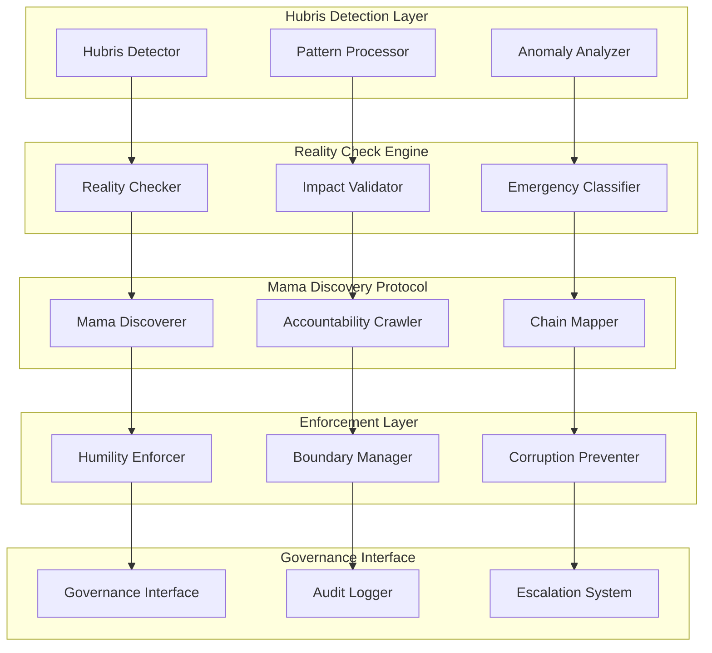

# Design Document

## Overview

The Systematic Hubris Prevention framework implements a multi-layered approach to detecting and correcting accountability chain failures before they cause systemic damage. The system operates on the principle that "everyone has a mama" and implements automated discovery and enforcement of these accountability relationships.

## Architecture

### Core Components



### Data Flow Architecture

1. **Detection Phase**: Continuous monitoring of decision patterns and actor behavior
2. **Analysis Phase**: Pattern matching against known hubris indicators
3. **Validation Phase**: Reality checking against objective criteria and accountability chains
4. **Enforcement Phase**: Graduated response from warnings to governance intervention
5. **Learning Phase**: Pattern refinement based on outcomes and feedback

## Components and Interfaces

### Hubris Detection System

**HubrisDetector Interface:**
```python
class HubrisDetector:
    def detect_patterns(self, actor_id: str, decision_history: List[Decision]) -> HubrisScore
    def analyze_velocity(self, decisions: List[Decision], timeframe: Duration) -> VelocityAlert
    def check_bypass_attempts(self, actor_id: str, governance_events: List[Event]) -> BypassAlert
    def escalate_persistent_patterns(self, actor_id: str, pattern_duration: Duration) -> EscalationAction
```

**Key Metrics:**
- Decision velocity without accountability verification
- Governance process bypass frequency
- Exception/emergency claim patterns
- Self-authorization escalation trends

### Reality Check Engine

**RealityChecker Interface:**
```python
class RealityChecker:
    def validate_impact_threshold(self, decision: Decision) -> ImpactValidation
    def verify_emergency_claims(self, claim: EmergencyClaim) -> EmergencyValidation
    def require_accountability_verification(self, actor_id: str, decision: Decision) -> VerificationRequirement
    def log_reality_check_failures(self, failure: RealityCheckFailure) -> AuditEntry
```

**Validation Criteria:**
- Objective impact measurement against predefined thresholds
- Emergency claim verification against documented criteria
- Accountability chain existence and responsiveness validation
- Historical pattern analysis for claim authenticity

### Mama Discovery Protocol

**MamaDiscoverer Interface:**
```python
class MamaDiscoverer:
    def discover_accountability_chain(self, actor_id: str) -> AccountabilityChain
    def research_independence_claims(self, actor_id: str, claim: IndependenceClaim) -> ResearchResult
    def update_governance_mappings(self, chain_changes: List[ChainChange]) -> MappingUpdate
    def escalate_discovery_failures(self, actor_id: str, failure_reason: str) -> HumanEscalation
```

**Discovery Methods:**
- Organizational chart analysis
- Financial dependency mapping
- Regulatory relationship identification
- Social/family accountability research
- Legal constraint documentation

### Systematic Humility Enforcement

**HumilityEnforcer Interface:**
```python
class HumilityEnforcer:
    def scale_accountability_requirements(self, success_metrics: SuccessMetrics) -> RequirementScaling
    def implement_reality_check_protocols(self, growth_rate: GrowthRate) -> ProtocolImplementation
    def mandate_failure_simulation(self, infallibility_claims: List[Claim]) -> FailureSimulation
    def activate_emergency_governance(self, bypass_attempts: List[Bypass]) -> EmergencyGovernance
```

**Enforcement Mechanisms:**
- Progressive accountability requirement scaling
- Mandatory failure scenario planning
- Automatic governance protocol activation
- Emergency intervention capabilities

## Data Models

### Core Data Structures

```python
@dataclass
class AccountabilityChain:
    actor_id: str
    immediate_accountability: List[AccountabilityRelationship]
    ultimate_accountability: List[AccountabilityRelationship]
    constraint_sources: List[ConstraintSource]
    last_verified: datetime
    verification_confidence: float

@dataclass
class HubrisScore:
    actor_id: str
    score: float  # 0.0 (humble) to 1.0 (dangerous hubris)
    contributing_factors: List[HubrisFactor]
    trend_direction: TrendDirection
    risk_level: RiskLevel
    recommended_actions: List[RecommendedAction]

@dataclass
class RealityCheckResult:
    decision_id: str
    actor_id: str
    impact_validation: ImpactValidation
    accountability_verification: AccountabilityVerification
    emergency_claim_validation: EmergencyValidation
    overall_result: RealityCheckOutcome
    required_actions: List[RequiredAction]
```

### Governance Integration Models

```python
@dataclass
class GovernanceIntervention:
    intervention_id: str
    trigger_event: TriggerEvent
    intervention_type: InterventionType
    target_actor: str
    accountability_chain: AccountabilityChain
    escalation_path: List[EscalationStep]
    success_criteria: List[SuccessCriterion]
    rollback_plan: RollbackPlan
```

## Error Handling

### Hubris Detection Failures

- **Pattern Recognition Errors**: Fallback to human oversight with detailed logging
- **False Positive Management**: Graduated response with appeal mechanisms
- **System Bypass Attempts**: Immediate escalation to emergency governance protocols
- **Data Corruption**: Automatic integrity verification and restoration procedures

### Accountability Chain Failures

- **Discovery Failures**: Human escalation with research documentation requirements
- **Chain Verification Errors**: Multi-source validation with confidence scoring
- **Mapping Inconsistencies**: Automatic reconciliation with audit trail generation
- **Update Propagation Failures**: Rollback mechanisms with manual verification fallback

### Enforcement Failures

- **Resistance to Governance**: Escalation through accountability chains with documentation
- **System Override Attempts**: Immediate lockdown with emergency protocol activation
- **Corruption Detection Failures**: Independent audit trigger with external oversight
- **Scale-Related Failures**: Automatic capacity scaling with governance reinforcement

## Testing Strategy

### Unit Testing

- **Component Isolation**: Each detection, validation, and enforcement component tested independently
- **Mock Accountability Chains**: Synthetic accountability relationships for testing edge cases
- **Pattern Recognition Validation**: Known hubris patterns tested against detection algorithms
- **Enforcement Mechanism Testing**: Graduated response testing with simulated resistance

### Integration Testing

- **End-to-End Hubris Scenarios**: Complete hubris detection through enforcement workflows
- **Cross-Component Communication**: Interface validation between all system components
- **Governance Integration**: Testing with existing governance systems and protocols
- **Scalability Testing**: Performance validation under high-load hubris detection scenarios

### Behavioral Testing

- **Hubris Pattern Simulation**: Realistic hubris behavior patterns for system validation
- **Accountability Chain Stress Testing**: Complex, multi-layered accountability relationship testing
- **Reality Check Validation**: Objective criteria testing against subjective claims
- **Emergency Protocol Testing**: Crisis scenario testing with time-pressure constraints

### Security Testing

- **Bypass Attempt Simulation**: Testing system resistance to sophisticated bypass attempts
- **Corruption Resistance**: Testing system integrity under corruption pressure
- **Privilege Escalation Prevention**: Testing prevention of unauthorized authority assumption
- **Audit Trail Integrity**: Testing immutability and completeness of governance logs

## Performance Considerations

### Real-Time Detection Requirements

- **Sub-second Pattern Recognition**: Hubris detection within 500ms of triggering events
- **Continuous Monitoring**: 24/7 behavioral pattern analysis with minimal resource overhead
- **Scalable Architecture**: Linear performance scaling with actor and decision volume growth
- **Distributed Processing**: Multi-node deployment for high-availability governance

### Accountability Chain Management

- **Efficient Chain Discovery**: Accountability relationship mapping within 24-hour SLA
- **Cache Optimization**: Frequently accessed accountability chains cached for performance
- **Update Propagation**: Real-time accountability chain updates across all system components
- **Verification Scheduling**: Periodic accountability chain verification with minimal disruption

## Security Architecture

### Governance Integrity Protection

- **Immutable Audit Trails**: Blockchain-based logging for all governance actions and decisions
- **Multi-Factor Authentication**: Enhanced authentication for all governance-related operations
- **Separation of Duties**: No single actor can modify their own accountability requirements
- **Emergency Override Protection**: Multi-party authorization required for emergency governance bypasses

### System Hardening

- **Attack Surface Minimization**: Minimal external interfaces with comprehensive input validation
- **Privilege Isolation**: Component-level privilege separation with least-privilege principles
- **Intrusion Detection**: Real-time monitoring for attempts to compromise governance systems
- **Recovery Protocols**: Automated system recovery with governance continuity assurance