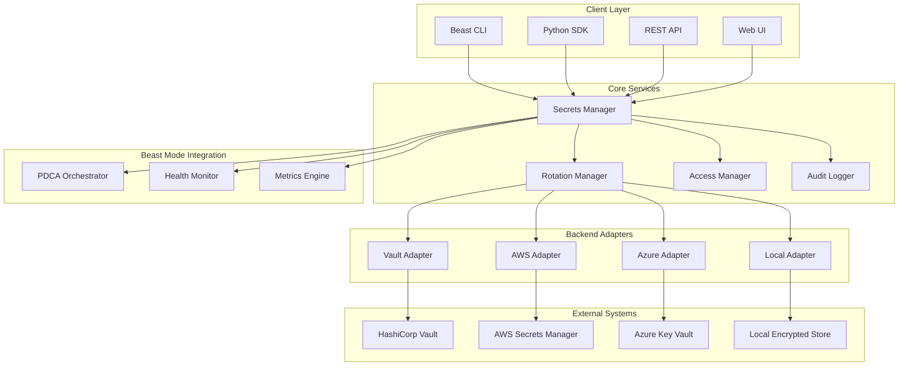

# Systematic Secrets Management Framework - Design

## Overview

The Systematic Secrets Management Framework implements enterprise-grade secret lifecycle management through a distributed, multi-backend architecture that integrates seamlessly with the Beast Mode ecosystem. The design emphasizes systematic security governance, operational excellence, and developer productivity while maintaining strict isolation between environments.

## Architecture

### High-Level Architecture



### Component Architecture

The system follows a layered architecture with clear separation of concerns:

1. **Client Layer**: Multiple interfaces for different user types and use cases
2. **Core Services**: Business logic and orchestration
3. **Backend Adapters**: Abstraction layer for different secret stores
4. **External Systems**: Actual secret storage backends
5. **Beast Mode Integration**: Systematic health and lifecycle management

## Components and Interfaces

### Core Services

#### Secrets Manager (Primary Orchestrator)
```python
class SecretsManager(ReflectiveModule):
    """Primary orchestrator implementing Reflective Module pattern"""
    
    def create_secret(self, secret_request: SecretRequest) -> SecretResponse
    def get_secret(self, secret_id: str, context: AccessContext) -> Secret
    def update_secret(self, secret_id: str, update_request: UpdateRequest) -> SecretResponse
    def delete_secret(self, secret_id: str, context: AccessContext) -> bool
    def list_secrets(self, filter_criteria: FilterCriteria) -> List[SecretMetadata]
    
    # Reflective Module implementation
    def get_module_status(self) -> Dict[str, Any]
    def is_healthy(self) -> bool
    def get_health_indicators(self) -> List[HealthIndicator]
```

#### Rotation Manager
```python
class RotationManager:
    """Handles automatic secret rotation and lifecycle management"""
    
    def schedule_rotation(self, secret_id: str, rotation_policy: RotationPolicy) -> bool
    def execute_rotation(self, secret_id: str) -> RotationResult
    def get_rotation_status(self, secret_id: str) -> RotationStatus
    def emergency_rotation(self, secret_id: str, reason: str) -> RotationResult
```

#### Access Manager
```python
class AccessManager:
    """Enforces access control and authorization policies"""
    
    def authorize_access(self, principal: Principal, resource: Resource, action: Action) -> AuthResult
    def create_access_token(self, principal: Principal, scope: AccessScope) -> AccessToken
    def revoke_access(self, token_id: str) -> bool
    def audit_access(self, access_event: AccessEvent) -> None
```

#### Audit Logger
```python
class AuditLogger:
    """Provides tamper-proof audit logging and compliance reporting"""
    
    def log_event(self, event: AuditEvent) -> bool
    def generate_compliance_report(self, criteria: ReportCriteria) -> ComplianceReport
    def search_audit_logs(self, query: AuditQuery) -> List[AuditEvent]
    def archive_logs(self, retention_policy: RetentionPolicy) -> bool
```

### Backend Adapters

#### Abstract Backend Interface
```python
class SecretBackend(ABC):
    """Abstract interface for all secret storage backends"""
    
    @abstractmethod
    def store_secret(self, secret: Secret) -> bool
    
    @abstractmethod
    def retrieve_secret(self, secret_id: str) -> Secret
    
    @abstractmethod
    def update_secret(self, secret_id: str, secret: Secret) -> bool
    
    @abstractmethod
    def delete_secret(self, secret_id: str) -> bool
    
    @abstractmethod
    def list_secrets(self, filter_criteria: FilterCriteria) -> List[str]
    
    @abstractmethod
    def health_check(self) -> HealthStatus
```

#### HashiCorp Vault Adapter
```python
class VaultAdapter(SecretBackend):
    """HashiCorp Vault integration with native rotation support"""
    
    def __init__(self, vault_config: VaultConfig):
        self.client = hvac.Client(url=vault_config.url)
        self.auth_method = vault_config.auth_method
        self.mount_point = vault_config.mount_point
    
    def store_secret(self, secret: Secret) -> bool:
        # Implementation using Vault KV v2 engine
        pass
    
    def setup_rotation(self, secret_id: str, rotation_config: VaultRotationConfig) -> bool:
        # Configure Vault's native rotation capabilities
        pass
```

#### AWS Secrets Manager Adapter
```python
class AWSAdapter(SecretBackend):
    """AWS Secrets Manager integration with IAM-based access control"""
    
    def __init__(self, aws_config: AWSConfig):
        self.client = boto3.client('secretsmanager', region_name=aws_config.region)
        self.kms_key_id = aws_config.kms_key_id
    
    def store_secret(self, secret: Secret) -> bool:
        # Implementation using AWS Secrets Manager API
        pass
    
    def setup_automatic_rotation(self, secret_id: str, lambda_arn: str) -> bool:
        # Configure AWS automatic rotation
        pass
```

### Client Interfaces

#### Python SDK
```python
class BeastSecretsClient:
    """Python SDK for systematic secrets management"""
    
    def __init__(self, config: ClientConfig):
        self.base_url = config.base_url
        self.auth_token = config.auth_token
        self.environment = config.environment
    
    def get_secret(self, name: str) -> str:
        """Get secret value with automatic caching and refresh"""
        pass
    
    def create_secret(self, name: str, value: str, metadata: Dict[str, Any] = None) -> bool:
        """Create new secret with environment isolation"""
        pass
    
    @contextmanager
    def secret_context(self, secret_names: List[str]):
        """Context manager for automatic secret cleanup"""
        pass
```

#### CLI Interface
```bash
# Beast Mode CLI integration
beast secrets create --name "api-key" --value "secret-value" --env development
beast secrets get --name "api-key" --env development
beast secrets rotate --name "api-key" --emergency
beast secrets audit --from "2024-01-01" --to "2024-01-31"
```

## Data Models

### Core Data Models

#### Secret Model
```python
@dataclass
class Secret:
    id: str
    name: str
    value: str  # Encrypted at rest
    environment: Environment
    secret_type: SecretType
    metadata: Dict[str, Any]
    created_at: datetime
    updated_at: datetime
    expires_at: Optional[datetime]
    rotation_policy: Optional[RotationPolicy]
    access_policy: AccessPolicy
    tags: List[str]
    
    def is_expired(self) -> bool:
        return self.expires_at and datetime.utcnow() > self.expires_at
    
    def needs_rotation(self) -> bool:
        if not self.rotation_policy:
            return False
        return datetime.utcnow() > (self.updated_at + self.rotation_policy.rotation_interval)
```

#### Access Context Model
```python
@dataclass
class AccessContext:
    principal: Principal
    environment: Environment
    service_name: str
    request_id: str
    ip_address: str
    user_agent: str
    timestamp: datetime
    
    def to_audit_event(self, action: str, result: str) -> AuditEvent:
        return AuditEvent(
            principal=self.principal,
            action=action,
            resource=f"secret/{self.environment}",
            result=result,
            timestamp=self.timestamp,
            metadata={
                'service': self.service_name,
                'ip': self.ip_address,
                'request_id': self.request_id
            }
        )
```

#### Rotation Policy Model
```python
@dataclass
class RotationPolicy:
    rotation_interval: timedelta
    grace_period: timedelta
    max_retries: int
    notification_threshold: timedelta
    rotation_strategy: RotationStrategy
    
    def next_rotation_time(self, last_rotation: datetime) -> datetime:
        return last_rotation + self.rotation_interval
    
    def is_in_grace_period(self, rotation_time: datetime) -> bool:
        return datetime.utcnow() < (rotation_time + self.grace_period)
```

### Environment Isolation Model

```python
class Environment(Enum):
    DEVELOPMENT = "development"
    STAGING = "staging"
    PRODUCTION = "production"
    
@dataclass
class EnvironmentConfig:
    name: Environment
    encryption_key_id: str
    backend_config: BackendConfig
    access_policies: List[AccessPolicy]
    audit_retention_days: int
    
    def get_secret_path(self, secret_name: str) -> str:
        return f"{self.name.value}/{secret_name}"
```

## Error Handling

### Exception Hierarchy
```python
class SecretsManagementError(Exception):
    """Base exception for all secrets management errors"""
    pass

class SecretNotFoundError(SecretsManagementError):
    """Secret does not exist or is not accessible"""
    pass

class AccessDeniedError(SecretsManagementError):
    """Insufficient permissions to access secret"""
    pass

class RotationFailedError(SecretsManagementError):
    """Secret rotation process failed"""
    pass

class BackendUnavailableError(SecretsManagementError):
    """Secret storage backend is unavailable"""
    pass

class EnvironmentViolationError(SecretsManagementError):
    """Attempted cross-environment access violation"""
    pass
```

### Error Recovery Strategies
1. **Backend Failover**: Automatic failover to backup secret stores
2. **Graceful Degradation**: Cached secrets during backend outages
3. **Retry Logic**: Exponential backoff for transient failures
4. **Circuit Breaker**: Prevent cascade failures during backend issues

## Testing Strategy

### Test Categories

#### Unit Tests
- Individual component functionality
- Data model validation
- Error handling scenarios
- Encryption/decryption operations

#### Integration Tests
- Backend adapter functionality
- End-to-end secret lifecycle
- Cross-environment isolation
- Audit trail completeness

#### Security Tests
- Access control enforcement
- Encryption key management
- Audit log tamper resistance
- Environment boundary validation

#### Performance Tests
- Response time under load
- Concurrent access handling
- Large-scale secret management
- Backend failover timing

#### Compliance Tests
- Audit trail completeness
- Retention policy enforcement
- Access control compliance
- Regulatory requirement validation

### Test Data Management
```python
class SecretTestFactory:
    """Factory for creating test secrets with proper isolation"""
    
    @staticmethod
    def create_test_secret(environment: Environment = Environment.DEVELOPMENT) -> Secret:
        return Secret(
            id=f"test-{uuid4()}",
            name=f"test-secret-{int(time.time())}",
            value="test-value",
            environment=environment,
            secret_type=SecretType.GENERIC,
            metadata={"test": True},
            created_at=datetime.utcnow(),
            updated_at=datetime.utcnow(),
            expires_at=datetime.utcnow() + timedelta(hours=1),
            rotation_policy=None,
            access_policy=AccessPolicy.default_test_policy(),
            tags=["test"]
        )
```

## Beast Mode Integration

### Reflective Module Implementation
```python
class SecretsManager(ReflectiveModule):
    def get_module_status(self) -> Dict[str, Any]:
        return {
            "service": "systematic-secrets-management",
            "version": "1.0.0",
            "status": "healthy" if self.is_healthy() else "degraded",
            "active_secrets": self._count_active_secrets(),
            "pending_rotations": self._count_pending_rotations(),
            "backend_status": self._get_backend_status(),
            "last_health_check": datetime.utcnow().isoformat()
        }
    
    def is_healthy(self) -> bool:
        return all([
            self._check_backend_connectivity(),
            self._check_encryption_keys(),
            self._check_rotation_service(),
            self._check_audit_logging()
        ])
    
    def get_health_indicators(self) -> List[HealthIndicator]:
        return [
            HealthIndicator("backend_connectivity", self._check_backend_connectivity()),
            HealthIndicator("encryption_keys", self._check_encryption_keys()),
            HealthIndicator("rotation_service", self._check_rotation_service()),
            HealthIndicator("audit_logging", self._check_audit_logging()),
            HealthIndicator("secret_expiration", self._check_expiring_secrets())
        ]
```

### PDCA Integration
```python
class SecretsPDCAParticipant:
    """Participates in Beast Mode PDCA cycles for systematic improvement"""
    
    def plan_phase(self) -> PDCAPhaseResult:
        """Analyze secret management metrics and plan improvements"""
        metrics = self.collect_metrics()
        issues = self.identify_issues(metrics)
        improvements = self.plan_improvements(issues)
        return PDCAPhaseResult("plan", improvements)
    
    def do_phase(self, plan: PDCAPhaseResult) -> PDCAPhaseResult:
        """Execute planned improvements"""
        results = []
        for improvement in plan.data:
            result = self.execute_improvement(improvement)
            results.append(result)
        return PDCAPhaseResult("do", results)
    
    def check_phase(self, do_result: PDCAPhaseResult) -> PDCAPhaseResult:
        """Validate improvement effectiveness"""
        validation_results = []
        for result in do_result.data:
            validation = self.validate_improvement(result)
            validation_results.append(validation)
        return PDCAPhaseResult("check", validation_results)
    
    def act_phase(self, check_result: PDCAPhaseResult) -> PDCAPhaseResult:
        """Apply successful improvements systematically"""
        applied_improvements = []
        for validation in check_result.data:
            if validation.success:
                applied = self.apply_improvement(validation.improvement)
                applied_improvements.append(applied)
        return PDCAPhaseResult("act", applied_improvements)
```

This design provides a comprehensive, systematic approach to secrets management that integrates seamlessly with the Beast Mode ecosystem while maintaining enterprise-grade security and operational excellence.