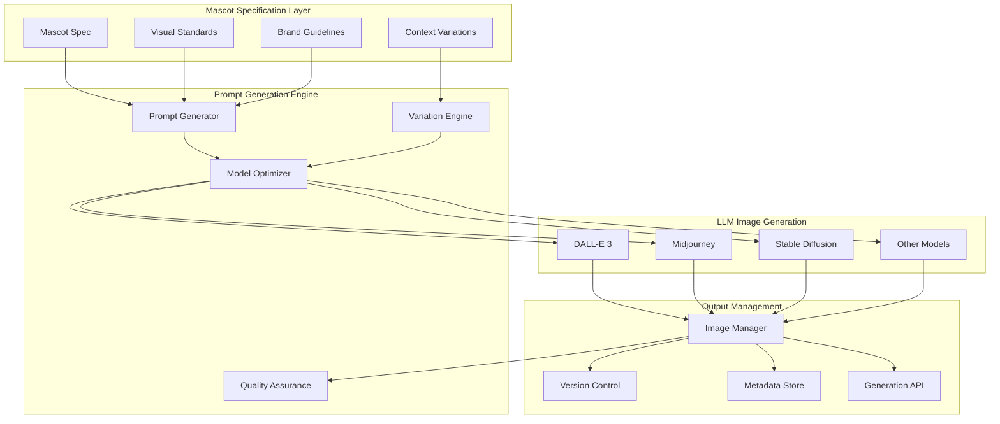
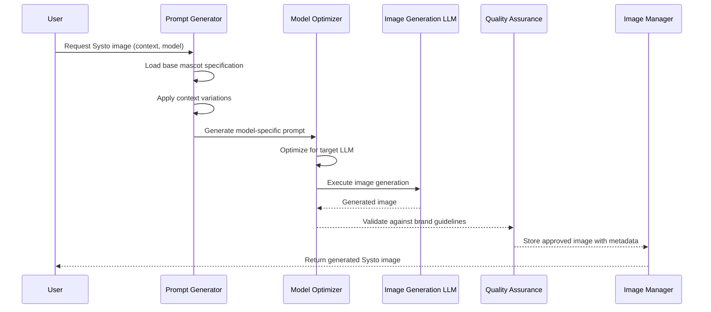

# Systo Mascot LLM Generation - Design Document

## Overview

This design document outlines a systematic approach to generating Systo mascot imagery using LLM-powered image generation tools. The system transforms our detailed mascot specification into precise, model-optimized prompts that ensure consistent brand representation while enabling contextual variations.

**🎯 Core Design Philosophy: "Specification-Driven Visual Generation"**

Our mascot requirements become systematic inputs for AI image generation, demonstrating how "The Requirements ARE the Solution" applies to visual content creation. This approach ensures brand consistency while leveraging the power of multiple LLM image generation models.

## Architecture

### High-Level System Architecture



### Prompt Generation Flow



## Components and Interfaces

### 1. Prompt Generation Engine

**Purpose**: Converts mascot specifications into optimized prompts for different LLM image generation models.

#### Base Prompt Template System
```python
class SystoPromptGenerator:
    """Systematic prompt generation for Systo mascot imagery"""
    
    def __init__(self):
        self.base_specification = self._load_mascot_spec()
        self.model_optimizers = {
            'dalle': DALLEOptimizer(),
            'midjourney': MidjourneyOptimizer(),
            'stable_diffusion': StableDiffusionOptimizer()
        }
    
    def generate_base_prompt(self) -> BasePrompt:
        """Generate core Systo prompt from specification"""
        return BasePrompt(
            subject="Friendly wolf-dog hybrid mascot named Systo",
            appearance="Athletic build, focused expression with slight confidence smirk",
            personality="Competent teammate, collaborative posture, never lone wolf",
            tech_elements="Utility vest, smart collar with metrics, transforming tool paws",
            style="Professional cartoon style, approachable but competent",
            mood="'Finally, someone who gets it' energy, systematic collaboration"
        )
    
    def apply_context_variation(self, base_prompt: BasePrompt, context: str) -> ContextPrompt:
        """Apply DevOps-specific context variations"""
        variations = {
            'sre': "wearing 'This is Fine' shirt, calmly fixing burning servers in background",
            'platform': "wearing hard hat, holding Infrastructure as Code blueprints",
            'security': "wearing Zero Trust bandana, holding vulnerability magnifying glass",
            'cloud_native': "surrounded by Kubernetes patterns, floating cloud symbols"
        }
        return base_prompt.with_context(variations.get(context, ""))
    
    def optimize_for_model(self, prompt: ContextPrompt, model: str) -> OptimizedPrompt:
        """Optimize prompt for specific LLM image generation model"""
        optimizer = self.model_optimizers.get(model)
        return optimizer.optimize(prompt) if optimizer else prompt
```

#### Model-Specific Optimizers
```python
class DALLEOptimizer:
    """DALL-E 3 specific prompt optimization"""
    
    def optimize(self, prompt: ContextPrompt) -> OptimizedPrompt:
        """Optimize for DALL-E's style preferences and limitations"""
        return OptimizedPrompt(
            text=f"A {prompt.subject}, {prompt.appearance}. {prompt.personality}. "
                 f"{prompt.tech_elements}. {prompt.context}. "
                 f"Digital art style, clean composition, professional mascot design. "
                 f"Bright, friendly colors. High quality, detailed.",
            style_params={
                'aspect_ratio': '1:1',
                'quality': 'hd',
                'style': 'natural'
            }
        )

class MidjourneyOptimizer:
    """Midjourney specific prompt optimization"""
    
    def optimize(self, prompt: ContextPrompt) -> OptimizedPrompt:
        """Optimize for Midjourney's parameter system"""
        return OptimizedPrompt(
            text=f"{prompt.subject}, {prompt.appearance}, {prompt.personality}. "
                 f"{prompt.tech_elements}. {prompt.context}",
            style_params={
                'aspect_ratio': '--ar 1:1',
                'stylize': '--s 750',
                'version': '--v 6',
                'quality': '--q 2'
            }
        )

class StableDiffusionOptimizer:
    """Stable Diffusion specific prompt optimization"""
    
    def optimize(self, prompt: ContextPrompt) -> OptimizedPrompt:
        """Optimize for Stable Diffusion with negative prompts"""
        return OptimizedPrompt(
            text=f"({prompt.subject}:1.2), {prompt.appearance}, {prompt.personality}. "
                 f"{prompt.tech_elements}. {prompt.context}. "
                 f"professional mascot design, cartoon style, high quality, detailed",
            negative_prompt="ugly, blurry, low quality, distorted, aggressive, scary, "
                          "lone wolf, intimidating, unprofessional",
            style_params={
                'steps': 50,
                'cfg_scale': 7.5,
                'sampler': 'DPM++ 2M Karras'
            }
        )
```

### 2. Generation API Interface

**Purpose**: Provides programmatic access to Systo mascot generation with systematic error handling.

```python
class SystoGenerationAPI:
    """API for systematic Systo mascot generation"""
    
    def __init__(self):
        self.prompt_generator = SystoPromptGenerator()
        self.image_clients = {
            'dalle': OpenAIImageClient(),
            'midjourney': MidjourneyClient(),
            'stable_diffusion': StableDiffusionClient()
        }
        self.quality_validator = SystoQualityValidator()
    
    async def generate_systo(
        self, 
        context: str = 'base',
        model: str = 'dalle',
        variations: int = 1,
        quality_check: bool = True
    ) -> GenerationResult:
        """Generate Systo mascot image with systematic validation"""
        
        # Generate optimized prompt
        base_prompt = self.prompt_generator.generate_base_prompt()
        context_prompt = self.prompt_generator.apply_context_variation(base_prompt, context)
        optimized_prompt = self.prompt_generator.optimize_for_model(context_prompt, model)
        
        # Generate images
        client = self.image_clients[model]
        images = []
        
        for i in range(variations):
            try:
                image = await client.generate_image(optimized_prompt)
                
                if quality_check:
                    validation = await self.quality_validator.validate_image(image)
                    if validation.passes_brand_guidelines:
                        images.append(ImageResult(image, validation))
                    else:
                        # Retry with refined prompt
                        refined_prompt = self._refine_prompt_from_validation(
                            optimized_prompt, validation
                        )
                        retry_image = await client.generate_image(refined_prompt)
                        images.append(ImageResult(retry_image, validation))
                else:
                    images.append(ImageResult(image, None))
                    
            except Exception as e:
                logger.error(f"Generation failed for variation {i}: {e}")
                continue
        
        return GenerationResult(
            images=images,
            prompt_used=optimized_prompt,
            context=context,
            model=model,
            metadata=self._generate_metadata()
        )
```

### 3. Quality Validation System

**Purpose**: Ensures generated images meet Systo brand guidelines and visual standards.

```python
class SystoQualityValidator:
    """Systematic quality validation for generated Systo images"""
    
    def __init__(self):
        self.brand_guidelines = self._load_brand_guidelines()
        self.visual_analyzer = VisualAnalyzer()
    
    async def validate_image(self, image: Image) -> ValidationResult:
        """Comprehensive validation against brand guidelines"""
        
        # Core visual element detection
        visual_elements = await self.visual_analyzer.detect_elements(image)
        
        # Brand guideline checks
        checks = {
            'has_wolf_dog_features': self._check_wolf_dog_features(visual_elements),
            'athletic_build': self._check_athletic_build(visual_elements),
            'collaborative_posture': self._check_collaborative_posture(visual_elements),
            'confident_expression': self._check_confident_expression(visual_elements),
            'tech_elements_present': self._check_tech_elements(visual_elements),
            'brand_colors': self._check_brand_colors(image),
            'professional_quality': self._check_professional_quality(image)
        }
        
        # Calculate overall score
        score = sum(checks.values()) / len(checks)
        passes = score >= 0.8  # 80% threshold
        
        return ValidationResult(
            passes_brand_guidelines=passes,
            overall_score=score,
            individual_checks=checks,
            improvement_suggestions=self._generate_suggestions(checks),
            visual_elements_detected=visual_elements
        )
    
    def _generate_suggestions(self, checks: Dict[str, float]) -> List[str]:
        """Generate specific improvement suggestions"""
        suggestions = []
        
        if checks['has_wolf_dog_features'] < 0.7:
            suggestions.append("Enhance wolf-dog hybrid features - more pointed ears, canine snout")
        
        if checks['collaborative_posture'] < 0.7:
            suggestions.append("Adjust posture to be more collaborative - open stance, welcoming gesture")
        
        if checks['confident_expression'] < 0.7:
            suggestions.append("Refine expression - slight confidence smirk, focused but friendly eyes")
        
        return suggestions
```

### 4. Batch Generation and Workflow Integration

**Purpose**: Enables systematic generation of mascot variations for different use cases and platforms.

```python
class SystoBatchGenerator:
    """Batch generation for systematic mascot creation"""
    
    def __init__(self):
        self.api = SystoGenerationAPI()
        self.workflow_templates = self._load_workflow_templates()
    
    async def generate_complete_mascot_set(self) -> MascotSet:
        """Generate complete set of Systo variations for all contexts"""
        
        contexts = ['base', 'sre', 'platform', 'security', 'cloud_native']
        models = ['dalle', 'midjourney', 'stable_diffusion']
        
        results = {}
        
        for context in contexts:
            context_results = {}
            
            for model in models:
                try:
                    result = await self.api.generate_systo(
                        context=context,
                        model=model,
                        variations=3,
                        quality_check=True
                    )
                    context_results[model] = result
                    
                except Exception as e:
                    logger.error(f"Failed to generate {context} with {model}: {e}")
                    continue
            
            results[context] = context_results
        
        return MascotSet(
            results=results,
            generation_timestamp=datetime.now(),
            total_images=sum(len(r.images) for ctx in results.values() for r in ctx.values()),
            quality_summary=self._generate_quality_summary(results)
        )
    
    async def generate_platform_optimized_set(self, platform: str) -> PlatformSet:
        """Generate mascot set optimized for specific platform requirements"""
        
        platform_specs = {
            'social_media': {
                'sizes': ['1080x1080', '1200x630', '1080x1920'],
                'contexts': ['base', 'collaborative'],
                'style': 'vibrant'
            },
            'documentation': {
                'sizes': ['512x512', '256x256'],
                'contexts': ['base', 'helpful'],
                'style': 'clean'
            },
            'swag': {
                'sizes': ['1024x1024'],
                'contexts': ['base'],
                'style': 'high_contrast'
            }
        }
        
        spec = platform_specs.get(platform, platform_specs['social_media'])
        
        # Generate optimized variations
        results = []
        for size in spec['sizes']:
            for context in spec['contexts']:
                result = await self.api.generate_systo(
                    context=context,
                    model='dalle',  # Best for platform optimization
                    variations=2
                )
                
                # Resize and optimize for platform
                optimized_images = await self._optimize_for_platform(
                    result.images, size, spec['style']
                )
                
                results.extend(optimized_images)
        
        return PlatformSet(
            platform=platform,
            images=results,
            specifications=spec,
            optimization_metadata=self._generate_optimization_metadata()
        )
```

## Systematic Prompt Templates

### Base Systo Prompt Template
```
Subject: Friendly wolf-dog hybrid mascot named Systo
Appearance: Athletic build, focused expression with slight confidence smirk
Personality: Competent teammate, collaborative posture, never lone wolf
Tech Elements: Utility vest, smart collar with metrics, transforming tool paws
Style: Professional cartoon style, approachable but competent
Mood: "Finally, someone who gets it" energy, systematic collaboration
Quality: High quality, detailed, professional mascot design
```

### Context Variation Templates
```python
CONTEXT_VARIATIONS = {
    'sre': "wearing 'This is Fine' shirt, calmly fixing burning servers in background, "
           "confident problem-solving demeanor, systematic approach to chaos",
    
    'platform': "wearing hard hat, holding Infrastructure as Code blueprints, "
                "surrounded by deployment pipelines, systematic infrastructure design",
    
    'security': "wearing Zero Trust bandana, holding vulnerability magnifying glass, "
               "systematic security analysis, protective but not paranoid",
    
    'cloud_native': "surrounded by Kubernetes patterns, floating cloud symbols, "
                   "container orchestration elements, systematic cloud architecture",
    
    'collaborative': "working alongside diverse human team members, bridging human creativity "
                    "with AI capabilities, glue between humans and technology",
    
    'problem_solving': "analyzing code patterns, systematic debugging approach, "
                      "connecting dots between requirements and solutions"
}
```

### Model-Specific Optimizations
```python
MODEL_OPTIMIZATIONS = {
    'dalle': {
        'prefix': "Digital art style, ",
        'suffix': ". Bright, friendly colors. Clean composition.",
        'avoid': "complex backgrounds, multiple characters",
        'enhance': "single character focus, clear details"
    },
    
    'midjourney': {
        'prefix': "",
        'suffix': " --ar 1:1 --s 750 --v 6 --q 2",
        'avoid': "overly detailed prompts",
        'enhance': "artistic style descriptors, mood keywords"
    },
    
    'stable_diffusion': {
        'prefix': "(high quality:1.2), (detailed:1.1), ",
        'suffix': ", professional mascot design",
        'negative': "ugly, blurry, low quality, distorted, aggressive, scary",
        'enhance': "weight emphasis on key features"
    }
}
```

This systematic approach ensures that our mascot generation is consistent, high-quality, and true to the Systo brand while leveraging the power of multiple LLM image generation models. The requirements truly become the visual solution! 🐺🎨