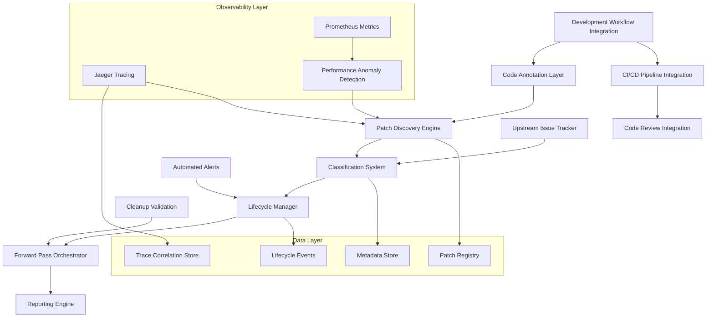

# Technical Debt Patch Annotation System Design

## Overview

The Technical Debt Patch Annotation System provides a structured framework for marking, tracking, and managing temporary workarounds and patches in code. The system ensures that ad-hoc solutions don't become permanent technical debt by making patches visible, trackable, and actionable through systematic cleanup processes.

This design implements a comprehensive annotation framework with automated discovery, classification, lifecycle management, and integration with development workflows to maintain code quality and prevent technical debt accumulation.

## Architecture

### System Components



### Core Architecture Principles

1. **Annotation-First Design**: All patches must be explicitly annotated with standardized markers
2. **Automated Discovery**: Machine-readable annotations enable systematic processing
3. **Observability-Driven Detection**: Jaeger traces and Prometheus metrics reveal patch impact
4. **Lifecycle Management**: Patches have defined creation, tracking, and resolution phases
5. **Integration-Native**: Seamlessly integrates with existing development workflows
6. **Forward Pass Coordination**: Systematic cleanup planning and execution

## Components and Interfaces

### 1. Patch Annotation Framework

#### Annotation Schema
```python
@dataclass
class PatchAnnotation:
    """Standardized patch annotation structure"""
    patch_id: str                    # Unique identifier (UUID)
    reason: str                      # Why this patch was needed
    upstream_issue: str              # Reference to root cause issue
    cleanup_task: str                # Specific remediation guidance
    debt_level: DebtLevel           # Low, Medium, High, Critical
    created_date: datetime          # When patch was created
    expected_resolution: datetime    # Target cleanup date
    component: str                  # Affected system component
    bypass_type: BypassType        # Architecture, Security, Performance, etc.
    validation_criteria: List[str]  # How to verify cleanup success
```

#### Annotation Markers
```python
# Standard patch annotation format
"""
PATCH_START: {patch_id}
REASON: {reason}
UPSTREAM: {upstream_issue}
CLEANUP: {cleanup_task}
DEBT_LEVEL: {debt_level}
EXPECTED_RESOLUTION: {expected_resolution}
COMPONENT: {component}
BYPASS_TYPE: {bypass_type}
VALIDATION: {validation_criteria}
PATCH_END: {patch_id}
"""

# Example usage in code
def process_data(data):
    """
    PATCH_START: PATCH-2024-001
    REASON: Temporary workaround for upstream API rate limiting
    UPSTREAM: API-ISSUE-456
    CLEANUP: Replace with proper retry mechanism when API v2 available
    DEBT_LEVEL: Medium
    EXPECTED_RESOLUTION: 2024-03-15
    COMPONENT: data_processor
    BYPASS_TYPE: Architecture
    VALIDATION: ["API v2 integration tests pass", "Rate limiting removed"]
    PATCH_END: PATCH-2024-001
    """
    # Temporary rate limiting workaround
    time.sleep(0.5)  # PATCH: Remove when API v2 deployed
    return api_client.fetch_data(data)
```

### 2. Patch Discovery Engine

#### Automated Scanner with Observability Integration
```python
class PatchDiscoveryEngine:
    """Discovers and validates patch annotations in codebase with observability correlation"""
    
    def scan_codebase(self, root_path: str) -> List[PatchAnnotation]:
        """Scan entire codebase for patch annotations"""
        
    def validate_annotation(self, annotation: PatchAnnotation) -> ValidationResult:
        """Validate annotation completeness and format"""
        
    def detect_orphaned_patches(self) -> List[str]:
        """Find patches without proper annotations"""
        
    def correlate_with_traces(self, patch: PatchAnnotation) -> List[TraceCorrelation]:
        """Correlate patches with Jaeger trace performance impacts"""
        
    def analyze_metrics_impact(self, patch: PatchAnnotation) -> MetricsImpact:
        """Analyze Prometheus metrics around patch execution paths"""
        
    def detect_performance_anomalies(self, component: str) -> List[PerformanceAnomaly]:
        """Detect performance anomalies that might indicate hidden patches"""
        
    def generate_discovery_report(self) -> DiscoveryReport:
        """Generate comprehensive patch inventory with observability insights"""
```

#### Observability-Based Patch Detection
```python
class ObservabilityPatchDetector:
    """Detects potential patches through observability signals"""
    
    def analyze_trace_patterns(self, service: str, timeframe: timedelta) -> List[SuspiciousPattern]:
        """Analyze Jaeger traces for patterns indicating workarounds"""
        
    def detect_metric_anomalies(self, component: str) -> List[MetricAnomaly]:
        """Detect Prometheus metric patterns suggesting patches"""
        
    def correlate_error_patterns(self, error_logs: List[LogEntry]) -> List[ErrorPattern]:
        """Correlate error patterns with potential patch locations"""
        
    def identify_performance_workarounds(self, traces: List[JaegerTrace]) -> List[WorkaroundCandidate]:
        """Identify performance workarounds through trace analysis"""
```

#### File Pattern Recognition
- **Source Code**: `.py`, `.js`, `.ts`, `.java`, `.cpp`, etc.
- **Configuration**: `.yml`, `.json`, `.xml`, `.ini`, etc.
- **Infrastructure**: `Dockerfile`, `docker-compose.yml`, `Makefile`, etc.
- **Documentation**: `.md`, `.rst`, `.txt` files with code blocks

### 3. Technical Debt Classification System

#### Severity Classification
```python
class DebtLevel(Enum):
    LOW = "Low"           # Minor workaround, low maintenance burden
    MEDIUM = "Medium"     # Moderate impact, requires attention
    HIGH = "High"         # Significant impact, priority cleanup
    CRITICAL = "Critical" # Severe impact, immediate attention required

class BypassType(Enum):
    ARCHITECTURE = "Architecture"   # Bypasses architectural patterns
    SECURITY = "Security"          # Temporary security workaround
    PERFORMANCE = "Performance"    # Performance optimization patch
    INTEGRATION = "Integration"    # External system integration patch
    COMPLIANCE = "Compliance"      # Regulatory compliance workaround
```

#### Impact Assessment Engine
```python
class ImpactAssessmentEngine:
    """Assesses and classifies technical debt impact"""
    
    def assess_component_impact(self, component: str, patches: List[PatchAnnotation]) -> ComponentImpact:
        """Assess cumulative impact on component"""
        
    def calculate_maintenance_burden(self, patch: PatchAnnotation) -> MaintenanceBurden:
        """Calculate ongoing maintenance cost"""
        
    def detect_debt_hotspots(self) -> List[DebtHotspot]:
        """Identify components with excessive technical debt"""
        
    def generate_risk_assessment(self) -> RiskAssessment:
        """Generate overall technical debt risk profile"""
```

### 4. Observability Integration Layer

#### Jaeger Tracing Integration
```python
class JaegerIntegration:
    """Integrates with Jaeger for distributed tracing analysis"""
    
    def trace_patch_execution_paths(self, patch_id: str) -> List[ExecutionTrace]:
        """Trace execution paths through patch code"""
        
    def analyze_patch_performance_impact(self, patch: PatchAnnotation) -> PerformanceImpact:
        """Analyze performance impact of patch through traces"""
        
    def detect_cascade_effects(self, patch_id: str) -> List[CascadeEffect]:
        """Detect downstream effects of patches through trace correlation"""
        
    def correlate_patches_with_errors(self, error_traces: List[ErrorTrace]) -> List[PatchCorrelation]:
        """Correlate error traces with potential patch locations"""
        
    def generate_patch_trace_report(self, patch_id: str) -> TraceReport:
        """Generate comprehensive trace analysis for patch"""
```

#### Prometheus Metrics Integration
```python
class PrometheusIntegration:
    """Integrates with Prometheus for metrics-based patch detection"""
    
    def monitor_patch_metrics(self, patch: PatchAnnotation) -> MetricsMonitor:
        """Set up monitoring for patch-related metrics"""
        
    def detect_performance_degradation(self, component: str) -> List[PerformanceDegradation]:
        """Detect performance degradation patterns indicating patches"""
        
    def analyze_resource_consumption(self, patch_id: str) -> ResourceConsumption:
        """Analyze resource consumption patterns around patches"""
        
    def correlate_alerts_with_patches(self, alerts: List[PrometheusAlert]) -> List[AlertCorrelation]:
        """Correlate Prometheus alerts with known patches"""
        
    def generate_patch_metrics_dashboard(self, patch_id: str) -> MetricsDashboard:
        """Generate Grafana dashboard for patch monitoring"""
```

#### Upstream Issue Integration
```python
class UpstreamIssueTracker:
    """Integrates with external issue tracking systems"""
    
    def link_patch_to_issue(self, patch_id: str, issue_ref: str) -> None:
        """Link patch to upstream issue"""
        
    def check_issue_status(self, issue_ref: str) -> IssueStatus:
        """Check if upstream issue is resolved"""
        
    def notify_patch_cleanup_ready(self, patch_id: str) -> None:
        """Notify when upstream fix enables patch cleanup"""
        
    def track_dependency_versions(self, patch: PatchAnnotation) -> VersionInfo:
        """Track external dependency versions"""
        
    def correlate_issues_with_observability(self, issue_ref: str) -> ObservabilityCorrelation:
        """Correlate issues with Jaeger traces and Prometheus metrics"""
```

#### Supported Issue Systems
- **GitHub Issues**: Direct API integration
- **Jira**: REST API integration
- **GitLab Issues**: API integration
- **Custom Systems**: Configurable webhook integration

### 5. Forward Pass Management System

#### Cleanup Orchestrator
```python
class ForwardPassOrchestrator:
    """Manages systematic patch cleanup processes"""
    
    def plan_cleanup_pass(self, criteria: CleanupCriteria) -> CleanupPlan:
        """Plan systematic cleanup of patches"""
        
    def group_patches_by_component(self, patches: List[PatchAnnotation]) -> Dict[str, List[PatchAnnotation]]:
        """Group patches for efficient cleanup"""
        
    def generate_cleanup_tasks(self, cleanup_plan: CleanupPlan) -> List[CleanupTask]:
        """Generate specific cleanup implementation tasks"""
        
    def validate_cleanup_completion(self, cleanup_task: CleanupTask) -> ValidationResult:
        """Validate that patch cleanup was successful"""
```

#### Cleanup Planning
```python
@dataclass
class CleanupPlan:
    """Systematic cleanup execution plan"""
    plan_id: str
    target_components: List[str]
    patches_to_resolve: List[PatchAnnotation]
    execution_order: List[CleanupTask]
    validation_criteria: List[str]
    rollback_plan: RollbackPlan
    estimated_effort: timedelta
    risk_assessment: RiskLevel
```

### 6. Development Workflow Integration

#### CI/CD Pipeline Integration
```python
class CIPipelineIntegration:
    """Integrates patch management with CI/CD pipelines"""
    
    def validate_patch_annotations(self, changed_files: List[str]) -> ValidationResult:
        """Validate patch annotations in changed files"""
        
    def check_debt_thresholds(self, component: str) -> ThresholdResult:
        """Check if component exceeds debt thresholds"""
        
    def generate_patch_report(self, pull_request: PullRequest) -> PatchReport:
        """Generate patch impact report for PR"""
        
    def block_merge_on_violations(self, violations: List[Violation]) -> bool:
        """Block merge if patch annotations are invalid"""
```

#### Code Review Integration
```python
class CodeReviewIntegration:
    """Integrates with code review systems"""
    
    def annotate_pr_with_debt_impact(self, pr_id: str, impact: DebtImpact) -> None:
        """Add debt impact comments to pull request"""
        
    def suggest_cleanup_opportunities(self, changed_files: List[str]) -> List[CleanupSuggestion]:
        """Suggest cleanup opportunities in changed code"""
        
    def validate_patch_cleanup(self, pr_id: str) -> CleanupValidation:
        """Validate that patch cleanup is complete and correct"""
```

## Data Models

### Core Data Structures

#### Patch Registry Schema with Observability Integration
```sql
CREATE TABLE patches (
    patch_id VARCHAR(36) PRIMARY KEY,
    reason TEXT NOT NULL,
    upstream_issue VARCHAR(255),
    cleanup_task TEXT NOT NULL,
    debt_level ENUM('Low', 'Medium', 'High', 'Critical') NOT NULL,
    created_date TIMESTAMP NOT NULL,
    expected_resolution TIMESTAMP,
    component VARCHAR(255) NOT NULL,
    bypass_type ENUM('Architecture', 'Security', 'Performance', 'Integration', 'Compliance') NOT NULL,
    file_path VARCHAR(1024) NOT NULL,
    line_start INTEGER NOT NULL,
    line_end INTEGER NOT NULL,
    status ENUM('Active', 'Cleanup_Planned', 'Cleanup_In_Progress', 'Resolved') DEFAULT 'Active',
    created_by VARCHAR(255),
    assigned_to VARCHAR(255),
    resolution_date TIMESTAMP NULL,
    validation_status ENUM('Pending', 'Validated', 'Failed') DEFAULT 'Pending',
    -- Observability integration fields
    jaeger_trace_ids JSON,
    prometheus_metrics JSON,
    performance_impact_score DECIMAL(5,2),
    observability_correlation_id VARCHAR(36)
);

CREATE TABLE patch_observability_correlations (
    correlation_id VARCHAR(36) PRIMARY KEY,
    patch_id VARCHAR(36) REFERENCES patches(patch_id),
    jaeger_trace_id VARCHAR(255),
    prometheus_query TEXT,
    performance_baseline JSON,
    performance_current JSON,
    anomaly_detected BOOLEAN DEFAULT FALSE,
    correlation_confidence DECIMAL(3,2),
    created_date TIMESTAMP NOT NULL
);

CREATE TABLE patch_performance_metrics (
    metric_id VARCHAR(36) PRIMARY KEY,
    patch_id VARCHAR(36) REFERENCES patches(patch_id),
    metric_name VARCHAR(255) NOT NULL,
    metric_value DECIMAL(10,4),
    metric_unit VARCHAR(50),
    measurement_timestamp TIMESTAMP NOT NULL,
    baseline_value DECIMAL(10,4),
    deviation_percentage DECIMAL(5,2),
    alert_threshold_exceeded BOOLEAN DEFAULT FALSE
);

CREATE TABLE patch_lifecycle_events (
    event_id VARCHAR(36) PRIMARY KEY,
    patch_id VARCHAR(36) REFERENCES patches(patch_id),
    event_type ENUM('Created', 'Updated', 'Cleanup_Planned', 'Cleanup_Started', 'Cleanup_Completed', 'Validated', 'Expired', 'Performance_Alert', 'Trace_Anomaly') NOT NULL,
    event_date TIMESTAMP NOT NULL,
    event_data JSON,
    observability_data JSON,
    created_by VARCHAR(255)
);

CREATE TABLE cleanup_plans (
    plan_id VARCHAR(36) PRIMARY KEY,
    plan_name VARCHAR(255) NOT NULL,
    target_components JSON NOT NULL,
    patches_included JSON NOT NULL,
    execution_order JSON NOT NULL,
    status ENUM('Draft', 'Approved', 'In_Progress', 'Completed', 'Failed') DEFAULT 'Draft',
    created_date TIMESTAMP NOT NULL,
    scheduled_date TIMESTAMP,
    completed_date TIMESTAMP,
    created_by VARCHAR(255),
    -- Observability validation
    performance_validation_plan JSON,
    trace_validation_criteria JSON
);
```

#### Configuration Schema
```python
@dataclass
class SystemConfiguration:
    """System-wide configuration for patch management"""
    debt_thresholds: Dict[str, int]           # Component debt limits
    notification_settings: NotificationConfig # Alert configuration
    integration_settings: IntegrationConfig   # External system integration
    cleanup_schedules: List[CleanupSchedule] # Automated cleanup timing
    validation_rules: List[ValidationRule]   # Custom validation logic
```

## Error Handling

### Validation Error Management
```python
class PatchValidationError(Exception):
    """Raised when patch annotation validation fails"""
    
class UpstreamIssueError(Exception):
    """Raised when upstream issue tracking fails"""
    
class CleanupValidationError(Exception):
    """Raised when patch cleanup validation fails"""

class ErrorHandler:
    """Centralized error handling for patch management"""
    
    def handle_validation_error(self, error: PatchValidationError) -> ErrorResponse:
        """Handle patch validation failures"""
        
    def handle_cleanup_failure(self, error: CleanupValidationError) -> RecoveryPlan:
        """Handle cleanup validation failures"""
        
    def generate_error_report(self, errors: List[Exception]) -> ErrorReport:
        """Generate comprehensive error analysis"""
```

### Graceful Degradation
- **Partial Annotation Support**: System works with incomplete annotations, warns about missing fields
- **Offline Mode**: Core functionality available without external integrations
- **Fallback Validation**: Manual validation when automated checks fail
- **Recovery Procedures**: Clear steps for system recovery from failures

## Testing Strategy

### Unit Testing
```python
class TestPatchAnnotationFramework:
    """Unit tests for patch annotation system"""
    
    def test_annotation_parsing(self):
        """Test parsing of patch annotations from code"""
        
    def test_validation_rules(self):
        """Test patch annotation validation logic"""
        
    def test_classification_engine(self):
        """Test debt classification algorithms"""

class TestDiscoveryEngine:
    """Unit tests for patch discovery"""
    
    def test_codebase_scanning(self):
        """Test automated patch discovery"""
        
    def test_file_pattern_recognition(self):
        """Test recognition of different file types"""
        
    def test_orphaned_patch_detection(self):
        """Test detection of unannotated patches"""
```

### Integration Testing
```python
class TestWorkflowIntegration:
    """Integration tests for development workflow"""
    
    def test_ci_pipeline_integration(self):
        """Test CI/CD pipeline integration"""
        
    def test_code_review_integration(self):
        """Test code review system integration"""
        
    def test_issue_tracker_integration(self):
        """Test upstream issue tracking integration"""

class TestCleanupOrchestration:
    """Integration tests for cleanup processes"""
    
    def test_cleanup_plan_execution(self):
        """Test systematic cleanup execution"""
        
    def test_validation_workflows(self):
        """Test cleanup validation processes"""
        
    def test_rollback_procedures(self):
        """Test cleanup rollback mechanisms"""
```

### End-to-End Testing
```python
class TestCompleteWorkflow:
    """End-to-end testing of complete patch lifecycle"""
    
    def test_patch_creation_to_resolution(self):
        """Test complete patch lifecycle from creation to resolution"""
        
    def test_forward_pass_execution(self):
        """Test complete forward pass cleanup process"""
        
    def test_reporting_and_analytics(self):
        """Test comprehensive reporting functionality"""
```

## Design Decisions and Rationales

### 1. Annotation-Based Approach
**Decision**: Use structured comments for patch annotations rather than external metadata files.

**Rationale**: 
- Keeps patch information co-located with the code
- Survives code refactoring and file moves
- Visible to developers during code review
- Machine-readable for automated processing
- No additional file management overhead

### 2. Observability-Driven Detection
**Decision**: Integrate Jaeger distributed tracing and Prometheus metrics as primary patch detection mechanisms alongside code annotations.

**Rationale**: 
- Performance anomalies often indicate hidden workarounds or patches
- Distributed traces reveal execution path deviations caused by patches
- Metrics provide objective measurement of patch impact
- Observability data can detect unannotated patches automatically
- Correlation between traces and metrics provides comprehensive patch visibility
- Historical performance data enables impact assessment and cleanup validation

### 3. UUID-Based Patch Identification
**Decision**: Use UUIDs for patch identifiers rather than sequential numbers.

**Rationale**:
- Globally unique across distributed development
- No coordination required for ID generation
- Prevents conflicts in merge scenarios
- Enables distributed patch tracking
- Future-proof for system scaling

### 4. Lifecycle State Management
**Decision**: Implement explicit lifecycle states for patches rather than implicit status tracking.

**Rationale**:
- Clear visibility into patch status
- Enables automated workflow transitions
- Supports audit and compliance requirements
- Facilitates reporting and analytics
- Prevents patches from being forgotten

### 5. Component-Based Debt Aggregation
**Decision**: Group and assess technical debt at the component level rather than individual patches.

**Rationale**:
- Provides architectural view of debt distribution
- Enables component-level cleanup planning
- Supports resource allocation decisions
- Identifies debt hotspots for prioritization
- Aligns with system architecture boundaries

### 6. Integration-First Design
**Decision**: Design for seamless integration with existing development tools rather than standalone operation.

**Rationale**:
- Minimizes adoption friction for development teams
- Leverages existing workflow investments
- Ensures patch management becomes part of normal development process
- Reduces tool proliferation and context switching
- Increases likelihood of consistent usage

### 7. Forward Pass Orchestration
**Decision**: Implement systematic cleanup planning rather than ad-hoc patch resolution.

**Rationale**:
- Ensures comprehensive debt reduction
- Enables efficient resource utilization
- Reduces risk of incomplete cleanup
- Provides predictable cleanup schedules
- Supports systematic quality improvement

### 8. Validation-Centric Cleanup
**Decision**: Require explicit validation criteria for all patch cleanup rather than assuming success.

**Rationale**:
- Ensures cleanup actually resolves the underlying issue
- Prevents regression introduction during cleanup
- Provides objective success criteria
- Enables automated validation where possible
- Maintains system quality during debt reduction

## Observability-Based Early Detection

### How Jaeger and Prometheus Would Have Revealed Hidden Patches

The integration of Jaeger distributed tracing and Prometheus metrics provides crucial early warning systems for technical debt patches:

#### Jaeger Trace Analysis for Patch Detection
```python
class TraceBasedPatchDetection:
    """Detect patches through distributed trace analysis"""
    
    def analyze_execution_anomalies(self, service: str, timeframe: timedelta) -> List[ExecutionAnomaly]:
        """
        Detect execution patterns that suggest workarounds:
        - Unusual retry patterns
        - Unexpected service call sequences  
        - Performance degradation in specific code paths
        - Error handling that bypasses normal flows
        """
        
    def identify_workaround_patterns(self, traces: List[JaegerTrace]) -> List[WorkaroundPattern]:
        """
        Identify common workaround patterns in traces:
        - Sleep/delay calls in critical paths
        - Fallback service calls
        - Circuit breaker activations
        - Manual error recovery sequences
        """
        
    def correlate_performance_drops(self, baseline: PerformanceBaseline) -> List[PerformanceDrop]:
        """
        Correlate performance drops with code changes:
        - Sudden latency increases
        - Throughput reductions
        - Resource consumption spikes
        - Error rate increases
        """
```

#### Prometheus Metrics for Patch Indicators
```python
class MetricsBasedPatchDetection:
    """Detect patches through Prometheus metrics analysis"""
    
    def monitor_patch_indicators(self) -> Dict[str, MetricThreshold]:
        """
        Monitor metrics that commonly indicate patches:
        - response_time_p99 > baseline + 2*stddev
        - error_rate > 1% for previously stable services
        - retry_count > normal patterns
        - fallback_activation_rate > 0
        - manual_intervention_count > 0
        """
        
    def detect_resource_consumption_anomalies(self, component: str) -> List[ResourceAnomaly]:
        """
        Detect resource usage patterns suggesting workarounds:
        - Memory leaks from incomplete cleanup
        - CPU spikes from inefficient patches
        - Network overhead from redundant calls
        - Disk I/O from temporary file operations
        """
        
    def analyze_business_metric_impact(self, patches: List[PatchAnnotation]) -> BusinessImpact:
        """
        Correlate patches with business metrics:
        - User experience degradation
        - Transaction success rate drops
        - Feature availability reductions
        - Customer satisfaction impacts
        """
```

### Real-World Detection Scenarios

#### Scenario 1: Performance Workaround Detection
```yaml
# Jaeger would show:
trace_pattern:
  - normal_flow: service_a -> service_b -> response (50ms)
  - patch_flow: service_a -> sleep(500ms) -> service_b -> response (550ms)
  
# Prometheus would show:
metrics_anomaly:
  - response_time_p99: increased from 50ms to 550ms
  - artificial_delay_total: new metric appearing
  - workaround_execution_count: > 0
```

#### Scenario 2: Integration Patch Detection
```yaml
# Jaeger would show:
integration_pattern:
  - normal_flow: app -> external_api -> success
  - patch_flow: app -> external_api -> timeout -> fallback_service -> response
  
# Prometheus would show:
integration_metrics:
  - external_api_timeout_rate: > 5%
  - fallback_service_usage: > 0
  - integration_success_rate: < 95%
```

#### Scenario 3: Error Handling Patch Detection
```yaml
# Jaeger would show:
error_handling:
  - normal_flow: operation -> success
  - patch_flow: operation -> error -> retry -> manual_fix -> success
  
# Prometheus would show:
error_metrics:
  - operation_error_rate: > baseline
  - manual_intervention_count: > 0
  - retry_attempt_total: increased frequency
```

### Automated Patch Discovery Pipeline

```python
class ObservabilityPatchPipeline:
    """Automated pipeline for discovering patches through observability"""
    
    def __init__(self):
        self.jaeger_client = JaegerClient()
        self.prometheus_client = PrometheusClient()
        self.patch_detector = PatchDetector()
    
    def run_discovery_pipeline(self) -> PatchDiscoveryResult:
        """
        Automated patch discovery process:
        1. Analyze recent traces for anomalous patterns
        2. Correlate with Prometheus metric deviations
        3. Identify potential patch locations in code
        4. Generate patch annotation suggestions
        5. Alert development teams to investigate
        """
        
        # Step 1: Trace analysis
        trace_anomalies = self.jaeger_client.analyze_recent_traces(
            timeframe=timedelta(days=7),
            services=self.get_monitored_services()
        )
        
        # Step 2: Metrics correlation
        metric_anomalies = self.prometheus_client.detect_metric_deviations(
            timeframe=timedelta(days=7),
            components=self.get_monitored_components()
        )
        
        # Step 3: Cross-correlation
        correlated_anomalies = self.correlate_observability_signals(
            trace_anomalies, metric_anomalies
        )
        
        # Step 4: Code location identification
        potential_patches = self.identify_code_locations(correlated_anomalies)
        
        # Step 5: Generate recommendations
        return self.generate_patch_recommendations(potential_patches)
```

This observability-driven approach would have automatically detected performance workarounds, integration patches, and error handling bypasses before they became entrenched technical debt, providing early warning systems that complement the annotation-based tracking system.

This design provides a comprehensive framework for managing technical debt patches while integrating seamlessly with existing development workflows and ensuring systematic cleanup processes.