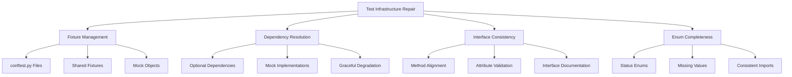

# Design Document

## Overview

The test infrastructure repair feature will systematically address the 26 failed tests and 28 test errors in the Beast Mode framework. The design focuses on four main areas: fixture management, dependency handling, interface consistency, and enum completeness.

## Architecture

### Component Structure



### Repair Strategy

The repair will follow a systematic approach:

1. **Analysis Phase**: Categorize all failures by root cause
2. **Foundation Phase**: Fix missing fixtures and dependencies
3. **Interface Phase**: Align test expectations with implementations
4. **Validation Phase**: Ensure all tests pass and provide meaningful coverage

## Components and Interfaces

### 1. Fixture Management System

**Purpose**: Provide consistent, reusable test fixtures across all test modules.

**Key Components**:
- `tests/conftest.py` - Root-level fixtures
- `tests/orchestration/conftest.py` - Orchestration-specific fixtures
- `tests/analysis/conftest.py` - Analysis-specific fixtures

**Critical Fixtures Needed**:
```python
@pytest.fixture
def orchestrator():
    """Tool orchestrator with proper initialization"""
    
@pytest.fixture
def sample_tool_definition():
    """Standard tool definition for testing"""
    
@pytest.fixture
def mock_intelligence_engine():
    """Mock intelligence engine with required methods"""
```

### 2. Dependency Resolution System

**Purpose**: Handle missing or optional dependencies gracefully.

**Strategy**:
- **psutil**: Create mock implementation for resource monitoring
- **concurrent.futures**: Ensure proper import handling
- **External tools**: Mock subprocess calls and tool interactions

**Implementation Pattern**:
```python
try:
    import psutil
    PSUTIL_AVAILABLE = True
except ImportError:
    PSUTIL_AVAILABLE = False
    # Provide mock implementation
```

### 3. Interface Consistency Framework

**Purpose**: Ensure test expectations match actual component interfaces.

**Key Areas**:

#### Intelligence Engine Interface
Tests expect these methods that need to be implemented:
- `consult_registry_first()`
- `get_domain_tools()`

#### Multi-Perspective Validator Interface
Tests expect these methods:
- `get_basic_perspective_analysis()`
- `analyze_low_percentage_decision()`

#### Safety Manager Interface
Tests expect this method:
- `validate_workflow_safety()`

### 4. Enum Completeness System

**Purpose**: Ensure all enum values referenced in tests exist in implementations.

**Required Updates**:

#### AnalysisStatus Enum
Current values: `NOT_STARTED`, `IN_PROGRESS`, `COMPLETED`, `FAILED`, `KILLED`

Missing values needed by tests:
- `SUCCESS` (map to `COMPLETED`)
- `PARTIAL_SUCCESS` (new value for partial completion)

**Updated Enum**:
```python
class AnalysisStatus(Enum):
    NOT_STARTED = "not_started"
    IN_PROGRESS = "in_progress"
    COMPLETED = "completed"
    SUCCESS = "completed"  # Alias for backward compatibility
    PARTIAL_SUCCESS = "partial_success"  # New value
    FAILED = "failed"
    KILLED = "killed"
```

## Data Models

### Test Failure Categories

```python
@dataclass
class TestFailureCategory:
    category: str
    failure_count: int
    examples: List[str]
    repair_strategy: str
    priority: int
```

**Identified Categories**:
1. **Missing Fixtures** (28 errors) - Priority 1
2. **Missing Dependencies** (3 failures) - Priority 2  
3. **Interface Mismatches** (8 failures) - Priority 3
4. **Health Check Issues** (6 failures) - Priority 4
5. **Enum Issues** (3 failures) - Priority 5
6. **Precision Issues** (1 failure) - Priority 6

### Component Health Model

```python
@dataclass
class ComponentHealthStatus:
    component_name: str
    is_healthy: bool
    health_indicators: Dict[str, Any]
    dependencies_available: bool
    initialization_successful: bool
    error_messages: List[str]
```

## Error Handling

### Graceful Degradation Strategy

1. **Missing Dependencies**: Skip tests with clear messages rather than failing
2. **Interface Mismatches**: Provide temporary adapter methods
3. **Health Check Failures**: Implement proper dependency validation
4. **Enum Issues**: Provide backward-compatible aliases

### Error Recovery Patterns

```python
def safe_health_check(component):
    """Perform health check with proper error handling"""
    try:
        # Check dependencies first
        if not component.dependencies_available():
            return False, ["Dependencies not available"]
            
        # Perform actual health check
        return component.is_healthy(), []
    except Exception as e:
        return False, [f"Health check failed: {str(e)}"]
```

## Testing Strategy

### Test Organization

```
tests/
├── conftest.py                 # Root fixtures
├── orchestration/
│   ├── conftest.py            # Orchestration fixtures
│   └── test_tool_orchestrator.py
├── analysis/
│   ├── conftest.py            # Analysis fixtures
│   └── test_analysis_*.py
└── integration/
    ├── conftest.py            # Integration fixtures
    └── test_integration_*.py
```

### Mock Strategy

**Principle**: Mock external dependencies, not internal interfaces.

**Mock Targets**:
- `subprocess.run` for tool execution
- `psutil` for resource monitoring
- File system operations for safety
- Network calls for external services

**Real Targets**:
- Internal component interfaces
- Business logic
- Data transformations
- Error handling

### Validation Approach

1. **Syntax Validation**: All tests must parse and import successfully
2. **Fixture Validation**: All fixtures must be available and properly scoped
3. **Interface Validation**: All method calls must match actual implementations
4. **Coverage Validation**: Tests must provide meaningful coverage of functionality

## Implementation Phases

### Phase 1: Foundation Repair (Priority 1-2)
- Create missing conftest.py files with required fixtures
- Implement dependency mocking for psutil and concurrent.futures
- Fix import issues

### Phase 2: Interface Alignment (Priority 3-4)
- Add missing methods to intelligence engines and validators
- Fix health check implementations
- Ensure component initialization works correctly

### Phase 3: Enum and Precision Fixes (Priority 5-6)
- Add missing enum values with backward compatibility
- Fix floating-point precision issues in assertions
- Update enum imports across modules

### Phase 4: Validation and Documentation
- Run full test suite to ensure all fixes work
- Document new interfaces and patterns
- Create maintenance guidelines for future test development