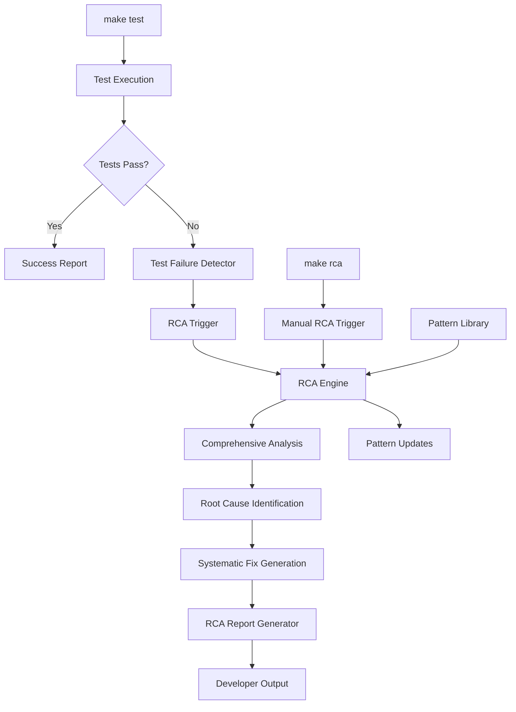

# Design Document

## Overview

The Test-RCA Integration system extends the existing Beast Mode framework to automatically trigger Root Cause Analysis (RCA) when tests fail. This design leverages the existing RCAEngine from `src.beast_mode.analysis.rca_engine` and integrates it with the make test workflow to provide immediate, actionable insights when test failures occur.

The system follows the Beast Mode principle of systematic analysis over ad-hoc debugging, providing developers with comprehensive failure analysis, root cause identification, and systematic fixes rather than just error messages.

## Architecture

### High-Level Architecture



### Component Architecture

The system consists of four main components:

1. **Test Failure Detector**: Monitors test execution and captures failure information
2. **RCA Integration Layer**: Bridges test failures with the RCA engine
3. **Make Command Extensions**: Adds RCA functionality to the existing Makefile
4. **Report Generator**: Formats RCA results for developer consumption

## Components and Interfaces

### 1. Test Failure Detector

**Location**: `src/beast_mode/testing/test_failure_detector.py`

**Responsibilities**:
- Monitor pytest execution output
- Parse test failure information
- Extract stack traces, error messages, and context
- Create Failure objects for RCA analysis

**Key Methods**:
```python
class TestFailureDetector(ReflectiveModule):
    def monitor_test_execution(self, test_command: str) -> List[TestFailure]
    def parse_pytest_output(self, output: str) -> List[TestFailure]
    def extract_failure_context(self, failure_info: dict) -> Dict[str, Any]
    def create_failure_object(self, test_name: str, error_info: dict) -> Failure
```

**Interface with RCA Engine**:
- Converts pytest failures to `Failure` objects compatible with RCAEngine
- Provides comprehensive context including test file, function, and environment

### 2. RCA Integration Layer

**Location**: `src/beast_mode/testing/rca_integration.py`

**Responsibilities**:
- Coordinate between test failures and RCA analysis
- Manage RCA workflow for multiple test failures
- Aggregate and prioritize RCA results
- Handle pattern matching for known test failure types

**Key Methods**:
```python
class TestRCAIntegrator(ReflectiveModule):
    def analyze_test_failures(self, failures: List[TestFailure]) -> RCAAnalysisResult
    def prioritize_failures(self, failures: List[TestFailure]) -> List[TestFailure]
    def group_related_failures(self, failures: List[TestFailure]) -> Dict[str, List[TestFailure]]
    def generate_comprehensive_report(self, rca_results: List[RCAResult]) -> TestRCAReport
```

### 3. Make Command Extensions

**Location**: `makefiles/testing.mk`

**New Make Targets**:
- `test-with-rca`: Run tests with automatic RCA on failures
- `rca`: Perform RCA on most recent test failures
- `rca-task`: Perform RCA on specific task/test (requires TASK parameter)
- `rca-report`: Generate detailed RCA report from previous analysis

**Integration Points**:
- Extends existing `test` target to optionally trigger RCA
- Uses environment variables to control RCA behavior
- Integrates with existing Beast Mode CLI (`./beast`)

### 4. Report Generator

**Location**: `src/beast_mode/testing/rca_report_generator.py`

**Responsibilities**:
- Format RCA results for developer consumption
- Generate actionable fix recommendations
- Create prevention pattern summaries
- Provide clear next steps for developers

**Output Formats**:
- Console output with color coding and clear sections
- JSON reports for CI/CD integration
- Markdown reports for documentation

## Data Models

### TestFailure

```python
@dataclass
class TestFailure:
    test_name: str
    test_file: str
    failure_type: str  # assertion, error, timeout, etc.
    error_message: str
    stack_trace: str
    test_function: str
    test_class: Optional[str]
    failure_timestamp: datetime
    test_context: Dict[str, Any]
    pytest_node_id: str
```

### TestRCAReport

```python
@dataclass
class TestRCAReport:
    analysis_timestamp: datetime
    total_failures: int
    failures_analyzed: int
    grouped_failures: Dict[str, List[TestFailure]]
    rca_results: List[RCAResult]
    summary: TestRCASummary
    recommendations: List[str]
    prevention_patterns: List[PreventionPattern]
    next_steps: List[str]
```

### TestRCASummary

```python
@dataclass
class TestRCASummary:
    most_common_root_causes: List[Tuple[RootCauseType, int]]
    systematic_fixes_available: int
    pattern_matches_found: int
    estimated_fix_time_minutes: int
    confidence_score: float
    critical_issues: List[str]
```

## Error Handling

### Failure Scenarios and Responses

1. **RCA Engine Unavailable**:
   - Fallback to basic error reporting
   - Log degradation event
   - Continue with test execution

2. **Test Output Parsing Failure**:
   - Use generic failure analysis
   - Report parsing issues to logs
   - Attempt alternative parsing methods

3. **Pattern Library Corruption**:
   - Rebuild pattern library from defaults
   - Continue with reduced functionality
   - Alert about degraded pattern matching

4. **Resource Exhaustion During RCA**:
   - Implement timeout mechanisms (30-second limit)
   - Prioritize critical failures
   - Provide partial analysis results

### Error Recovery Strategies

- **Graceful Degradation**: System continues to function with reduced RCA capabilities
- **Automatic Retry**: Retry RCA analysis with simplified parameters
- **Fallback Reporting**: Provide basic failure information when RCA fails
- **Health Monitoring**: Track RCA system health and alert on persistent issues

## Testing Strategy

### Unit Testing

1. **Test Failure Detector Tests**:
   - Mock pytest output parsing
   - Verify failure object creation
   - Test edge cases (malformed output, empty results)

2. **RCA Integration Tests**:
   - Mock RCA engine responses
   - Test failure grouping and prioritization
   - Verify report generation

3. **Make Command Tests**:
   - Test make target execution
   - Verify parameter passing
   - Test error handling in make context

### Integration Testing

1. **End-to-End Test Scenarios**:
   - Real test failures triggering RCA
   - Multiple failure types in single run
   - Pattern matching with existing library

2. **Performance Testing**:
   - RCA completion within 30-second requirement
   - Pattern matching performance with large libraries
   - Memory usage during analysis

3. **Compatibility Testing**:
   - Different pytest versions
   - Various test failure types
   - Integration with existing Beast Mode components

### Test Data and Fixtures

- **Synthetic Test Failures**: Controlled failure scenarios for testing
- **Real Failure Examples**: Captured from actual development scenarios
- **Pattern Library Fixtures**: Known patterns for testing pattern matching
- **Performance Benchmarks**: Baseline measurements for performance validation

## Implementation Phases

### Phase 1: Core Integration (Requirements 1, 3)
- Implement TestFailureDetector
- Create basic RCA integration
- Add make command extensions
- Basic console output

### Phase 2: Advanced Analysis (Requirements 2, 4)
- Implement comprehensive factor analysis
- Add systematic fix generation
- Integrate with existing pattern library
- Enhanced reporting

### Phase 3: Multi-Failure Support (Requirement 5)
- Add failure grouping and prioritization
- Support for different test types
- Pattern learning and library updates
- Performance optimization

## Security Considerations

- **Command Injection Prevention**: Sanitize all test output before processing
- **File System Access**: Limit RCA analysis to project directory
- **Resource Limits**: Implement timeouts and memory limits for RCA processes
- **Sensitive Data**: Avoid logging sensitive information from test failures

## Performance Requirements

- **RCA Analysis Time**: Complete within 30 seconds for typical failures
- **Pattern Matching**: Sub-second performance for existing patterns (DR3 requirement)
- **Memory Usage**: Limit RCA analysis to reasonable memory footprint
- **Concurrent Analysis**: Support analysis of multiple failures without blocking

## Monitoring and Observability

- **RCA Success Metrics**: Track successful RCA completions and fix applications
- **Performance Metrics**: Monitor analysis times and resource usage
- **Pattern Library Growth**: Track pattern library size and match rates
- **Developer Adoption**: Monitor usage of RCA features and developer feedback