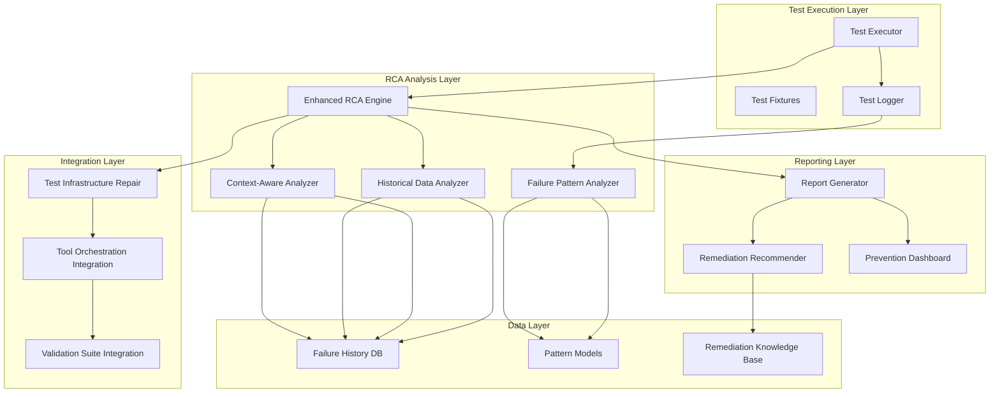
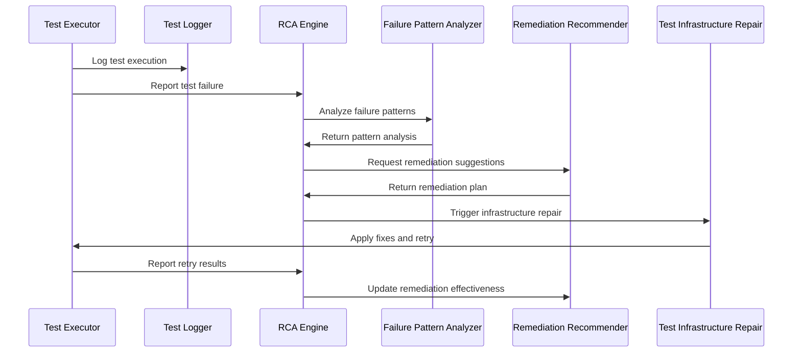

# Design Document

## Overview

This design addresses the systematic resolution of test failures and enhancement of Root Cause Analysis (RCA) capabilities in the Beast Mode framework. The solution integrates with existing test infrastructure while providing intelligent failure analysis and automated remediation suggestions.

The design follows a layered architecture approach:
- **Test Infrastructure Layer**: Enhanced logging, fixture management, and execution reliability
- **RCA Analysis Layer**: Intelligent failure pattern recognition and root cause identification  
- **Integration Layer**: Seamless integration with existing test validation and orchestration systems
- **Reporting Layer**: Comprehensive failure analysis and remediation guidance

## Architecture

### System Architecture Diagram



### Component Interaction Flow



## Components and Interfaces

### 1. Enhanced RCA Engine

**Purpose**: Intelligent analysis of test failures with context-aware diagnosis

**Key Interfaces**:
```python
class EnhancedRCAEngine(ReflectiveModule):
    def analyze_test_failure(self, failure_context: TestFailureContext) -> RCAResult
    def identify_root_causes(self, failure_data: Dict[str, Any]) -> List[RootCause]
    def suggest_remediation(self, root_causes: List[RootCause]) -> RemediationPlan
    def learn_from_resolution(self, failure_id: str, resolution_outcome: ResolutionOutcome) -> None
    def get_failure_patterns(self, time_range: Optional[TimeRange] = None) -> List[FailurePattern]
```

**Integration Points**:
- Existing `RCAEngine` (enhancement)
- Test validation suite
- Tool orchestration system
- Historical failure database

### 2. Test Infrastructure Repair System

**Purpose**: Automated repair of common test infrastructure issues

**Key Interfaces**:
```python
class TestInfrastructureRepair:
    def diagnose_logging_issues(self) -> List[LoggingIssue]
    def fix_logging_permissions(self, issues: List[LoggingIssue]) -> RepairResult
    def repair_tool_orchestration_methods(self) -> RepairResult
    def validate_test_fixtures(self) -> ValidationResult
    def repair_health_check_accuracy(self) -> RepairResult
```

**Integration Points**:
- Existing test fixtures (`tests/conftest.py`)
- Tool orchestrator classes
- Health monitoring systems
- Test validation suite

### 3. Failure Pattern Analyzer

**Purpose**: Machine learning-based pattern recognition for test failures

**Key Interfaces**:
```python
class FailurePatternAnalyzer:
    def analyze_failure_patterns(self, failures: List[TestFailure]) -> PatternAnalysis
    def categorize_failure_type(self, failure: TestFailure) -> FailureCategory
    def predict_failure_likelihood(self, test_context: TestContext) -> float
    def identify_related_failures(self, failure: TestFailure) -> List[TestFailure]
```

**Integration Points**:
- Test execution results
- Historical failure data
- Pattern model storage
- RCA engine

### 4. Context-Aware Analyzer

**Purpose**: Analysis of failure context including environment, dependencies, and system state

**Key Interfaces**:
```python
class ContextAwareAnalyzer:
    def analyze_execution_context(self, context: ExecutionContext) -> ContextAnalysis
    def identify_environmental_factors(self, failure: TestFailure) -> List[EnvironmentalFactor]
    def analyze_dependency_issues(self, failure: TestFailure) -> DependencyAnalysis
    def assess_system_state_impact(self, failure: TestFailure) -> SystemStateAnalysis
```

**Integration Points**:
- System monitoring data
- Dependency management
- Environment configuration
- Test execution environment

## Data Models

### Core Data Structures

```python
@dataclass
class TestFailureContext:
    test_name: str
    failure_type: FailureType
    error_message: str
    stack_trace: str
    execution_environment: Dict[str, Any]
    system_state: Dict[str, Any]
    timestamp: datetime
    related_failures: List[str] = field(default_factory=list)

@dataclass
class RootCause:
    cause_id: str
    category: RootCauseCategory
    description: str
    confidence_score: float
    evidence: List[str]
    suggested_fixes: List[str]
    prevention_measures: List[str]

@dataclass
class RemediationPlan:
    plan_id: str
    root_causes: List[RootCause]
    immediate_actions: List[RemediationAction]
    preventive_measures: List[PreventiveMeasure]
    estimated_effort: str
    success_probability: float
    rollback_plan: List[str]

@dataclass
class FailurePattern:
    pattern_id: str
    pattern_type: PatternType
    frequency: int
    affected_tests: List[str]
    common_characteristics: Dict[str, Any]
    trend_analysis: TrendAnalysis
    prevention_effectiveness: float

enum FailureType:
    INFRASTRUCTURE = "infrastructure"
    LOGIC_ERROR = "logic_error"
    CONFIGURATION = "configuration"
    DEPENDENCY = "dependency"
    ENVIRONMENT = "environment"
    TIMING = "timing"
    RESOURCE = "resource"

enum RootCauseCategory:
    MISSING_METHOD = "missing_method"
    INTERFACE_MISMATCH = "interface_mismatch"
    CONFIGURATION_ERROR = "configuration_error"
    DEPENDENCY_ISSUE = "dependency_issue"
    RESOURCE_CONSTRAINT = "resource_constraint"
    TIMING_ISSUE = "timing_issue"
    ENVIRONMENT_ISSUE = "environment_issue"
```

### Database Schema

```sql
-- Failure History Table
CREATE TABLE failure_history (
    id UUID PRIMARY KEY,
    test_name VARCHAR(255) NOT NULL,
    failure_type VARCHAR(50) NOT NULL,
    error_message TEXT,
    stack_trace TEXT,
    execution_context JSONB,
    root_causes JSONB,
    remediation_applied JSONB,
    resolution_outcome VARCHAR(50),
    timestamp TIMESTAMP NOT NULL,
    created_at TIMESTAMP DEFAULT NOW()
);

-- Pattern Models Table
CREATE TABLE pattern_models (
    id UUID PRIMARY KEY,
    pattern_type VARCHAR(50) NOT NULL,
    model_data JSONB NOT NULL,
    accuracy_score FLOAT,
    training_data_size INTEGER,
    last_updated TIMESTAMP DEFAULT NOW()
);

-- Remediation Knowledge Base Table
CREATE TABLE remediation_knowledge (
    id UUID PRIMARY KEY,
    root_cause_category VARCHAR(50) NOT NULL,
    remediation_steps JSONB NOT NULL,
    success_rate FLOAT,
    effort_estimate VARCHAR(20),
    prerequisites JSONB,
    created_at TIMESTAMP DEFAULT NOW()
);
```

## Error Handling

### Error Classification System

```python
class TestRCAError(Exception):
    """Base exception for test RCA system"""
    pass

class AnalysisError(TestRCAError):
    """Errors during RCA analysis"""
    pass

class RemediationError(TestRCAError):
    """Errors during remediation application"""
    pass

class PatternAnalysisError(TestRCAError):
    """Errors during pattern analysis"""
    pass
```

### Error Recovery Strategies

1. **Analysis Failures**: Fallback to basic pattern matching
2. **Remediation Failures**: Provide manual remediation steps
3. **Data Access Failures**: Use cached analysis results
4. **Integration Failures**: Operate in standalone mode

### Graceful Degradation

- If RCA engine fails, provide basic error categorization
- If pattern analysis fails, use rule-based classification
- If remediation suggestions fail, provide generic troubleshooting steps
- If historical data unavailable, use current session data only

## Testing Strategy

### Unit Testing Approach

1. **RCA Engine Tests**:
   - Test failure analysis accuracy
   - Test root cause identification
   - Test remediation suggestion quality
   - Test learning mechanism effectiveness

2. **Pattern Analyzer Tests**:
   - Test pattern recognition accuracy
   - Test failure categorization
   - Test prediction reliability
   - Test pattern evolution tracking

3. **Infrastructure Repair Tests**:
   - Test logging issue detection and repair
   - Test method implementation fixes
   - Test health check accuracy improvements
   - Test fixture validation and repair

### Integration Testing Strategy

1. **End-to-End Test Failure Analysis**:
   - Simulate various test failure scenarios
   - Verify complete analysis pipeline
   - Validate remediation effectiveness
   - Test prevention measure implementation

2. **System Integration Tests**:
   - Test integration with existing test infrastructure
   - Verify compatibility with tool orchestration
   - Test reporting system integration
   - Validate data persistence and retrieval

### Performance Testing

1. **Analysis Performance**:
   - RCA analysis completion time < 5 seconds
   - Pattern analysis for 1000 failures < 30 seconds
   - Remediation suggestion generation < 2 seconds

2. **System Impact**:
   - Memory usage increase < 100MB during analysis
   - CPU usage spike < 20% during pattern analysis
   - Storage growth < 1MB per 100 analyzed failures

### Test Data Management

1. **Synthetic Test Failures**: Generate controlled failure scenarios
2. **Historical Data**: Use anonymized real failure data for training
3. **Pattern Validation**: Cross-validate patterns with domain experts
4. **Remediation Effectiveness**: Track success rates of applied fixes

## Implementation Phases

### Phase 1: Core RCA Enhancement (Week 1-2)
- Enhance existing RCA engine with intelligent analysis
- Implement failure pattern recognition
- Create basic remediation suggestion system
- Integrate with existing test infrastructure

### Phase 2: Infrastructure Repair System (Week 2-3)
- Implement automated logging issue detection and repair
- Add missing method implementation system
- Create health check accuracy improvements
- Develop fixture validation and repair

### Phase 3: Advanced Pattern Analysis (Week 3-4)
- Implement machine learning-based pattern recognition
- Create context-aware failure analysis
- Develop predictive failure detection
- Build comprehensive pattern database

### Phase 4: Integration and Optimization (Week 4-5)
- Complete integration with existing systems
- Optimize performance and resource usage
- Implement comprehensive reporting
- Create prevention dashboard and monitoring

### Phase 5: Validation and Deployment (Week 5-6)
- Comprehensive testing and validation
- Performance optimization
- Documentation and training materials
- Production deployment and monitoring setup