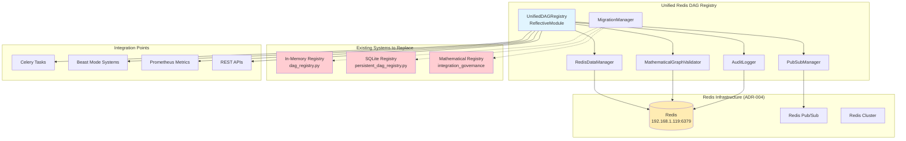

# Unified Redis-Based DAG Registry Design

## Overview

The Unified Redis-Based DAG Registry consolidates three existing DAG registry implementations into a single, Redis-backed system that provides mathematical DAG validation, persistent storage, multi-node coordination, and seamless integration with the Beast Mode framework. This design leverages Redis as both the storage backend and coordination mechanism while preserving all capabilities from the existing implementations.

**Architecture Philosophy**: Replace fragmented DAG registry landscape with a unified Redis-native solution that maintains backward compatibility while providing enhanced capabilities through Redis infrastructure.

## ADR Conformance Review

### Relevant ADRs Reviewed
- ADR-004: DAG Orchestration with Celery + Redis - ✅ **Fully Compliant** - Uses Redis as primary infrastructure for both DAG registry and Celery coordination
- ADR-005: ReflectiveModule Pattern for Universal Observability - ✅ **Compliant** - All components inherit ReflectiveModule for automatic observability
- ADR-006: Existing DAG Registry Over External Graph Libraries - ✅ **Compliant** - Consolidates existing DAG registries rather than introducing external dependencies
- ADR-008: Failure Isolation Over Cascade Prevention - ✅ **Compliant** - Implements failure isolation and graceful degradation
- ADR-009: Resource-Aware Dynamic Concurrency - ✅ **Compliant** - Provides resource-aware operations and dynamic scaling

### Conformance Assessment
- **Infrastructure**: Fully aligns with Redis infrastructure decisions (ADR-004) and existing Beast Mode network
- **Integration**: Follows ReflectiveModule pattern (ADR-005) and consolidates existing DAG registries (ADR-006)
- **Operations**: Implements failure isolation (ADR-008) and resource-aware approaches (ADR-009)
- **Technology**: Maintains consistency with established Beast Mode framework patterns

## Architecture

### System Architecture Diagram



### Component Architecture

#### 1. UnifiedDAGRegistry (Core Component)
**Role**: Main registry interface that consolidates all existing DAG registry capabilities
**Implementation**: Inherits from ReflectiveModule for Beast Mode integration
**Responsibilities**:
- Unified API for all DAG operations
- Coordinate between Redis storage and mathematical validation
- Manage pub/sub notifications and multi-node coordination
- Provide backward compatibility with existing registry APIs

```python
class UnifiedDAGRegistry(ReflectiveModule):
    def __init__(self, redis_url: str = "redis://192.168.1.119:6379"):
        super().__init__()
        self.redis_manager = RedisDataManager(redis_url)
        self.graph_validator = MathematicalGraphValidator()
        self.pubsub_manager = PubSubManager(redis_url)
        self.audit_logger = AuditLogger(redis_url)
        
    # Unified API methods that replace all existing registries
    def register_module(self, module_id: str, dependencies: Set[str] = None, **metadata) -> bool
    def get_dependencies(self, module_id: str) -> Set[str]
    def validate_dag(self) -> bool
    def get_topological_order(self) -> List[str]
```

#### 2. RedisDataManager (Storage Layer)
**Role**: Manages all Redis data operations with ACID compliance
**Implementation**: Redis-native storage with optimized data structures
**Responsibilities**:
- Module metadata storage and retrieval
- Dependency relationship management
- Transaction safety and consistency
- Performance optimization through Redis data structures

**Redis Data Schema**:
```
# Module metadata (Hash)
module:{module_id} -> {
    "class_name": str,
    "file_path": str,
    "line_number": int,
    "version": str,
    "capabilities": json,
    "health_status": str,
    "registered_at": timestamp,
    "last_updated": timestamp
}

# Dependencies (Set)
deps:{module_id} -> {dependency_ids}

# Dependents (Set) 
dependents:{module_id} -> {dependent_ids}

# Registry metadata (Hash)
registry:metadata -> {
    "registry_id": str,
    "total_modules": int,
    "is_dag": bool,
    "created_at": timestamp,
    "last_updated": timestamp
}

# Audit log (Sorted Set)
audit:log -> {timestamp: json_record}
```

#### 3. MathematicalGraphValidator (Validation Engine)
**Role**: Provides mathematical DAG validation using graph theory algorithms
**Implementation**: Combines algorithms from existing registries with Redis-optimized operations
**Responsibilities**:
- Cycle detection using DFS algorithms
- Topological sorting with mathematical guarantees
- Strongly connected component analysis
- Dependency path analysis and optimization

**Algorithm Integration**:
- **From in-memory registry**: DFS cycle detection algorithm
- **From SQLite registry**: Transaction-safe validation
- **From mathematical registry**: NetworkX-compatible graph operations
- **Redis optimization**: Batch operations and pipeline optimization

#### 4. PubSubManager (Coordination Layer)
**Role**: Manages multi-node coordination through Redis pub/sub
**Implementation**: Redis pub/sub with Beast Mode channel conventions
**Responsibilities**:
- Registry change notifications
- Node synchronization
- Split-brain detection and resolution
- Event broadcasting and subscription management

**Channel Schema**:
```
beast_mode:dag_registry:module_registered
beast_mode:dag_registry:module_updated
beast_mode:dag_registry:module_removed
beast_mode:dag_registry:validation_failed
beast_mode:dag_registry:sync_request
```

#### 5. AuditLogger (Compliance Layer)
**Role**: Comprehensive audit trail and compliance reporting
**Implementation**: Redis-based audit log with structured data
**Responsibilities**:
- Operation logging with full context
- Compliance reporting and data export
- Security audit trails
- Performance metrics and analytics

#### 6. MigrationManager (Compatibility Layer)
**Role**: Seamless migration from existing DAG registry implementations
**Implementation**: Data import and API compatibility layer
**Responsibilities**:
- Import data from SQLite registry
- Import data from in-memory registry
- Import mathematical registry configurations
- Provide backward-compatible APIs

## Integration Points

### 1. Celery Integration (ADR-004 Compliance)
**Integration Pattern**: Redis serves as both DAG registry and Celery broker
```python
class CeleryDAGIntegration:
    def __init__(self, dag_registry: UnifiedDAGRegistry):
        self.dag_registry = dag_registry
        self.celery_app = Celery('dag_orchestrator', 
                                broker=dag_registry.redis_url,
                                backend=dag_registry.redis_url)
    
    def validate_task_dependencies(self, task_id: str) -> bool:
        return self.dag_registry.validate_task_chain(task_id)
```

### 2. Beast Mode ReflectiveModule Integration
**Pattern**: Full observability and health monitoring
```python
# Automatic capabilities from ReflectiveModule inheritance:
# - /health endpoint with Redis connectivity status
# - /ready endpoint with DAG validation status  
# - /metrics endpoint with Prometheus metrics
# - Structured logging with correlation IDs
# - CLI generation for registry operations
```

### 3. Existing System Compatibility
**Backward Compatibility Layer**:
```python
# Maintain existing APIs
def register_module_safely(module_id: str, dependencies: Set[str] = None) -> bool:
    return unified_dag_registry.register_module(module_id, dependencies)

def get_dag_validation() -> bool:
    return unified_dag_registry.validate_dag()

def get_registry_stats() -> Dict[str, Any]:
    return unified_dag_registry.get_registry_stats()
```

## Data Migration Strategy

### Phase 1: Parallel Operation
1. Deploy unified registry alongside existing registries
2. Configure dual-write mode for new operations
3. Validate data consistency between systems
4. Monitor performance and reliability

### Phase 2: Data Import
1. **SQLite Registry Migration**:
   - Export all module data, dependencies, and audit logs
   - Import into Redis with preserved timestamps and metadata
   - Validate mathematical consistency

2. **In-Memory Registry Migration**:
   - Capture current registry state
   - Import active modules and dependencies
   - Preserve global registry instance behavior

3. **Mathematical Registry Migration**:
   - Import component analysis results
   - Preserve NetworkX graph configurations
   - Maintain Airflow DAG generation capabilities

### Phase 3: Cutover
1. Switch all new operations to unified registry
2. Redirect existing API calls to unified implementation
3. Deprecate old registry implementations
4. Remove legacy code after validation period

## Performance Optimization

### Redis Optimization Strategies
1. **Pipeline Operations**: Batch multiple Redis commands for atomic execution
2. **Connection Pooling**: Reuse Redis connections across operations
3. **Data Structure Optimization**: Use Redis Sets for dependencies, Hashes for metadata
4. **Caching Layer**: Local caching for frequently accessed data
5. **Compression**: JSON compression for large metadata objects

### Mathematical Algorithm Optimization
1. **Incremental Validation**: Only validate affected subgraphs on changes
2. **Cached Results**: Cache topological sort results until graph changes
3. **Parallel Processing**: Use Redis transactions for concurrent operations
4. **Memory Efficiency**: Stream large graph operations to avoid memory spikes

## Security and Compliance

### Security Measures
1. **Redis Authentication**: Use Redis AUTH and TLS encryption
2. **Access Control**: Role-based permissions for registry operations
3. **Audit Trails**: Complete operation logging with user context
4. **Data Encryption**: Encrypt sensitive metadata in Redis
5. **Network Security**: VPN/firewall protection for Redis access

### Compliance Features
1. **Audit Reporting**: Automated compliance report generation
2. **Data Retention**: Configurable retention policies for audit logs
3. **Data Export**: Complete data export for compliance requirements
4. **Change Tracking**: Full change history with rollback capabilities
5. **Access Logging**: Detailed access logs for security audits

## Monitoring and Observability

### Prometheus Metrics
```
dag_registry_operations_total{operation, status}
dag_registry_operation_duration_seconds{operation}
dag_registry_redis_connection_status
dag_registry_modules_total
dag_registry_dependencies_total
dag_registry_validation_errors_total
dag_registry_pubsub_messages_total{channel}
```

### Health Checks
```
/health - Overall system health including Redis connectivity
/ready - Registry readiness for operations
/metrics - Prometheus metrics endpoint
/status - Detailed status including DAG validation results
```

### Logging Structure
```json
{
  "timestamp": "2025-01-27T10:30:00Z",
  "level": "INFO",
  "component": "UnifiedDAGRegistry",
  "operation": "register_module",
  "module_id": "example.module",
  "correlation_id": "req-12345",
  "duration_ms": 15,
  "redis_operations": 3,
  "validation_result": "success"
}
```

## Deployment Strategy

### Infrastructure Requirements
- Redis 6.0+ with persistence enabled
- Network connectivity to 192.168.1.119:6379 (primary)
- Fallback Redis at localhost:6380
- Python 3.9+ with redis, celery packages
- Prometheus monitoring infrastructure

### Deployment Steps
1. **Infrastructure Validation**: Verify Redis connectivity and performance
2. **Package Installation**: Deploy unified registry package
3. **Configuration**: Configure Redis URLs and Beast Mode integration
4. **Migration Execution**: Run data migration from existing registries
5. **Validation**: Verify all existing functionality works correctly
6. **Monitoring Setup**: Configure Prometheus metrics and alerting
7. **Cutover**: Switch production traffic to unified registry

### Rollback Plan
1. **Immediate Rollback**: Switch back to previous registry implementations
2. **Data Recovery**: Restore from Redis backup if needed
3. **Validation**: Verify system functionality after rollback
4. **Root Cause Analysis**: Analyze issues and plan remediation

## Success Metrics

### Performance Metrics
- Registry operation latency < 1ms (95th percentile)
- DAG validation time scales linearly with graph size
- Redis connection uptime > 99.9%
- Zero data loss during normal operations

### Functional Metrics
- 100% backward compatibility with existing APIs
- All existing test suites pass without modification
- Complete data migration from all existing registries
- Full integration with Celery and Beast Mode systems

### Operational Metrics
- Automated deployment and rollback capabilities
- Comprehensive monitoring and alerting
- Complete audit trails for compliance
- Multi-node coordination without conflicts

This design provides a comprehensive solution that unifies all existing DAG registry implementations while leveraging Redis infrastructure for enhanced capabilities and Beast Mode integration.