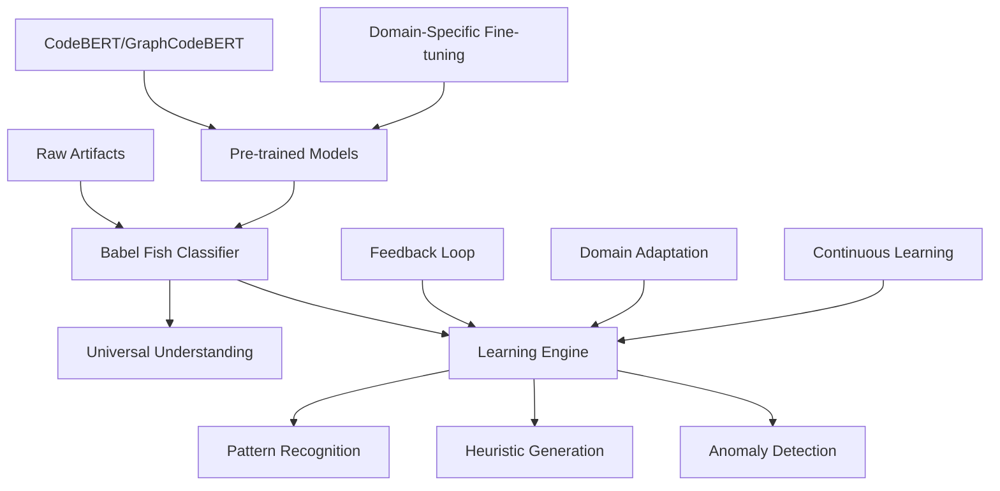

# Design Document: The Adaptive Babel Fish

## Overview

This design implements an adaptive, learning artifact classification system that serves as the "Babel Fish" for universal content understanding. Unlike static translation systems, our Babel Fish learns, adapts, creates heuristic rules for efficiency, detects anomalies, and conforms to the universe as it discovers it.

## Core Philosophy: The Learning Babel Fish



**Design Principle:** We don't transform artifacts or patch them with metadata. We understand them natively, learn their patterns, and adapt to new domains automatically.

## Architecture

### 1. Adaptive Classification Engine

**Core Component:** The heart of our Babel Fish that learns and evolves.

```python
class AdaptiveBabelFish(ReflectiveModule):
    """The learning, adaptive artifact classifier"""
    
    def __init__(self):
        self.base_model = self._load_pretrained_model()
        self.heuristic_engine = HeuristicGenerationEngine()
        self.anomaly_detector = AnomalyDetectionSystem()
        self.learning_engine = ContinuousLearningEngine()
        self.efficiency_optimizer = EfficiencyOptimizer()
    
    def understand_artifact(self, artifact_path: Path) -> ArtifactUnderstanding:
        """Understand artifact using adaptive intelligence"""
        
        # Try efficient heuristics first
        quick_result = self.heuristic_engine.quick_classify(artifact_path)
        if quick_result.confidence > 0.95:
            return quick_result
        
        # Fall back to deep learning for complex cases
        deep_result = self.base_model.classify(artifact_path)
        
        # Detect anomalies and learn from them
        if self.anomaly_detector.is_anomaly(deep_result):
            self.learning_engine.learn_from_anomaly(artifact_path, deep_result)
        
        # Generate new heuristics for efficiency
        self.heuristic_engine.update_rules(artifact_path, deep_result)
        
        return deep_result
```

### 2. Heuristic Generation Engine

**Purpose:** Creates efficient rules from learned patterns to speed up classification.

**Adaptive Strategy:**
- **Pattern Mining:** Extract common patterns from successful classifications
- **Rule Generation:** Create fast heuristic rules for frequent patterns
- **Efficiency Optimization:** Use heuristics for 80% of cases, deep learning for edge cases
- **Rule Evolution:** Continuously refine rules based on accuracy feedback

```python
class HeuristicGenerationEngine:
    """Generates efficient heuristic rules from learned patterns"""
    
    def __init__(self):
        self.pattern_miner = PatternMiningEngine()
        self.rule_generator = RuleGenerationEngine()
        self.efficiency_tracker = EfficiencyTracker()
    
    def update_rules(self, artifact_path: Path, classification_result: ClassificationResult):
        """Learn new heuristic rules from successful classifications"""
        
        # Extract patterns from successful classification
        patterns = self.pattern_miner.extract_patterns(artifact_path, classification_result)
        
        # Generate new heuristic rules
        new_rules = self.rule_generator.create_rules(patterns)
        
        # Test rule efficiency and accuracy
        validated_rules = self._validate_rules(new_rules)
        
        # Add validated rules to heuristic engine
        self._add_rules(validated_rules)
```

### 3. Anomaly Detection System

**Purpose:** Identifies exceptions, edge cases, and learning opportunities.

**Detection Strategy:**
- **Confidence Thresholds:** Flag low-confidence classifications
- **Pattern Deviation:** Detect artifacts that don't match known patterns
- **Domain Drift:** Identify when artifact patterns are changing
- **Learning Triggers:** Use anomalies as training opportunities

### 4. Continuous Learning Engine

**Purpose:** Adapts to new domains and improves accuracy over time.

**Learning Strategy:**
- **Active Learning:** Focus learning on most informative examples
- **Domain Adaptation:** Fine-tune for new organizational patterns
- **Feedback Integration:** Learn from human corrections and validations
- **Model Evolution:** Continuously improve without losing existing knowledge

## Build vs Buy Analysis: The Pragmatic Choice

### Option A: Rule-Based Enhancement (Build from Scratch)

**Pros:**
- Full control over classification logic
- Deterministic behavior
- No external dependencies

**Cons:**
- **Massive Engineering Effort:** Would need to recreate what CodeBERT already knows
- **Domain Limitation:** Rules work for known patterns only
- **Maintenance Nightmare:** Each new domain requires manual rule creation
- **No Learning Capability:** Static rules don't adapt or improve

**Estimated Effort:** 6-12 months for basic functionality
**Scalability:** Poor (manual rules for each domain)

### Option B: Transfer Learning + Adaptation (Buy + Enhance)

**Pros:**
- **Leverage Existing Knowledge:** CodeBERT already understands code, configs, docs
- **Universal Applicability:** Works across any domain out of the box
- **Learning Capability:** Adapts and improves automatically
- **Proven Foundation:** Built on battle-tested ML models

**Cons:**
- External model dependencies
- Requires ML infrastructure
- Less predictable than rules

**Estimated Effort:** 2-4 weeks for production system
**Scalability:** Excellent (learns new domains automatically)

### Recommendation: Option B (Transfer Learning)

**Rationale:**
1. **Babel Fish Philosophy:** Pre-trained models already "speak" multiple artifact languages
2. **Learning Capability:** Can adapt to our specific organizational patterns
3. **Universal Understanding:** Works on any domain without manual configuration
4. **Efficiency:** Heuristic generation creates fast paths for common cases

## Components and Interfaces

### 1. Pre-trained Model Foundation

**Base Models:**
- **CodeBERT:** For code and configuration understanding
- **GraphCodeBERT:** For structural code analysis
- **RoBERTa:** For documentation and text analysis

**Integration Strategy:**
```python
class PretrainedModelFoundation:
    """Foundation layer using pre-trained models"""
    
    def __init__(self):
        self.code_model = AutoModel.from_pretrained("microsoft/codebert-base")
        self.graph_model = AutoModel.from_pretrained("microsoft/graphcodebert-base")
        self.text_model = AutoModel.from_pretrained("roberta-base")
    
    def extract_features(self, artifact_path: Path) -> FeatureVector:
        """Extract semantic features using appropriate pre-trained model"""
        
        artifact_type = self._detect_artifact_type(artifact_path)
        
        if artifact_type in ['code', 'config']:
            return self.code_model.encode(artifact_path)
        elif artifact_type == 'structured_code':
            return self.graph_model.encode(artifact_path)
        else:
            return self.text_model.encode(artifact_path)
```

### 2. Domain Adaptation Layer

**Purpose:** Learns organizational-specific patterns while preserving universal knowledge.

**Adaptation Techniques:**
- **Few-shot Learning:** Learn from small numbers of examples
- **Meta-learning:** Learn how to learn new domains quickly
- **Transfer Learning:** Fine-tune on organizational patterns
- **Continual Learning:** Add new knowledge without forgetting old

### 3. Efficiency Optimization System

**Purpose:** Creates fast paths for common classifications while maintaining accuracy.

**Optimization Strategy:**
- **Heuristic Caching:** Cache results for identical artifacts
- **Pattern Shortcuts:** Use fast rules for common patterns
- **Confidence Routing:** Route high-confidence cases through fast paths
- **Batch Processing:** Process similar artifacts together for efficiency

## Data Models

### Core Models

```python
@dataclass
class ArtifactUnderstanding:
    """Complete understanding of an artifact by the Babel Fish"""
    primary_type: str
    confidence: float
    semantic_features: Dict[str, float]
    learned_patterns: List[str]
    heuristic_rules_used: List[str]
    anomaly_indicators: List[str]
    learning_opportunities: List[str]
    explanation: str

@dataclass
class LearningEvent:
    """Record of learning from classification experience"""
    artifact_path: str
    classification_result: ClassificationResult
    patterns_discovered: List[str]
    heuristics_generated: List[str]
    anomalies_detected: List[str]
    learning_value: float
    timestamp: datetime

@dataclass
class HeuristicRule:
    """Efficient rule generated from learned patterns"""
    rule_id: str
    pattern: str
    classification: str
    confidence_threshold: float
    accuracy_rate: float
    usage_count: int
    created_at: datetime
    last_validated: datetime
```

## Implementation Strategy

### Phase 1: Foundation (Week 1)
1. **Model Integration:** Set up CodeBERT and supporting models
2. **Basic Classification:** Implement transfer learning classifier
3. **Validation Framework:** Test against our statistical audit dataset
4. **Target:** >90% accuracy on current repository

### Phase 2: Learning Engine (Week 2)
1. **Anomaly Detection:** Implement confidence-based anomaly detection
2. **Pattern Mining:** Extract patterns from successful classifications
3. **Heuristic Generation:** Create efficient rules from patterns
4. **Target:** 50% of classifications use fast heuristic paths

### Phase 3: Adaptive Intelligence (Week 3)
1. **Continuous Learning:** Implement feedback-based learning
2. **Domain Adaptation:** Fine-tune on organizational patterns
3. **Efficiency Optimization:** Optimize for speed and accuracy
4. **Target:** >95% accuracy with <100ms average classification time

### Phase 4: Universal Deployment (Week 4)
1. **Multi-domain Testing:** Validate on different artifact domains
2. **Integration:** Replace existing ContentClassifier
3. **Monitoring:** Add learning and efficiency metrics
4. **Target:** Production-ready Babel Fish system

## Success Metrics

### Learning Metrics
- **Adaptation Speed:** Time to achieve 90% accuracy on new domains
- **Pattern Discovery:** Number of useful patterns discovered per day
- **Heuristic Efficiency:** Percentage of classifications using fast paths
- **Anomaly Learning:** Accuracy improvement from anomaly-driven learning

### Performance Metrics
- **Classification Accuracy:** >95% overall, >90% per category
- **Classification Speed:** <100ms average, <10ms for heuristic paths
- **Memory Efficiency:** <2GB model footprint
- **Scalability:** Handle 10,000+ artifacts per hour

### Babel Fish Metrics
- **Universal Applicability:** Works on 5+ different domains
- **Zero-Patch Compliance:** 100% native artifact understanding
- **Learning Velocity:** Continuous accuracy improvement over time
- **Efficiency Evolution:** Increasing percentage of fast-path classifications

## Key Design Decisions

### Why Adaptive Learning Over Static Rules?

1. **Universe Conformance:** The system adapts to reality rather than imposing rigid categories
2. **Efficiency Evolution:** Learns efficient shortcuts while maintaining accuracy
3. **Anomaly Intelligence:** Uses exceptions as learning opportunities
4. **Domain Agnostic:** Adapts to any domain without manual configuration

### Why Transfer Learning Foundation?

1. **Babel Fish Philosophy:** Pre-trained models already "speak" multiple artifact languages
2. **Universal Knowledge:** CodeBERT understands code patterns across languages
3. **Learning Capability:** Can adapt to organizational specifics while preserving universal knowledge
4. **Proven Foundation:** Built on battle-tested, production-ready models

### Why Heuristic Generation?

1. **Efficiency Optimization:** Fast paths for common cases, deep learning for edge cases
2. **Resource Conservation:** Reduces computational overhead for routine classifications
3. **Pattern Crystallization:** Converts learned knowledge into efficient rules
4. **Scalability:** Enables high-throughput classification without sacrificing accuracy

The Adaptive Babel Fish embodies the principle of conforming to the universe while learning and evolving. It doesn't impose rigid categories but discovers and adapts to the patterns it finds, creating efficient pathways while maintaining the flexibility to handle any artifact in any domain.