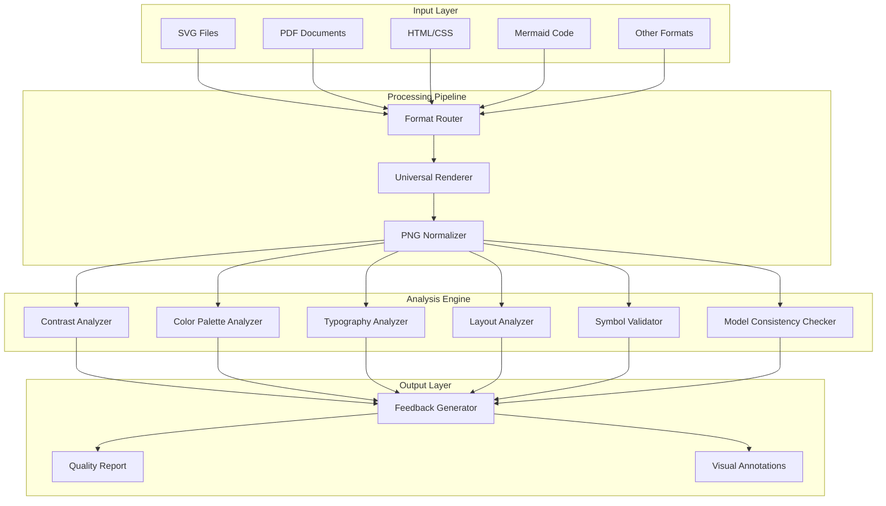

# Design Document

## Overview

The Systematic Visual Diagram Quality Validation Pipeline is designed as a microservices-based system that provides deterministic, automated quality validation for visual diagrams. The architecture emphasizes format-agnostic processing through a universal rendering pipeline, followed by systematic quality analysis using measurable design principles and accessibility standards.

The system operates in a containerized Linux environment optimized for consistent, fast processing (<5 seconds per diagram) while maintaining high output quality (300 DPI, 2× retina scale). The design supports real-time feedback integration and can adapt validation criteria based on target audience requirements.

## Architecture

### High-Level System Architecture



### Container Architecture

The system runs in a lightweight Linux container (<500 MB) with the following components:

- **Base Image**: Alpine Linux for minimal footprint
- **Rendering Libraries**: Cairo, librsvg, Puppeteer for headless browser rendering
- **Image Processing**: OpenCV, Pillow for pixel-level analysis
- **Font Management**: Consistent font set for deterministic rendering
- **Analysis Engines**: Custom Python modules for quality rule enforcement

## Components and Interfaces

### 1. Format Router and Input Processors

**Purpose**: Detect input format and route to appropriate processor

**Interface**:
```python
class FormatRouter:
    def detect_format(self, input_data: bytes) -> str
    def route_to_processor(self, format_type: str, input_data: bytes) -> ProcessorInterface
```

**Processors**:
- **SVGProcessor**: Uses librsvg for SVG rendering
- **PDFProcessor**: Uses pdf2image for PDF page extraction
- **HTMLProcessor**: Uses Puppeteer for web content rendering
- **MermaidProcessor**: Uses mermaid-cli for diagram generation
- **GenericImageProcessor**: Handles existing raster formats

### 2. Universal Renderer

**Purpose**: Convert all inputs to standardized PNG format

**Interface**:
```python
class UniversalRenderer:
    def render_to_png(self, processor: ProcessorInterface, 
                     width: int, height: int, dpi: int = 300) -> PNGImage
    def apply_retina_scaling(self, image: PNGImage) -> PNGImage
```

**Configuration**:
- Output resolution: 300 DPI
- Retina scaling: 2× for high-density displays
- Color space: sRGB for consistent color analysis
- Anti-aliasing: Enabled for smooth text rendering

### 3. Analysis Engine Framework

**Purpose**: Systematic quality rule enforcement through modular analyzers

**Base Interface**:
```python
class QualityAnalyzer:
    def analyze(self, image: PNGImage, metadata: dict) -> AnalysisResult
    def get_violations(self) -> List[QualityViolation]
    def generate_recommendations(self) -> List[Recommendation]
```

#### Contrast Analyzer
- **WCAG Compliance**: Measures luminance contrast ratios
- **Text Detection**: OCR-based text region identification
- **Background Analysis**: Pixel sampling for accurate contrast calculation
- **Threshold Enforcement**: 4.5:1 minimum for normal text, 3:1 for large text

#### Color Palette Analyzer
- **Color Extraction**: K-means clustering for dominant color identification
- **Palette Limitation**: 5-7 color maximum enforcement
- **Consistency Checking**: Cross-reference color usage throughout diagram
- **Colorblind Simulation**: Protanopia/deuteranopia filters for accessibility testing

#### Typography Analyzer
- **Font Detection**: OCR with font recognition capabilities
- **Size Measurement**: Pixel-to-point conversion for font size validation
- **Consistency Checking**: Font family and style uniformity analysis
- **Spacing Analysis**: Text bounding box overlap detection

#### Layout Analyzer
- **Flow Direction**: Left-to-right, top-to-bottom sequence validation
- **Alignment Detection**: Grid-based alignment analysis
- **Spacing Consistency**: Statistical analysis of element distances
- **Connector Analysis**: Line intersection and clarity checking

#### Symbol Validator
- **Shape Recognition**: Computer vision for standard symbol detection
- **Convention Checking**: Flowchart symbol standard compliance
- **Legend Detection**: Text pattern matching for legend identification
- **Notation Consistency**: Symbol usage uniformity analysis

#### Model Consistency Checker
- **Data Integration**: JSON/XML model parsing capabilities
- **Completeness Verification**: Element mapping between model and diagram
- **Accuracy Validation**: Text content comparison with source data
- **Synchronization Reporting**: Detailed mismatch identification

### 4. Feedback Generation System

**Purpose**: Convert analysis results into actionable recommendations

**Interface**:
```python
class FeedbackGenerator:
    def generate_report(self, violations: List[QualityViolation], 
                       audience_mode: str) -> QualityReport
    def create_visual_annotations(self, violations: List[QualityViolation]) -> AnnotatedImage
    def format_recommendations(self, recommendations: List[Recommendation]) -> str
```

**Audience Adaptation**:
- **Executive Mode**: Stricter clarity rules, larger fonts, simplified recommendations
- **Technical Mode**: Detailed analysis, comprehensive reporting, precision focus
- **General Mode**: Balanced approach with standard thresholds

## Data Models

### Core Data Structures

```python
@dataclass
class PNGImage:
    data: bytes
    width: int
    height: int
    dpi: int
    color_mode: str
    metadata: dict

@dataclass
class QualityViolation:
    rule_id: str
    severity: str  # 'error', 'warning', 'info'
    location: BoundingBox
    current_value: float
    expected_value: float
    description: str
    
@dataclass
class Recommendation:
    violation_id: str
    action_type: str  # 'increase', 'decrease', 'change', 'add', 'remove'
    specific_guidance: str
    expected_outcome: str
    
@dataclass
class QualityReport:
    overall_score: float
    violations: List[QualityViolation]
    recommendations: List[Recommendation]
    processing_time: float
    audience_mode: str
```

### Configuration Models

```python
@dataclass
class ValidationConfig:
    audience_mode: str
    contrast_threshold: float = 4.5
    max_colors: int = 7
    min_font_size: int = 12
    enable_model_checking: bool = False
    brand_colors: List[str] = None
    
@dataclass
class RenderingConfig:
    output_dpi: int = 300
    retina_scale: float = 2.0
    max_width: int = 4096
    max_height: int = 4096
    timeout_seconds: int = 30
```

## Error Handling

### Graceful Degradation Strategy

1. **Rendering Failures**: Fall back to lower resolution or alternative renderer
2. **Analysis Timeouts**: Return partial results with timeout notification
3. **Format Unsupported**: Attempt generic image processing if possible
4. **Memory Constraints**: Process in chunks or reduce resolution temporarily

### Error Classification

```python
class ValidationError(Exception):
    def __init__(self, error_type: str, message: str, recoverable: bool = True):
        self.error_type = error_type
        self.message = message
        self.recoverable = recoverable
```

**Error Types**:
- `RENDERING_FAILED`: Input cannot be converted to PNG
- `ANALYSIS_TIMEOUT`: Processing exceeded time limit
- `INVALID_FORMAT`: Unsupported or corrupted input
- `RESOURCE_EXHAUSTED`: Memory or CPU limits exceeded
- `MODEL_MISMATCH`: Consistency checking failed

### Recovery Mechanisms

- **Automatic Retry**: Up to 3 attempts with exponential backoff
- **Fallback Processing**: Reduced quality analysis if full analysis fails
- **Partial Results**: Return available analysis even if some checks fail
- **User Notification**: Clear error messages with suggested actions

## Testing Strategy

### Unit Testing Framework

**Coverage Requirements**: >90% code coverage for all analysis modules

**Test Categories**:
1. **Format Processing Tests**: Verify correct rendering for each input type
2. **Analysis Accuracy Tests**: Validate rule enforcement against known good/bad examples
3. **Performance Tests**: Ensure <5 second processing time under various loads
4. **Regression Tests**: Prevent quality degradation in analysis accuracy

### Integration Testing

**End-to-End Scenarios**:
- Complete pipeline processing for each supported format
- Real-time feedback integration with mock diagramming tools
- CI/CD pipeline integration with build failure scenarios
- Cross-format consistency validation

### Performance Testing

**Benchmarks**:
- Processing time: <5 seconds for diagrams up to 2MB
- Memory usage: <1GB peak during processing
- Container startup: <10 seconds cold start
- Concurrent processing: 10+ diagrams simultaneously

### Quality Assurance Testing

**Validation Datasets**:
- WCAG compliance test suite with known contrast violations
- Typography samples with various font sizes and styles
- Layout examples with alignment and flow issues
- Color palette samples including colorblind-problematic combinations

**Accuracy Metrics**:
- False positive rate: <5% for all quality rules
- False negative rate: <2% for critical accessibility violations
- Recommendation relevance: >95% user acceptance in testing

### Continuous Testing Integration

**Automated Test Execution**:
- Unit tests on every commit
- Integration tests on pull requests
- Performance regression tests on releases
- Quality validation against reference diagram set

**Test Data Management**:
- Version-controlled test diagram repository
- Automated generation of test cases from real-world samples
- Regular updates to test suite based on user feedback
- Benchmark tracking for performance regression detection