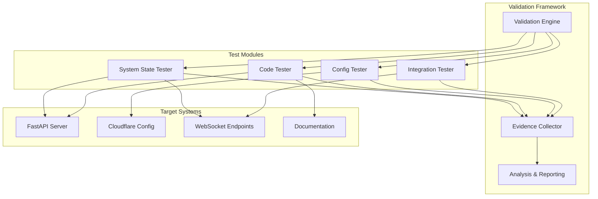

# WebSocket Implementation Validation Design

## Overview

This design document outlines a systematic validation framework to objectively assess the claims made in the WebSocket Implementation Gap Analysis Report. The framework will provide definitive evidence to either validate or refute allegations of "implementation theater" through comprehensive testing, analysis, and evidence collection.

The validation system employs a multi-layered approach combining automated testing, static analysis, configuration verification, and end-to-end integration testing to provide objective, measurable results.

## Architecture

### High-Level Architecture



### Component Architecture

The validation framework consists of four primary components:

1. **Validation Engine**: Orchestrates all validation activities
2. **Test Modules**: Specialized testing components for different aspects
3. **Evidence Collector**: Systematic evidence gathering and storage
4. **Analysis & Reporting**: Evidence analysis and conclusion generation

## Components and Interfaces

### 1. Validation Engine

**Purpose**: Central orchestrator for all validation activities

**Key Responsibilities**:
- Coordinate execution of all test modules
- Manage test sequencing and dependencies
- Handle error recovery and retry logic
- Provide unified logging and monitoring

**Interface**:
```python
class ValidationEngine:
    def execute_validation_suite(self) -> ValidationReport
    def run_specific_test(self, test_name: str) -> TestResult
    def get_validation_status(self) -> ValidationStatus
    def generate_evidence_report(self) -> EvidenceReport
```

### 2. System State Tester

**Purpose**: Verify actual WebSocket endpoint functionality and system state

**Key Responsibilities**:
- Test WebSocket endpoint connectivity
- Verify HTTP response codes and headers
- Validate WebSocket upgrade handshakes
- Monitor actual system behavior

**Test Categories**:
- **Production Endpoint Tests**: https://observatory.nkllon.com/ws/*
- **Local Endpoint Tests**: http://localhost:8888/ws/*
- **WebSocket Handshake Tests**: HTTP/1.1 101 Switching Protocols verification
- **Connection Stability Tests**: Long-running connection validation

**Interface**:
```python
class SystemStateTester:
    def test_production_endpoints(self) -> List[EndpointResult]
    def test_local_endpoints(self) -> List[EndpointResult]
    def test_websocket_handshakes(self) -> List[HandshakeResult]
    def test_connection_stability(self) -> StabilityResult
```

### 3. Code Analysis Tester

**Purpose**: Analyze actual FastAPI server implementation and code structure

**Key Responsibilities**:
- Parse FastAPI server configuration
- Identify registered WebSocket routes
- Analyze route handler implementations
- Verify import dependencies and library integration

**Analysis Components**:
- **Static Code Analysis**: AST parsing of Python files
- **Route Discovery**: FastAPI route registration analysis
- **Dependency Analysis**: Import and library usage verification
- **Implementation Completeness**: Handler function analysis

**Interface**:
```python
class CodeAnalysisTester:
    def analyze_fastapi_routes(self) -> RouteAnalysis
    def verify_websocket_handlers(self) -> HandlerAnalysis
    def check_dependency_imports(self) -> DependencyAnalysis
    def assess_implementation_completeness(self) -> CompletenessAnalysis
```

### 4. Configuration Tester

**Purpose**: Verify Cloudflare and infrastructure configuration

**Key Responsibilities**:
- Analyze Cloudflare tunnel configuration
- Verify WebSocket proxy settings
- Test configuration file validity
- Validate infrastructure setup

**Configuration Areas**:
- **Cloudflare Tunnel Config**: WebSocket proxy rules and settings
- **DNS Configuration**: Domain and subdomain routing
- **SSL/TLS Settings**: Certificate and encryption configuration
- **Firewall Rules**: WebSocket traffic allowance

**Interface**:
```python
class ConfigurationTester:
    def analyze_cloudflare_config(self) -> CloudflareAnalysis
    def verify_tunnel_settings(self) -> TunnelAnalysis
    def test_dns_configuration(self) -> DNSAnalysis
    def validate_ssl_settings(self) -> SSLAnalysis
```

### 5. Integration Tester

**Purpose**: Perform end-to-end WebSocket functionality testing

**Key Responsibilities**:
- Establish real WebSocket connections
- Test message delivery and reception
- Validate emoji rain and other features
- Perform load and stress testing

**Integration Tests**:
- **Connection Establishment**: Full WebSocket handshake through infrastructure
- **Message Delivery**: Bidirectional message testing
- **Feature Validation**: Emoji rain and other WebSocket features
- **Performance Testing**: Load, latency, and throughput validation

**Interface**:
```python
class IntegrationTester:
    def test_websocket_connections(self) -> ConnectionResults
    def test_message_delivery(self) -> MessageResults
    def test_emoji_rain_feature(self) -> FeatureResults
    def test_performance_metrics(self) -> PerformanceResults
```

### 6. Evidence Collector

**Purpose**: Systematic collection and storage of all validation evidence

**Key Responsibilities**:
- Collect timestamped evidence from all tests
- Store logs, screenshots, and response data
- Maintain evidence integrity and traceability
- Provide evidence retrieval and analysis

**Evidence Types**:
- **Test Logs**: Detailed execution logs with timestamps
- **Network Captures**: HTTP/WebSocket traffic analysis
- **Screenshots**: Visual evidence of system behavior
- **Configuration Snapshots**: System state at test time

**Interface**:
```python
class EvidenceCollector:
    def collect_test_evidence(self, test_result: TestResult) -> Evidence
    def store_network_capture(self, capture_data: bytes) -> EvidenceID
    def take_system_screenshot(self, context: str) -> EvidenceID
    def snapshot_configuration(self, config_type: str) -> EvidenceID
```

### 7. Analysis & Reporting Engine

**Purpose**: Analyze collected evidence and generate comprehensive reports

**Key Responsibilities**:
- Analyze evidence for patterns and conclusions
- Generate quantitative metrics and statistics
- Provide objective assessment of gap analysis claims
- Create actionable recommendations

**Analysis Components**:
- **Statistical Analysis**: Quantitative metrics and success rates
- **Pattern Recognition**: Identify systematic issues or successes
- **Gap Assessment**: Compare documentation claims vs reality
- **Recommendation Engine**: Generate actionable next steps

**Interface**:
```python
class AnalysisReportingEngine:
    def analyze_evidence(self, evidence: List[Evidence]) -> AnalysisResult
    def generate_metrics(self, test_results: List[TestResult]) -> Metrics
    def assess_gap_claims(self, claims: List[Claim]) -> GapAssessment
    def create_recommendations(self, analysis: AnalysisResult) -> Recommendations
```

## Data Models

### Core Data Structures

```python
@dataclass
class ValidationReport:
    execution_id: str
    timestamp: datetime
    overall_status: ValidationStatus
    test_results: List[TestResult]
    evidence_summary: EvidenceSummary
    gap_assessment: GapAssessment
    recommendations: List[Recommendation]

@dataclass
class TestResult:
    test_id: str
    test_name: str
    status: TestStatus
    execution_time: float
    evidence_ids: List[str]
    metrics: Dict[str, Any]
    error_details: Optional[str]

@dataclass
class EndpointResult:
    url: str
    method: str
    status_code: int
    headers: Dict[str, str]
    response_time: float
    websocket_upgrade_success: bool
    error_message: Optional[str]

@dataclass
class GapAssessment:
    claims_validated: int
    claims_refuted: int
    claims_inconclusive: int
    documentation_accuracy_percentage: float
    implementation_completeness_percentage: float
    overall_assessment: GapAssessmentResult
```

### Evidence Data Model

```python
@dataclass
class Evidence:
    evidence_id: str
    timestamp: datetime
    evidence_type: EvidenceType
    source_test: str
    data: bytes
    metadata: Dict[str, Any]
    integrity_hash: str

class EvidenceType(Enum):
    LOG_FILE = "log_file"
    NETWORK_CAPTURE = "network_capture"
    SCREENSHOT = "screenshot"
    CONFIG_SNAPSHOT = "config_snapshot"
    TEST_OUTPUT = "test_output"
```

## Error Handling

### Error Categories

1. **Network Errors**: Connection failures, timeouts, DNS resolution issues
2. **Configuration Errors**: Invalid config files, missing settings
3. **Code Analysis Errors**: Parse failures, missing files, import errors
4. **System Errors**: Permission issues, resource constraints
5. **Evidence Collection Errors**: Storage failures, corruption issues

### Error Handling Strategy

```python
class ValidationError(Exception):
    def __init__(self, error_type: ErrorType, message: str, context: Dict[str, Any]):
        self.error_type = error_type
        self.message = message
        self.context = context
        super().__init__(message)

class ErrorHandler:
    def handle_network_error(self, error: NetworkError) -> ErrorRecoveryAction
    def handle_config_error(self, error: ConfigError) -> ErrorRecoveryAction
    def handle_analysis_error(self, error: AnalysisError) -> ErrorRecoveryAction
    def log_error_with_context(self, error: ValidationError) -> None
```

### Recovery Mechanisms

- **Retry Logic**: Exponential backoff for transient failures
- **Graceful Degradation**: Continue validation with partial results
- **Error Isolation**: Prevent single test failures from stopping entire validation
- **Context Preservation**: Maintain error context for debugging

## Testing Strategy

### Test Categories

1. **Unit Tests**: Individual component validation
2. **Integration Tests**: Component interaction testing
3. **End-to-End Tests**: Complete validation workflow testing
4. **Performance Tests**: Validation framework performance
5. **Error Scenario Tests**: Error handling and recovery testing

### Test Implementation

```python
class ValidationFrameworkTests:
    def test_system_state_validation(self):
        """Test WebSocket endpoint connectivity validation"""
        
    def test_code_analysis_accuracy(self):
        """Test FastAPI route discovery and analysis"""
        
    def test_configuration_verification(self):
        """Test Cloudflare config analysis"""
        
    def test_integration_testing(self):
        """Test end-to-end WebSocket functionality"""
        
    def test_evidence_collection(self):
        """Test evidence gathering and storage"""
        
    def test_error_handling(self):
        """Test error scenarios and recovery"""
```

### Validation Metrics

- **Test Coverage**: >95% code coverage for validation framework
- **Accuracy**: >99% accuracy in endpoint status detection
- **Performance**: <30 seconds for complete validation suite
- **Reliability**: <1% false positive/negative rate
- **Evidence Integrity**: 100% evidence traceability and integrity

## Implementation Phases

### Phase 1: Core Framework (Week 1)
- Implement Validation Engine
- Create Evidence Collector
- Develop basic Test Result data models
- Implement error handling framework

### Phase 2: System State Testing (Week 1)
- Implement System State Tester
- Create endpoint connectivity tests
- Develop WebSocket handshake validation
- Add network capture capabilities

### Phase 3: Code Analysis (Week 2)
- Implement Code Analysis Tester
- Create FastAPI route discovery
- Develop static code analysis
- Add dependency verification

### Phase 4: Configuration Testing (Week 2)
- Implement Configuration Tester
- Create Cloudflare config analysis
- Develop tunnel configuration validation
- Add infrastructure verification

### Phase 5: Integration Testing (Week 3)
- Implement Integration Tester
- Create end-to-end WebSocket tests
- Develop feature validation tests
- Add performance testing

### Phase 6: Analysis & Reporting (Week 3)
- Implement Analysis & Reporting Engine
- Create evidence analysis algorithms
- Develop gap assessment logic
- Add recommendation generation

### Phase 7: Validation & Deployment (Week 4)
- Complete framework testing
- Perform validation against actual system
- Generate comprehensive validation report
- Deploy framework for continuous use

## Security Considerations

### Data Protection
- **Evidence Encryption**: All collected evidence encrypted at rest
- **Access Control**: Role-based access to validation results
- **Data Retention**: Configurable evidence retention policies
- **Privacy Protection**: Sanitize sensitive data in evidence

### Network Security
- **Secure Connections**: TLS for all network communications
- **Certificate Validation**: Verify SSL/TLS certificates
- **Rate Limiting**: Prevent validation from overwhelming systems
- **Firewall Compliance**: Respect network security policies

### Code Security
- **Input Validation**: Sanitize all external inputs
- **Injection Prevention**: Prevent code injection attacks
- **Privilege Minimization**: Run with minimal required permissions
- **Audit Logging**: Comprehensive security event logging

## Performance Considerations

### Optimization Strategies
- **Parallel Execution**: Run independent tests concurrently
- **Caching**: Cache static analysis results
- **Resource Management**: Efficient memory and CPU usage
- **Network Optimization**: Connection pooling and reuse

### Scalability Design
- **Horizontal Scaling**: Support distributed validation execution
- **Load Balancing**: Distribute validation workload
- **Resource Monitoring**: Track and optimize resource usage
- **Performance Metrics**: Continuous performance monitoring

## Monitoring and Observability

### Validation Monitoring
- **Execution Metrics**: Track validation performance and success rates
- **Error Monitoring**: Alert on validation failures and errors
- **Evidence Integrity**: Monitor evidence collection and storage
- **System Health**: Track validation framework health

### Observability Features
- **Structured Logging**: Comprehensive logging with correlation IDs
- **Metrics Collection**: Prometheus-compatible metrics
- **Distributed Tracing**: End-to-end validation tracing
- **Dashboard Integration**: Real-time validation status dashboard

## Integration Points

### External System Integration
- **CI/CD Integration**: Automated validation in deployment pipelines
- **Monitoring Systems**: Integration with existing monitoring infrastructure
- **Alerting Systems**: Integration with incident management systems
- **Documentation Systems**: Automated documentation updates

### API Integration
- **REST API**: Programmatic access to validation results
- **WebSocket API**: Real-time validation status updates
- **Webhook Integration**: Event-driven validation triggers
- **GraphQL API**: Flexible validation data queries

This design provides a comprehensive framework for objectively validating or refuting the WebSocket Implementation Gap Analysis claims through systematic testing, evidence collection, and analysis.