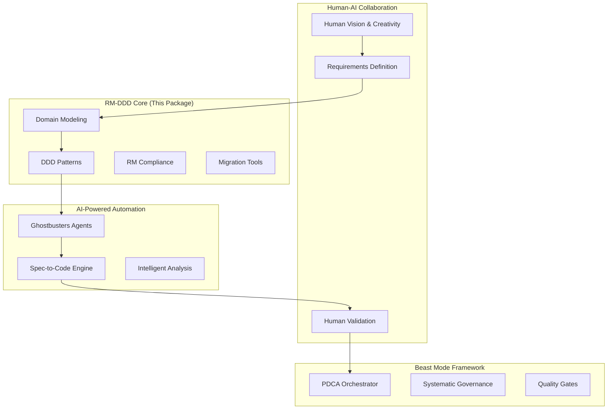

# RM-DDD SDK: Systematic Domain-Driven Development

[](https://badge.fury.io/py/rm-ddd)
[](https://www.python.org/downloads/)
[](https://opensource.org/licenses/MIT)
[](https://rm-ddd.readthedocs.io/en/latest/?badge=latest)

**The foundational package and comprehensive ecosystem entry point for systematic domain-driven development using the Beast Mode framework.**

## 🎯 "The Requirements ARE the Solution"

RM-DDD embodies the core philosophy where comprehensive requirements definition becomes the solution architecture itself. This approach bridges human creativity with AI-powered systematic automation, creating a development ecosystem that increases odds of success while reducing pain and rework.

## 🌟 What Makes RM-DDD Different

### Systematic Superiority Over Ad-Hoc Development

- **Physics-Informed Architecture**: Acknowledges constraints while maximizing success probability
- **Requirements Traceability**: Every implementation traces back to validated requirements  
- **Accountability Chains**: Every component has clear ownership and validation
- **PDCA Integration**: Continuous improvement built into the development process
- **Automated Quality Assurance**: >90% coverage through systematic validation

### Human-AI Collaboration Bridge

*"We're the glue between humans and AI"* - RM-DDD enables:

- **LLMs Need Human Creativity**: AI provides systematic capability, humans provide vision
- **Ghostbusters Enable Human Teams**: AI agents amplify rather than replace human creativity
- **Collaborative Intelligence**: Making AI accessible for creative human collaboration
- **The Real Team is Human**: AI becomes the systematic foundation for human breakthroughs

## 🏗️ Complete Ecosystem Integration

RM-DDD serves as the central hub for the entire Beast Mode systematic development ecosystem:



## 🚀 Quick Start

### Installation

```bash
pip install rm-ddd
```

### Basic Usage

```python
from rm_ddd import DomainEntity, AggregateRoot, DomainService
from rm_ddd.decorators import domain_entity, aggregate_root

@domain_entity("order_management")
class Order(AggregateRoot[str]):
    def __init__(self, order_id: str, customer_id: str):
        super().__init__(order_id, "order_management")
        self.customer_id = customer_id
        self.items = []
        self.status = "pending"
    
    def add_item(self, product_id: str, quantity: int, price: float):
        """Add item to order with domain validation"""
        if quantity <= 0:
            raise ValueError("Quantity must be positive")
        
        self.items.append({
            "product_id": product_id,
            "quantity": quantity,
            "price": price
        })
        
        # Emit domain event
        self.add_domain_event(OrderItemAdded(
            order_id=self.id,
            product_id=product_id,
            quantity=quantity
        ))
    
    def get_domain_boundaries(self):
        return DomainBoundaries(
            context="order_management",
            invariants=["total_amount >= 0", "items not empty when confirmed"]
        )
    
    def validate_domain_invariants(self):
        result = ValidationResult(is_valid=True)
        
        if self.status == "confirmed" and not self.items:
            result.add_error("Confirmed order must have items")
        
        total = sum(item["price"] * item["quantity"] for item in self.items)
        if total < 0:
            result.add_error("Order total cannot be negative")
        
        return result
```

## 📚 Comprehensive Reference Implementations

### Enterprise Migration Scenarios

RM-DDD provides complete, production-ready reference implementations:

1. **E-commerce Platform Migration**: Complete transformation from monolith to systematic architecture
2. **Banking System Modernization**: Regulatory compliance with systematic domain modeling
3. **Healthcare System Integration**: HIPAA compliance with privacy-by-design patterns
4. **Manufacturing IoT Integration**: Real-time processing with systematic event sourcing
5. **Government System Transformation**: Security-first with systematic audit trails

### Multi-Language Ecosystem Consistency

```python
# Python (source of truth)
from rm_ddd.multilang import generate_cross_language_stubs

domain_model = define_ecommerce_domain()
stubs = generate_cross_language_stubs(domain_model, languages=[
    "java", "csharp", "typescript", "go"
])
```

Generated Java equivalent:
```java
@DomainEntity("order_management")
public class Order extends AggregateRoot<String> {
    // Consistent domain model across languages
}
```

## 🎓 DDD Fundamentals: Modeling, Not Deployment

**Critical Clarification**: Domain-Driven Design is fundamentally about modeling and collaboration, not deployment architecture.

### Core DDD Purpose
- **Domain Modeling**: Accurate business reality through systematic patterns
- **Team Collaboration**: Ubiquitous language and bounded contexts for effective communication
- **Complexity Management**: Strategic and tactical patterns for domain complexity

### Common Misconception Correction
- **DDD ≠ Microservices**: Domain boundaries don't automatically imply service boundaries
- **Bounded Contexts ≠ Services**: Contexts are modeling constructs, deployable as modules or services
- **Deployment is Separate**: Architecture driven by operational requirements, not domain boundaries

### Systematic Deployment Decision Framework

RM-DDD provides systematic frameworks for deployment decisions based on:

- **Conway's Law**: Team size and communication patterns
- **Performance Requirements**: Specific scalability and latency needs
- **Technology Diversity**: Different technology stack requirements  
- **Compliance Isolation**: Regulatory and security isolation needs
- **Operational Complexity**: Trade-offs between simplicity and flexibility

**Default Recommendation**: Modular monolith with clear migration paths when systematic triggers justify additional complexity.

## 🛠️ Key Features

### Core RM Layer
- **ReflectiveModule Base Classes**: Automatic RM compliance and health monitoring
- **Health Monitoring System**: Comprehensive module and domain health tracking
- **Registry Integration**: Automatic component discovery and registration
- **Compliance Validation**: Built-in RM compliance checking and reporting

### DDD Pattern Layer
- **Entity Base Classes**: Identity, equality, and domain boundary management
- **Value Object Patterns**: Immutability enforcement and validation
- **Aggregate Root Management**: Consistency boundaries and domain events
- **Domain Service Framework**: Stateless domain logic encapsulation
- **Repository Abstractions**: Clean separation of domain and infrastructure
- **Domain Event System**: Event sourcing and event-driven architecture

### Convenience Layer
- **Decorators & Annotations**: `@domain_entity`, `@aggregate_root`, `@domain_service`
- **Validation Utilities**: Comprehensive domain validation and invariant checking
- **Code Generators**: Automatic generation of boilerplate domain code
- **Complexity Monitoring**: Cognitive complexity tracking and refactoring suggestions

### Multi-Language Support
- **Java Stubs**: Enterprise integration with Spring Boot patterns
- **C# Interfaces**: .NET Core integration with Entity Framework patterns
- **TypeScript Definitions**: Type-safe domain modeling for Node.js
- **Go Interfaces**: Microservices patterns with systematic bounded contexts

## 📖 Documentation

### Getting Started
- [Installation Guide](docs/installation.md)
- [Quick Start Tutorial](docs/quickstart.md)
- [Core Concepts](docs/concepts.md)
- [Ecosystem Overview](docs/ecosystem.md)

### Reference Implementations
- [E-commerce Migration](examples/ecommerce/README.md)
- [Banking System](examples/banking/README.md)
- [Healthcare Integration](examples/healthcare/README.md)
- [Multi-Language Examples](examples/multilang/README.md)

### Advanced Topics
- [Beast Mode Integration](docs/beast-mode-integration.md)
- [Ghostbusters AI Agents](docs/ghostbusters-integration.md)
- [Performance Optimization](docs/performance.md)
- [Security Patterns](docs/security.md)
- [Compliance Framework](docs/compliance.md)

## 🤝 Contributing

We welcome contributions! Please see our [Contributing Guide](CONTRIBUTING.md) for details.

### Development Setup

```bash
git clone https://github.com/beast-mode/rm-ddd.git
cd rm-ddd
pip install -e ".[dev]"
pre-commit install
```

### Running Tests

```bash
pytest
pytest --cov=rm_ddd --cov-report=html
```

## 📄 License

This project is licensed under the MIT License - see the [LICENSE](LICENSE) file for details.

## 🌐 Ecosystem Links

- **Beast Mode Framework**: [beast-mode.dev](https://beast-mode.dev)
- **Ghostbusters AI Agents**: [ghostbusters.dev](https://ghostbusters.dev)
- **Spec-to-Code Engine**: [spec-to-code.dev](https://spec-to-code.dev)
- **Documentation**: [rm-ddd.readthedocs.io](https://rm-ddd.readthedocs.io)

## 💬 Community

- **Discord**: [Join our community](https://discord.gg/beast-mode)
- **GitHub Discussions**: [Share ideas and ask questions](https://github.com/beast-mode/rm-ddd/discussions)
- **Twitter**: [@BeastModeDev](https://twitter.com/BeastModeDev)

---

**"It Just Works"** - Steve Jobs-level reliability through systematic design.

*Physics-informed pragmatism: Increase your odds, save work, pain, and misery.*