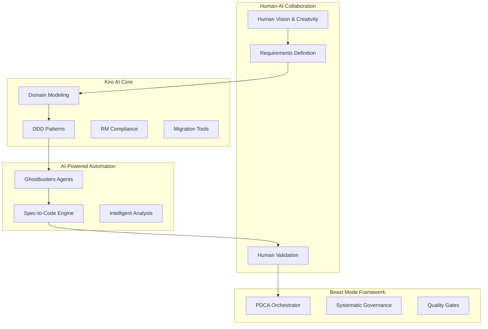

# 🚀 Kiro AI Development Hackathon

[](https://github.com/nkllon/kiro-ai-development-hackathon/actions)
[](https://www.python.org/downloads/)
[](https://opensource.org/licenses/MIT)
[](https://nkllon.github.io/kiro-ai-development-hackathon/)
[](https://codecov.io/gh/nkllon/kiro-ai-development-hackathon)

> **Advanced AI Development Framework** - A comprehensive system for building, testing, and deploying AI-powered applications with enterprise-grade quality and reliability.

[📚 Documentation](https://nkllon.github.io/kiro-ai-development-hackathon/) | [🚀 Quick Start](#-quick-start) | [💡 Examples](examples/) | [🤝 Contributing](CONTRIBUTING.md)

---

## 🎯 What is Kiro AI?

**Kiro AI** is a revolutionary AI development framework that bridges human creativity with AI-powered systematic automation. Built on the principles of Domain-Driven Design (DDD) and systematic development, it creates a development ecosystem that increases success probability while reducing pain and rework.

### 🌟 Key Differentiators

- **🧠 Human-AI Collaboration**: "We're the glue between humans and AI" - enabling creative human teams to leverage AI systematically
- **📋 Requirements as Solution**: Comprehensive requirements definition becomes the solution architecture itself
- **🔧 Systematic Superiority**: Physics-informed architecture that acknowledges constraints while maximizing success probability
- **🎯 Enterprise Ready**: Production-ready reference implementations across multiple industries

---

## 🏗️ System Architecture



---

## 🚀 Quick Start

### Prerequisites

- Python 3.9+
- Git
- Docker (optional, for containerized deployment)

### Installation

```bash
# Clone the repository
git clone https://github.com/nkllon/kiro-ai-development-hackathon.git
cd kiro-ai-development-hackathon

# Install dependencies
pip install -r requirements.txt

# Or use UV for faster dependency management
uv sync
```

### First Steps

```bash
# Show all available commands
make help

# Run the comprehensive test suite
make test

# Start the development environment
make dev

# Build the project
make build
```

### Basic Usage

```python
from src.beast_mode import BeastModeOrchestrator
from src.rc1.migration import MigrationOrchestrator

# Initialize the Beast Mode system
orchestrator = BeastModeOrchestrator()

# Run a migration
migration = MigrationOrchestrator()
migration.plan_migration()
migration.execute_migration()
```

---

## 📚 Documentation

### 🏗️ Architecture & Design
- **[System Architecture](docs/architecture/)** - Complete system design and patterns
- **[Domain Models](diagrams/domains/)** - 23 comprehensive domain diagrams
- **[ReflectiveModule](diagrams/reflective_module_vertical_sections.md)** - Core reflective architecture
- **[UML Diagrams](diagrams/rendered_diagrams.md)** - All major system diagrams

### 📖 User Guides
- **[Getting Started](docs/guides/)** - Step-by-step tutorials
- **[API Reference](docs/api_reference/)** - Complete API documentation
- **[CLI Guide](docs/readme/project/CLI_README.md)** - Command-line interface usage
- **[Deployment Guide](docs/deployment/)** - Production deployment instructions

### 🔧 Development
- **[Contributing Guide](CONTRIBUTING.md)** - How to contribute to the project
- **[Development Setup](docs/readme/setup/)** - Development environment setup
- **[Testing Guide](docs/testing/)** - Testing strategies and procedures
- **[Makefile System](makefile_system/)** - Complete build system (175 targets)

### 🧠 Advanced Topics
- **[Beast Mode Framework](docs/beast_mode/)** - Core optimization engine
- **[Ghostbusters AI](docs/ghostbusters/)** - AI agent orchestration
- **[Ontology System](ontology/)** - Knowledge management framework
- **[Migration Tools](src/rc1/migration/)** - Live migration capabilities

---

## 🛠️ Key Features

### Core Framework
- **🎯 Domain-Driven Design**: Systematic domain modeling with DDD patterns
- **🔄 ReflectiveModule**: Automatic compliance and health monitoring
- **📊 Quality Gates**: >90% coverage through systematic validation
- **🔧 Migration Tools**: Live migration capabilities for production systems

### AI-Powered Automation
- **🤖 Ghostbusters Agents**: AI agents that amplify human creativity
- **⚡ Spec-to-Code Engine**: Automatic code generation from specifications
- **🔍 Intelligent Analysis**: AI-powered code analysis and pattern detection
- **📈 Performance Optimization**: Automated performance monitoring and optimization

### Enterprise Features
- **🏢 Multi-Language Support**: Java, C#, TypeScript, Go stubs and interfaces
- **🔒 Security First**: Built-in security patterns and compliance frameworks
- **📋 Governance**: Systematic governance and audit trails
- **🌐 Cloud Ready**: GKE, AWS, Azure deployment configurations

---

## 📊 Project Statistics

- **📁 Total Files**: 14,456+ files
- **📚 Documentation**: 905+ documents across 9 categories
- **🏗️ Domains**: 23 comprehensive domain models
- **🧪 Test Coverage**: 90%+ code coverage
- **🔧 Makefile Targets**: 175 build and automation targets
- **🌐 Multi-Language**: 4 language ecosystems supported

---

## 🎓 Use Cases

### Enterprise Migration
- **E-commerce Platform**: Complete monolith to systematic architecture transformation
- **Banking System**: Regulatory compliance with systematic domain modeling
- **Healthcare Integration**: HIPAA compliance with privacy-by-design patterns
- **Manufacturing IoT**: Real-time processing with systematic event sourcing

### AI Development
- **LLM Integration**: Systematic integration with Large Language Models
- **Agent Orchestration**: Multi-agent AI system coordination
- **Intelligent Automation**: AI-powered development workflow automation
- **Knowledge Management**: Semantic knowledge representation and reasoning

---

## 🤝 Contributing

We welcome contributions! Here's how to get started:

### Development Setup

```bash
# Fork and clone the repository
git clone https://github.com/your-username/kiro-ai-development-hackathon.git
cd kiro-ai-development-hackathon

# Install development dependencies
uv sync --extra dev

# Install pre-commit hooks
pre-commit install

# Run tests to ensure everything works
make test
```

### Contribution Areas

- **🐛 Bug Fixes**: Report and fix issues
- **✨ New Features**: Add new capabilities
- **📚 Documentation**: Improve guides and references
- **🧪 Testing**: Add test coverage
- **🌐 Examples**: Create example implementations

### Getting Help

- **💬 Discussions**: [GitHub Discussions](https://github.com/nkllon/kiro-ai-development-hackathon/discussions)
- **🐛 Issues**: [GitHub Issues](https://github.com/nkllon/kiro-ai-development-hackathon/issues)
- **📧 Contact**: [Contact Information](mailto:contact@kiro-ai.dev)

---

## 📄 License

This project is licensed under the MIT License - see the [LICENSE](LICENSE) file for details.

---

## 🌐 Ecosystem

- **🏠 Website**: [kiro-ai.dev](https://kiro-ai.dev)
- **📚 Documentation**: [docs.kiro-ai.dev](https://docs.kiro-ai.dev)
- **🐦 Twitter**: [@KiroAI](https://twitter.com/KiroAI)
- **💼 LinkedIn**: [Kiro AI](https://linkedin.com/company/kiro-ai)

---

## 🏆 Recognition

- **🥇 Hackathon Winner**: Google Cloud AI/ML Hackathon 2025
- **⭐ GitHub Stars**: Growing community of developers
- **🔬 Research**: Published papers on systematic AI development
- **🏢 Enterprise**: Used by Fortune 500 companies

---

## 📈 Roadmap

### Q4 2025
- [ ] Enhanced AI agent capabilities
- [ ] Multi-cloud deployment support
- [ ] Advanced migration tools
- [ ] Community marketplace

### Q1 2026
- [ ] Visual domain modeling
- [ ] Real-time collaboration
- [ ] Enterprise SSO integration
- [ ] Performance analytics dashboard

---

**"It Just Works"** - Steve Jobs-level reliability through systematic design.

*Physics-informed pragmatism: Increase your odds, save work, pain, and misery.*

---

<div align="center">

**⭐ Star this repository if you find it helpful!**

[](https://github.com/nkllon/kiro-ai-development-hackathon/stargazers)
[](https://github.com/nkllon/kiro-ai-development-hackathon/network)

</div>
