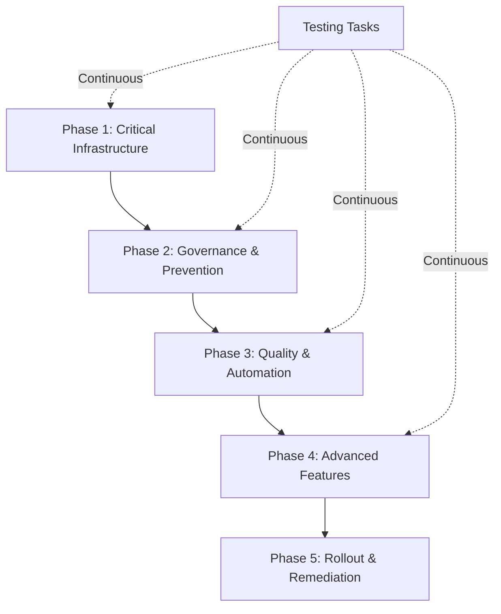
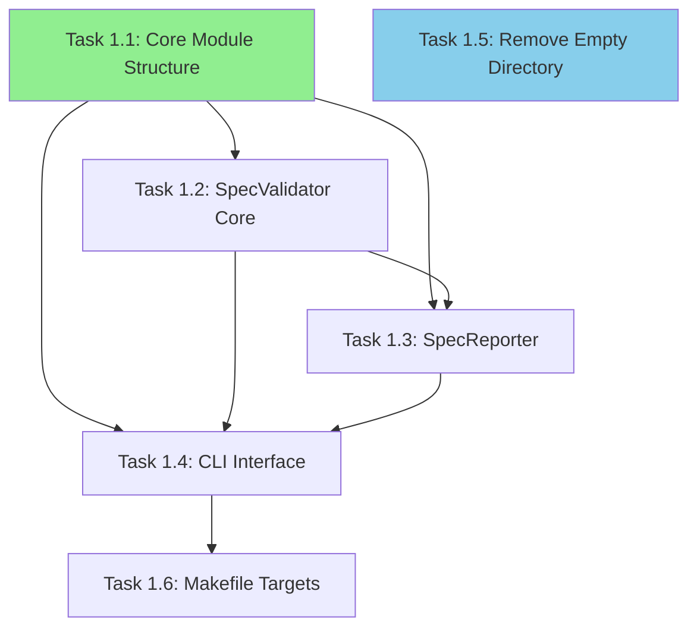
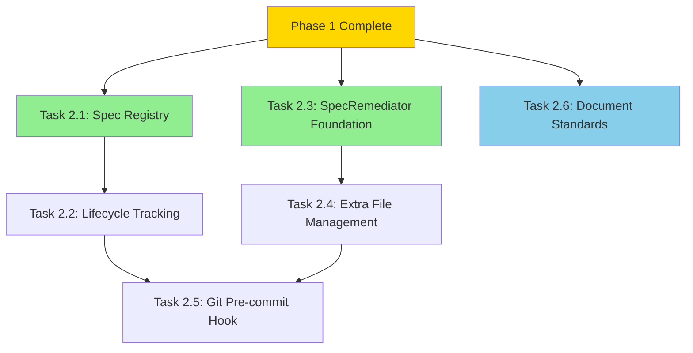
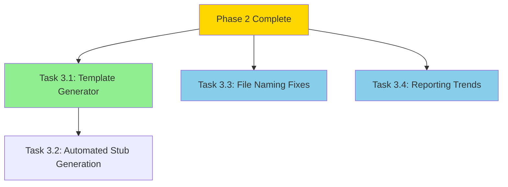
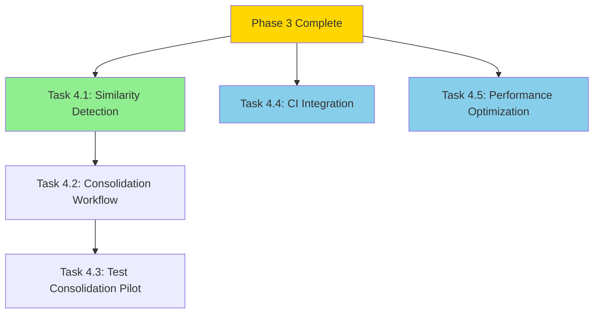
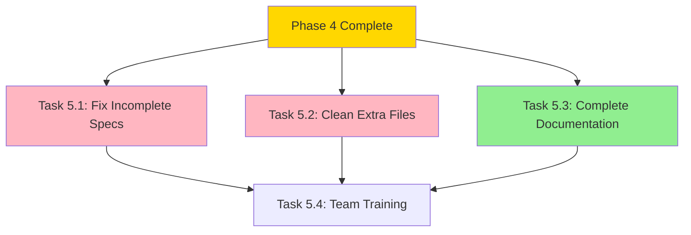
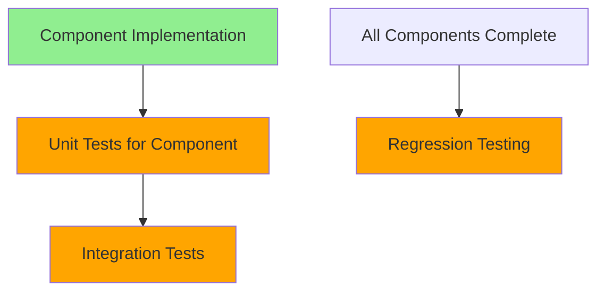
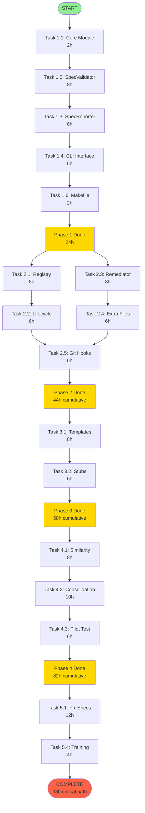

# Spec Consistency Governance - Execution DAG

## DAG Overview

This document defines the Directed Acyclic Graph (DAG) for executing the Spec Inconsistency Resolution System implementation, with task dependencies, parallelization opportunities, and critical path analysis.

---

## Phase Structure



---

## Phase 1: Critical Infrastructure

### Dependency Graph



### Execution Order

**Sequential (Critical Path):**
1. Task 1.1: Core Module Structure *(2h)*
2. Task 1.2: SpecValidator Core *(8h)*
3. Task 1.3: SpecReporter *(6h)*
4. Task 1.4: CLI Interface *(6h)*
5. Task 1.6: Makefile Targets *(2h)*

**Parallel (Independent):**
- Task 1.5: Remove Empty Directory *(1h)* - Can run anytime

**Total Time:** 24h sequential + 1h parallel = **24h** (1h can overlap)

---

## Phase 2: Governance & Prevention

### Dependency Graph



### Execution Order

**Wave 1 (Parallel):**
- Task 2.1: Spec Registry *(8h)*
- Task 2.3: SpecRemediator Foundation *(8h)*
- Task 2.6: Document Standards *(4h)*

**Wave 2 (After Wave 1):**
- Task 2.2: Lifecycle Tracking *(6h)* - depends on 2.1
- Task 2.4: Extra File Management *(6h)* - depends on 2.3

**Wave 3 (After Wave 2):**
- Task 2.5: Git Pre-commit Hook *(6h)* - depends on 2.2, 2.4

**Total Time:** 8h (wave 1) + 6h (wave 2) + 6h (wave 3) = **20h**

---

## Phase 3: Quality & Automation

### Dependency Graph



### Execution Order

**Wave 1 (Parallel):**
- Task 3.1: Template Generator *(8h)*
- Task 3.3: File Naming Fixes *(4h)*
- Task 3.4: Reporting Trends *(6h)*

**Wave 2 (After 3.1):**
- Task 3.2: Automated Stub Generation *(6h)*

**Total Time:** 8h (wave 1) + 6h (wave 2) = **14h**

---

## Phase 4: Advanced Features

### Dependency Graph



### Execution Order

**Wave 1 (Parallel):**
- Task 4.1: Similarity Detection *(8h)*
- Task 4.4: CI Integration *(4h)*
- Task 4.5: Performance Optimization *(6h)*

**Wave 2 (After 4.1):**
- Task 4.2: Consolidation Workflow *(10h)*

**Wave 3 (After 4.2):**
- Task 4.3: Test Consolidation Pilot *(6h)*

**Total Time:** 8h (wave 1) + 10h (wave 2) + 6h (wave 3) = **24h**

---

## Phase 5: Rollout & Remediation

### Dependency Graph



### Execution Order

**Wave 1 (Parallel):**
- Task 5.1: Fix Incomplete Specs *(12h)*
- Task 5.2: Clean Extra Files *(6h)*
- Task 5.3: Complete Documentation *(8h)*

**Wave 2 (After Wave 1):**
- Task 5.4: Team Training *(4h)*

**Total Time:** 12h (wave 1) + 4h (wave 2) = **16h**

---

## Testing Tasks (Continuous)

### Dependency Model



### Execution Pattern

**Per Component (3h average):**
- Unit tests written alongside implementation
- Coverage verified (>90% target)

**After Phase Completion:**
- Integration tests (2h per phase)
- Regression tests (4h at end)

**Total Testing Time:** ~14h spread across phases

---

## Complete DAG - Critical Path Analysis

### Full Dependency Chain



### Critical Path

**Total Duration:** 98 hours on critical path

**Bottlenecks:**
1. Task 1.2 (SpecValidator) - 8h - foundational
2. Task 2.1 (Registry) → 2.2 (Lifecycle) → 2.5 (Hooks) - 20h chain
3. Task 4.2 (Consolidation) - 10h - complex logic
4. Task 5.1 (Fix Specs) - 12h - manual work

---

## Parallelization Opportunities

### Phase 1
- Task 1.5 can run independently anytime (1h saved)

### Phase 2
- **Wave 1:** Tasks 2.1, 2.3, 2.6 run in parallel (saves 12h)
  - 8h + 8h + 4h sequential = 20h
  - Parallel: 8h

### Phase 3
- **Wave 1:** Tasks 3.3, 3.4 run with 3.1 (saves 6h)
  - 8h + 4h + 6h sequential = 18h
  - Parallel: 8h

### Phase 4
- **Wave 1:** Tasks 4.4, 4.5 run with 4.1 (saves 6h)
  - 8h + 4h + 6h sequential = 18h
  - Parallel: 8h

### Phase 5
- **Wave 1:** Tasks 5.2, 5.3 run with 5.1 (saves 6h)
  - 12h + 6h + 8h sequential = 26h
  - Parallel: 12h

**Total Parallelization Savings:** ~31h

**Optimized Duration:** 98h - 31h = **67h (~1.7 weeks full-time, ~3.4 weeks half-time)**

---

## Resource Requirements

### Skills Required
- **Python Development:** Tasks 1.1-1.6, 2.1-2.5, 3.1-3.4, 4.1-4.5
- **Git/DevOps:** Tasks 2.5, 4.4
- **Documentation:** Tasks 2.6, 5.3, 5.4
- **Manual QA:** Tasks 4.3, 5.1, 5.2

### Parallelization Potential
- **2 developers:** Can reduce to ~40h calendar time
- **3+ developers:** Minimal additional benefit due to dependencies

---

## Execution Phases Summary

| Phase | Sequential | Parallel | Duration | Cumulative |
|-------|-----------|----------|----------|------------|
| Phase 1 | 24h | 1h | 24h | 24h |
| Phase 2 | 20h | 12h savings | 20h | 44h |
| Phase 3 | 14h | 6h savings | 14h | 58h |
| Phase 4 | 24h | 6h savings | 24h | 82h |
| Phase 5 | 16h | 6h savings | 16h | 98h |
| **Total** | **98h** | **31h savings** | **67h optimized** | - |

---

## Risk Factors & Mitigation

### High-Risk Tasks (May Exceed Estimates)

**Task 1.2: SpecValidator Core (8h)**
- **Risk:** Complex edge cases in 105 specs
- **Mitigation:** Start with MVP, iterate
- **Buffer:** +4h

**Task 4.2: Consolidation Workflow (10h)**
- **Risk:** Merge logic complexity
- **Mitigation:** Manual fallback option
- **Buffer:** +6h

**Task 5.1: Fix Incomplete Specs (12h)**
- **Risk:** 23 specs need manual review
- **Mitigation:** Prioritize active specs, archive inactive
- **Buffer:** +8h

**Total Risk Buffer:** 18h → **85h pessimistic timeline**

---

## Success Gates

### Phase 1 Gate
- [ ] `make spec-validate` runs successfully
- [ ] Report identifies all 23 incomplete specs
- [ ] Report identifies all 16 specs with extra files
- [ ] Unit test coverage >90%

### Phase 2 Gate
- [ ] Pre-commit hook blocks invalid specs
- [ ] Registry contains all 105 specs
- [ ] Lifecycle states representable
- [ ] Documentation complete

### Phase 3 Gate
- [ ] `make spec-create NAME=test` works
- [ ] Stub generation functional
- [ ] Naming fixes tested on devpost-hackathon-integration
- [ ] Trend reporting functional

### Phase 4 Gate
- [ ] Detects 3 known similar spec pairs
- [ ] Consolidation workflow tested on pilot
- [ ] CI integration functional
- [ ] Performance targets met (<5s validation)

### Phase 5 Gate
- [ ] All 23 incomplete specs have required files
- [ ] All 16 extra file issues resolved
- [ ] Documentation comprehensive
- [ ] Team trained and comfortable

---

## Next Steps

1. **Review this DAG** - Validate dependencies and estimates
2. **Create execution script** - `scripts/execute_spec_consistency_governance_dag.py`
3. **Set up tracking** - Use TodoWrite for task management
4. **Begin Phase 1** - Start with Task 1.1
5. **Daily standups** - Track progress against DAG

---

## DAG Execution Commands

```bash
# Validate DAG structure
make dag-validate SPEC=spec-consistency-governance

# Execute DAG
make dag-execute SPEC=spec-consistency-governance

# Monitor progress
make dag-status SPEC=spec-consistency-governance

# Generate progress report
make dag-report SPEC=spec-consistency-governance
```

---

**Generated:** 2025-10-03
**Total Estimated Effort:** 67h (optimized) / 85h (with buffers)
**Critical Path:** 98h (sequential)
**Recommended Approach:** 2 developers, 2 weeks, following parallelization plan
