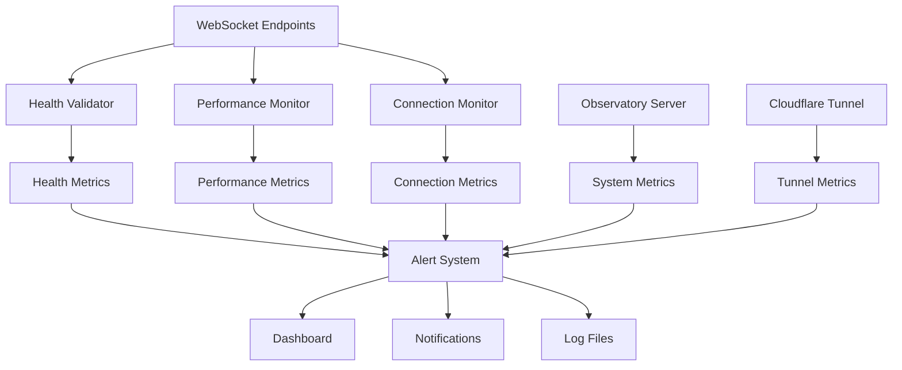

# WebSocket Monitoring Guide
## Observatory WebSocket Infrastructure Monitoring & Alerting

**Target**: observatory.nkllon.com WebSocket infrastructure  
**Purpose**: Comprehensive monitoring and alerting procedures  
**Version**: 1.0  
**Last Updated**: 2025-01-27  

---

## 📋 Table of Contents

1. [Monitoring Architecture](#monitoring-architecture)
2. [Health Monitoring](#health-monitoring)
3. [Performance Monitoring](#performance-monitoring)
4. [Alerting Configuration](#alerting-configuration)
5. [Dashboard Setup](#dashboard-setup)
6. [Metrics Collection](#metrics-collection)
7. [Log Management](#log-management)
8. [Monitoring Procedures](#monitoring-procedures)

---

## 🏗️ Monitoring Architecture

### Monitoring System Overview



### Monitoring Components

| Component | Purpose | Data Source | Collection Frequency |
|-----------|---------|-------------|---------------------|
| Health Validator | WebSocket endpoint health | WebSocket connections | Every 30s |
| Performance Monitor | Latency and throughput | Message flow | Every 30s |
| Connection Monitor | Connection management | Connection pool | Every 30s |
| System Monitor | Resource usage | Observatory server | Every 5min |
| Tunnel Monitor | Tunnel health | Cloudflare tunnel | Every 30s |

---

## 🔍 Health Monitoring

### WebSocket Health Validator

#### Health Check Configuration

```python
# WebSocket Health Validator Configuration
class WebSocketHealthValidator:
    def __init__(self):
        self.endpoints = [
            'wss://observatory.nkllon.com/ws/emoji-rain',
            'wss://observatory.nkllon.com/ws/observatory',
            'wss://observatory.nkllon.com/ws/anomalies',
            'wss://observatory.nkllon.com/ws/doctor-status'
        ]
        
        self.thresholds = {
            'max_latency_ms': 1000,
            'min_throughput_msgs_per_sec': 1.0,
            'max_error_rate': 0.05,
            'connection_timeout_sec': 30
        }
        
        self.check_interval = 30  # seconds
        self.timeout = 10  # seconds
        self.max_retries = 3
```

#### Health Check Procedures

```bash
# Start health monitoring
python scripts/websocket_monitoring.py --daemon --health-monitoring

# Manual health check
python scripts/websocket_monitoring.py --health-check

# Comprehensive health check
python scripts/websocket_monitoring.py --comprehensive-health-check
```

#### Health Metrics

| Metric | Target | Warning | Critical | Collection Method |
|--------|--------|---------|----------|-------------------|
| Endpoint Health | 100% | <95% | <90% | WebSocket handshake |
| Connection Health | 100% | <95% | <90% | Connection validation |
| Service Health | 100% | <95% | <90% | Health endpoint |
| Tunnel Health | 100% | <95% | <90% | Tunnel status |

### Health Status Dashboard

#### Real-Time Health Display

```javascript
// WebSocket Health Dashboard
const HealthDashboard = {
    endpoints: [
        { 
            name: 'emoji-rain', 
            status: 'healthy', 
            latency: '45ms',
            lastCheck: '2025-01-27T10:30:00Z',
            uptime: '99.9%'
        },
        { 
            name: 'observatory', 
            status: 'healthy', 
            latency: '42ms',
            lastCheck: '2025-01-27T10:30:00Z',
            uptime: '99.9%'
        },
        { 
            name: 'anomalies', 
            status: 'healthy', 
            latency: '48ms',
            lastCheck: '2025-01-27T10:30:00Z',
            uptime: '99.9%'
        },
        { 
            name: 'doctor-status', 
            status: 'healthy', 
            latency: '41ms',
            lastCheck: '2025-01-27T10:30:00Z',
            uptime: '99.9%'
        }
    ],
    overall: {
        status: 'operational',
        healthScore: 99.9,
        lastUpdate: '2025-01-27T10:30:00Z'
    }
};
```

---

## 📊 Performance Monitoring

### Performance Metrics Collection

#### Key Performance Indicators

| KPI | Target | Warning | Critical | Collection Frequency |
|-----|--------|---------|----------|---------------------|
| Connection Latency | <100ms | >500ms | >1000ms | Every 30s |
| Message Throughput | >100 msg/sec | <50 msg/sec | <10 msg/sec | Every 30s |
| Connection Success Rate | >99% | <95% | <90% | Every 30s |
| Concurrent Connections | >10 | <5 | <2 | Every 30s |
| Memory Usage | <50MB | >100MB | >200MB | Every 5min |
| CPU Usage | <10% | >20% | >40% | Every 5min |

#### Performance Monitoring Commands

```bash
# Start performance monitoring
python scripts/websocket_monitoring.py --daemon --performance-monitoring

# Test connection latency
python scripts/websocket_monitoring.py --latency-test --iterations 100

# Test message throughput
python scripts/websocket_monitoring.py --throughput-test --duration 60

# Test concurrent connections
python scripts/websocket_monitoring.py --concurrent-test --connections 50
```

### Performance Analysis

#### Latency Analysis

```bash
# Analyze latency patterns
python scripts/websocket_monitoring.py --latency-analysis

# Check latency distribution
python scripts/websocket_monitoring.py --latency-distribution

# Identify latency bottlenecks
python scripts/websocket_monitoring.py --latency-bottlenecks
```

#### Throughput Analysis

```bash
# Analyze throughput patterns
python scripts/websocket_monitoring.py --throughput-analysis

# Check throughput trends
python scripts/websocket_monitoring.py --throughput-trends

# Identify throughput bottlenecks
python scripts/websocket_monitoring.py --throughput-bottlenecks
```

#### Resource Analysis

```bash
# Analyze resource usage
python scripts/monitor_workers.sh --resource-analysis

# Check resource trends
python scripts/monitor_workers.sh --resource-trends

# Identify resource bottlenecks
python scripts/monitor_workers.sh --resource-bottlenecks
```

### Performance Dashboard

#### Real-Time Performance Display

```javascript
// Performance Dashboard
const PerformanceDashboard = {
    metrics: {
        latency: {
            current: '45ms',
            average: '42ms',
            p95: '65ms',
            p99: '120ms',
            trend: 'stable'
        },
        throughput: {
            current: '250 msg/sec',
            average: '245 msg/sec',
            peak: '320 msg/sec',
            trend: 'increasing'
        },
        connections: {
            active: 15,
            peak: 25,
            average: 12,
            trend: 'stable'
        },
        resources: {
            memory: '32MB',
            cpu: '8%',
            disk: '2GB',
            trend: 'stable'
        }
    },
    trends: {
        latency: 'stable',
        throughput: 'increasing',
        connections: 'stable',
        resources: 'stable'
    }
};
```

---

## 🚨 Alerting Configuration

### Alert Categories

#### Critical Alerts

| Alert Type | Trigger | Action | Escalation |
|------------|---------|--------|------------|
| WebSocket Connection Failure | HTTP/2 404 response | Immediate notification | Level 4 (5 min) |
| Service Unavailability | Health endpoint down | Immediate notification | Level 4 (5 min) |
| Performance Threshold Exceeded | Latency >1000ms | Immediate notification | Level 3 (15 min) |
| Resource Exhaustion | Memory >200MB | Immediate notification | Level 3 (15 min) |

#### Warning Alerts

| Alert Type | Trigger | Action | Escalation |
|------------|---------|--------|------------|
| High Latency | Latency >500ms | Performance investigation | Level 2 (1 hour) |
| Low Throughput | Throughput <50 msg/sec | Performance optimization | Level 2 (1 hour) |
| High Error Rate | Error rate >1% | Error analysis | Level 2 (1 hour) |
| Resource Usage Spike | CPU >20% | Resource monitoring | Level 2 (1 hour) |

### Alert Configuration

#### Alert Rules Configuration

```yaml
# Alert Rules Configuration
alerts:
  critical:
    websocket_connection_failure:
      condition: "websocket_status != 'healthy'"
      threshold: 1
      duration: "30s"
      action: "immediate_notification"
      escalation: "level_4"
      
    service_unavailability:
      condition: "health_endpoint_status != 200"
      threshold: 1
      duration: "30s"
      action: "immediate_notification"
      escalation: "level_4"
      
    performance_threshold:
      condition: "latency_ms > 1000"
      threshold: 3
      duration: "2m"
      action: "immediate_notification"
      escalation: "level_3"
      
  warning:
    high_latency:
      condition: "latency_ms > 500"
      threshold: 5
      duration: "5m"
      action: "performance_investigation"
      escalation: "level_2"
      
    low_throughput:
      condition: "throughput_msg_per_sec < 50"
      threshold: 5
      duration: "5m"
      action: "performance_optimization"
      escalation: "level_2"
```

#### Alert Channels

```yaml
# Alert Channels Configuration
alert_channels:
  email:
    enabled: true
    recipients: ["operations@observatory.com", "infrastructure@observatory.com"]
    template: "critical_alert_template"
    
  slack:
    enabled: true
    webhook: "https://hooks.slack.com/services/..."
    channel: "#observatory-alerts"
    
  dashboard:
    enabled: true
    real_time: true
    auto_refresh: 30
    
  log_file:
    enabled: true
    path: "logs/alerts.log"
    format: "json"
```

### Alert Management

#### Alert Testing

```bash
# Test alert configuration
python scripts/websocket_monitoring.py --test-alerts

# Test specific alert
python scripts/websocket_monitoring.py --test-alert websocket_connection_failure

# Test alert channels
python scripts/websocket_monitoring.py --test-alert-channels
```

#### Alert History

```bash
# View alert history
python scripts/websocket_monitoring.py --alert-history --days 7

# Analyze alert patterns
python scripts/websocket_monitoring.py --alert-analysis

# Check alert effectiveness
python scripts/websocket_monitoring.py --alert-effectiveness
```

---

## 📈 Dashboard Setup

### Real-Time Dashboard

#### Dashboard Configuration

```javascript
// Real-Time Dashboard Configuration
const DashboardConfig = {
    refreshInterval: 30000, // 30 seconds
    endpoints: [
        'wss://observatory.nkllon.com/ws/emoji-rain',
        'wss://observatory.nkllon.com/ws/observatory',
        'wss://observatory.nkllon.com/ws/anomalies',
        'wss://observatory.nkllon.com/ws/doctor-status'
    ],
    metrics: [
        'latency',
        'throughput',
        'connections',
        'health',
        'resources'
    ],
    alerts: {
        enabled: true,
        sound: true,
        notifications: true
    }
};
```

#### Dashboard Components

```html
<!-- WebSocket Monitoring Dashboard -->
<div id="websocket-dashboard">
    <div class="dashboard-header">
        <h1>Observatory WebSocket Monitoring</h1>
        <div class="status-indicator" id="overall-status"></div>
    </div>
    
    <div class="metrics-grid">
        <div class="metric-card" id="latency-metric">
            <h3>Latency</h3>
            <div class="metric-value" id="latency-value"></div>
            <div class="metric-trend" id="latency-trend"></div>
        </div>
        
        <div class="metric-card" id="throughput-metric">
            <h3>Throughput</h3>
            <div class="metric-value" id="throughput-value"></div>
            <div class="metric-trend" id="throughput-trend"></div>
        </div>
        
        <div class="metric-card" id="connections-metric">
            <h3>Connections</h3>
            <div class="metric-value" id="connections-value"></div>
            <div class="metric-trend" id="connections-trend"></div>
        </div>
        
        <div class="metric-card" id="health-metric">
            <h3>Health</h3>
            <div class="metric-value" id="health-value"></div>
            <div class="metric-trend" id="health-trend"></div>
        </div>
    </div>
    
    <div class="endpoints-section">
        <h2>WebSocket Endpoints</h2>
        <div class="endpoints-grid" id="endpoints-grid"></div>
    </div>
    
    <div class="alerts-section">
        <h2>Recent Alerts</h2>
        <div class="alerts-list" id="alerts-list"></div>
    </div>
</div>
```

### Historical Dashboard

#### Historical Data Visualization

```javascript
// Historical Dashboard Configuration
const HistoricalDashboard = {
    timeRange: {
        default: '24h',
        options: ['1h', '6h', '24h', '7d', '30d']
    },
    charts: [
        {
            type: 'line',
            metric: 'latency',
            title: 'Connection Latency Over Time'
        },
        {
            type: 'line',
            metric: 'throughput',
            title: 'Message Throughput Over Time'
        },
        {
            type: 'bar',
            metric: 'connections',
            title: 'Concurrent Connections Over Time'
        },
        {
            type: 'area',
            metric: 'health',
            title: 'Health Score Over Time'
        }
    ]
};
```

---

## 📊 Metrics Collection

### Metrics Collection Architecture

#### Collection Agents

```python
# Metrics Collection Agent
class MetricsCollector:
    def __init__(self):
        self.collectors = {
            'websocket': WebSocketMetricsCollector(),
            'system': SystemMetricsCollector(),
            'tunnel': TunnelMetricsCollector(),
            'performance': PerformanceMetricsCollector()
        }
        
    def collect_metrics(self):
        metrics = {}
        for name, collector in self.collectors.items():
            metrics[name] = collector.collect()
        return metrics
```

#### Collection Schedule

| Metric Type | Collection Frequency | Retention Period | Storage Location |
|-------------|---------------------|------------------|-----------------|
| Real-time Metrics | Every 30s | 7 days | Memory + Redis |
| Performance Metrics | Every 5min | 30 days | Database |
| Historical Metrics | Every 1hour | 1 year | Archive |
| Alert Metrics | On-demand | 90 days | Log files |

### Metrics Storage

#### Metrics Database Schema

```sql
-- Metrics Database Schema
CREATE TABLE websocket_metrics (
    id SERIAL PRIMARY KEY,
    timestamp TIMESTAMP DEFAULT CURRENT_TIMESTAMP,
    endpoint VARCHAR(255),
    latency_ms FLOAT,
    throughput_msg_per_sec FLOAT,
    connection_count INTEGER,
    health_score FLOAT,
    memory_usage_mb FLOAT,
    cpu_usage_percent FLOAT
);

CREATE TABLE alert_history (
    id SERIAL PRIMARY KEY,
    timestamp TIMESTAMP DEFAULT CURRENT_TIMESTAMP,
    alert_type VARCHAR(255),
    severity VARCHAR(50),
    message TEXT,
    resolved_at TIMESTAMP,
    resolution_notes TEXT
);
```

#### Metrics Aggregation

```bash
# Aggregate metrics by hour
python scripts/aggregate_metrics.py --interval hourly

# Aggregate metrics by day
python scripts/aggregate_metrics.py --interval daily

# Generate metrics reports
python scripts/generate_metrics_report.py --period weekly
```

---

## 📝 Log Management

### Log Collection

#### Log Sources

| Log Source | Location | Format | Rotation |
|------------|----------|--------|----------|
| Observatory Server | `logs/observatory.log` | JSON | Daily |
| Cloudflare Tunnel | `logs/cloudflared.log` | Text | Daily |
| WebSocket Monitoring | `logs/websocket_monitoring.log` | JSON | Daily |
| Alert History | `logs/alerts.log` | JSON | Weekly |

#### Log Collection Commands

```bash
# Collect Observatory server logs
tail -f logs/observatory.log | python scripts/log_processor.py

# Collect tunnel logs
tail -f logs/cloudflared.log | python scripts/log_processor.py

# Collect monitoring logs
tail -f logs/websocket_monitoring.log | python scripts/log_processor.py
```

### Log Analysis

#### Log Analysis Tools

```bash
# Analyze WebSocket logs
python scripts/log_analyzer.py --source websocket --period 24h

# Analyze error patterns
python scripts/log_analyzer.py --errors --period 7d

# Analyze performance logs
python scripts/log_analyzer.py --performance --period 24h
```

#### Log Search

```bash
# Search for specific errors
grep -i "websocket.*error" logs/observatory.log

# Search for performance issues
grep -i "latency.*high" logs/websocket_monitoring.log

# Search for connection issues
grep -i "connection.*failed" logs/cloudflared.log
```

---

## 🔧 Monitoring Procedures

### Daily Monitoring

#### Morning Health Check

```bash
# Check overall system health
python scripts/websocket_monitoring.py --status

# Review overnight alerts
python scripts/websocket_monitoring.py --alert-history --hours 12

# Check performance metrics
python scripts/websocket_monitoring.py --performance-summary
```

#### Midday Monitoring

```bash
# Check real-time metrics
python scripts/websocket_monitoring.py --real-time-check

# Analyze connection patterns
python scripts/websocket_monitoring.py --connection-analysis

# Review resource usage
python scripts/monitor_workers.sh --resource-check
```

#### Evening Review

```bash
# Generate daily report
python scripts/websocket_monitoring.py --daily-report

# Review performance trends
python scripts/websocket_monitoring.py --trend-analysis --hours 24

# Check alert effectiveness
python scripts/websocket_monitoring.py --alert-effectiveness
```

### Weekly Monitoring

#### Performance Analysis

```bash
# Weekly performance analysis
python scripts/websocket_monitoring.py --weekly-analysis

# Capacity analysis
python scripts/monitor_workers.sh --capacity-analysis

# Trend analysis
python scripts/websocket_monitoring.py --trend-analysis --days 7
```

#### Monitoring Optimization

```bash
# Optimize monitoring configuration
python scripts/websocket_monitoring.py --optimize-monitoring

# Review alert thresholds
python scripts/websocket_monitoring.py --review-alert-thresholds

# Update monitoring procedures
python scripts/websocket_monitoring.py --update-procedures
```

### Monthly Monitoring

#### Comprehensive Review

```bash
# Monthly comprehensive review
python scripts/websocket_monitoring.py --monthly-review

# Performance optimization review
python scripts/websocket_monitoring.py --optimization-review

# Monitoring system health check
python scripts/websocket_monitoring.py --monitoring-health-check
```

#### Monitoring Improvements

```bash
# Identify monitoring improvements
python scripts/websocket_monitoring.py --identify-improvements

# Implement monitoring enhancements
python scripts/websocket_monitoring.py --implement-enhancements

# Update monitoring documentation
python scripts/websocket_monitoring.py --update-documentation
```

---

## 📋 Monitoring Checklist

### Daily Checklist

- [ ] **System Health Check**
  - [ ] Check overall system status
  - [ ] Review overnight alerts
  - [ ] Validate monitoring systems

- [ ] **Performance Monitoring**
  - [ ] Check real-time metrics
  - [ ] Analyze connection patterns
  - [ ] Review resource usage

- [ ] **Alert Management**
  - [ ] Review alert history
  - [ ] Check alert effectiveness
  - [ ] Update alert thresholds if needed

### Weekly Checklist

- [ ] **Performance Analysis**
  - [ ] Weekly performance analysis
  - [ ] Capacity analysis
  - [ ] Trend analysis

- [ ] **Monitoring Optimization**
  - [ ] Optimize monitoring configuration
  - [ ] Review alert thresholds
  - [ ] Update monitoring procedures

- [ ] **System Maintenance**
  - [ ] Clean up old logs
  - [ ] Update monitoring scripts
  - [ ] Validate monitoring data

### Monthly Checklist

- [ ] **Comprehensive Review**
  - [ ] Monthly comprehensive review
  - [ ] Performance optimization review
  - [ ] Monitoring system health check

- [ ] **Monitoring Improvements**
  - [ ] Identify monitoring improvements
  - [ ] Implement monitoring enhancements
  - [ ] Update monitoring documentation

- [ ] **Capacity Planning**
  - [ ] Analyze capacity trends
  - [ ] Plan for growth
  - [ ] Update capacity planning

---

## 📞 Support & Escalation

### Monitoring Support

| Level | Role | Contact | Response Time |
|-------|------|---------|---------------|
| L1 | Monitoring Team | monitoring@observatory.com | 1 hour |
| L2 | Infrastructure Team | infrastructure@observatory.com | 30 minutes |
| L3 | Senior Engineer | senior@observatory.com | 15 minutes |
| L4 | On-call Engineer | oncall@observatory.com | 5 minutes |

### Escalation Procedures

#### Monitoring Issues

1. **Alert System Failure**
   - Immediate notification to monitoring team
   - Escalation to infrastructure team if not resolved in 30 minutes
   - Emergency procedures if critical alerts fail

2. **Dashboard Issues**
   - Notification to monitoring team
   - Escalation to infrastructure team if not resolved in 1 hour
   - Alternative monitoring methods if dashboard unavailable

3. **Metrics Collection Issues**
   - Immediate investigation by monitoring team
   - Escalation to infrastructure team if not resolved in 30 minutes
   - Manual monitoring procedures if automated collection fails

---

*This monitoring guide is maintained as part of the Observatory WebSocket infrastructure and should be updated whenever monitoring procedures change.*

**Last Updated**: 2025-01-27  
**Next Review**: 2025-02-27  
**Version**: 1.0