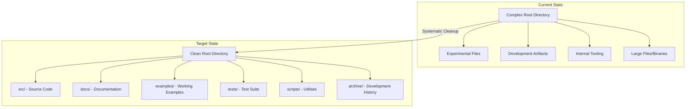

# Project Cleanup for Public Use - Design Document

## Overview

The Beast Mode AI Development Framework requires systematic cleanup and organization to transform from a complex hackathon project with 100+ implementations into a clean, professional, and user-friendly open-source project. This design addresses the comprehensive reorganization needed to make the project accessible to the general public while preserving its powerful capabilities and maintaining its hackathon submission requirements.

## Architecture

### High-Level Architecture



### Cleanup Strategy Architecture

The cleanup process follows a systematic approach with multiple phases:

1. **Discovery Phase**: Automated scanning and classification of all files
2. **Organization Phase**: Systematic reorganization into proper structure
3. **Documentation Phase**: Creation of comprehensive user-facing documentation
4. **Validation Phase**: Testing and verification of cleaned structure
5. **Security Phase**: Credential scanning and sensitive data removal

## Components and Interfaces

### 1. File Classification System

**Purpose**: Automatically categorize files for appropriate handling

**Interface**:
```python
class FileClassifier:
    def classify_file(self, file_path: str) -> FileCategory
    def get_cleanup_action(self, category: FileCategory) -> CleanupAction
    def generate_cleanup_plan(self, directory: str) -> CleanupPlan
```

**Categories**:
- **Keep in Root**: Essential files (README, LICENSE, requirements.txt)
- **Move to src/**: Source code and modules
- **Move to docs/**: Documentation files
- **Move to examples/**: Working examples and demos
- **Move to tests/**: Test files and fixtures
- **Move to scripts/**: Utility scripts
- **Archive**: Development artifacts and experimental code
- **Delete**: Temporary files, build artifacts, logs
- **Security Review**: Files that may contain credentials

### 2. Documentation Generator

**Purpose**: Create comprehensive user-facing documentation

**Interface**:
```python
class DocumentationGenerator:
    def generate_main_readme(self, project_info: ProjectInfo) -> str
    def create_installation_guide(self) -> str
    def generate_quick_start(self) -> str
    def create_api_documentation(self) -> str
    def build_examples_index(self) -> str
```

**Components**:
- **README Generator**: Creates compelling main README with clear value proposition
- **Installation Guide**: Step-by-step setup instructions
- **Quick Start Guide**: 5-minute getting started experience
- **API Documentation**: Comprehensive API reference
- **Examples Index**: Catalog of working examples with descriptions

### 3. Example System

**Purpose**: Provide working demonstrations of key features

**Interface**:
```python
class ExampleManager:
    def create_quick_start_example(self) -> Example
    def build_ai_memory_palace_demo(self) -> Example
    def create_dag_orchestration_example(self) -> Example
    def generate_reflective_module_example(self) -> Example
    def validate_all_examples(self) -> ValidationResults
```

**Example Categories**:
- **Quick Start**: Minimal working example (< 5 minutes)
- **AI Memory Palace**: Demonstration of knowledge management
- **DAG Orchestration**: Task dependency and execution examples
- **ReflectiveModule Pattern**: Observability and health monitoring
- **Beast Mode Framework**: Complete system demonstration

### 4. Security Scanner

**Purpose**: Identify and remove sensitive information

**Interface**:
```python
class SecurityScanner:
    def scan_for_credentials(self, directory: str) -> List[SecurityIssue]
    def scan_for_sensitive_data(self, directory: str) -> List[SecurityIssue]
    def generate_security_report(self) -> SecurityReport
    def create_remediation_plan(self, issues: List[SecurityIssue]) -> RemediationPlan
```

**Scan Types**:
- **Credential Detection**: API keys, passwords, tokens
- **Sensitive Data**: Personal information, internal URLs
- **Configuration Files**: Environment files with secrets
- **Log Files**: Logs containing sensitive information

### 5. Installation System

**Purpose**: Simplify setup and dependency management

**Interface**:
```python
class InstallationManager:
    def create_requirements_files(self) -> Dict[str, str]
    def generate_setup_script(self) -> str
    def create_docker_setup(self) -> DockerConfig
    def build_validation_tests(self) -> TestSuite
```

**Components**:
- **Dependency Management**: Clean requirements.txt with minimal dependencies
- **Setup Scripts**: Automated installation and configuration
- **Docker Support**: Containerized deployment options
- **Validation Tests**: Verify installation success

## Data Models

### Project Structure Model

```python
@dataclass
class ProjectStructure:
    root_files: List[str]          # Essential root-level files
    source_directories: Dict[str, str]  # src/ organization
    documentation: Dict[str, str]   # docs/ structure
    examples: List[Example]        # Working examples
    tests: Dict[str, str]          # Test organization
    scripts: List[str]             # Utility scripts
    archived_items: List[str]      # Development artifacts
```

### Cleanup Plan Model

```python
@dataclass
class CleanupPlan:
    files_to_move: Dict[str, str]     # source -> destination
    files_to_delete: List[str]        # Files to remove
    files_to_archive: List[str]       # Development artifacts
    security_issues: List[SecurityIssue]  # Sensitive data
    documentation_needed: List[str]   # Missing docs
    examples_to_create: List[str]     # Required examples
```

### Example Model

```python
@dataclass
class Example:
    name: str
    description: str
    category: str
    files: List[str]
    dependencies: List[str]
    setup_instructions: str
    expected_output: str
    validation_script: str
```

## Error Handling

### Cleanup Process Error Handling

**Strategy**: Fail-safe approach with comprehensive rollback capabilities

**Error Categories**:
1. **File System Errors**: Permission issues, disk space, file locks
2. **Security Issues**: Credential exposure, sensitive data detection
3. **Dependency Errors**: Missing dependencies, version conflicts
4. **Validation Failures**: Broken examples, failed tests

**Error Handling Patterns**:

```python
class CleanupError(Exception):
    """Base exception for cleanup operations"""
    pass

class SecurityViolationError(CleanupError):
    """Raised when security issues are detected"""
    pass

class ValidationError(CleanupError):
    """Raised when validation fails"""
    pass

def safe_cleanup_operation(operation: Callable) -> Result:
    """Execute cleanup operation with comprehensive error handling"""
    try:
        backup_state = create_backup()
        result = operation()
        validate_result(result)
        return Success(result)
    except SecurityViolationError as e:
        restore_backup(backup_state)
        return SecurityFailure(e)
    except ValidationError as e:
        restore_backup(backup_state)
        return ValidationFailure(e)
    except Exception as e:
        restore_backup(backup_state)
        return UnexpectedFailure(e)
```

### Rollback Strategy

**Backup System**: Complete state backup before any modifications
**Incremental Rollback**: Ability to undo individual operations
**Validation Gates**: Verify each step before proceeding
**Recovery Procedures**: Documented recovery from any failure state

## Testing Strategy

### Multi-Level Testing Approach

#### 1. Unit Tests
- **File Classification**: Test file categorization accuracy
- **Documentation Generation**: Verify generated content quality
- **Security Scanning**: Validate credential detection
- **Example Creation**: Test example generation and validation

#### 2. Integration Tests
- **End-to-End Cleanup**: Full cleanup process validation
- **Installation Testing**: Verify setup procedures work
- **Example Execution**: All examples run successfully
- **Documentation Accuracy**: Generated docs match implementation

#### 3. User Acceptance Tests
- **New User Experience**: Fresh clone to working system in < 10 minutes
- **Developer Onboarding**: Contributor can understand and extend
- **Example Effectiveness**: Examples demonstrate key capabilities
- **Documentation Completeness**: All questions answered in docs

#### 4. Security Tests
- **Credential Scanning**: No sensitive data in public repository
- **Access Control**: Proper permissions and security boundaries
- **Dependency Security**: No vulnerable dependencies
- **Configuration Safety**: Secure default configurations

### Testing Infrastructure

```python
class CleanupTestSuite:
    def test_file_classification_accuracy(self)
    def test_documentation_generation(self)
    def test_example_functionality(self)
    def test_security_scanning(self)
    def test_installation_process(self)
    def test_user_experience_flow(self)
    def test_rollback_procedures(self)
```

## Performance Considerations

### Cleanup Performance

**File Processing**: Parallel processing for large file sets
**Memory Management**: Streaming processing for large files
**Disk I/O Optimization**: Batch operations and efficient copying
**Progress Tracking**: Real-time progress reporting

### Repository Size Optimization

**Target Size**: < 500MB total repository size
**Binary Removal**: Archive or remove large binary files
**History Cleanup**: Consider git history cleanup for sensitive data
**Compression**: Use git LFS for necessary large files

### Installation Performance

**Dependency Optimization**: Minimal required dependencies
**Parallel Installation**: Concurrent dependency resolution
**Caching Strategy**: Cache common dependencies and artifacts
**Validation Speed**: Fast validation tests (< 5 minutes)

## Security Considerations

### Credential Management

**Detection Strategy**: Multi-pattern credential scanning
**Remediation Process**: Automatic credential removal and replacement
**Prevention Measures**: Pre-commit hooks and CI/CD scanning
**Documentation**: Clear guidance on secure credential management

### Sensitive Data Handling

**Data Classification**: Automatic sensitive data detection
**Removal Process**: Secure deletion of sensitive information
**Audit Trail**: Complete record of security remediation
**Compliance**: Ensure compliance with security best practices

### Access Control

**Repository Permissions**: Proper GitHub repository settings
**Contributor Guidelines**: Clear security requirements for contributors
**Review Process**: Security review for all contributions
**Monitoring**: Ongoing security monitoring and alerts

## Deployment Strategy

### Phased Deployment Approach

#### Phase 1: Preparation and Backup
- Complete repository backup
- Security scan and remediation
- File classification and planning
- Stakeholder communication

#### Phase 2: Core Cleanup
- File reorganization and movement
- Directory structure creation
- Basic documentation generation
- Initial validation

#### Phase 3: Documentation and Examples
- Comprehensive documentation creation
- Working example development
- Installation guide creation
- User experience testing

#### Phase 4: Validation and Release
- Complete system validation
- Security verification
- Performance testing
- Public release preparation

### Rollback Plan

**Backup Strategy**: Complete git repository backup
**Incremental Rollback**: Ability to undo individual phases
**Validation Gates**: Go/no-go decisions at each phase
**Recovery Procedures**: Documented recovery from any failure

## Monitoring and Observability

### Cleanup Process Monitoring

**Progress Tracking**: Real-time progress reporting
**Error Detection**: Immediate error notification
**Performance Metrics**: Processing speed and resource usage
**Quality Metrics**: Validation results and success rates

### Post-Cleanup Monitoring

**Repository Health**: Ongoing repository size and structure monitoring
**User Experience**: New user onboarding success rates
**Example Functionality**: Continuous validation of working examples
**Security Posture**: Ongoing security scanning and monitoring

## Design Decisions and Rationales

### 1. Systematic vs. Manual Cleanup

**Decision**: Implement systematic, automated cleanup process
**Rationale**: 
- Ensures consistency and completeness
- Reduces human error and oversight
- Provides repeatable and auditable process
- Enables rollback and recovery capabilities

### 2. Archive vs. Delete Development Artifacts

**Decision**: Archive development artifacts rather than delete
**Rationale**:
- Preserves development history and lessons learned
- Maintains hackathon submission integrity
- Allows future reference and learning
- Provides safety net for important discoveries

### 3. Comprehensive Documentation Strategy

**Decision**: Generate comprehensive, user-focused documentation
**Rationale**:
- Reduces barrier to entry for new users
- Demonstrates project value and capabilities
- Supports community adoption and contribution
- Meets professional open-source standards

### 4. Working Examples as Primary Documentation

**Decision**: Prioritize working examples over theoretical documentation
**Rationale**:
- Provides immediate value demonstration
- Enables learning by doing
- Validates system functionality
- Reduces time to first success

### 5. Security-First Approach

**Decision**: Implement comprehensive security scanning and remediation
**Rationale**:
- Protects against credential exposure
- Ensures compliance with security best practices
- Builds trust with users and contributors
- Prevents security incidents and reputation damage

### 6. Fail-Safe Cleanup Process

**Decision**: Implement comprehensive backup and rollback capabilities
**Rationale**:
- Protects against data loss during cleanup
- Enables experimentation with confidence
- Provides recovery from unexpected issues
- Maintains system integrity throughout process

This design provides a comprehensive, systematic approach to transforming the Beast Mode AI Development Framework into a clean, professional, and user-friendly open-source project while preserving its powerful capabilities and maintaining its hackathon submission requirements.