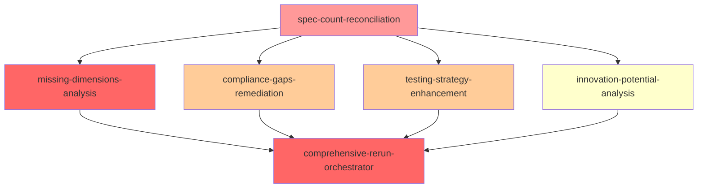

# Phase 5D2 Gap Mitigation DAG System

## Overview

This DAG (Directed Acyclic Graph) system orchestrates the complete remediation of Phase 5D2 dimension coverage validation failures. It manages 6 interconnected tasks with proper dependency management and parallel execution capabilities.

## Problem Statement

Phase 5D2 failed with only 45.5% dimension coverage due to:
- **Missing Foundational Dimensions**: 12 dimensions (1-12) completely absent
- **Spec Count Discrepancy**: 114 specs in inventory vs 107 analyzed  
- **Critical Compliance Gaps**: 74.8% of specs have poor regulatory compliance
- **Poor Testing Coverage**: 45.3 average score (POOR rating)
- **Low Innovation Potential**: 21.0 average score (POOR rating)

## DAG Structure



**Legend:**
- 🔴 Red: CRITICAL priority tasks
- 🟠 Orange: HIGH priority tasks  
- 🟡 Yellow: MEDIUM priority tasks

## Files in This DAG System

### Core DAG Files
- **`phase-5d2-dag-config.yaml`** - Complete DAG configuration with dependencies, resources, and success criteria
- **`execute-phase-5d2-dag.py`** - Python DAG executor with async parallel execution
- **`Makefile.phase-5d2-dag`** - Convenient make targets for DAG operations

### Task Prompt Files
1. **`phase-5d2-spec-count-reconciliation.md`** - Resolve 114 vs 107 spec discrepancy (2-4h)
2. **`phase-5d2-missing-dimensions-analysis.md`** - Complete dimensions 1-12 analysis (40-60h)
3. **`phase-5d2-compliance-gaps-remediation.md`** - Address compliance gaps (20-30h)
4. **`phase-5d2-testing-strategy-enhancement.md`** - Improve testing strategies (15-20h)
5. **`phase-5d2-innovation-potential-analysis.md`** - Enhance innovation potential (12-15h)
6. **`phase-5d2-comprehensive-rerun-orchestrator.md`** - Orchestrate Phase 5D2 rerun (8-12h)

### Documentation
- **`phase-5d2-gap-mitigation-summary.md`** - Complete overview and execution strategy
- **`README-phase-5d2-dag.md`** - This file

## Quick Start

### Prerequisites
```bash
# Check prerequisites
make -f prompts/staging/Makefile.phase-5d2-dag check-prerequisites

# Validate DAG structure
make -f prompts/staging/Makefile.phase-5d2-dag validate-dag
```

### Execute DAG
```bash
# Full execution (60-80 hours with parallelization)
make -f prompts/staging/Makefile.phase-5d2-dag execute-dag

# Or dry run for testing
make -f prompts/staging/Makefile.phase-5d2-dag dry-run
```

### Monitor Progress
```bash
# Check execution status
make -f prompts/staging/Makefile.phase-5d2-dag status

# View logs
make -f prompts/staging/Makefile.phase-5d2-dag logs

# Show task details
make -f prompts/staging/Makefile.phase-5d2-dag tasks
```

## Execution Strategy

### Phase 1: Foundation (Sequential - 2-4 hours)
- **spec-count-reconciliation**: Must complete first to establish accurate spec inventory
- **Blocks**: All other analyses until resolved

### Phase 2: Parallel Gap Mitigation (40-60 hours wall clock)
Can run simultaneously after Phase 1:
- **missing-dimensions-analysis**: Critical path, largest effort
- **compliance-gaps-remediation**: High priority quality enhancement
- **testing-strategy-enhancement**: High priority quality enhancement  
- **innovation-potential-analysis**: Medium priority enhancement

### Phase 3: Integration and Orchestration (8-12 hours)
- **comprehensive-rerun-orchestrator**: Integrates all results and executes Phase 5D2 rerun

## Resource Requirements

### Computational Resources
- **Large Compute**: Required for missing dimensions analysis (40-60 hours)
- **Standard Compute**: Sufficient for other quality enhancement tasks
- **Orchestration Tools**: Required for final integration and validation

### Expertise Requirements
- **Spec Analysis**: Deep understanding of specification structure
- **Compliance Expertise**: Knowledge of regulatory requirements
- **Testing Strategy**: Experience with comprehensive testing approaches
- **Innovation Assessment**: Understanding of emerging technologies

### Timeline Options
- **Sequential Execution**: 89-111 hours over 4-5 weeks
- **Parallel Execution**: 60-80 hours wall clock over 2-3 weeks
- **Critical Path**: 42-64 hours (reconciliation + missing dimensions)

## Success Criteria

### Before Gap Mitigation (Current State)
- ❌ Dimension Coverage: 45.5% (10/22 dimensions)
- ❌ Spec Coverage: 93.9% (107/114 specs)
- ❌ Average Quality: 54.2 (below 70 target)
- ❌ Compliance: 11.7 average (CRITICAL)
- ❌ Testing: 45.3 average (POOR)
- ❌ Innovation: 21.0 average (POOR)

### After Gap Mitigation (Target State)
- ✅ Dimension Coverage: 100% (22/22 dimensions)
- ✅ Spec Coverage: 100% (all specs analyzed)
- ✅ Average Quality: >70 (meets target)
- ✅ Compliance: >70 average (GOOD)
- ✅ Testing: >75 average (GOOD)
- ✅ Innovation: >60 average (MODERATE)

## DAG Features

### Dependency Management
- **Mathematical Validation**: Ensures no circular dependencies
- **Topological Ordering**: Guarantees valid execution sequence
- **Parallel Optimization**: Maximizes concurrent execution where possible

### Error Handling
- **Retry Logic**: Exponential backoff for transient failures
- **Failure Isolation**: Non-critical failures don't block entire DAG
- **Graceful Degradation**: Continues execution where possible

### Monitoring and Observability
- **Structured Logging**: Complete audit trail of all operations
- **Progress Tracking**: Real-time status updates
- **Success Validation**: Automated verification of success criteria
- **Performance Metrics**: Duration and resource usage tracking

### Quality Assurance
- **Pre-flight Validation**: DAG structure validation before execution
- **Success Criteria Checking**: Automated validation of task outputs
- **Integration Testing**: Validates compatibility of all results
- **Final Validation**: Comprehensive success verification

## Advanced Usage

### Custom Configuration
```bash
# Use custom config file
python3 prompts/staging/execute-phase-5d2-dag.py --config custom-config.yaml

# Override specific parameters
python3 prompts/staging/execute-phase-5d2-dag.py --max-parallel 2 --timeout 48
```

### Partial Execution
```bash
# Execute only specific tasks
python3 prompts/staging/execute-phase-5d2-dag.py --tasks spec-count-reconciliation,compliance-gaps-remediation

# Resume from specific point
python3 prompts/staging/execute-phase-5d2-dag.py --resume-from missing-dimensions-analysis
```

### Development and Testing
```bash
# Validate configuration only
python3 prompts/staging/execute-phase-5d2-dag.py --validate-only

# Dry run with detailed output
python3 prompts/staging/execute-phase-5d2-dag.py --dry-run --verbose

# Generate execution plan
python3 prompts/staging/execute-phase-5d2-dag.py --plan-only
```

## Troubleshooting

### Common Issues

#### DAG Validation Failures
```bash
# Check for circular dependencies
make -f prompts/staging/Makefile.phase-5d2-dag validate-dag

# Visualize DAG structure
make -f prompts/staging/Makefile.phase-5d2-dag visualize
```

#### Task Execution Failures
```bash
# Check detailed logs
make -f prompts/staging/Makefile.phase-5d2-dag logs

# Review task status
make -f prompts/staging/Makefile.phase-5d2-dag status

# Retry specific task
python3 prompts/staging/execute-phase-5d2-dag.py --retry task-name
```

#### Resource Constraints
```bash
# Reduce parallelism
python3 prompts/staging/execute-phase-5d2-dag.py --max-parallel 1

# Increase timeout
python3 prompts/staging/execute-phase-5d2-dag.py --timeout 72
```

### Emergency Procedures
```bash
# Emergency stop
make -f prompts/staging/Makefile.phase-5d2-dag stop

# Clean and restart
make -f prompts/staging/Makefile.phase-5d2-dag clean
make -f prompts/staging/Makefile.phase-5d2-dag execute-dag
```

## Integration with Existing Systems

### Beast Mode Framework
- Uses `ReflectiveModule` pattern for observability
- Integrates with existing health monitoring
- Follows systematic development principles

### Kiro Specs System
- Reads from `.kiro/specs/` directory
- Maintains spec structure and conventions
- Updates specifications systematically

### Reporting and Analytics
- Generates reports in `.kiro/reports/phase-5d2-gap-mitigation/`
- Compatible with existing reporting frameworks
- Provides structured data for further analysis

## Next Steps After Successful Execution

1. **Validate Results**: Confirm all success criteria are met
2. **Re-run Phase 5D2**: Execute dimension coverage validation with complete data
3. **Proceed to Phase 5D3**: Begin CMS integration validation
4. **Document Lessons**: Capture learnings for future gap mitigation efforts

## Support and Maintenance

### Monitoring
- Check execution logs regularly
- Monitor resource usage and performance
- Validate success criteria after each run

### Updates
- Update task prompts based on lessons learned
- Enhance DAG configuration for better performance
- Add new tasks as requirements evolve

### Documentation
- Keep README updated with new features
- Document any configuration changes
- Maintain troubleshooting guide

---

**This DAG system provides a systematic, reliable approach to addressing all Phase 5D2 failures and enabling successful constellation elaboration progression.**