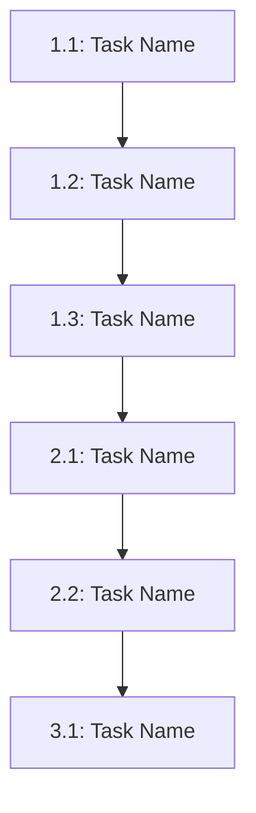

# Phase 4: Bootstrap Layer Task Breakdown

## Objective

Create comprehensive tasks.md files with execution DAGs for all Bootstrap Layer specifications.

## Standard Task Structure

```markdown
# [Spec Name] Tasks

## Task Overview

**Total Estimated Effort:** [person-weeks]
**Critical Path:** [Yes/No]
**Implementation Phases:** [number]

## Task Breakdown

### Phase 1: [Phase Name]

#### Task 1.1: [Task Name]

**Description:** [What needs to be done]

**Dependencies:**
- Upstream: [Tasks that must complete first]
- Specs: [Other specs that must be complete]

**Deliverables:**
- [Specific outputs]

**Acceptance Criteria:**
1. GIVEN [context] WHEN [action] THEN [outcome]
2. [...]

**Estimated Effort:** [hours/days]

**Testing Requirements:**
- Unit tests: [Coverage target]
- Integration tests: [Key scenarios]
- Validation: [How to verify completion]

**CMS Integration:** [If applicable]
- [CMS operations needed for this task]

[Repeat for all tasks]

## Task Dependency DAG



## Implementation Sequence

### Parallel Track 1
- Task 1.1 → Task 1.2 → Task 1.3

### Parallel Track 2
- Task 2.1 → Task 2.2

### Synchronization Point
- Wait for Tracks 1 & 2 → Task 3.1

## Resource Requirements

**Skills Required:**
- Python development
- Docker/DevOps
- Testing/QA
- [Other skills]

**Team Size:** [number] developers
**Duration:** [weeks]

## Success Criteria

✅ All tasks completed and validated
✅ All tests passing (>90% coverage)
✅ Documentation complete
✅ Integration validated
✅ Performance benchmarks met

## Risk Mitigation

**Risk 1:** [Risk description]
- **Probability:** [High/Medium/Low]
- **Impact:** [High/Medium/Low]
- **Mitigation:** [Strategy]

[Repeat for all risks]

---

**Tasks Version:** 2.0
**Last Updated:** [Date]
**Depends On:** design.md v2.0
```

## Bootstrap-Specific Task Considerations

**Installation Tasks:**
- Dependency manager implementation
- Environment validator implementation
- Directory structure creator
- Configuration system
- Health checker implementation
- Makefile integration

**Testing Tasks:**
- Multi-platform testing (macOS, Linux, Windows)
- Clean environment testing
- Rollback testing
- Error scenario testing

**Documentation Tasks:**
- Installation guide
- Troubleshooting guide
- Developer onboarding documentation

## Deliverables

- tasks.md for all bootstrap specs
- Task dependency DAGs
- Resource estimates
- Risk mitigation plans
- Phase 4 bootstrap completion report

## Timeline

**Duration:** 1.5-2 days
**Dependencies:** Phase 3 bootstrap designs complete
