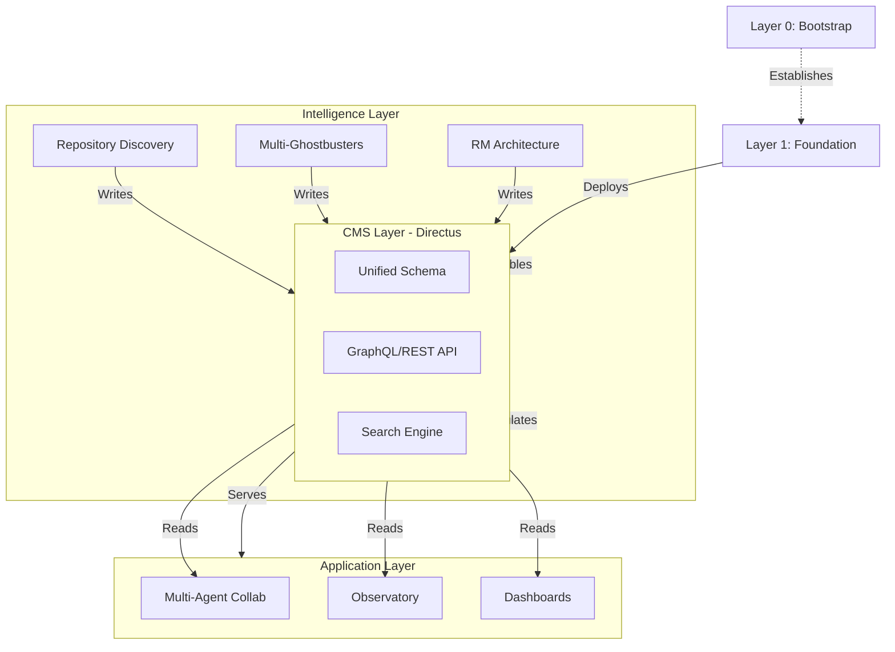
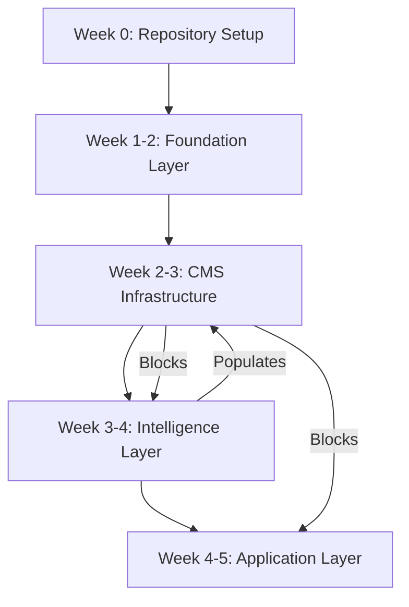

# Phase 5c: Repository Constellation CMS Dependency Mapping

## Objective

Update the Repository Constellation specification to include explicit identification of all CMS dependencies across all layers and specs.

## Context

**Inputs:**
- Phase 5a consolidated CMS requirements
- Phase 5b updated CMS Architecture spec
- Repository Constellation spec

**Location:** `.kiro/specs/repository-constellation-specification.md`

## Task

### 1. Add CMS Dependency Section to Constellation

Add new major section after "Critical Path Dependencies":

```markdown
## CMS Integration Architecture

### CMS Centrality in Constellation

The Content Management System (CMS) serves as the **central nervous system** of the repository constellation, providing:
- Persistent storage for all repository intelligence
- API-driven access to intelligence data
- Real-time synchronization across components
- Search and discovery capabilities
- Analytics and reporting infrastructure

### CMS Dependency by Layer

#### Layer 0: Bootstrap
**CMS Dependency Level:** MINIMAL
**Rationale:** Bootstrap layer establishes infrastructure but doesn't yet consume intelligence

Specs with CMS dependencies:
- None (bootstrap precedes CMS availability)

#### Layer 1: Foundation
**CMS Dependency Level:** CRITICAL
**Rationale:** Foundation layer includes CMS infrastructure itself

Specs with CMS dependencies:
- **cms-architecture** (DEFINES) - Defines the CMS system
- **directus-cms-setup** (CRITICAL) - Implements CMS infrastructure
- **directus-schema-design** (CRITICAL) - Implements repository intelligence schema
- **system-health-mitigation** (MODERATE) - Stores health metrics in CMS
- **service-auto-start-governance** (LOW) - May store service definitions in CMS

#### Layer 2: Intelligence
**CMS Dependency Level:** CRITICAL
**Rationale:** Intelligence layer generates and stores all repository intelligence in CMS

Specs with CMS dependencies:
- **repository-content-discovery-indexing** (CRITICAL) - Primary CMS data producer
  - Stores: repository_files, specifications, requirements, relationships
  - Requires: Full CRUD, search, relationships
  - Data volume: 10,000+ files, 108+ specs

- **multi-perspective-ghostbusters** (CRITICAL) - Stores multi-perspective analysis
  - Stores: analysis_results, perspective_reports, conflict_detections
  - Requires: Search, analytics, reporting
  - Data volume: 100+ analyses per repository scan

- **reflective-module-architecture** (HIGH) - Stores architectural patterns
  - Stores: module_definitions, interface_registry, pattern_library
  - Requires: Search, version control, relationships
  - Data volume: 50+ modules, 200+ interfaces

[... for all intelligence specs with CMS dependencies ...]

#### Layer 3: Application
**CMS Dependency Level:** HIGH
**Rationale:** Application layer consumes CMS intelligence to deliver value

Specs with CMS dependencies:
- **multi-agent-collaboration** (HIGH) - Queries intelligence for coordination
  - Queries: specifications, requirements, dependencies
  - Requires: Fast read access, search, real-time updates
  - Query patterns: Spec dependencies, conflict detection

- **observatory-live-coordination-feed** (HIGH) - Real-time intelligence updates
  - Queries: All intelligence collections
  - Requires: WebSocket updates, search, filtering
  - Query patterns: Recent changes, stakeholder-filtered views

[... for all application specs with CMS dependencies ...]

### CMS Criticality Matrix

| Constellation Layer | Critical CMS Specs | High CMS Specs | Moderate CMS Specs | Low CMS Specs | No CMS Deps |
|-------------------|-------------------|---------------|-------------------|--------------|-------------|
| Layer 0 (Bootstrap) | 0 | 0 | 0 | 0 | 3 |
| Layer 1 (Foundation) | 3 | 1 | 2 | 1 | 8 |
| Layer 2 (Intelligence) | 12 | 8 | 3 | 1 | 5 |
| Layer 3 (Application) | 5 | 15 | 8 | 2 | 10 |
| **TOTAL** | **20** | **24** | **13** | **4** | **26** |

### CMS Data Flow Architecture



### CMS Implementation Dependencies

#### Critical Path Gating
**CMS Blocks:**
- 20 CRITICAL specs cannot be implemented without CMS operational
- 24 HIGH priority specs degraded without CMS
- Layer 2 (Intelligence) completely blocked without CMS
- Layer 3 (Application) severely limited without CMS

**Minimum Viable CMS for MVP Constellation:**
- Core collections: repository_files, specifications, requirements
- Basic relationships: spec dependencies, file-to-spec mapping
- REST API access (GraphQL optional for MVP)
- Basic search (semantic search deferred to post-MVP)
- Performance: <2s query response (optimize to <500ms post-MVP)

#### CMS Availability Requirements

**For Layer 2 Implementation:**
- CMS must be operational and schema deployed
- API endpoints functional
- Basic search working
- Adequate performance for development/testing

**For Layer 3 Implementation:**
- CMS fully populated with repository intelligence
- Search optimized for production performance
- Real-time updates working (WebSocket)
- Analytics and reporting functional
```

### 2. Update Dependency Matrix

Add CMS column to existing dependency matrix:

```markdown
| Component | Repository Setup | Spec Consistency | System Health | Service Auto-Start | **CMS Infrastructure** | **CMS Data Available** |
|-----------|------------------|------------------|---------------|-------------------|----------------------|----------------------|
| **Spec Consistency Governance** | 🚀 REQUIRED (80%) | N/A | ❌ NONE | ❌ NONE | ❌ NONE | ❌ NONE |
| **System Health Mitigation** | 🚀 REQUIRED (40%) | ✅ SATISFIED | N/A | ❌ NONE | ⚠️ OPTIONAL | ❌ NONE |
| **CMS Infrastructure** | 🚀 REQUIRED (60%) | ✅ SATISFIED | ✅ SATISFIED | ❌ NONE | N/A | N/A |
| **Repository Discovery** | 🚀 REQUIRED (80%) | ✅ SATISFIED | 🔄 PARTIAL | 📋 NEEDED | **🔴 CRITICAL** | ❌ NONE (produces it) |
| **Multi-Agent Collaboration** | 🚀 REQUIRED (60%) | ✅ SATISFIED | 🔄 PARTIAL | 📋 NEEDED | **🔴 CRITICAL** | **🔴 CRITICAL** |
```

### 3. Update Critical Path Analysis

Revise critical path sections to include CMS as explicit dependency:

```markdown
### Revised Critical Path with CMS



**Critical Insight:** CMS must be operational before Intelligence Layer implementation begins.
```

## Deliverables

### 1. Updated Repository Constellation Specification

- `.kiro/specs/repository-constellation-specification.md` (updated)
- New section: "CMS Integration Architecture"
- Updated dependency matrices with CMS columns
- Updated critical path with CMS gating

### 2. CMS Dependency Map

Create `.kiro/reports/cms-dependency-map-final.md` with:
- Comprehensive list of all CMS-dependent specs
- Dependency levels for each
- Data models required by each
- API requirements for each

## Validation Criteria

✅ All CMS dependencies from Phase 5a reflected in constellation
✅ CMS criticality matrix complete and accurate
✅ CMS data flow architecture documented
✅ Critical path updated to show CMS gating
✅ Minimum viable CMS requirements identified

## Timeline

**Duration:** 0.5 days
**Dependencies:** Phase 5a, 5b complete

## Success Metrics

- CMS dependencies explicit in constellation spec
- Clear CMS implementation roadmap
- No ambiguity about CMS criticality
