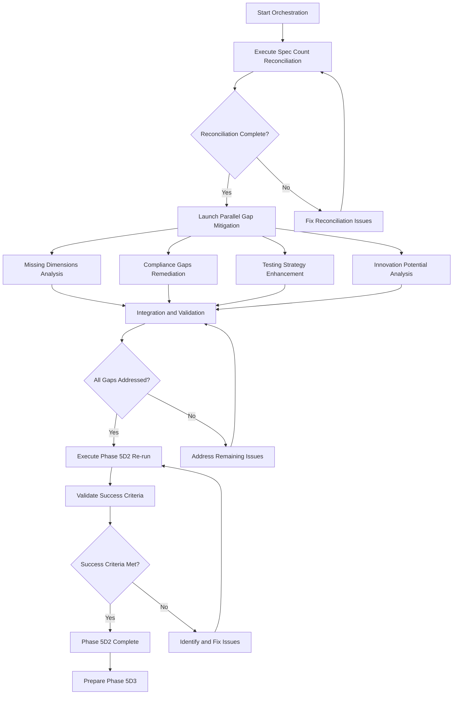

# Phase 5D2 Comprehensive Re-run Orchestrator

---
**DAG Metadata:**
- **Task ID**: `phase-5d2-comprehensive-rerun-orchestrator`
- **Dependencies**: `["phase-5d2-missing-dimensions-analysis", "phase-5d2-compliance-gaps-remediation", "phase-5d2-testing-strategy-enhancement", "phase-5d2-innovation-potential-analysis"]`
- **Parallel Group**: `orchestration`
- **Estimated Duration**: `8-12 hours`
- **Priority**: `CRITICAL`
- **Resource Requirements**: `orchestration-tools, data-integration, validation-frameworks`
- **Outputs**: `integrated-analysis, phase-5d2-rerun-results, phase-5d3-readiness-report`
- **Success Criteria**: `dimension_coverage == 100, quality_gates_passed == true, phase_5d3_ready == true`
---

## Objective
Orchestrate the complete re-execution of Phase 5D2 Dimension Coverage Validation after addressing all identified gaps and deficiencies.

## Context
Phase 5D2 failed with only 45.5% dimension coverage and multiple critical issues. This orchestrator coordinates the execution of all gap mitigation prompts to enable a successful re-run.

## Prerequisites
The following gap mitigation prompts must be completed before re-running Phase 5D2:
1. ✅ **Missing Dimensions Analysis** - Complete dimensions 1-12 analysis
2. ✅ **Spec Count Reconciliation** - Resolve 114 vs 107 spec discrepancy  
3. ✅ **Compliance Gaps Remediation** - Address 74.8% poor compliance coverage
4. ✅ **Testing Strategy Enhancement** - Improve 45.3 average testing score
5. ✅ **Innovation Potential Analysis** - Enhance 21.0 average innovation score

## Orchestration Strategy

### Phase 1: Gap Mitigation Execution (60-80 hours total)
Execute all gap mitigation prompts in parallel where possible:

#### Critical Path (Sequential)
1. **Spec Count Reconciliation** (2-4 hours)
   - Must complete first to establish accurate spec inventory
   - Affects all subsequent analyses

2. **Missing Dimensions Analysis** (40-60 hours)
   - Largest effort, can run in parallel with others after reconciliation
   - Blocks final validation until complete

#### Parallel Execution (Can run simultaneously)
3. **Compliance Gaps Remediation** (20-30 hours)
4. **Testing Strategy Enhancement** (15-20 hours)  
5. **Innovation Potential Analysis** (12-15 hours)

### Phase 2: Integration and Validation (8-12 hours)
1. **Data Integration**: Combine all gap mitigation results
2. **Quality Validation**: Verify all improvements meet targets
3. **Consistency Check**: Ensure all analyses are compatible
4. **Pre-flight Validation**: Confirm readiness for Phase 5D2 re-run

### Phase 3: Phase 5D2 Re-execution (90-120 minutes)
1. **Complete Dimension Coverage Validation**: All 22 dimensions across all specs
2. **Quality Gate Validation**: Verify all quality gates pass
3. **Readiness Assessment**: Confirm Phase 5D3 prerequisites met
4. **Final Report Generation**: Comprehensive validation report

## Success Criteria for Re-run

### Dimension Coverage Requirements
- [ ] **Dimension Completeness**: 100% (22/22 dimensions) vs. previous 45.5%
- [ ] **Spec Coverage**: 100% specs analyzed vs. previous 93.9%
- [ ] **Average Dimension Quality**: >70 average score vs. previous 54.2
- [ ] **Critical Gap Threshold**: <10% specs with critical gaps vs. previous 74.8%

### Specific Dimension Targets
- [ ] **Compliance Regulations**: >70 average vs. previous 11.7 (CRITICAL)
- [ ] **Testing Strategy**: >75 average vs. previous 45.3 (POOR)
- [ ] **Innovation Potential**: >60 average vs. previous 21.0 (POOR)
- [ ] **All Missing Dimensions 1-12**: >70 average (new analysis)

### Quality Gates
- [ ] **Validation Result**: COMPLETE vs. previous INCOMPLETE
- [ ] **Confidence Level**: HIGH vs. previous LOW
- [ ] **Next Phase Readiness**: READY vs. previous BLOCKED
- [ ] **Overall Assessment**: SUCCESSFUL vs. previous FAILED

## Implementation Approach

### Orchestration Workflow

### Execution Monitoring
Track progress across all gap mitigation efforts:
- **Completion Status**: Track each prompt's completion
- **Quality Metrics**: Monitor improvement in dimension scores
- **Integration Status**: Ensure all results integrate properly
- **Readiness Indicators**: Validate Phase 5D2 re-run prerequisites

### Risk Mitigation
- **Dependency Management**: Ensure proper sequencing of activities
- **Quality Assurance**: Validate each gap mitigation before integration
- **Rollback Planning**: Prepare rollback procedures if issues arise
- **Resource Management**: Monitor effort and timeline constraints

## Expected Outcomes

### Quantitative Improvements
- **Dimension Coverage**: 45.5% → 100%
- **Spec Coverage**: 93.9% → 100%
- **Average Quality Score**: 54.2 → 70+
- **Critical Gaps**: 74.8% → <10%

### Qualitative Improvements
- **Validation Completeness**: Full validation of all 22 dimensions
- **Quality Assurance**: All quality gates passing
- **Risk Reduction**: Comprehensive risk assessment and mitigation
- **Readiness**: Prepared for Phase 5D3 CMS Integration Validation

## Dependencies
- Completion of all gap mitigation prompts
- Access to all spec files and analysis tools
- Sufficient computational resources for parallel execution
- Quality validation frameworks and tools

## Estimated Total Effort
- **Gap Mitigation**: 60-80 hours (parallel execution)
- **Integration**: 8-12 hours
- **Phase 5D2 Re-run**: 90-120 minutes
- **Total Timeline**: 3-4 weeks with parallel execution

## Priority
CRITICAL - Enables progression through constellation elaboration process

## Success Validation
After re-run completion, validate:
- [ ] All 22 dimensions analyzed across all specs
- [ ] All quality gates passing
- [ ] Phase 5D3 prerequisites met
- [ ] Comprehensive validation report generated
- [ ] No critical gaps remaining
- [ ] System ready for CMS integration validation

## Output Format
Generate orchestration report including:
- Gap mitigation execution status and results
- Integrated dimension coverage analysis
- Quality gate validation results
- Phase 5D2 re-run success confirmation
- Phase 5D3 readiness assessment
- Lessons learned and process improvements