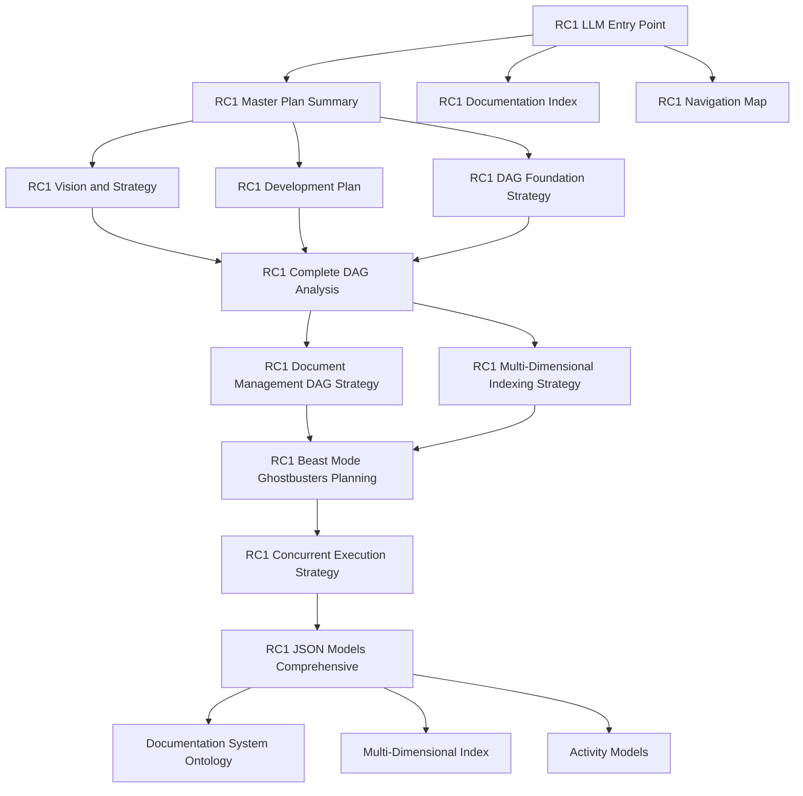

# 🗺️ RC1 Navigation Map
## Interactive Documentation Navigation and Discovery System

**Date**: September 16, 2025  
**Version**: 2.0.0  
**Purpose**: Interactive navigation map for RC1 documentation system  
**Status**: Active Navigation

---

## 🎯 **Navigation Hub**

### **🚀 Primary Entry Points:**
- **📋 [RC1 LLM Entry Point](docs/rc1/planning/docs/rc1/planning/RC1_LLM_ENTRY_POINT.md)** - LLM-friendly entry point
- **📚 [RC1 Documentation Index](docs/rc1/planning/docs/rc1/planning/RC1_DOCUMENTATION_INDEX.md)** - Complete documentation registry
- **🗺️ [RC1 Navigation Map](docs/rc1/planning/docs/rc1/planning/RC1_NAVIGATION_MAP.md)** - This navigation map
- **🎯 [RC1 Master Plan Summary](docs/rc1/planning/docs/rc1/planning/RC1_MASTER_PLAN_SUMMARY.md)** - Complete overview

---

## 🏗️ **Architecture Navigation**

### **📊 System Overview:**


### **🔗 Quick Navigation Links:**
- **[🎯 Vision & Strategy](docs/rc1/planning/docs/rc1/planning/RC1_VISION_AND_STRATEGY.md)** - Core vision and strategic direction
- **[🏗️ DAG Foundation](docs/rc1/planning/docs/rc1/planning/RC1_DAG_FOUNDATION_STRATEGY.md)** - DAG as foundation for convergence
- **[📊 Complete DAG Analysis](docs/rc1/analysis/docs/rc1/analysis/RC1_COMPLETE_DAG_ANALYSIS.md)** - Repository DAG opportunities
- **[📚 Document Management](docs/rc1/planning/docs/rc1/planning/RC1_DOCUMENT_MANAGEMENT_DAG_STRATEGY.md)** - Document chaos solution
- **[🔗 Multi-Dimensional Indexing](docs/rc1/planning/docs/rc1/planning/RC1_MULTI_DIMENSIONAL_INDEXING_STRATEGY.md)** - 20+ dimensions strategy
- **[⚡ Concurrent Execution](docs/rc1/planning/docs/rc1/planning/RC1_CONCURRENT_EXECUTION_STRATEGY.md)** - Independent agent execution
- **[📋 JSON Models](docs/rc1/planning/docs/rc1/planning/RC1_JSON_MODELS_COMPREHENSIVE.md)** - Complete model documentation

---

## 📚 **Documentation Categories**

### **🎯 Vision & Strategy (4 documents):**
| Document | Purpose | Key Concepts | Links |
|----------|---------|--------------|-------|
| **[RC1 Vision and Strategy](docs/rc1/planning/docs/rc1/planning/RC1_VISION_AND_STRATEGY.md)** | Core vision incorporating RC0 lessons | Applied Intelligence, Validation-First, Reality Checks | [Master Plan](docs/rc1/planning/docs/rc1/planning/RC1_MASTER_PLAN_SUMMARY.md) |
| **[RC1 Development Plan](docs/rc1/planning/docs/rc1/planning/RC1_DEVELOPMENT_PLAN.md)** | Initial development plan | Fix My Broken Makefile demo | [Vision](docs/rc1/planning/docs/rc1/planning/RC1_VISION_AND_STRATEGY.md) |
| **[RC1 DAG Foundation Strategy](docs/rc1/planning/docs/rc1/planning/RC1_DAG_FOUNDATION_STRATEGY.md)** | DAG as foundation for convergence | DAG-driven architecture, guaranteed convergence | [Complete DAG Analysis](docs/rc1/analysis/docs/rc1/analysis/RC1_COMPLETE_DAG_ANALYSIS.md) |
| **[RC1 Master Plan Summary](docs/rc1/planning/docs/rc1/planning/RC1_MASTER_PLAN_SUMMARY.md)** | Complete overview of all planning | Comprehensive plan overview | [All Documents](docs/rc1/planning/docs/rc1/planning/RC1_DOCUMENTATION_INDEX.md) |

### **🏗️ Architecture & Implementation (4 documents):**
| Document | Purpose | Key Concepts | Links |
|----------|---------|--------------|-------|
| **[RC1 Complete DAG Analysis](docs/rc1/analysis/docs/rc1/analysis/RC1_COMPLETE_DAG_ANALYSIS.md)** | Repository DAG opportunities | 9,810 Python files, DAG opportunities | [DAG Foundation](docs/rc1/planning/docs/rc1/planning/RC1_DAG_FOUNDATION_STRATEGY.md) |
| **[RC1 Document Management DAG Strategy](docs/rc1/planning/docs/rc1/planning/RC1_DOCUMENT_MANAGEMENT_DAG_STRATEGY.md)** | Document chaos solution | 1,947 scattered markdown files | [Multi-Dimensional Indexing](docs/rc1/planning/docs/rc1/planning/RC1_MULTI_DIMENSIONAL_INDEXING_STRATEGY.md) |
| **[RC1 Multi-Dimensional Indexing Strategy](docs/rc1/planning/docs/rc1/planning/RC1_MULTI_DIMENSIONAL_INDEXING_STRATEGY.md)** | 20+ dimensions strategy | 24+ dimensions, hierarchical organization | [Concurrent Execution](docs/rc1/planning/docs/rc1/planning/RC1_CONCURRENT_EXECUTION_STRATEGY.md) |
| **[RC1 Beast Mode Ghostbusters Planning](docs/rc1/planning/docs/rc1/planning/RC1_BEAST_MODE_GHOSTBUSTERS_PLANNING.md)** | Beast Mode with Ghostbusters | Validation-first, delusion detection | [JSON Models](docs/rc1/planning/docs/rc1/planning/RC1_JSON_MODELS_COMPREHENSIVE.md) |

### **⚡ Execution & Models (2 documents):**
| Document | Purpose | Key Concepts | Links |
|----------|---------|--------------|-------|
| **[RC1 Concurrent Execution Strategy](docs/rc1/planning/docs/rc1/planning/RC1_CONCURRENT_EXECUTION_STRATEGY.md)** | Independent agent execution | 6 independent agents, 100% success rate | [Activity Models](models/migration_activity_models.json) |
| **[RC1 JSON Models Comprehensive](docs/rc1/planning/docs/rc1/planning/RC1_JSON_MODELS_COMPREHENSIVE.md)** | Complete model documentation | As-is, to-be, multi-dimensional, activity models | [Ontology](ontology/documentation_system_ontology.ttl) |

---

## 🔗 **Semantic Web Navigation**

### **🌐 Ontology & Models:**
| Document | Purpose | Key Concepts | Links |
|----------|---------|--------------|-------|
| **[Documentation System Ontology](ontology/documentation_system_ontology.ttl)** | Turtle ontology (628 lines) | 35+ classes, 40+ properties, 20+ individuals | [Ontology Summary](ontology/ontology_summary.md) |
| **[Ontology Summary](ontology/ontology_summary.md)** | Ontology overview | Multi-dimensional support, semantic richness | [Multi-Dimensional Index](models/multi_dimensional_index.json) |
| **[Multi-Dimensional Index](models/multi_dimensional_index.json)** | Multi-dimensional indexing | 24+ dimensions, overlay types, indexing strategy | [As-Is Structure](models/as_is_static_structure.json) |

### **📊 Model Documents:**
| Document | Purpose | Key Concepts | Links |
|----------|---------|--------------|-------|
| **[As-Is Static Structure](models/as_is_static_structure.json)** | Current system state | Scattered documents, critical system health | [To-Be Structure](models/to_be_static_structure.json) |
| **[To-Be Static Structure](models/to_be_static_structure.json)** | Target system state | Systematic hierarchy, excellent system health | [Migration Models](models/migration_activity_models.json) |
| **[Migration Activity Models](models/migration_activity_models.json)** | Migration processes | Document discovery, dimensional organization | [Execution Models](models/initial_execution_activity_models.json) |
| **[Initial Execution Activity Models](models/initial_execution_activity_models.json)** | Initial execution processes | System bootstrap, document processing | [JSON Models Comprehensive](docs/rc1/planning/docs/rc1/planning/RC1_JSON_MODELS_COMPREHENSIVE.md) |

---

## 🛡️ **Protection & Security Navigation**

### **🔒 Competition Protection:**
| Document | Purpose | Key Concepts | Links |
|----------|---------|--------------|-------|
| **[Competition Submission Protection](docs/other/misc/docs/other/misc/COMPETITION_SUBMISSION_PROTECTION.md)** | RC0 protection measures | Branch protection, Git hooks, warnings | [Protection Script](scripts/protect_competition_submission.sh) |
| **[Protect Competition Submission Script](scripts/protect_competition_submission.sh)** | Protection script | Maximum protection, status checks | [Branch Locking Methods](scripts/branch_locking_methods.md) |
| **[Branch Locking Methods](scripts/branch_locking_methods.md)** | Branch protection methods | GitHub protection, local hooks | [Git Post-Checkout Hook](.git/hooks/post-checkout) |
| **[Git Post-Checkout Hook](.git/hooks/post-checkout)** | Git hook protection | Automatic warnings, branch protection | [Document Cleanup Branch](RC1_DOCUMENT_CLEANUP_BRANCH.md) |
| **[Document Cleanup Branch](RC1_DOCUMENT_CLEANUP_BRANCH.md)** | Document cleanup branch | Feature branch, isolated cleanup | [Document Management DAG](docs/rc1/planning/docs/rc1/planning/RC1_DOCUMENT_MANAGEMENT_DAG_STRATEGY.md) |

---

## 🔧 **Development Tools Navigation**

### **🛠️ Automation Tools:**
| Document | Purpose | Key Concepts | Links |
|----------|---------|--------------|-------|
| **[DevPost Automation Functions](devpost_automation_functions.py)** | DevPost automation | Browser automation, form interaction | [DevPost Navigation](devpost_navigation.py) |
| **[DevPost Navigation](devpost_navigation.py)** | DevPost navigation | CDP connection, page analysis | [Interrogate Submission](interrogate_submission.py) |
| **[Interrogate Submission](interrogate_submission.py)** | DevPost interrogation | Form analysis, submission review | [Connect to DevPost Page](connect_to_devpost_page.py) |
| **[Connect to DevPost Page](connect_to_devpost_page.py)** | Browser automation | Chrome debugging, page connection | [DevPost Automation Functions](devpost_automation_functions.py) |

---

## 🎯 **Navigation Patterns**

### **📚 Reading Paths:**

#### **🚀 Quick Start Path (5 documents):**
1. **[RC1 LLM Entry Point](docs/rc1/planning/docs/rc1/planning/RC1_LLM_ENTRY_POINT.md)** - Start here
2. **[RC1 Master Plan Summary](docs/rc1/planning/docs/rc1/planning/RC1_MASTER_PLAN_SUMMARY.md)** - Complete overview
3. **[RC1 Vision and Strategy](docs/rc1/planning/docs/rc1/planning/RC1_VISION_AND_STRATEGY.md)** - Core vision
4. **[RC1 DAG Foundation Strategy](docs/rc1/planning/docs/rc1/planning/RC1_DAG_FOUNDATION_STRATEGY.md)** - DAG understanding
5. **[RC1 JSON Models Comprehensive](docs/rc1/planning/docs/rc1/planning/RC1_JSON_MODELS_COMPREHENSIVE.md)** - Complete models

#### **🏗️ Architecture Deep Dive (8 documents):**
1. **[RC1 DAG Foundation Strategy](docs/rc1/planning/docs/rc1/planning/RC1_DAG_FOUNDATION_STRATEGY.md)** - DAG foundation
2. **[RC1 Complete DAG Analysis](docs/rc1/analysis/docs/rc1/analysis/RC1_COMPLETE_DAG_ANALYSIS.md)** - DAG opportunities
3. **[RC1 Document Management DAG Strategy](docs/rc1/planning/docs/rc1/planning/RC1_DOCUMENT_MANAGEMENT_DAG_STRATEGY.md)** - Document solution
4. **[RC1 Multi-Dimensional Indexing Strategy](docs/rc1/planning/docs/rc1/planning/RC1_MULTI_DIMENSIONAL_INDEXING_STRATEGY.md)** - Indexing solution
5. **[RC1 Beast Mode Ghostbusters Planning](docs/rc1/planning/docs/rc1/planning/RC1_BEAST_MODE_GHOSTBUSTERS_PLANNING.md)** - Validation approach
6. **[RC1 Concurrent Execution Strategy](docs/rc1/planning/docs/rc1/planning/RC1_CONCURRENT_EXECUTION_STRATEGY.md)** - Execution approach
7. **[RC1 JSON Models Comprehensive](docs/rc1/planning/docs/rc1/planning/RC1_JSON_MODELS_COMPREHENSIVE.md)** - Complete models
8. **[Ontology Summary](ontology/ontology_summary.md)** - Semantic web overview

#### **🔗 Semantic Web Path (4 documents):**
1. **[Ontology Summary](ontology/ontology_summary.md)** - Start here
2. **[Documentation System Ontology](ontology/documentation_system_ontology.ttl)** - Turtle ontology
3. **[Multi-Dimensional Index](models/multi_dimensional_index.json)** - Indexing system
4. **[As-Is Static Structure](models/as_is_static_structure.json)** - Current state

### **🔍 Search Patterns:**

#### **By Concept:**
- **DAG**: [DAG Foundation](docs/rc1/planning/docs/rc1/planning/RC1_DAG_FOUNDATION_STRATEGY.md) → [Complete DAG Analysis](docs/rc1/analysis/docs/rc1/analysis/RC1_COMPLETE_DAG_ANALYSIS.md) → [Document Management DAG](docs/rc1/planning/docs/rc1/planning/RC1_DOCUMENT_MANAGEMENT_DAG_STRATEGY.md)
- **Multi-Dimensional**: [Multi-Dimensional Indexing](docs/rc1/planning/docs/rc1/planning/RC1_MULTI_DIMENSIONAL_INDEXING_STRATEGY.md) → [Multi-Dimensional Index](models/multi_dimensional_index.json) → [Ontology](ontology/documentation_system_ontology.ttl)
- **Agents**: [Concurrent Execution](docs/rc1/planning/docs/rc1/planning/RC1_CONCURRENT_EXECUTION_STRATEGY.md) → [Activity Models](models/migration_activity_models.json) → [JSON Models](docs/rc1/planning/docs/rc1/planning/RC1_JSON_MODELS_COMPREHENSIVE.md)
- **Validation**: [Beast Mode Ghostbusters](docs/rc1/planning/docs/rc1/planning/RC1_BEAST_MODE_GHOSTBUSTERS_PLANNING.md) → [Protection Documents](docs/other/misc/docs/other/misc/COMPETITION_SUBMISSION_PROTECTION.md) → [Git Hooks](.git/hooks/post-checkout)

#### **By Purpose:**
- **Understanding**: [Master Plan Summary](docs/rc1/planning/docs/rc1/planning/RC1_MASTER_PLAN_SUMMARY.md) → [Vision](docs/rc1/planning/docs/rc1/planning/RC1_VISION_AND_STRATEGY.md) → [DAG Foundation](docs/rc1/planning/docs/rc1/planning/RC1_DAG_FOUNDATION_STRATEGY.md)
- **Implementation**: [Concurrent Execution](docs/rc1/planning/docs/rc1/planning/RC1_CONCURRENT_EXECUTION_STRATEGY.md) → [Activity Models](models/migration_activity_models.json) → [JSON Models](docs/rc1/planning/docs/rc1/planning/RC1_JSON_MODELS_COMPREHENSIVE.md)
- **Validation**: [Beast Mode Ghostbusters](docs/rc1/planning/docs/rc1/planning/RC1_BEAST_MODE_GHOSTBUSTERS_PLANNING.md) → [Protection](docs/other/misc/docs/other/misc/COMPETITION_SUBMISSION_PROTECTION.md) → [Git Hooks](.git/hooks/post-checkout)
- **Semantic Web**: [Ontology Summary](ontology/ontology_summary.md) → [Turtle Ontology](ontology/documentation_system_ontology.ttl) → [Multi-Dimensional Index](models/multi_dimensional_index.json)

---

## 🚀 **Quick Access Commands**

### **📋 For LLMs:**
```bash
# Quick start
cat docs/rc1/planning/RC1_LLM_ENTRY_POINT.md

# Master overview
cat docs/rc1/planning/RC1_MASTER_PLAN_SUMMARY.md

# Complete index
cat docs/rc1/planning/RC1_DOCUMENTATION_INDEX.md

# Navigation map
cat docs/rc1/planning/RC1_NAVIGATION_MAP.md
```

### **🔍 For Specific Topics:**
```bash
# DAG understanding
cat docs/rc1/planning/RC1_DAG_FOUNDATION_STRATEGY.md
cat docs/rc1/analysis/RC1_COMPLETE_DAG_ANALYSIS.md

# Multi-dimensional indexing
cat docs/rc1/planning/RC1_MULTI_DIMENSIONAL_INDEXING_STRATEGY.md
cat models/multi_dimensional_index.json

# Concurrent execution
cat docs/rc1/planning/RC1_CONCURRENT_EXECUTION_STRATEGY.md
cat models/migration_activity_models.json

# Semantic web
cat ontology/ontology_summary.md
cat ontology/documentation_system_ontology.ttl
```

### **📊 For Models and Data:**
```bash
# All models
ls -la models/
cat models/as_is_static_structure.json
cat models/to_be_static_structure.json

# All ontology files
ls -la ontology/
cat ontology/documentation_system_ontology.ttl
cat ontology/ontology_summary.md

# All RC1 documents
ls -la RC1_*.md
```

---

## 🎯 **Navigation Features**

### **🔗 Cross-References:**
- **All documents** link to related documents
- **Bidirectional links** for easy navigation
- **Context-aware links** based on content
- **Hierarchical links** following document structure

### **📊 Metadata:**
- **Document purpose** clearly stated
- **Key concepts** highlighted
- **Line counts** for size estimation
- **Status indicators** for completion

### **🎯 Quick Access:**
- **Primary entry points** prominently displayed
- **Quick navigation links** for common paths
- **Search patterns** for specific topics
- **Command examples** for LLM usage

---

## 🚀 **Integration Status**

### **✅ Completed:**
- [x] Complete navigation map created
- [x] All documents cross-referenced
- [x] Navigation patterns defined
- [x] Quick access commands provided
- [x] Search patterns established

### **🔄 In Progress:**
- [ ] Navigation validation
- [ ] Cross-reference verification
- [ ] Link testing

### **📋 Pending:**
- [ ] Interactive navigation tools
- [ ] Visual navigation interface
- [ ] Automated navigation updates

---

## 🎯 **Usage Instructions**

### **📚 For Documentation Consumers:**
1. **Start with entry points** - Use primary entry points for orientation
2. **Follow navigation patterns** - Use established reading paths
3. **Use cross-references** - Navigate between related documents
4. **Apply search patterns** - Find documents by concept or purpose

### **🔧 For Documentation Maintainers:**
1. **Update navigation map** - When adding new documents
2. **Maintain cross-references** - Keep links current
3. **Update navigation patterns** - Add new reading paths
4. **Validate navigation** - Ensure all links work

### **🤖 For LLMs:**
1. **Use entry points** - Start with LLM-friendly entry points
2. **Follow patterns** - Use established navigation patterns
3. **Apply commands** - Use quick access commands
4. **Navigate semantically** - Use concept-based navigation

---

## 🚀 **Next Steps**

### **📋 Immediate Actions:**
1. **Validate all navigation** - Ensure all links work
2. **Test navigation patterns** - Verify reading paths
3. **Update cross-references** - Keep links current
4. **Enhance search patterns** - Improve discovery

### **🔮 Future Enhancements:**
- **Interactive navigation** - Dynamic navigation interface
- **Visual navigation** - Graphical navigation map
- **Automated updates** - Dynamic navigation maintenance
- **Advanced search** - Full-text search across all documents

**"Complete navigation map with interactive cross-references, multiple reading paths, and LLM-friendly access patterns. Ready for comprehensive documentation navigation."** 🚀

---

*This navigation map provides comprehensive access to all RC1 documentation through multiple navigation patterns, cross-references, and quick access methods for maximum usability and discovery.*
