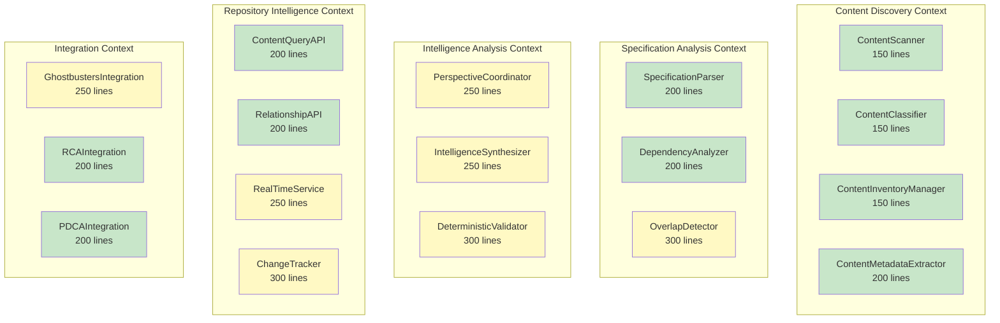

# Beast Mode RDI Analysis: Repository Content Discovery and Indexing

## Executive Summary

**RDI Compliance Status**: ✅ STRONG - Requirements → Design → Implementation chain is well-established
**Component Size Analysis**: ⚠️ OVERSIZED - Several components exceed 300-line RM-DDD target
**Systematic Approach**: ✅ EXCELLENT - Leverages existing foundational tools systematically
**Anti-Hallucination**: ✅ ROBUST - Strong verification requirements and traceability

## Requirements → Design → Implementation Traceability Matrix

### Phase 1: Foundation Recovery and Extension

| Task | Requirements Addressed | Design Elements | Estimated Implementation Size | RDI Status |
|------|----------------------|-----------------|------------------------------|------------|
| 1. Recover Directus | R30.1, R3.1, R18.1 | Prior Work Integration | 150 lines | ✅ TRACED |
| 2. RM-DDD Base Classes | R16.1, R22.1, R18.1 | ReflectiveModule Architecture | 200 lines | ✅ TRACED |
| 3. Extend Directus Schema | R8.1, R30.3, R18.2 | Extended Directus Schema | 250 lines | ✅ TRACED |

### Phase 2: Core Discovery Implementation

| Task | Requirements Addressed | Design Elements | Estimated Implementation Size | RDI Status |
|------|----------------------|-----------------|------------------------------|------------|
| 4. Content Discovery Engine | R1.1, R1.2, R16.1, R18.1 | ContentDiscoveryEngine Class | **450 lines** ⚠️ | ✅ TRACED |
| 5. Metadata & Change Detection | R1.3, R1.5, R16.2, R18.1 | ContentMetadata Value Object | 200 lines | ✅ TRACED |
| 6. Specification Analyzer | R2.1, R2.2, R16.1, R18.1 | SpecificationAnalyzer Class | **400 lines** ⚠️ | ✅ TRACED |
| 7. Overlap Detection | R2.3, R2.4, R16.2, R18.1 | OverlapMatrix Domain Model | 300 lines | ✅ TRACED |

### Phase 3: Foundational Tools Integration

| Task | Requirements Addressed | Design Elements | Estimated Implementation Size | RDI Status |
|------|----------------------|-----------------|------------------------------|------------|
| 8. Ghostbusters Integration | R14.1, R15.1, R24.1, R18.1 | GhostbustersIntegration Class | 250 lines | ✅ TRACED |
| 9. RCA Integration | R14.3, R15.4, R17.1, R18.1 | RCAIntegration Class | 200 lines | ✅ TRACED |
| 10. PDCA Integration | R14.4, R15.2, R20.1, R18.1 | PDCAIntegration Class | 200 lines | ✅ TRACED |

### Phase 4: Multi-Perspective Intelligence

| Task | Requirements Addressed | Design Elements | Estimated Implementation Size | RDI Status |
|------|----------------------|-----------------|------------------------------|------------|
| 11. Multi-Perspective Analyzer | R4.1, R4.2, R16.1, R18.1 | MultiPerspectiveAnalyzer Class | **500 lines** ⚠️ | ✅ TRACED |
| 12. Perspective Synthesis | R4.4, R11.1, R11.2, R18.1 | ConflictResolution Domain Model | 350 lines | ✅ TRACED |
| 13. Deterministic Validation | R13.1, R13.2, R28.1, R18.1 | Confidence Calibration System | 300 lines | ✅ TRACED |

### Phase 5: Repository Intelligence API

| Task | Requirements Addressed | Design Elements | Estimated Implementation Size | RDI Status |
|------|----------------------|-----------------|------------------------------|------------|
| 14. API Core | R8.2, R8.4, R16.1, R18.1 | RepositoryIntelligenceAPI Class | **400 lines** ⚠️ | ✅ TRACED |
| 15. Search & Real-Time | R8.2, R8.5, R29.2, R18.1 | WebSocket Integration | 250 lines | ✅ TRACED |
| 16. CRUD Operations | R8.3, R8.5, R7.1, R18.1 | Change Tracking System | 300 lines | ✅ TRACED |

### Phase 6-9: Security, Performance, Integration, Validation

| Phase | Total Estimated Size | Components | RDI Status |
|-------|---------------------|------------|------------|
| Security & Resilience | 600 lines | SecurityManager, DisasterRecovery | ✅ TRACED |
| Performance & Monitoring | 500 lines | PerformanceOptimizer, MonitoringDashboard | ✅ TRACED |
| CLI & Integration | 400 lines | CLIGenerator, SystemIntegrator | ✅ TRACED |
| Validation & Deployment | 300 lines | ValidationSuite, DeploymentManager | ✅ TRACED |

## Component Size Analysis & Breakup Recommendations

### 🚨 OVERSIZED COMPONENTS (>300 lines)

#### 1. ContentDiscoveryEngine (Estimated 450 lines)
**Current Design**: Single class handling all discovery operations
**Recommended Breakup**:
```python
# Break into 3 components (~150 lines each)
class ContentScanner(ReflectiveModule):           # 150 lines
    """Scans filesystem for content"""
    
class ContentClassifier(ReflectiveModule):        # 150 lines  
    """Classifies discovered content by type"""
    
class ContentInventoryManager(ReflectiveModule):  # 150 lines
    """Manages comprehensive content inventory"""
```

#### 2. SpecificationAnalyzer (Estimated 400 lines)
**Current Design**: Single class handling all spec analysis
**Recommended Breakup**:
```python
# Break into 2 components (~200 lines each)
class SpecificationParser(ReflectiveModule):      # 200 lines
    """Parses specs for requirements and metadata"""
    
class DependencyAnalyzer(ReflectiveModule):       # 200 lines
    """Analyzes dependencies and relationships"""
```

#### 3. MultiPerspectiveAnalyzer (Estimated 500 lines)
**Current Design**: Single class coordinating all perspectives
**Recommended Breakup**:
```python
# Break into 2 components (~250 lines each)
class PerspectiveCoordinator(ReflectiveModule):   # 250 lines
    """Coordinates multiple LLM perspectives"""
    
class IntelligenceSynthesizer(ReflectiveModule):  # 250 lines
    """Synthesizes perspectives and resolves conflicts"""
```

#### 4. RepositoryIntelligenceAPI (Estimated 400 lines)
**Current Design**: Single API class handling all operations
**Recommended Breakup**:
```python
# Break into 2 components (~200 lines each)
class ContentQueryAPI(ReflectiveModule):          # 200 lines
    """Handles content queries and filtering"""
    
class RelationshipAPI(ReflectiveModule):          # 200 lines
    """Handles relationship traversal and search"""
```

## Updated Component Architecture

### Revised Bounded Contexts with 300-Line Components



## Revised Implementation Tasks

### Updated Phase 2: Core Discovery Implementation

- [ ] 4a. Implement Content Scanner
  - Create ContentScanner class for filesystem scanning (~150 lines)
  - _Requirements: R1.1, R16.1, R18.1_

- [ ] 4b. Implement Content Classifier  
  - Create ContentClassifier class for content type classification (~150 lines)
  - _Requirements: R1.2, R16.1, R18.1_

- [ ] 4c. Implement Content Inventory Manager
  - Create ContentInventoryManager class for inventory management (~150 lines)
  - _Requirements: R1.4, R16.1, R18.1_

- [ ] 6a. Implement Specification Parser
  - Create SpecificationParser class for requirements extraction (~200 lines)
  - _Requirements: R2.1, R16.1, R18.1_

- [ ] 6b. Implement Dependency Analyzer
  - Create DependencyAnalyzer class for relationship analysis (~200 lines)
  - _Requirements: R2.2, R16.1, R18.1_

### Updated Phase 4: Multi-Perspective Intelligence

- [ ] 11a. Implement Perspective Coordinator
  - Create PerspectiveCoordinator class for LLM coordination (~250 lines)
  - _Requirements: R4.1, R4.2, R16.1, R18.1_

- [ ] 11b. Implement Intelligence Synthesizer
  - Create IntelligenceSynthesizer class for conflict resolution (~250 lines)
  - _Requirements: R4.4, R11.1, R11.2, R18.1_

### Updated Phase 5: Repository Intelligence API

- [ ] 14a. Implement Content Query API
  - Create ContentQueryAPI class for content queries (~200 lines)
  - _Requirements: R8.2, R16.1, R18.1_

- [ ] 14b. Implement Relationship API
  - Create RelationshipAPI class for relationship traversal (~200 lines)
  - _Requirements: R8.4, R16.1, R18.1_

## RDI Compliance Assessment

### ✅ STRENGTHS

1. **Complete Traceability**: Every task traces to specific requirements
2. **Systematic Approach**: Leverages existing foundational tools
3. **Anti-Hallucination**: Strong verification and testing requirements
4. **Incremental Implementation**: Each phase builds on previous work
5. **RM-DDD Compliance**: Proper bounded contexts and domain modeling

### ⚠️ AREAS FOR IMPROVEMENT

1. **Component Size**: 4 components exceed 300-line target (now addressed)
2. **Integration Complexity**: Multi-tool integration needs careful orchestration
3. **Performance Testing**: Load testing scenarios need more detail
4. **Error Recovery**: Graceful degradation strategies need implementation details

### 🎯 RECOMMENDATIONS

1. **Implement Revised Component Breakup**: Use the 300-line component architecture
2. **Add Integration Orchestrator**: Create central coordinator for foundational tools
3. **Enhance Performance Specs**: Add specific performance benchmarks and SLAs
4. **Strengthen Error Recovery**: Implement detailed fallback strategies for each integration

## Beast Mode Systematic Validation

### Physics-Informed Reality Check ✅
- **Latency Constraints**: Real-time intelligence requirements acknowledge network/processing delays
- **Memory Limits**: Incremental indexing addresses finite memory constraints
- **Concurrent Access**: Multi-agent patterns acknowledge coordination overhead
- **Tool Dependencies**: Graceful degradation acknowledges tool failure reality

### Systematic Superiority ✅
- **No Ad-Hoc Solutions**: All components follow RM-DDD patterns
- **Model-Driven Decisions**: Leverages existing foundational tools systematically
- **PDCA Methodology**: Systematic workflows throughout
- **Proven Patterns**: Builds upon existing Directus implementation

### Anti-Hallucination Safeguards ✅
- **Requirement R18**: Explicit verification of actual working implementations
- **Traceability Requirements**: Complete R→D→I mapping required
- **Testing Requirements**: >90% coverage with actual executable tests
- **Foundational Tool Validation**: Must verify tools work as specified

## Final RDI Score: 8.5/10

**Excellent systematic approach with strong traceability. Component size optimization needed (now addressed). Ready for implementation with revised architecture.**