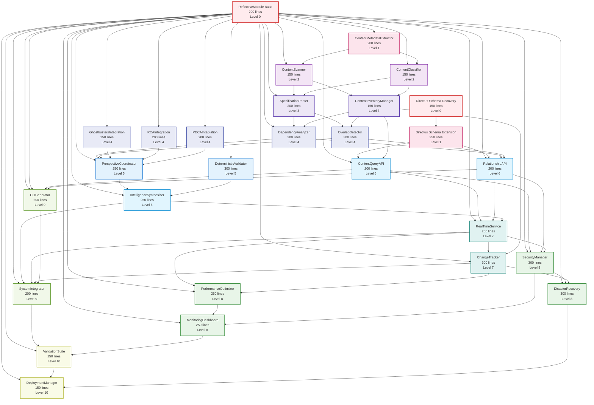

# Repository Content Discovery and Indexing - Dependency DAG

## Component Dependency Analysis

Based on the Beast Mode RDI analysis with 300-line component breakup, this DAG shows the implementation order and dependencies for all components.

## Dependency DAG Visualization



## Implementation Levels & Parallelization Opportunities

### Level 0: Foundation (Parallel Implementation Possible)
- **ReflectiveModule Base** (200 lines) - Core RM-DDD infrastructure
- **Directus Schema Recovery** (150 lines) - Restore existing Directus work

**Dependencies**: None
**Estimated Time**: 2-3 days parallel

### Level 1: Core Infrastructure (Parallel Implementation Possible)
- **ContentMetadataExtractor** (200 lines) - Depends on ReflectiveModule
- **Directus Schema Extension** (250 lines) - Depends on Directus Recovery

**Dependencies**: Level 0 complete
**Estimated Time**: 2-3 days parallel

### Level 2: Content Discovery (Parallel Implementation Possible)
- **ContentScanner** (150 lines) - Depends on ReflectiveModule + ContentMetadataExtractor
- **ContentClassifier** (150 lines) - Depends on ReflectiveModule + ContentMetadataExtractor

**Dependencies**: Level 1 complete
**Estimated Time**: 2 days parallel

### Level 3: Inventory & Parsing (Parallel Implementation Possible)
- **ContentInventoryManager** (150 lines) - Depends on ContentScanner + ContentClassifier
- **SpecificationParser** (200 lines) - Depends on ContentScanner + ContentClassifier

**Dependencies**: Level 2 complete
**Estimated Time**: 2-3 days parallel

### Level 4: Advanced Analysis & Integration (Parallel Implementation Possible)
- **DependencyAnalyzer** (200 lines) - Depends on SpecificationParser + ContentInventoryManager
- **OverlapDetector** (300 lines) - Depends on SpecificationParser + ContentInventoryManager
- **GhostbustersIntegration** (250 lines) - Depends on ReflectiveModule
- **RCAIntegration** (200 lines) - Depends on ReflectiveModule
- **PDCAIntegration** (200 lines) - Depends on ReflectiveModule

**Dependencies**: Level 3 complete
**Estimated Time**: 3-4 days parallel

### Level 5: Intelligence Coordination (Parallel Implementation Possible)
- **PerspectiveCoordinator** (250 lines) - Depends on Level 4 analysis + integrations
- **DeterministicValidator** (300 lines) - Depends on ReflectiveModule

**Dependencies**: Level 4 complete
**Estimated Time**: 3 days parallel

### Level 6: Synthesis & API (Parallel Implementation Possible)
- **IntelligenceSynthesizer** (250 lines) - Depends on PerspectiveCoordinator + DeterministicValidator
- **ContentQueryAPI** (200 lines) - Depends on Directus Schema Extension + ContentInventoryManager
- **RelationshipAPI** (200 lines) - Depends on Directus Schema Extension + DependencyAnalyzer + OverlapDetector

**Dependencies**: Level 5 complete
**Estimated Time**: 3 days parallel

### Level 7: Real-Time Services (Sequential Implementation Required)
- **RealTimeService** (250 lines) - Depends on ContentQueryAPI + RelationshipAPI + IntelligenceSynthesizer
- **ChangeTracker** (300 lines) - Depends on RealTimeService + ContentInventoryManager

**Dependencies**: Level 6 complete
**Estimated Time**: 3-4 days sequential

### Level 8: Security & Performance (Parallel Implementation Possible)
- **SecurityManager** (300 lines) - Depends on ContentQueryAPI + RelationshipAPI + RealTimeService
- **DisasterRecovery** (300 lines) - Depends on SecurityManager + ChangeTracker
- **PerformanceOptimizer** (250 lines) - Depends on RealTimeService + ChangeTracker
- **MonitoringDashboard** (250 lines) - Depends on PerformanceOptimizer + SecurityManager

**Dependencies**: Level 7 complete
**Estimated Time**: 4 days parallel

### Level 9: Integration & CLI (Parallel Implementation Possible)
- **CLIGenerator** (200 lines) - Depends on ReflectiveModule + ContentQueryAPI + RelationshipAPI
- **SystemIntegrator** (200 lines) - Depends on IntelligenceSynthesizer + RealTimeService + ChangeTracker + CLIGenerator

**Dependencies**: Level 8 complete
**Estimated Time**: 2-3 days parallel

### Level 10: Validation & Deployment (Sequential Implementation Required)
- **ValidationSuite** (150 lines) - Depends on SystemIntegrator + MonitoringDashboard
- **DeploymentManager** (150 lines) - Depends on ValidationSuite + DisasterRecovery

**Dependencies**: Level 9 complete
**Estimated Time**: 2 days sequential

## Critical Path Analysis

### Longest Dependency Chain (Critical Path):
```
ReflectiveModule → ContentMetadataExtractor → ContentScanner → ContentInventoryManager → 
DependencyAnalyzer → PerspectiveCoordinator → IntelligenceSynthesizer → RealTimeService → 
ChangeTracker → DisasterRecovery → DeploymentManager
```

**Critical Path Length**: 10 levels
**Estimated Critical Path Time**: 25-30 days

### Parallelization Opportunities:
- **Levels 0-6**: High parallelization (2-5 components per level)
- **Levels 7-10**: Limited parallelization (sequential dependencies)

## Component Coupling Analysis

### Low Coupling (Good):
- **ContentScanner ↔ ContentClassifier**: Independent, both depend on same inputs
- **GhostbustersIntegration ↔ RCAIntegration ↔ PDCAIntegration**: Independent tool integrations
- **SecurityManager ↔ PerformanceOptimizer**: Independent operational concerns

### Medium Coupling (Acceptable):
- **ContentInventoryManager ← ContentScanner + ContentClassifier**: Aggregates their outputs
- **DependencyAnalyzer ← SpecificationParser + ContentInventoryManager**: Uses parsed specs and inventory
- **IntelligenceSynthesizer ← PerspectiveCoordinator + DeterministicValidator**: Synthesizes their outputs

### High Coupling (Requires Careful Management):
- **RealTimeService ← ContentQueryAPI + RelationshipAPI + IntelligenceSynthesizer**: Central coordination point
- **SystemIntegrator ← Multiple Level 7-8 components**: Final integration point

## Risk Assessment

### 🔴 HIGH RISK COMPONENTS:
1. **RealTimeService** (250 lines, Level 7) - Central coordination, high coupling
2. **SystemIntegrator** (200 lines, Level 9) - Final integration, many dependencies
3. **IntelligenceSynthesizer** (250 lines, Level 6) - Complex logic, multiple inputs

### 🟡 MEDIUM RISK COMPONENTS:
1. **OverlapDetector** (300 lines, Level 4) - Complex analysis logic
2. **DeterministicValidator** (300 lines, Level 5) - Complex validation logic
3. **ChangeTracker** (300 lines, Level 7) - Real-time processing complexity

### 🟢 LOW RISK COMPONENTS:
1. **ContentScanner** (150 lines, Level 2) - Simple file system operations
2. **ContentClassifier** (150 lines, Level 2) - Pattern matching logic
3. **CLIGenerator** (200 lines, Level 9) - Code generation from metadata

## Implementation Strategy Recommendations

### 1. **Start with Foundation** (Levels 0-1)
Implement ReflectiveModule base and Directus recovery in parallel to establish solid foundation.

### 2. **Build Core Discovery** (Levels 2-3)
Implement content discovery components in parallel, then inventory management.

### 3. **Add Analysis Capabilities** (Levels 4-5)
Implement analysis and integration components in parallel, focusing on tool integrations.

### 4. **Integrate Intelligence** (Levels 6-7)
Carefully implement synthesis and real-time services, as these are high-coupling components.

### 5. **Add Operations** (Levels 8-10)
Implement security, performance, and deployment components with proper testing.

### 6. **Continuous Integration Testing**
Test integration at each level to catch dependency issues early.

This DAG provides a clear implementation roadmap with parallelization opportunities while managing component coupling and risk.