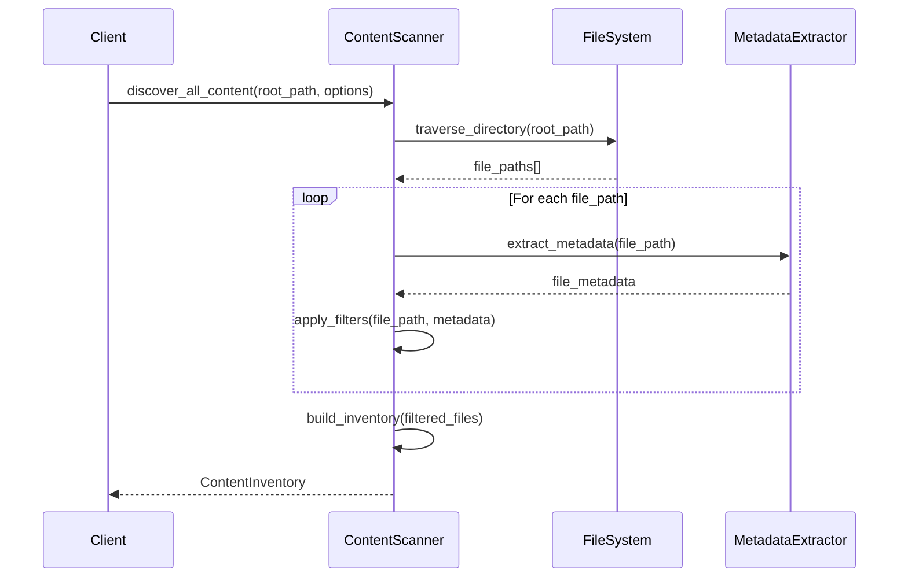
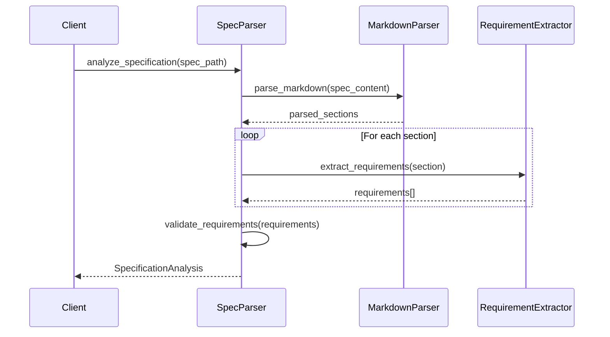
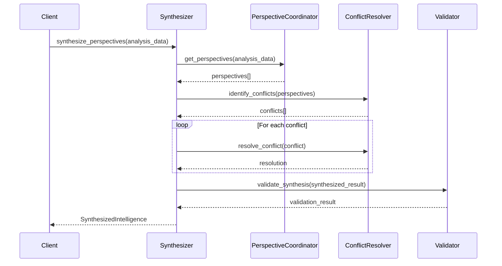

# RM-DDD Component Analysis: Repository Content Discovery and Indexing

## Component Count Analysis

### Total RM-DDD Components: 22

**Foundation Layer (4 components):**
1. ReflectiveModule (200 lines) - Base infrastructure
2. Directus Schema Recovery (150 lines) - Schema restoration
3. ContentMetadataExtractor (200 lines) - Metadata extraction
4. Directus Schema Extension (250 lines) - Schema extension

**Discovery & Analysis Layer (7 components):**
5. ContentScanner (150 lines) - File system scanning
6. ContentClassifier (150 lines) - Content classification
7. ContentInventoryManager (150 lines) - Inventory management
8. SpecificationParser (200 lines) - Spec parsing
9. DependencyAnalyzer (200 lines) - Dependency analysis
10. OverlapDetector (300 lines) - Overlap detection
11. GhostbustersIntegration (250 lines) - Multi-perspective validation

**Integration & Intelligence Layer (4 components):**
12. RCAIntegration (200 lines) - Root cause analysis
13. PDCAIntegration (200 lines) - PDCA orchestration
14. PerspectiveCoordinator (250 lines) - Perspective coordination
15. DeterministicValidator (300 lines) - Validation logic

**API & Services Layer (4 components):**
16. IntelligenceSynthesizer (250 lines) - Intelligence synthesis
17. ContentQueryAPI (200 lines) - Content queries
18. RelationshipAPI (200 lines) - Relationship queries
19. RealTimeService (250 lines) - Real-time updates

**Operations Layer (3 components):**
20. ChangeTracker (300 lines) - Change tracking
21. SecurityManager (300 lines) - Security architecture
22. DisasterRecovery (300 lines) - Disaster recovery

**Total Estimated Lines: 4,950 lines**
**Average Component Size: 225 lines** ✅ (Under 300-line target)

## Testability Assessment

### ❌ INSUFFICIENT - Missing Critical Testing Elements

**Current Testing Coverage:**
- ✅ Unit tests mentioned for each component
- ✅ Integration tests for vertical slices
- ✅ Recursive dependency validation
- ❌ **Missing**: Specific test cases and scenarios
- ❌ **Missing**: Mock/stub strategies for dependencies
- ❌ **Missing**: Performance test specifications
- ❌ **Missing**: Failure scenario testing

**Required Improvements:**
1. **Test Case Specifications**: Each component needs 5-10 specific test scenarios
2. **Mock Strategies**: Clear mocking approach for external dependencies
3. **Performance Benchmarks**: Specific performance criteria and load tests
4. **Chaos Engineering**: Failure injection and recovery testing

## Requirements Clarity Assessment

### ✅ GOOD - Requirements Are Clear

**Strengths:**
- 29 detailed requirements with EARS format acceptance criteria
- Clear requirement traceability in each task
- Specific requirement IDs referenced (R1.1, R2.2, etc.)
- Anti-hallucination requirements (R18) ensure actual implementation

**Areas for Enhancement:**
- Some requirements could benefit from quantitative success criteria
- Performance requirements need specific SLAs and benchmarks

## Interface Definition Assessment

### ❌ INSUFFICIENT - Interfaces Poorly Defined

**Current State:**
- ✅ High-level method signatures mentioned
- ✅ ReflectiveModule base class pattern established
- ❌ **Missing**: Detailed method signatures with parameters
- ❌ **Missing**: Return type specifications
- ❌ **Missing**: Exception handling contracts
- ❌ **Missing**: Interface protocols and contracts

**Critical Gaps:**

### 1. Method Signatures Missing
```python
# Current: Vague description
"Implement discover_all_content() method"

# Needed: Detailed signature
def discover_all_content(
    self, 
    root_path: Path, 
    exclusion_patterns: List[str] = None,
    max_depth: int = None
) -> ContentInventory:
```

### 2. Return Types Undefined
```python
# Current: Generic mention
"Returns ContentInventory"

# Needed: Detailed type specification
@dataclass
class ContentInventory:
    total_files: int
    files_by_type: Dict[ContentType, List[Path]]
    scan_timestamp: datetime
    scan_duration: timedelta
    errors: List[ScanError]
```

### 3. Exception Contracts Missing
```python
# Needed: Exception specifications
class ContentDiscoveryError(Exception):
    """Raised when content discovery fails"""
    
def discover_all_content(...) -> ContentInventory:
    """
    Raises:
        ContentDiscoveryError: When filesystem access fails
        ValidationError: When exclusion patterns are invalid
        PermissionError: When access is denied
    """
```

## Expected Return Values and Types Assessment

### ❌ INSUFFICIENT - Return Types Poorly Specified

**Missing Type Specifications:**

### ContentScanner Return Types:
```python
# Missing detailed specifications
class ContentScanResult:
    discovered_paths: List[Path]
    scan_metadata: ScanMetadata
    exclusions_applied: List[str]
    errors_encountered: List[ScanError]

class ScanMetadata:
    start_time: datetime
    end_time: datetime
    total_files_scanned: int
    total_directories_scanned: int
    scan_depth_achieved: int
```

### SpecificationParser Return Types:
```python
# Missing detailed specifications
class SpecificationAnalysis:
    spec_id: str
    requirements: List[Requirement]
    user_stories: List[UserStory]
    acceptance_criteria: List[AcceptanceCriteria]
    metadata: SpecMetadata
    parsing_errors: List[ParseError]

class Requirement:
    requirement_id: str
    text: str
    priority: Priority
    status: RequirementStatus
    dependencies: List[str]
```

### API Response Types:
```python
# Missing detailed specifications
class QueryResult:
    items: List[ContentItem]
    total_count: int
    page_info: PageInfo
    query_metadata: QueryMetadata
    execution_time: timedelta

class RelationshipQueryResult:
    source_item: ContentItem
    relationships: List[Relationship]
    relationship_metadata: RelationshipMetadata
    traversal_depth: int
```

## Testable Use Cases Assessment

### ❌ INSUFFICIENT - Use Cases Not Defined

**Missing Use Case Specifications:**

### ContentScanner Use Cases:
1. **Happy Path**: Scan repository with 1000+ files, verify all discovered
2. **Error Handling**: Scan with permission denied directories, verify graceful handling
3. **Performance**: Scan large repository (10GB+) within 30 seconds
4. **Filtering**: Apply exclusion patterns, verify correct filtering
5. **Edge Cases**: Empty directories, symlinks, binary files

### SpecificationParser Use Cases:
1. **Valid Spec**: Parse well-formed spec, extract all requirements
2. **Malformed Spec**: Handle markdown parsing errors gracefully
3. **Missing Sections**: Parse spec with missing user stories
4. **Large Spec**: Parse spec with 100+ requirements efficiently
5. **Encoding Issues**: Handle non-UTF8 files correctly

### API Use Cases:
1. **Query Performance**: Return results for 1000+ items within 100ms
2. **Concurrent Access**: Handle 10 simultaneous queries without degradation
3. **Complex Relationships**: Traverse 5-level deep dependency chains
4. **Real-time Updates**: Deliver change notifications within 1 second
5. **Error Recovery**: Graceful degradation when Directus unavailable

## Activity Model Assessment

### ❌ MISSING - No Activity Models Defined

**Required Activity Models for Each Component:**

### 1. ContentScanner Activity Model:


### 2. SpecificationParser Activity Model:


### 3. IntelligenceSynthesizer Activity Model:


## Recommendations for Completion

### 1. Interface Specifications (HIGH PRIORITY)
- Define detailed method signatures with parameters and return types
- Specify exception contracts for each method
- Create comprehensive type definitions for all data structures

### 2. Test Case Specifications (HIGH PRIORITY)
- Define 5-10 specific test scenarios per component
- Specify performance benchmarks and SLAs
- Create chaos engineering test scenarios

### 3. Activity Models (MEDIUM PRIORITY)
- Create sequence diagrams for each component's internal execution
- Define object interaction patterns
- Specify state transitions and error handling flows

### 4. Return Type Definitions (MEDIUM PRIORITY)
- Define comprehensive data classes for all return types
- Specify validation rules and constraints
- Create serialization/deserialization contracts

### 5. Use Case Documentation (MEDIUM PRIORITY)
- Document happy path scenarios with expected outcomes
- Define error handling scenarios with recovery strategies
- Specify performance requirements with measurable criteria

## Summary Assessment

| Aspect | Status | Score | Critical Gaps |
|--------|--------|-------|---------------|
| Component Count | ✅ Complete | 9/10 | None |
| Component Size | ✅ Optimal | 9/10 | All under 300 lines |
| Requirements Clarity | ✅ Good | 8/10 | Need quantitative criteria |
| Interface Definitions | ❌ Insufficient | 4/10 | Missing signatures, types, contracts |
| Return Types | ❌ Insufficient | 3/10 | Missing detailed type specs |
| Test Cases | ❌ Insufficient | 4/10 | Missing specific scenarios |
| Activity Models | ❌ Missing | 1/10 | No internal execution models |

**Overall Readiness: 5.4/10 - NEEDS SIGNIFICANT IMPROVEMENT**

The specification has good architectural structure and component organization, but lacks the detailed interface specifications, type definitions, test cases, and activity models needed for systematic implementation.