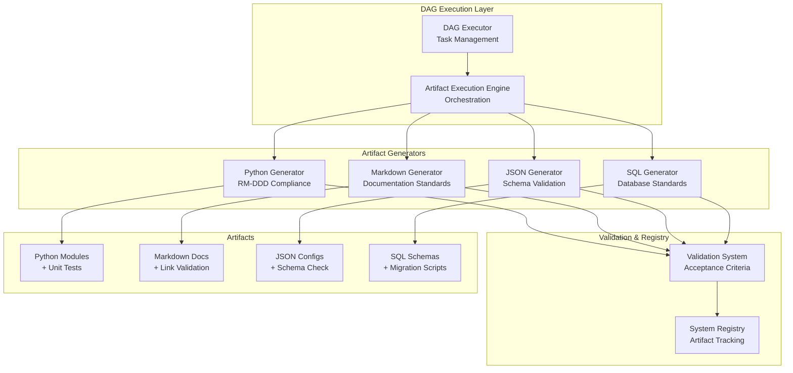

# Artifact-Driven Beast Mode Architecture

## Core Insight: Separation of DAG Logic from Artifact Implementation

Your insight is absolutely critical: **DAG execution logic should be separate from artifact-specific implementation**. This creates a systematic, extensible architecture where:

- **Same DAG execution** can handle different artifact types
- **Different acceptance criteria** for each artifact type
- **Common requirements** can be shared across artifacts
- **Definition of done** is artifact-specific but systematically enforced

## Architecture Overview



## Artifact-Specific Acceptance Criteria

### Python Artifacts
```yaml
definition_of_done:
  - "Valid Python syntax with no syntax errors"
  - "All imports resolve successfully"
  - "Inherits from ReflectiveModule (RM-DDD compliance)"
  - "Implements all required RM-DDD methods"
  - "Has working unit tests with >90% coverage"
  - "All tests pass without errors"
  - "Proper error handling and logging"
  - "Registered in system registry"
  - "Code complexity within acceptable limits"
  - "Follows Python naming conventions"

acceptance_criteria:
  - syntax_valid: AST parsing succeeds
  - imports_valid: All imports resolve
  - rmddd_compliant: ReflectiveModule inheritance detected
  - tests_pass: pytest returns 0 exit code
  - coverage_adequate: coverage >= 90%
  - registered: Entry exists in system registry
```

### Markdown Artifacts
```yaml
definition_of_done:
  - "Valid Markdown syntax with no parsing errors"
  - "Proper heading hierarchy (H1 → H2 → H3)"
  - "All internal links resolve correctly"
  - "All external links are accessible"
  - "Required sections are present and complete"
  - "Spell check passes with no errors"
  - "Follows project documentation standards"
  - "Code blocks have proper syntax highlighting"
  - "Images have alt text and resolve"
  - "Table of contents is accurate (if required)"

acceptance_criteria:
  - markdown_valid: Markdown parser succeeds
  - links_resolve: All links return 200 status
  - sections_complete: Required sections present
  - spell_check_pass: No spelling errors detected
  - standards_compliant: Follows project style guide
```

### JSON Configuration Artifacts
```yaml
definition_of_done:
  - "Valid JSON syntax with no parsing errors"
  - "Conforms to specified JSON schema"
  - "All required fields are present"
  - "Field types match schema requirements"
  - "Validation rules pass"
  - "No security vulnerabilities (secrets exposed)"
  - "Environment-specific values properly templated"

acceptance_criteria:
  - json_valid: JSON.parse() succeeds
  - schema_compliant: Validates against JSON schema
  - security_safe: No hardcoded secrets detected
  - template_ready: Environment variables templated
```

## Common Requirements Across All Artifacts

### Universal Requirements
1. **Persistent Artifact**: Must create a file that persists in the filesystem
2. **Registry Integration**: Must be registered in the system registry
3. **Traceability**: Must trace back to specific requirements
4. **Validation**: Must pass artifact-specific validation
5. **Documentation**: Must include appropriate documentation/comments
6. **Version Control Ready**: Must be suitable for git commit

### Systematic Enforcement
```python
class ArtifactSpec:
    """Universal artifact specification"""
    artifact_type: ArtifactType
    target_path: str
    requirements: List[str]           # From requirements document
    acceptance_criteria: List[str]    # Artifact-specific validation
    definition_of_done: List[str]     # Completion criteria
    dependencies: List[str]           # Other artifacts needed
    metadata: Dict[str, Any]          # Additional context
```

## Implementation Strategy

### 1. DAG Execution Remains Universal
```python
# Same DAG logic for all artifact types
dag_executor.load_task_file(task_file)
task_info = dag_executor.get_task_status(task_id)
dag_executor.update_task_status(task_id, "in_progress")

# Artifact creation is delegated
artifact_result = artifact_engine.execute_artifact_task(task_file, task_id)

# Status update based on definition of done
if artifact_result.success:
    dag_executor.update_task_status(task_id, "completed")
else:
    dag_executor.update_task_status(task_id, "failed")
```

### 2. Artifact Generators Are Specialized
```python
class PythonArtifactGenerator:
    def generate_artifact(self, spec: ArtifactSpec) -> ArtifactResult:
        # Generate Python module
        module_path = self._generate_python_module(spec)
        
        # Generate unit tests (REQUIRED for Python)
        test_path = self._generate_test_suite(spec, module_path)
        
        # Validate Python-specific criteria
        validation_results = {
            'syntax_valid': self._validate_syntax(module_path),
            'tests_pass': self._run_tests(test_path),
            'coverage_adequate': self._check_coverage(test_path) >= 0.9,
            'rmddd_compliant': self._check_rmddd_compliance(module_path)
        }
        
        # Python artifact is NOT done until tests pass
        success = all(validation_results.values())
        
        return ArtifactResult(
            success=success,
            validation_results=validation_results,
            files_created=[module_path, test_path]
        )
```

### 3. Registry Integration Is Systematic
```python
class SystemRegistry:
    def register_artifact(self, artifact_result: ArtifactResult, spec: ArtifactSpec):
        """Register any artifact type in the system registry"""
        entry = {
            'artifact_id': generate_uuid(),
            'artifact_type': spec.artifact_type.value,
            'file_path': artifact_result.artifact_path,
            'requirements_traced': spec.requirements,
            'validation_passed': artifact_result.validation_results,
            'quality_metrics': artifact_result.quality_metrics,
            'created_at': datetime.now(),
            'definition_of_done_met': artifact_result.success
        }
        
        self._registry[entry['artifact_id']] = entry
        return entry['artifact_id']
```

## Key Benefits of This Architecture

### 1. **Extensibility**
- Add new artifact types without changing DAG logic
- Each generator can have completely different implementation
- Common patterns can be shared through base classes

### 2. **Systematic Quality**
- Each artifact type has explicit acceptance criteria
- Definition of done is enforced systematically
- Quality metrics are tracked per artifact type

### 3. **Traceability**
- Every artifact traces back to specific requirements
- Registry maintains complete artifact lifecycle
- Validation results are preserved for audit

### 4. **Flexibility**
- Same requirements can generate different artifact types
- Artifact-specific constraints are properly enforced
- Common requirements are shared systematically

## Example: Python vs Markdown from Same Requirements

### Shared Requirements
```yaml
requirements:
  - "Document the ContentScanner functionality"
  - "Provide usage examples"
  - "Include error handling guidance"
```

### Python Implementation
```python
# Task: 1.1 Implement ContentScanner [cs-a7f3]
# Artifact Type: PYTHON_MODULE
# Definition of Done: Working unit tests REQUIRED

class ContentScanner(ReflectiveModule):
    """Documents ContentScanner functionality through code"""
    
    def scan_content(self, path: Path) -> ScanResult:
        """Provides usage example through implementation"""
        try:
            # Implementation with error handling
            return ScanResult(success=True, files=discovered_files)
        except Exception as e:
            # Error handling guidance through code
            self._logger.error(f"Scan failed: {e}")
            raise ContentScanError(f"Failed to scan {path}: {e}")

# REQUIRED: test_content_scanner.py with >90% coverage
class TestContentScanner:
    def test_scan_content_success(self):
        # Tests MUST pass for Python artifact to be "done"
        assert scanner.scan_content(test_path).success
```

### Markdown Implementation
```markdown
# Task: 1.2 Document ContentScanner [cs-doc]
# Artifact Type: MARKDOWN_DOCUMENT  
# Definition of Done: Links resolve, spell check passes

# ContentScanner Documentation

Documents the ContentScanner functionality through prose.

## Usage Examples

Provides usage examples through documentation:

```python
scanner = ContentScanner()
result = scanner.scan_content(Path("/repo"))
```

## Error Handling Guidance

Error handling guidance through documentation:
- Handle `ContentScanError` for scan failures
- Check `ScanResult.success` before using results
```

## Registry Integration Requirements

### Universal Registry Fields
Every artifact must be registered with:
```python
registry_entry = {
    'artifact_id': str,           # Unique identifier
    'artifact_type': str,         # Python, Markdown, JSON, etc.
    'file_path': str,            # Persistent file location
    'requirements_traced': List[str],  # Source requirements
    'validation_passed': Dict[str, bool],  # Acceptance criteria results
    'definition_of_done_met': bool,    # Overall completion status
    'created_at': datetime,       # Creation timestamp
    'quality_metrics': Dict[str, float],  # Artifact-specific metrics
    'dependencies': List[str],    # Other artifacts this depends on
    'dependents': List[str]       # Other artifacts that depend on this
}
```

### Artifact-Specific Registry Extensions
```python
# Python artifacts add:
python_extensions = {
    'test_coverage': float,       # Percentage coverage
    'complexity_score': float,   # Code complexity metric
    'rmddd_compliant': bool,     # ReflectiveModule compliance
    'test_file_path': str        # Associated test file
}

# Markdown artifacts add:
markdown_extensions = {
    'word_count': int,           # Document length
    'links_validated': int,      # Number of links checked
    'spell_check_score': float,  # Spelling accuracy
    'readability_score': float   # Document readability
}
```

This architecture ensures that **every artifact type has appropriate acceptance criteria and definition of done**, while maintaining **systematic DAG execution** and **comprehensive registry integration**. The separation of concerns makes the system both powerful and extensible.