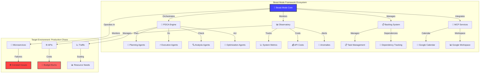
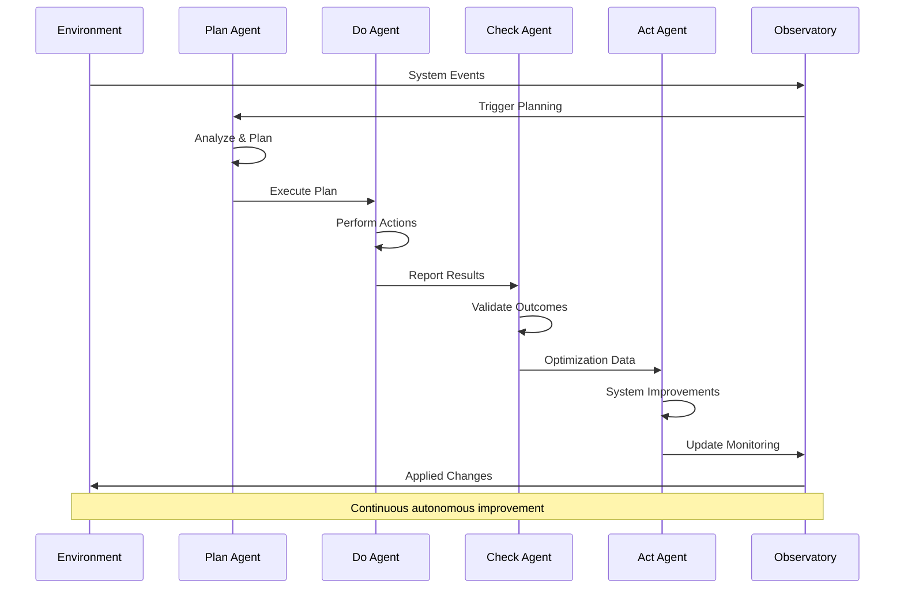

# Beast Mode Framework: Engineering Overview

## What Is This Project?

The **Beast Mode Framework** is an AI-powered, spec-driven development platform designed for the "rough and tumble world" of production distributed systems. Think of it as industrial mining equipment for extracting business value from the volatile, failure-prone environment of modern microservices architecture.

## The Problem We're Solving

### The "Rough and Tumble World" Challenge

Modern production systems are like **volcanic mining planets** - hostile environments where:

- **Services fail constantly** - Network partitions, cascading failures, resource exhaustion
- **Manual intervention is too slow** - By the time humans respond, damage is done
- **Costs spiral out of control** - API usage, cloud resources, and operational overhead
- **Complexity overwhelms teams** - Dependencies, configurations, and coordination chaos

Traditional approaches treat these as "edge cases" to handle. **Beast Mode treats chaos as the baseline operating condition.**

## Our Solution: Industrial-Strength Autonomous Operations

### 🎯 Core Philosophy: "Nkllon Mining Operations"

Just like miners on the volcanic planet Nkllon must use autonomous systems to extract value from extreme environments, Beast Mode provides:

1. **Autonomous Agents** - Systems that respond in milliseconds, not minutes
2. **Systematic PDCA Cycles** - Continuous improvement without human intervention
3. **Real-time Observatory** - Mining control center for distributed systems
4. **Spec-Driven Development** - Clear blueprints for complex operations
5. **Cost Intelligence** - Financial monitoring as a first-class concern

## Technical Architecture

### 🏗️ System Components

| Component | Purpose | Key Features |
|-----------|---------|-------------|
| **[PDCA Engine](other/misc/pdca.mdc)** | Autonomous improvement cycles | Plan → Do → Check → Act automation |
| **[Observatory](observatory-testing-guide.md)** | Real-time monitoring & visualization | Cost tracking, anomaly detection, dashboards |
| **[Backlog System](task/)** | Task & dependency management | Intelligent prioritization, dependency resolution |
| **[MCP Integrations](../.kiro/settings/)** | External service connections | Google Calendar, Workspace, etc. |
| **[CLI Interface](cli-help-documentation.md)** | Command-line operations | `beast-mode` commands for all operations |
| **[API Layer](beast-mode-api-reference.md)** | RESTful service interface | Programmatic access to all features |

### 🔄 The PDCA Heart

Every operation in Beast Mode follows systematic Plan-Do-Check-Act cycles:

## What Makes This Different?

### 🚀 Not Just Another Monitoring Tool

Most systems are **reactive** - they tell you what broke after it's too late. Beast Mode is **proactive** - it predicts, prevents, and automatically resolves issues before they impact business operations.

### 💡 AI-First, Human-Optional

- **Traditional**: Alerts → Human → Manual Fix → Hope
- **Beast Mode**: Detection → AI Analysis → Autonomous Response → Continuous Learning

### 📊 Financial Intelligence Built-In

Unlike traditional ops tools that treat cost as an afterthought, Beast Mode puts **financial monitoring** at the center:
- Real-time API cost tracking
- Budget alerts and automatic scaling
- Cost optimization recommendations
- ROI analysis for operational changes

## Getting Started

### 🏃‍♂️ Quick Start Path

1. **[Installation & Setup](beast-mode-quick-start-tutorial.md)** - Get Beast Mode running in < 30 minutes
2. **[Observatory Dashboard](beast-mode-observatory-simple-explanation.md)** - Your mining control center
3. **[First PDCA Cycle](beast-mode-workflow-guide.md)** - Run your first autonomous improvement
4. **[CLI Mastery](cli-help-documentation.md)** - Command-line power user guide

### 🔧 For DevOps Engineers

- **[Implementation Guide](beast-mode-implementation-guide.md)** - Production deployment strategies
- **[Troubleshooting](beast-mode-troubleshooting.md)** - Common issues and solutions
- **[Testing Guide](observatory-testing-guide.md)** - Validation and quality assurance

### 🧠 For Architects

- **[Architecture Deep Dive](artifact-driven-beast-mode-architecture.md)** - System design and patterns
- **[Integration Patterns](devpost_integration_guide.md)** - Connecting with existing systems
- **[Scalability Considerations](performance-improvements-summary.md)** - Handling growth

## Use Cases & Applications

### 🏭 Production Operations
- **Microservices Monitoring** - Real-time health and performance tracking
- **Cost Management** - API usage optimization and budget control
- **Incident Response** - Autonomous problem detection and resolution
- **Capacity Planning** - Predictive scaling and resource management

### 🔬 Development Workflow
- **Spec-Driven Development** - Clear requirements and design documentation
- **Quality Assurance** - Automated testing and compliance checking
- **Technical Debt Management** - Systematic identification and remediation
- **Team Coordination** - Intelligent task management and dependency tracking

### 📈 Business Intelligence
- **ROI Analysis** - Quantify the value of operational improvements
- **Risk Assessment** - Identify and mitigate operational risks
- **Performance Metrics** - Track system and team effectiveness
- **Strategic Planning** - Data-driven technology decisions

## The Bigger Picture

### 🌍 Industry Context

Beast Mode addresses the **operational complexity crisis** in modern software:

- **Microservices Explosion**: Systems have 10x more moving parts than 5 years ago
- **Cloud Cost Crisis**: Companies spending 20-40% more than needed on infrastructure
- **Alert Fatigue**: Teams overwhelmed by noise, missing critical signals
- **Skills Gap**: Not enough experienced ops engineers to handle complexity manually

### 🎯 Our Mission

**Transform systematic operations from expensive overhead into competitive advantage.**

We believe the future belongs to organizations that can:
1. **Operate autonomously** in chaotic environments
2. **Extract maximum value** from their technical investments
3. **Adapt continuously** without human intervention
4. **Scale operations** faster than they scale teams

## Documentation Navigation

### 📚 By Audience

**👨‍💻 Developers**
- [Quick Start Tutorial](beast-mode-quick-start-tutorial.md)
- [CLI Documentation](cli-help-documentation.md)
- [API Reference](beast-mode-api-reference.md)

**🔧 Operations Engineers**
- [Implementation Guide](beast-mode-implementation-guide.md)
- [Troubleshooting Guide](beast-mode-troubleshooting.md)
- [Observatory Guide](observatory-server-management.md)

**🏗️ Architects**
- [Architecture Overview](artifact-driven-beast-mode-architecture.md)
- [Design Patterns](design/)
- [Integration Strategies](devpost_integration_guide.md)

**👔 Managers**
- [Business Case](white-paper-ideas.md)
- [ROI Analysis](fractal-coordination-sosp-ready.md)
- [Team Adoption](LLM_STAKEHOLDER_MANAGEMENT.md)

### 🗂️ By Topic

**🏛️ Framework Foundation**
- [Core Architecture](artifact-driven-beast-mode-architecture.md)
- [PDCA Implementation](beast-mode-workflow-guide.md)
- [Reflective Module Design](README_RM_DDD_FRAMEWORK.md)

**📊 Observatory & Monitoring**
- [Simple Explanation](beast-mode-observatory-simple-explanation.md)
- [Server Management](observatory-server-management.md)
- [Testing Strategies](observatory-testing-guide.md)

**🔄 Development Process**
- [Spec-Driven Framework](spec-mode-framework-implementation-summary.md)
- [Task Management](beast-mode-task-requirements.md)
- [Quality Assurance](launch-control-checklist.md)

**🔌 Integrations & Extensions**
- [MCP Services](../.kiro/settings/)
- [Google Calendar Integration](../docker/google-calendar-mcp/)
- [DevPost Integration](devpost_integration_guide.md)

## Contributing & Community

### 🤝 Get Involved

This is an active development project. We welcome:

- **Bug reports** and feature requests
- **Documentation** improvements
- **Integration** development
- **Case studies** from production use

### 📞 Support Channels

- **GitHub Issues**: Bug reports and feature requests
- **Documentation**: Comprehensive guides and references
- **Examples**: Real-world implementation patterns

---

**Ready to start mining value from your distributed systems chaos?**

👉 **[Get Started Now](beast-mode-quick-start-tutorial.md)**

---

*Beast Mode Framework: Industrial-strength operations for the rough and tumble world of distributed systems.*