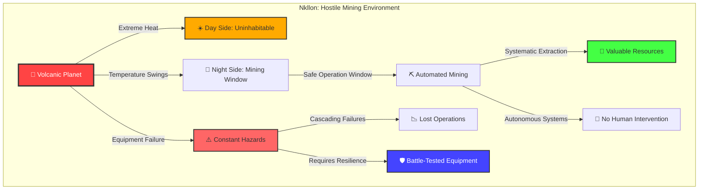
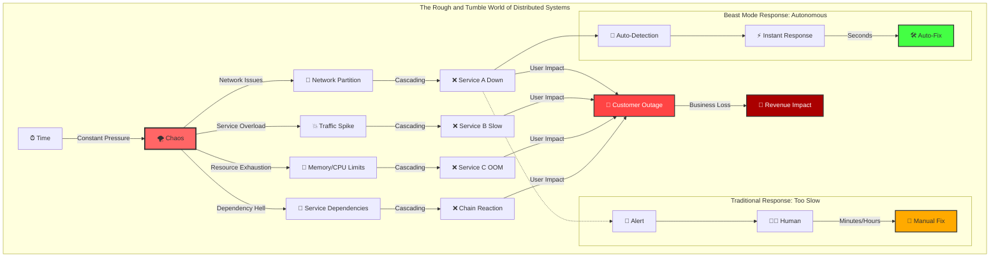
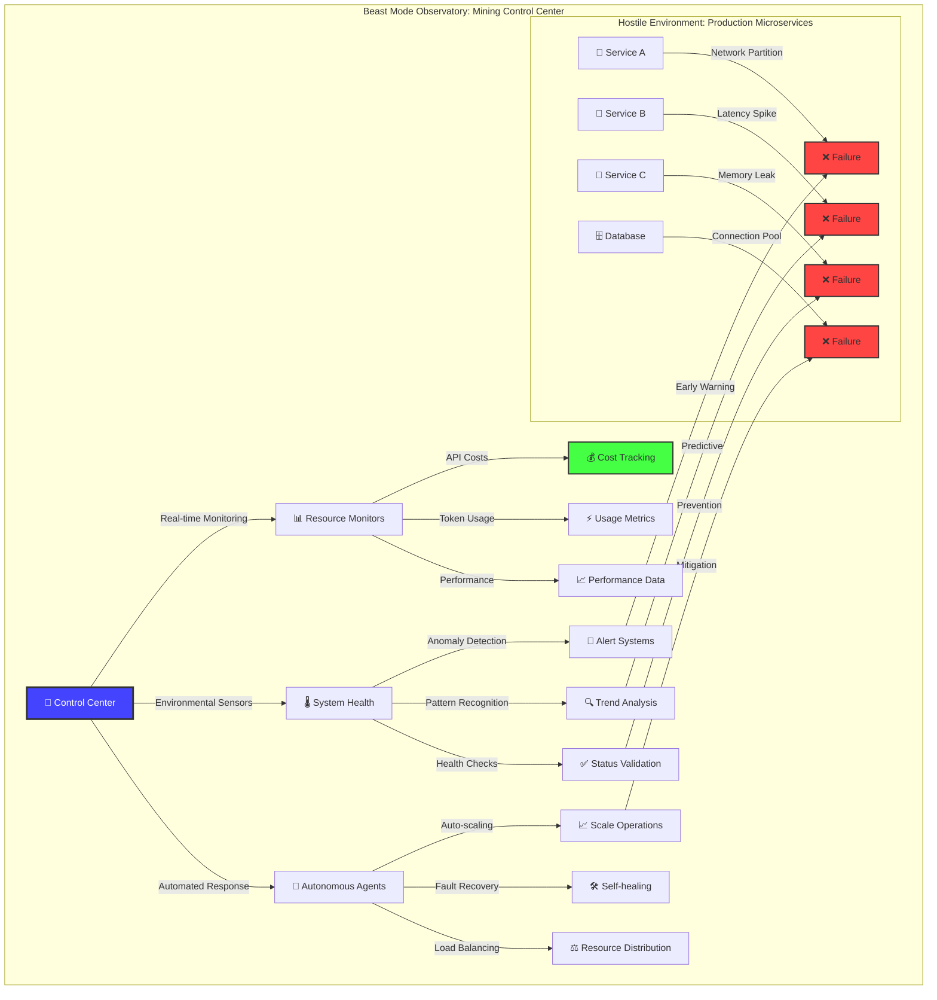
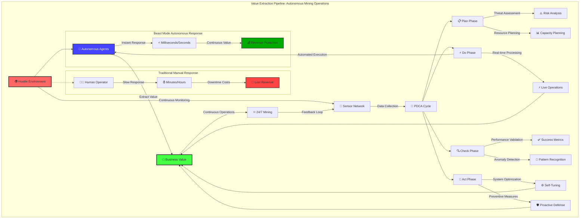

# Beast Mode Observatory Dashboard - Simple Explanation

## What is the Beast Mode Observatory Dashboard?

Think of this dashboard like a **"mission control center"** for computer systems - similar to what NASA uses to monitor space missions, but for managing software projects instead of rockets!

## What it does:

- **Watches over computer programs** like a teacher monitoring their classroom - it can see when things are working well and when they need help
- **Shows pretty charts and graphs** with lots of colors (like a science fair project display) that help people understand how their computer systems are performing
- **Makes boring computer monitoring fun** by adding visual effects like emoji falling like rain on the screen (🚀⚡🔥)
- **Tracks costs** so people know how much their computer systems are spending (like keeping track of a school budget)

## Key features a middle school teacher would relate to:

1. **Real-time monitoring** - Like having eyes in the back of your head to see what all your students (computer programs) are doing
2. **Visual alerts** - When something goes wrong, it lights up with warnings (like a fire alarm)
3. **Progress tracking** - Shows how projects are moving along (like a class progress chart)
4. **Cost management** - Keeps track of expenses so there are no surprises (like monitoring field trip costs)
5. **Fun interface** - Makes the boring job of watching computers more engaging with animations and effects

## The bigger picture:

This is part of the "Beast Mode Framework" - a system designed for what engineers call the **"rough and tumble world"** of distributed systems and microservices. Think of it like mining equipment for a volcanic planet - you need specialized, industrial-strength tools to extract value from extremely hostile environments.

### The "Nkllon Mining" Philosophy

Just as miners on the volcanic planet Nkllon from Star Wars must:
- Operate in extreme, ever-changing conditions where equipment can fail without warning
- Work systematically during "safe windows" when conditions allow
- Use automated systems because manual intervention is too slow and dangerous
- Continue extracting value despite constant environmental threats

The Beast Mode Framework operates in the equally volatile world of production microservices where:
- **Services fail constantly** - networks partition, dependencies cascade into outages
- **Manual intervention is too slow** - you need autonomous agents and automated responses
- **Chaos is the norm** - partial failures, latency spikes, and unexpected load are daily reality
- **Value extraction must continue** - business operations can't stop when individual components fail

The Observatory dashboard is your **mining control center** - it helps you operate safely and profitably in this "rough and tumble" environment by providing the systematic monitoring, automated responses, and predictive intelligence needed to thrive in hostile technical territory.

## Technical Context (for reference):

The Beast Mode Observatory is a real-time monitoring and visualization system that operates like **industrial mining control systems** for the rough and tumble world of distributed infrastructure:

### Core Mining Operations:
- **Resource Extraction Monitoring** - Tracks multi-LLM API costs and token usage across different AI services (like monitoring ore yield and processing costs)
- **Environmental Hazard Detection** - Implements anomaly detection and pattern recognition to spot system failures before they cascade
- **Automated Mining Equipment** - Integrates with Redis task queues, MCP servers, and autonomous agents that operate without human intervention
- **Multi-Site Operations** - Supports multi-environment deployment (local, tunnel, production) like managing multiple mining sites

### Survival Systems:
- **Comprehensive Visibility** - Provides real-time visibility into distributed system coordination (like monitoring all mining operations from a central control room)
- **Self-Preservation** - Includes self-monitoring capabilities and graceful degradation (systems continue operating even when components fail)
- **Operator Engagement** - Transforms systematic coordination monitoring from tedious oversight into an engaging experience through gamification

### The "Beast Mode" Advantage:

Just as successful mining operations on hostile worlds require specialized, battle-tested equipment that can operate autonomously in extreme conditions, the Observatory provides industrial-strength monitoring and control systems designed specifically for the volatile, high-stakes environment of production microservices where failure is constant and manual intervention is too slow.

## References and Further Reading

### Distributed Systems & Microservices
- [Microservices Architecture: The "Rough and Tumble World"](https://martinfowler.com/articles/microservices.html) - Martin Fowler's foundational article on microservices challenges
- [Building Microservices](https://www.oreilly.com/library/view/building-microservices/9781491950340/) - Sam Newman's comprehensive guide to distributed systems complexity
- [The Eight Fallacies of Distributed Computing](https://en.wikipedia.org/wiki/Fallacies_of_distributed_computing) - Understanding why distributed systems are inherently hostile
- [Site Reliability Engineering (SRE) Book](https://sre.google/sre-book/table-of-contents/) - Google's approach to operating reliable distributed systems

### Chaos Engineering & Resilience
- [Principles of Chaos Engineering](https://principlesofchaos.org/) - Building confidence in system behavior despite chaos
- [Netflix's Chaos Monkey](https://netflix.github.io/chaosmonkey/) - Pioneering approach to proactive failure testing
- [Antifragile Systems](https://www.oreilly.com/library/view/antifragile-systems-and/9781492032427/) - Building systems that thrive under stress

### Observatory & Monitoring Philosophy
- [Observability Engineering](https://www.oreilly.com/library/view/observability-engineering/9781492076438/) - Modern approaches to understanding complex systems
- [The Three Pillars of Observability](https://peter.bourgon.org/blog/2017/02/21/metrics-tracing-and-logging.html) - Metrics, logs, and traces
- [OpenTelemetry](https://opentelemetry.io/) - Industry standard for observability data collection

### PDCA & Systematic Operations
- [Plan-Do-Check-Act (PDCA) Cycle](https://en.wikipedia.org/wiki/PDCA) - W. Edwards Deming's systematic improvement methodology
- [Toyota Production System](https://en.wikipedia.org/wiki/Toyota_Production_System) - Industrial applications of systematic quality control
- [DevOps and Continuous Improvement](https://www.atlassian.com/devops/what-is-devops/devops-best-practices) - Applying systematic methodologies to software operations

### Star Wars Extended Universe References
- [Nkllon](https://starwars.fandom.com/wiki/Nkllon/Legends) - The volcanic mining planet from Star Wars Legends
- [Industrial Operations in Hostile Environments](https://starwars.fandom.com/wiki/Category:Mining_planets) - Other examples of extreme environment resource extraction in Star Wars

### Beast Mode Framework Documentation
- [Beast Mode Implementation Guide](beast-mode-implementation-guide.md) - Comprehensive setup and usage guide
- [Beast Mode API Reference](beast-mode-api-reference.md) - Technical API documentation
- [Observatory Testing Guide](observatory-testing-guide.md) - Testing strategies for monitoring systems
- [Beast Mode Troubleshooting](beast-mode-troubleshooting.md) - Common issues and solutions