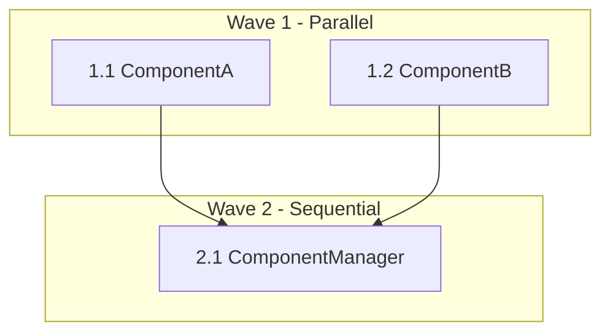

# Beast Mode Workflow Guide

## Overview

Beast Mode is a systematic approach to parallel task execution that enables up to 50% time reduction through intelligent dependency management and parallel execution waves. This guide covers the complete workflow from spec creation to task execution.

## Critical Requirements

### 1. Beast Mode Task Format Mandatory
**⚠️ CRITICAL**: Beast Mode DAG executor can ONLY execute task lists formatted in Beast Mode hierarchical structure. Legacy sequential task lists (1, 2, 3) will NOT work.

### 2. Hash IDs Required
All tasks must have unique hash IDs for tracking and correlation:
- Format: `[prefix-hash]` (e.g., `[cs-a7f3]`, `[cc-b8e4]`)
- Purpose: Enables systematic task tracking across the entire system
- **New in Beast Mode**: Hash IDs were not required in legacy format

### 3. Hierarchical Numbering
Tasks must use phase.task numbering to enable parallel execution:
- ✅ **Correct**: `1.1`, `1.2`, `2.1`, `3.1`, `3.2`
- ❌ **Incorrect**: `1`, `2`, `3`, `4`, `5`

## Beast Mode Workflow

### Phase 1: Spec Creation with Beast Mode Planning

#### Requirements Phase
When creating requirements, consider parallel execution opportunities:

```markdown
## Requirements

### Requirement 1: Parallel Component Development
**User Story:** As a development team, I want to develop components in parallel, so that I can reduce overall implementation time.

#### Acceptance Criteria
1. WHEN components have no dependencies THEN they SHALL be developed in parallel
2. WHEN dependencies exist THEN they SHALL be clearly documented for sequential execution
```

#### Design Phase
Design components for parallel implementation:

```markdown
## Architecture

### Parallel-First Design
- **Independent Components**: Design components with minimal dependencies
- **Clear Interfaces**: Define interfaces early to enable parallel development
- **Dependency Minimization**: Reduce coupling to maximize parallel opportunities
```

#### Task Phase - Beast Mode Format
Create tasks in Beast Mode hierarchical format from the beginning:

```markdown
## Beast Mode Hierarchical Implementation Tasks

### Phase 1: Parallel Foundation ⚡ PARALLEL EXECUTION

- [ ] 1.1 Implement ComponentA [comp-a1b2] ⚡ PARALLEL
  - **Target**: ComponentA (150 lines)
  - **Dependencies**: None
  - Create ComponentA class inheriting from ReflectiveModule
  - _Requirements: 1.1, 16.1, 18.1_

- [ ] 1.2 Implement ComponentB [comp-c3d4] ⚡ PARALLEL
  - **Target**: ComponentB (150 lines)  
  - **Dependencies**: None
  - Create ComponentB class inheriting from ReflectiveModule
  - _Requirements: 1.2, 16.1, 18.1_

### Phase 2: Sequential Integration 🔄 SEQUENTIAL

- [ ] 2.1 Implement ComponentManager [mgr-e5f6] 🔄 SEQUENTIAL (depends on 1.1, 1.2)
  - **Target**: ComponentManager (150 lines)
  - **Dependencies**: ComponentA (1.1), ComponentB (1.2)
  - Create ComponentManager integrating A and B
  - _Requirements: 1.4, 1.5, 16.1, 18.1_
```

### Phase 2: Beast Mode Execution

#### Using Beast Mode DAG Executor

```python
from src.beast_mode.task_dag.dag_task_executor import DAGTaskExecutor

# Initialize executor
executor = DAGTaskExecutor()

# Load Beast Mode task file
dag = executor.load_task_file('.kiro/specs/my-spec/tasks.md')

# Get execution plan
plan = executor.get_execution_plan()
print(f"Total tasks: {plan['total_tasks']}")
print(f"Execution waves: {plan['execution_waves']}")
print(f"Max parallelism: {plan['max_parallelism']}")

# Get next ready tasks
ready_tasks = executor.get_next_ready_tasks()
for task in ready_tasks:
    print(f"Ready: {task['number']}: {task['title']}")

# Update task status
result = executor.update_task_status(
    task_file_path='.kiro/specs/my-spec/tasks.md',
    task_identifier='1.1',
    new_status='in_progress'
)
```

#### Parallel Execution Strategy

1. **Wave 1**: Execute all tasks in Phase 1 simultaneously
2. **Wave 2**: Execute Phase 2 tasks after Phase 1 completes
3. **Continue**: Process subsequent phases based on dependencies

### Phase 3: Monitoring and Optimization

#### Performance Tracking
Beast Mode provides comprehensive execution metrics:

```python
# Get performance metrics
metrics = executor.get_performance_metrics()
print(f"Parallel efficiency: {metrics['parallel_efficiency']}")
print(f"Time reduction: {metrics['time_reduction_percentage']}")
print(f"Resource utilization: {metrics['resource_utilization']}")
```

#### Execution Visualization


## Converting Legacy Specs to Beast Mode

### Automatic Conversion Tool

```bash
# Scan all specs for conversion opportunities
python scripts/convert_to_beast_mode.py --scan-specs --dry-run

# Convert all legacy specs
python scripts/convert_to_beast_mode.py --scan-specs --convert

# Convert single file
python scripts/convert_to_beast_mode.py .kiro/specs/my-spec/tasks.md
```

### Manual Conversion Process

1. **Analyze Dependencies**: Map out which tasks depend on others
2. **Identify Parallel Opportunities**: Find tasks that can run simultaneously
3. **Create Phases**: Group parallel tasks into execution phases
4. **Assign Hierarchical Numbers**: Use phase.task format (1.1, 1.2, 2.1)
5. **Add Hash IDs**: Generate unique identifiers for each task
6. **Add Annotations**: Mark parallel vs sequential execution
7. **Validate**: Test with Beast Mode DAG executor

## Best Practices

### Task Design for Parallelization

#### ✅ Good Parallel Design
```markdown
### Phase 1: Independent Components ⚡ PARALLEL EXECUTION

- [ ] 1.1 Implement DataProcessor [dp-a1b2] ⚡ PARALLEL
  - No external dependencies
  - Self-contained functionality
  - Clear interface definition

- [ ] 1.2 Implement ValidationEngine [ve-c3d4] ⚡ PARALLEL  
  - Independent of DataProcessor
  - Separate responsibility
  - Parallel-safe implementation
```

#### ❌ Poor Parallel Design
```markdown
### Phase 1: Tightly Coupled Components

- [ ] 1.1 Implement DataProcessor [dp-a1b2]
  - Depends on ValidationEngine internal state
  - Shared mutable resources
  - Unclear interface boundaries

- [ ] 1.2 Implement ValidationEngine [ve-c3d4]
  - Depends on DataProcessor implementation details
  - Circular dependency potential
```

### Dependency Management

#### Clear Dependency Declaration
```markdown
- [ ] 2.1 Implement IntegrationManager [im-e5f6] 🔄 SEQUENTIAL (depends on 1.1, 1.2)
  - **Dependencies**: DataProcessor (1.1), ValidationEngine (1.2)
  - **Rationale**: Requires both components to be fully implemented
  - **Integration Points**: Uses interfaces from both components
```

#### Dependency Minimization
- **Design for Independence**: Minimize cross-component dependencies
- **Interface-First**: Define interfaces before implementation
- **Loose Coupling**: Use dependency injection and interfaces
- **Clear Boundaries**: Separate concerns to enable parallel development

### Performance Optimization

#### Parallel Execution Efficiency
- **Balanced Phases**: Distribute work evenly across parallel tasks
- **Resource Awareness**: Consider CPU, memory, and I/O constraints
- **Dependency Optimization**: Minimize sequential bottlenecks
- **Early Integration**: Test integration points early in parallel phases

#### Monitoring and Metrics
- **Execution Time Tracking**: Monitor actual vs. estimated execution times
- **Resource Utilization**: Track CPU, memory usage during parallel execution
- **Bottleneck Identification**: Identify sequential constraints limiting parallelization
- **Continuous Optimization**: Refine task structure based on execution data

## Troubleshooting

### Common Issues

#### "No tasks found" Error
- **Cause**: Task file not in Beast Mode format
- **Solution**: Convert using Beast Mode converter tool
- **Prevention**: Always use Beast Mode format for new specs

#### "Circular dependency detected" Warning
- **Cause**: Tasks have circular dependencies
- **Solution**: Redesign task dependencies to be acyclic
- **Prevention**: Design clear dependency hierarchies

#### Poor Parallel Performance
- **Cause**: Tasks not properly balanced across phases
- **Solution**: Redistribute tasks to balance parallel workload
- **Prevention**: Analyze task complexity during design phase

### Validation Checklist

Before executing Beast Mode tasks:

- [ ] All tasks use hierarchical numbering (1.1, 1.2, 2.1)
- [ ] All tasks have unique hash IDs
- [ ] Dependencies are clearly documented
- [ ] Parallel phases are properly balanced
- [ ] No circular dependencies exist
- [ ] Task file validates with Beast Mode parser

## Integration with Existing Tools

### Kiro IDE Integration
- **Task Status Updates**: Automatic status tracking in IDE
- **Parallel Execution Visualization**: Real-time execution monitoring
- **Dependency Graph Display**: Visual dependency relationships

### PDCA Integration
- **Plan**: Use Beast Mode for systematic planning
- **Do**: Execute tasks with parallel optimization
- **Check**: Monitor execution metrics and performance
- **Act**: Optimize task structure based on results

### RM-DDD Compliance
- **ReflectiveModule Pattern**: All components inherit from ReflectiveModule
- **Health Monitoring**: Comprehensive health status for all components
- **Systematic Approach**: Beast Mode enforces systematic development practices

This Beast Mode workflow enables systematic, parallel-optimized development that can reduce implementation time by up to 50% while maintaining high quality and systematic compliance.