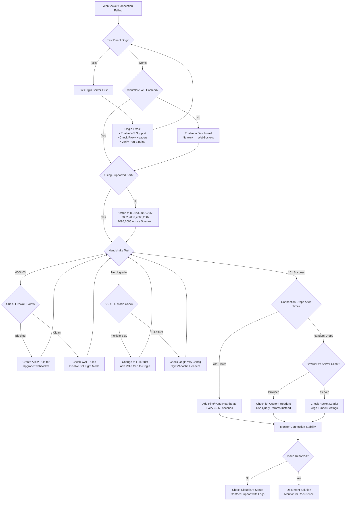

# Cloudflare WebSocket Diagnostic Flowchart

## Root Cause Analysis Decision Tree

This flowchart provides a systematic approach to diagnosing Cloudflare WebSocket issues based on the comprehensive analysis provided.

## Diagnostic Checklist

### Phase 1: Basic Validation
- [ ] Test WebSocket connection bypassing Cloudflare (grey-cloud DNS)
- [ ] Confirm WebSockets enabled in Cloudflare Dashboard
- [ ] Verify using supported port (80, 443, 2052, 2053, 2082, 2083, 2086, 2087, 2095, 2096)

### Phase 2: Handshake Analysis
- [ ] Test handshake with curl: `curl -i -N -H "Connection: Upgrade" -H "Upgrade: websocket" http://example.com`
- [ ] Verify 101 Switching Protocols response
- [ ] Check for 400/403/525/526 errors

### Phase 3: Configuration Review
- [ ] SSL/TLS mode set to "Full (strict)" for wss://
- [ ] Valid certificate on origin server
- [ ] Origin server WebSocket configuration (Nginx/Apache headers)
- [ ] Firewall events in Cloudflare Dashboard

### Phase 4: Connection Stability
- [ ] Implement ping/pong heartbeats (30-60 second intervals)
- [ ] Check for custom headers in browser clients
- [ ] Review WAF rules and Bot Fight Mode settings
- [ ] Test with Rocket Loader disabled

### Phase 5: Advanced Troubleshooting
- [ ] Monitor Cloudflare status page for incidents
- [ ] Check Argo Tunnel configuration if applicable
- [ ] Review connection patterns in analytics
- [ ] Document traffic correlation with failures

## Common Root Causes by Symptom

### Immediate Connection Failure
1. **WebSockets not enabled** → Enable in Dashboard
2. **Unsupported port** → Switch to supported port or use Spectrum
3. **Firewall blocking** → Create allow rule for WebSocket traffic

### Handshake Fails (400/403)
1. **WAF rules triggering** → Review and adjust WAF configuration
2. **Bot Fight Mode** → Disable or create exception
3. **Custom headers in browser** → Use query parameters instead

### SSL/TLS Errors (525/526)
1. **Flexible SSL mode** → Change to Full (strict)
2. **Invalid origin certificate** → Install valid certificate
3. **Origin not supporting HTTPS** → Configure SSL on origin

### Connection Drops After ~100 seconds
1. **Idle timeout** → Implement heartbeat mechanism
2. **No traffic flow** → Ensure regular ping/pong frames

### Random Connection Drops
1. **Cloudflare network updates** → Monitor status page
2. **Origin server issues** → Check origin logs and health
3. **Client-side JavaScript issues** → Review browser console

## Escalation Path

If systematic troubleshooting doesn't resolve the issue:

1. **Gather Evidence**
   - Cloudflare Ray IDs from failed requests
   - Origin server logs during failure
   - Network traces (HAR files)
   - Traffic analytics correlation

2. **Contact Support**
   - Provide systematic test results
   - Include configuration screenshots
   - Share traffic pattern analysis
   - Reference specific error codes and timestamps

3. **Temporary Workarounds**
   - Grey-cloud DNS record (bypass Cloudflare)
   - Use alternative ports if available
   - Implement client-side retry logic
   - Consider Cloudflare Spectrum for custom ports

## Success Metrics

- **Connection Success Rate**: >99% handshake success
- **Connection Stability**: <1% unexpected disconnections
- **Latency Impact**: <50ms additional latency through Cloudflare
- **Heartbeat Efficiency**: Minimal bandwidth overhead (<1KB/minute)