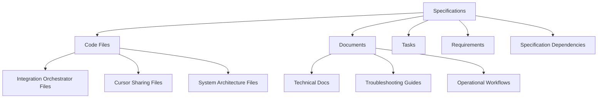

# CMS Artifacts Inventory

**Generated:** January 27, 2025  
**System:** Beast Mode Framework - Directus CMS Integration  
**Status:** Active Configuration Management System

## Overview

The Beast Mode Framework utilizes Directus CMS as a centralized configuration management system with file-based fallback capabilities. This document provides a comprehensive inventory of all artifacts stored and managed within the CMS.

## CMS Infrastructure

### Connection Details
- **CMS URL:** http://localhost:8055
- **Admin Interface:** http://localhost:8055/admin
- **Database:** PostgreSQL (directus_beast_mode)
- **Database Port:** 5433
- **Redis Cache:** localhost:6380

### Authentication
- **Admin Email:** admin@beast-mode.local
- **Admin Password:** beast_mode_admin_secure
- **API Authentication:** Bearer token-based

### Fallback Configuration
- **Fallback Directory:** `config/fallback/`
- **Fallback Mode:** File-based configuration when CMS unavailable
- **Sync Interval:** 15 minutes (configurable)

## Core Collections

### 1. Specifications Collection (`specifications`)

**Purpose:** Central repository for all project specifications and requirements

**Schema:**
```json
{
  "id": "uuid",
  "spec_name": "string",
  "spec_type": "string",
  "status": "string",
  "priority": "integer",
  "content": "text",
  "metadata": "json",
  "created_at": "timestamp",
  "updated_at": "timestamp"
}
```

**Data Source:** `.kiro/specs/` directory structure
- Automatically synced from repository specifications
- Includes requirements.md, design.md, and tasks.md content
- Maintains version history and metadata

**Current Artifacts:**
- Integration Orchestrator Framework
- AI-Driven Cursor Sharing
- Deployment Data Auditor
- System Architecture Validation
- All active `.kiro/specs/` directories

### 2. Code Files Collection (`code_files`)

**Purpose:** Repository source code management and tracking

**Schema:**
```json
{
  "id": "uuid",
  "file_name": "string",
  "file_path": "string",
  "file_type": "string",
  "line_count": "integer",
  "content": "text",
  "specification_id": "uuid",
  "metadata": "json",
  "size_bytes": "integer",
  "synced_at": "timestamp"
}
```

**Data Source:** Repository source code
- `src/**/*.py` - All Python source files
- `scripts/*.py` - Utility and automation scripts
- `*.py` - Root-level Python files

**Relationships:**
- Linked to specifications via `specification_id`
- Automatic relationship detection based on file paths
- Integration orchestrator files → Integration Orchestrator spec
- Cursor sharing files → AI-Driven Cursor Sharing spec

### 3. Documents Collection (`documents`)

**Purpose:** Documentation and markdown file management

**Schema:**
```json
{
  "id": "uuid",
  "title": "string",
  "document_type": "string",
  "content": "text",
  "specification_id": "uuid",
  "metadata": "json",
  "file_path": "string",
  "size_bytes": "integer",
  "synced_at": "timestamp"
}
```

**Data Source:** Repository documentation
- `*.md` - Root-level markdown files
- `docs/*.md` - Documentation directory
- `.kiro/**/*.md` - Kiro-specific documentation

**Content Types:**
- Technical documentation
- Troubleshooting guides
- Operational workflows
- Use case documentation
- Steering rules and governance

### 4. Tasks Collection (`tasks`)

**Purpose:** Implementation task tracking and management

**Schema:**
```json
{
  "id": "uuid",
  "task_name": "string",
  "description": "text",
  "status": "string",
  "priority": "integer",
  "specification_id": "uuid",
  "assigned_to": "string",
  "due_date": "date",
  "metadata": "json"
}
```

**Relationships:**
- Belongs to specifications (`specification_id`)
- Extracted from tasks.md files in specifications
- Maintains task dependencies and status

### 5. Requirements Collection (`requirements`)

**Purpose:** Individual requirement tracking and traceability

**Schema:**
```json
{
  "id": "uuid",
  "requirement_id": "string",
  "description": "text",
  "type": "string",
  "priority": "integer",
  "specification_id": "uuid",
  "acceptance_criteria": "text",
  "status": "string"
}
```

**Relationships:**
- Belongs to specifications (`specification_id`)
- Cascading delete with parent specification
- Maintains requirement traceability matrix

### 6. Specification Dependencies (`specification_dependencies`)

**Purpose:** Inter-specification dependency management

**Schema:**
```json
{
  "id": "uuid",
  "specification_id": "uuid",
  "depends_on_specification_id": "uuid",
  "dependency_type": "string",
  "description": "text"
}
```

**Relationships:**
- Links specifications together
- Enables dependency graph visualization
- Supports DAG validation for specification ordering

## Configuration Collections

### 1. Orchestration Config (`orchestration_config`)

**Purpose:** DAG orchestration and execution settings

**Default Configuration:**
```yaml
default:
  scheduled_generation_interval: 3600
  change_detection_interval: 300
  stale_documentation_threshold: 86400
  max_concurrent_generations: 3
```

**Fallback File:** `config/fallback/orchestration_config.yaml`

### 2. Validation Rules (`validation_rules`)

**Purpose:** System validation thresholds and criteria

**Default Configuration:**
```yaml
accuracy_threshold:
  threshold: 0.95
  enabled: true
staleness_check:
  threshold_hours: 24
  enabled: true
```

**Fallback File:** `config/fallback/validation_rules.yaml`

### 3. Generation Templates (`generation_templates`)

**Purpose:** Documentation generation templates and formats

**Default Configuration:**
```yaml
component_diagram:
  format: plantuml
  include_security: true
  include_real_time: true
```

**Fallback File:** `config/fallback/generation_templates.yaml`

### 4. Monitoring Thresholds (`monitoring_thresholds`)

**Purpose:** Performance monitoring and alerting thresholds

**Default Configuration:**
```yaml
response_time:
  warning: 1000
  critical: 5000
error_rate:
  warning: 0.05
  critical: 0.10
```

**Fallback File:** `config/fallback/monitoring_thresholds.yaml`

## Data Synchronization

### Automatic Sync Process

**Sync Sources:**
1. `.kiro/specs/` → `specifications` collection
2. `src/**/*.py` → `code_files` collection
3. `docs/**/*.md` → `documents` collection
4. Repository structure → relationship mapping

**Sync Frequency:**
- **Manual:** Via `sync_repository_to_directus.py`
- **Automatic:** 15-minute intervals (when CMS available)
- **On-demand:** Through CMS integration API

**Sync Script:** `sync_repository_to_directus.py`
```bash
python sync_repository_to_directus.py
```

### Fallback Strategy

**When CMS Unavailable:**
1. Load configurations from `config/fallback/` directory
2. Use file-based configuration management
3. Cache last known good configurations
4. Automatic reconnection attempts

**Fallback Files:**
- `constraint_validation_20251001_132511.json` - System constraints
- `redis_fallback.json` - Redis fallback configuration
- Collection-specific YAML files for each configuration type

## Relationship Mapping

### Specification-Centric Relationships



### Automatic Relationship Detection

**Code File Mapping:**
- Files containing `integration_orchestrator` → Integration Orchestrator spec
- Files containing `cursor_sharing` → AI-Driven Cursor Sharing spec
- Files in `src/system_architecture/` → System Architecture specs

**Document Mapping:**
- Documents in `.kiro/specs/[spec-name]/` → Corresponding specification
- Troubleshooting docs → Related system specifications
- Operational workflows → Process specifications

## API Access

### REST API Endpoints

**Base URL:** `http://localhost:8055`

**Collections:**
- `GET /items/specifications` - List all specifications
- `GET /items/code_files` - List all code files
- `GET /items/documents` - List all documents
- `GET /items/tasks` - List all tasks
- `GET /items/requirements` - List all requirements

**Authentication:**
```bash
curl -X POST http://localhost:8055/auth/login \
  -H "Content-Type: application/json" \
  -d '{"email": "admin@beast-mode.local", "password": "beast_mode_admin_secure"}'
```

**Example Query:**
```bash
curl -X GET http://localhost:8055/items/specifications \
  -H "Authorization: Bearer YOUR_TOKEN" \
  -H "Content-Type: application/json"
```

### GraphQL API

**Endpoint:** `http://localhost:8055/graphql`

**Example Query:**
```graphql
query {
  specifications {
    id
    spec_name
    status
    code_files {
      file_name
      file_path
    }
    documents {
      title
      document_type
    }
  }
}
```

## Health Monitoring

### CMS Health Endpoints

**Server Health:** `GET /server/health`
**Server Ping:** `GET /server/ping`
**Database Status:** Available through admin interface

### Integration Health

**CMS Integration Status:**
```python
from src.system_architecture.orchestration.cms_integration import CMSIntegration

cms = CMSIntegration()
health_status = cms.get_health_status()
```

**Health Metrics:**
- Connection status to CMS
- Last successful sync timestamp
- Cache hit/miss ratios
- Request success rates
- Fallback activation status

## Deployment Configuration

### Docker Compose Setup

**Primary Configuration:** `docker-compose.directus-fixed.yml`

**Services:**
- `directus-postgres` - PostgreSQL database
- `directus` - Directus CMS application
- `directus-redis` - Redis cache

**Volumes:**
- `directus_postgres_data` - Database persistence
- `directus_uploads` - File uploads
- `directus_redis_data` - Redis persistence

**Networks:**
- `beast_mode_directus_network` - Isolated network (172.30.0.0/16)

### Environment Variables

**Required Variables:**
```bash
DIRECTUS_KEY=directus-beast-mode-key-change-in-production
DIRECTUS_SECRET=directus-beast-mode-secret-change-in-production
DIRECTUS_DB_PASSWORD=directus_secure_password
DIRECTUS_ADMIN_EMAIL=admin@beast-mode.local
DIRECTUS_ADMIN_PASSWORD=beast_mode_admin_secure
DIRECTUS_PUBLIC_URL=http://localhost:8055
```

## Usage Examples

### Accessing Specifications

**Web Interface:**
1. Navigate to http://localhost:8055/admin
2. Login with admin credentials
3. Browse Collections → Specifications

**API Access:**
```python
import requests

# Get all specifications
response = requests.get(
    "http://localhost:8055/items/specifications",
    headers={"Authorization": "Bearer YOUR_TOKEN"}
)
specifications = response.json()["data"]
```

### Querying Related Data

**Get specification with related files:**
```python
# Get specification with code files and documents
response = requests.get(
    "http://localhost:8055/items/specifications/SPEC_ID",
    headers={"Authorization": "Bearer YOUR_TOKEN"},
    params={
        "fields": "*,code_files.*,documents.*,tasks.*"
    }
)
```

### Configuration Management

**Get orchestration config:**
```python
from src.system_architecture.orchestration.cms_integration import CMSIntegration

cms = CMSIntegration()
config = cms.get_configuration("orchestration_config", "default")
```

## Maintenance

### Regular Maintenance Tasks

**Daily:**
- Monitor CMS health status
- Check sync operation success
- Verify fallback file currency

**Weekly:**
- Review relationship mappings
- Update configuration thresholds
- Clean up orphaned records

**Monthly:**
- Database maintenance and optimization
- Review and update access credentials
- Audit configuration changes

### Backup Strategy

**Database Backup:**
```bash
docker exec directus_postgres_fixed pg_dump -U directus directus_beast_mode > backup.sql
```

**Configuration Backup:**
- Fallback files are automatically maintained
- Docker volumes provide persistence
- Regular snapshots recommended

### Troubleshooting

**Common Issues:**
1. **CMS Connection Failed** - Check Docker services, network connectivity
2. **Sync Failures** - Verify authentication, check file permissions
3. **Missing Relationships** - Run relationship population script
4. **Stale Data** - Force manual sync, check sync intervals

**Diagnostic Commands:**
```bash
# Check CMS health
curl http://localhost:8055/server/health

# Check Docker services
docker-compose -f docker-compose.directus-fixed.yml ps

# Manual sync
python sync_repository_to_directus.py
```

## Security Considerations

### Access Control
- Admin-only access to CMS interface
- API token-based authentication
- Network isolation through Docker networks
- Environment variable-based secrets

### Data Protection
- Database encryption at rest
- HTTPS recommended for production
- Regular credential rotation
- Audit logging enabled

### Compliance
- No hardcoded credentials in source code
- Secure environment variable management
- Regular security updates
- Access logging and monitoring

---

**Last Updated:** January 27, 2025  
**Document Version:** 1.0  
**Maintained By:** Beast Mode Framework Team

For questions or updates to this inventory, please refer to the CMS integration documentation or contact the system architecture team.