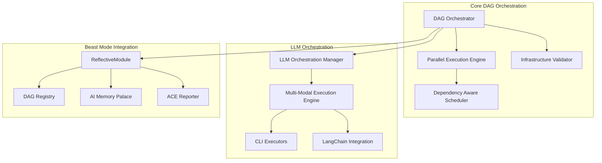

# DAG Orchestrated Parallel Execution System

## Overview

The DAG Orchestrated Parallel Execution System is a comprehensive framework for executing complex tasks in parallel while maintaining dependency consistency through mathematical DAG validation. The system integrates intelligent LLM orchestration, cost management, and multi-modal execution strategies.

## Quick Start

```bash
# Check prerequisites
bash scripts/check_dag_orchestrated_parallel_execution_prereqs.sh

# Execute remaining tasks
bash scripts/execute_dag_orchestration_tasks.sh

# Monitor execution
tail -f logs/dag-orchestration/execution-*.log
```

## Documentation Structure

- [API Reference](api-reference.md) - Complete API documentation
- [Getting Started Guide](getting-started.md) - Step-by-step tutorials
- [Examples](examples/) - Common DAG orchestration patterns
- [Troubleshooting Guide](troubleshooting.md) - Common issues and solutions
- [Performance Tuning](performance-tuning.md) - Optimization recommendations
- [Integration Guide](integration-guide.md) - Beast Mode component integration
- [Operations Runbook](operations-runbook.md) - Production deployment and maintenance

## System Status

**Current Implementation Status:** 89% Complete (55/62 tasks)

### ✅ Fully Implemented
- Mathematical DAG validation with cycle detection
- Parallel execution engine with dependency-aware scheduling
- Resource management with dynamic concurrency adjustment
- Comprehensive error handling and failure isolation
- Monitoring and observability with Prometheus metrics
- LLM orchestration with CLI discovery and execution

### 🔄 In Progress
- Multi-modal LLM execution engine (LangChain/LangGraph integration)
- Comprehensive documentation and examples
- Production deployment framework

### 📋 Remaining Tasks
- Advanced configuration and analytics
- Extended integration examples
- Performance optimization guides

## Architecture Overview



## Key Features

### Mathematical DAG Validation
- Cycle detection using DFS algorithms (O(V+E))
- Topological sorting for execution ordering
- Dependency consistency enforcement
- Mathematical proof of implementability

### Parallel Execution Engine
- Dynamic concurrency adjustment based on resources
- Failure isolation to prevent cascade effects
- Multiple execution strategies (parallel, sequential, adaptive)
- Resource-aware task scheduling

### LLM Orchestration
- Intelligent LLM selection based on cost and capability
- Multi-modal execution (CLI, LangChain, streaming)
- Automatic fallback and resilience
- Comprehensive cost tracking and budget management

### Beast Mode Integration
- ReflectiveModule pattern for systematic observability
- Automatic Prometheus metrics and health endpoints
- Integration with AI Memory Palace for learning
- ACE Reporter for progress broadcasting

## Getting Help

- **Documentation Issues**: Check [troubleshooting guide](troubleshooting.md)
- **API Questions**: See [API reference](api-reference.md)
- **Integration Help**: Review [integration guide](integration-guide.md)
- **Performance Issues**: Consult [performance tuning guide](performance-tuning.md)

## Contributing

This system follows the Beast Mode framework patterns and systematic development governance. All contributions must:

1. Inherit from ReflectiveModule for observability
2. Include comprehensive test coverage (>90%)
3. Follow DAG compliance for dependencies
4. Maintain mathematical consistency
5. Include documentation updates

## License

Part of the Kiro AI Development Hackathon submission.