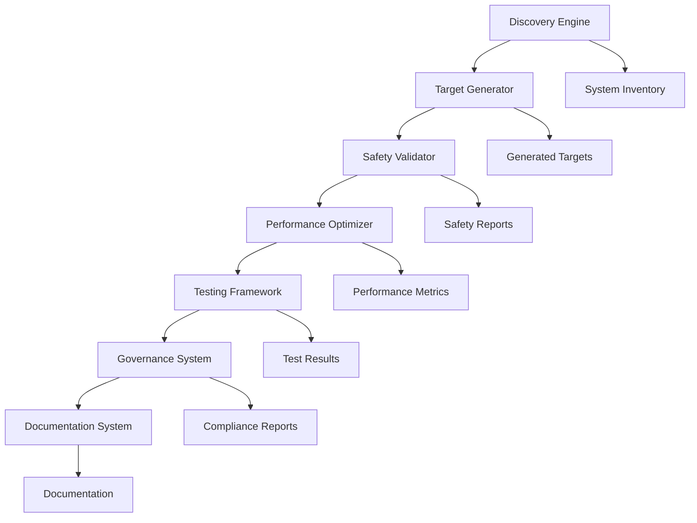

# Comprehensive Makefile System Guide

## Overview

The Comprehensive Makefile System is an advanced, AI-powered development framework that provides systematic access to all project capabilities through a unified Makefile interface. This system automatically discovers project components, generates appropriate targets, and provides safety validation, performance optimization, and comprehensive testing capabilities.

## Table of Contents

1. [Quick Start](#quick-start)
2. [System Architecture](#system-architecture)
3. [Core Components](#core-components)
4. [Usage Guide](#usage-guide)
5. [Advanced Features](#advanced-features)
6. [Troubleshooting](#troubleshooting)
7. [Best Practices](#best-practices)
8. [API Reference](#api-reference)

## Quick Start

### Installation

The Comprehensive Makefile System is already integrated into your project. No additional installation is required.

### Basic Usage

```bash
# Show all available targets
make help

# Run system discovery
make discover-system

# Validate system safety
make validate-safety

# Run comprehensive tests
make test-system

# Generate performance report
make performance-report
```

### First Steps

1. **Discover your system capabilities:**
   ```bash
   make discover-system
   ```

2. **Validate your current setup:**
   ```bash
   make validate-targets
   ```

3. **Run a quick system test:**
   ```bash
   make test-quick
   ```

## System Architecture

### Core Components

```
Comprehensive Makefile System
├── Discovery Engine          # Automatic system discovery
├── Target Generator         # Dynamic target generation
├── Safety Validator        # Safety and security validation
├── Performance Optimizer   # Performance optimization
├── Testing Framework       # Comprehensive testing
├── Governance System       # Quality and compliance
└── Documentation System    # Automated documentation
```

### Component Interaction



## Core Components

### 1. Discovery Engine (`scripts/makefile_system_discovery.py`)

Automatically discovers and catalogs all system capabilities:

- **Script Discovery**: Scans `scripts/`, `src/`, and root directories
- **Service Detection**: Identifies running processes and Docker containers
- **Capability Mapping**: Categorizes discovered components by function
- **System Classification**: Organizes components by system type

**Usage:**
```bash
# Run discovery
python scripts/makefile_system_discovery.py

# Generate discovery report
python scripts/makefile_system_discovery.py --output reports/discovery.json

# Verbose discovery
python scripts/makefile_system_discovery.py --verbose
```

### 2. Target Generator (`scripts/makefile_target_generator.py`)

Generates dynamic Makefile targets based on discovered capabilities:

- **Category Organization**: Groups targets by system (Observatory, Beast Mode, etc.)
- **Dynamic Generation**: Creates targets based on available scripts and services
- **Modular System**: Uses `.make-tasks/generated-targets.mk` for organization
- **Dependency Management**: Handles target dependencies automatically

### 3. Safety Validator (`scripts/makefile_safety_validator.py`)

Comprehensive safety validation system:

- **Prerequisite Checking**: Validates system requirements before execution
- **Dangerous Operation Detection**: Identifies and blocks risky commands
- **Confirmation Prompts**: Requires user confirmation for destructive operations
- **Error Handling**: Provides clear error messages and suggestions

**Usage:**
```bash
# Validate a target
python scripts/makefile_safety_validator.py target_name

# Interactive validation
python scripts/makefile_safety_validator.py target_name --interactive

# Validate with specific commands
python scripts/makefile_safety_validator.py target_name --commands "rm -rf build/"
```

### 4. Performance Optimizer (`scripts/makefile_performance_optimizer.py`)

Advanced performance optimization engine:

- **Parallel Execution**: Optimizes target execution using multiple workers
- **Intelligent Caching**: Caches expensive operations in `.make-tasks/cache/`
- **Progress Indicators**: Shows progress for long-running operations
- **Execution Strategies**: Adaptive execution based on operation type

**Usage:**
```bash
# Optimize target execution
python scripts/makefile_performance_optimizer.py target_name --commands "command1" "command2"

# Configure parallel workers
python scripts/makefile_performance_optimizer.py target_name --workers 8

# Use specific cache strategy
python scripts/makefile_performance_optimizer.py target_name --cache hybrid

# Generate performance report
python scripts/makefile_performance_optimizer.py --report
```

### 5. Testing Framework (`scripts/test_makefile_system.py`)

Comprehensive testing and validation suite:

- **Multiple Test Types**: Unit, integration, system, performance, security tests
- **Target Validation**: Validates all Makefile targets
- **Automated Testing**: Built-in test cases for common scenarios
- **Detailed Reporting**: Comprehensive test reports with metrics

**Usage:**
```bash
# Run all tests
python scripts/test_makefile_system.py

# Run specific test type
python scripts/test_makefile_system.py --type integration

# Test specific target
python scripts/test_makefile_system.py --target observatory

# Validate all targets
python scripts/test_makefile_system.py --validate-targets

# Generate test report
python scripts/test_makefile_system.py --report reports/test_results.json
```

### 6. Target Validator (`scripts/validate_makefile_targets.py`)

Specialized target validation system:

- **Syntax Validation**: Checks Makefile syntax and structure
- **Dependency Analysis**: Validates target dependencies and detects cycles
- **Safety Assessment**: Evaluates target safety and security
- **Performance Analysis**: Assesses performance characteristics

**Usage:**
```bash
# Validate all targets
python scripts/validate_makefile_targets.py

# Validate specific target
python scripts/validate_makefile_targets.py --target help

# Comprehensive validation
python scripts/validate_makefile_targets.py --level comprehensive

# Generate dependency graph
python scripts/validate_makefile_targets.py --graph
```

### 7. Makefile Linter (`scripts/lint_makefile.py`)

Quality assurance and style enforcement:

- **Syntax Checking**: Validates Makefile syntax and structure
- **Style Enforcement**: Enforces coding standards and best practices
- **Security Analysis**: Identifies security issues and vulnerabilities
- **Performance Recommendations**: Suggests performance improvements

**Usage:**
```bash
# Lint all Makefiles
python scripts/lint_makefile.py

# Lint specific file
python scripts/lint_makefile.py Makefile

# Generate lint report
python scripts/lint_makefile.py --report reports/lint_report.json

# Show only errors and warnings
python scripts/lint_makefile.py --severity warning
```

## Usage Guide

### System Categories

The Makefile system organizes targets into logical categories:

#### Observatory System
- `observatory-start`: Start Observatory services
- `observatory-stop`: Stop Observatory services
- `observatory-status`: Check Observatory status
- `observatory-health`: Health check
- `observatory-logs`: View logs
- `observatory-deploy`: Deploy Observatory

#### Beast Mode Framework
- `beast-test`: Run Beast Mode tests
- `beast-compliance`: Check compliance
- `beast-fix`: Fix issues automatically
- `beast-metrics`: Generate metrics

#### DAG Orchestration
- `dag-validate`: Validate DAG structure
- `dag-execute`: Execute DAG workflow
- `dag-monitor`: Monitor DAG execution
- `dag-status`: Check DAG status

#### Infrastructure Management
- `infra-deploy`: Deploy infrastructure
- `infra-monitor`: Monitor infrastructure
- `infra-validate`: Validate infrastructure
- `infra-backup`: Backup infrastructure

#### Development Workflow
- `dev-test`: Run development tests
- `dev-lint`: Lint code
- `dev-format`: Format code
- `dev-validate`: Validate development setup

#### Governance and Quality
- `governance-scan`: Scan for orphaned solutions
- `governance-status`: Check governance status
- `governance-report`: Generate governance report
- `quality-check`: Run quality checks

### Common Workflows

#### 1. New Developer Setup
```bash
# Discover system capabilities
make discover-system

# Validate setup
make validate-targets

# Run quick tests
make test-quick

# Check system health
make health-check
```

#### 2. Development Workflow
```bash
# Start development environment
make dev-start

# Run tests
make dev-test

# Lint and format code
make dev-lint
make dev-format

# Validate changes
make dev-validate
```

#### 3. Deployment Workflow
```bash
# Validate safety
make validate-safety

# Run comprehensive tests
make test-comprehensive

# Deploy infrastructure
make infra-deploy

# Deploy services
make deploy-all

# Validate deployment
make validate-deployment
```

#### 4. Maintenance Workflow
```bash
# Check system health
make health-check

# Run governance scan
make governance-scan

# Generate reports
make generate-reports

# Clean up
make clean-all
```

## Advanced Features

### 1. Parallel Execution

The system supports parallel execution for independent targets:

```bash
# Run targets in parallel
make -j4 target1 target2 target3

# Optimize parallel execution
make optimize-parallel
```

### 2. Caching System

Intelligent caching for expensive operations:

```bash
# Enable caching
export MAKEFILE_CACHE=enabled

# Clear cache
make clear-cache

# Cache statistics
make cache-stats
```

### 3. Safety Validation

Comprehensive safety validation:

```bash
# Validate target safety
make validate-safety TARGET=dangerous-target

# Interactive safety check
make safety-check-interactive

# Safety report
make safety-report
```

### 4. Performance Optimization

Advanced performance optimization:

```bash
# Performance analysis
make performance-analyze

# Optimize execution
make performance-optimize

# Performance report
make performance-report
```

### 5. Comprehensive Testing

Multi-level testing framework:

```bash
# Unit tests
make test-unit

# Integration tests
make test-integration

# System tests
make test-system

# Performance tests
make test-performance

# Security tests
make test-security

# All tests
make test-all
```

## Troubleshooting

### Common Issues

#### 1. Target Not Found
```bash
# Error: make: *** No rule to make target 'missing-target'
# Solution: Run discovery to update targets
make discover-system
```

#### 2. Permission Denied
```bash
# Error: Permission denied
# Solution: Check file permissions
make validate-permissions
```

#### 3. Dependency Issues
```bash
# Error: Circular dependency detected
# Solution: Validate target dependencies
make validate-dependencies
```

#### 4. Performance Issues
```bash
# Error: Target execution too slow
# Solution: Run performance optimization
make optimize-performance
```

### Diagnostic Commands

```bash
# System diagnostics
make diagnose-system

# Target diagnostics
make diagnose-target TARGET=target-name

# Performance diagnostics
make diagnose-performance

# Safety diagnostics
make diagnose-safety
```

### Debug Mode

Enable debug mode for detailed logging:

```bash
# Enable debug mode
export MAKEFILE_DEBUG=1

# Run with verbose output
make target-name VERBOSE=1

# Generate debug report
make debug-report
```

## Best Practices

### 1. Target Naming

- Use lowercase letters, numbers, hyphens, and underscores
- Follow the pattern: `system-action` (e.g., `observatory-start`)
- Use descriptive names that clearly indicate purpose

### 2. Documentation

- Add `##` comments to document target purpose
- Include usage examples in comments
- Document prerequisites and dependencies

### 3. Safety

- Always validate dangerous operations
- Use confirmation prompts for destructive actions
- Implement proper error handling

### 4. Performance

- Use parallel execution where appropriate
- Implement caching for expensive operations
- Optimize command sequences

### 5. Testing

- Write tests for all custom targets
- Use multiple test types (unit, integration, system)
- Maintain high test coverage

### 6. Maintenance

- Run regular governance scans
- Keep documentation up to date
- Monitor system performance
- Review and update safety rules

## API Reference

### Discovery Engine API

```python
from scripts.makefile_system_discovery import MakefileSystemDiscovery

# Initialize discovery engine
discovery = MakefileSystemDiscovery(".")

# Discover all systems
systems = discovery.discover_all_systems()

# Generate report
report = discovery.generate_discovery_report()
```

### Safety Validator API

```python
from scripts.makefile_safety_validator import MakefileSafetyValidator

# Initialize validator
validator = MakefileSafetyValidator(".")

# Validate target
report = validator.validate_target("target-name", ["command1", "command2"])

# Check if can proceed
can_proceed = validator.prompt_user_confirmation(report)
```

### Performance Optimizer API

```python
from scripts.makefile_performance_optimizer import MakefilePerformanceOptimizer

# Initialize optimizer
optimizer = MakefilePerformanceOptimizer(".")

# Optimize target execution
result = optimizer.optimize_target_execution("target-name", ["command1", "command2"])

# Get performance report
report = optimizer.get_performance_report()
```

### Testing Framework API

```python
from scripts.test_makefile_system import MakefileSystemTester

# Initialize tester
tester = MakefileSystemTester(".")

# Run all tests
results = tester.run_all_tests()

# Run specific test type
results = tester.run_tests_by_type(TestType.INTEGRATION)

# Validate targets
validation = tester.validate_makefile_targets()
```

## Configuration

### Environment Variables

- `MAKEFILE_DEBUG`: Enable debug mode (0/1)
- `MAKEFILE_CACHE`: Enable caching (enabled/disabled)
- `MAKEFILE_PARALLEL`: Default parallel workers (number)
- `MAKEFILE_TIMEOUT`: Default timeout in seconds (number)
- `MAKEFILE_SAFETY`: Safety level (strict/normal/permissive)

### Configuration Files

#### `.make-tasks/config.json`
```json
{
  "discovery": {
    "scan_directories": ["scripts", "src", "."],
    "exclude_patterns": ["*.pyc", "__pycache__", ".git"]
  },
  "safety": {
    "require_confirmation": ["clean", "reset", "delete"],
    "dangerous_patterns": ["rm -rf", "sudo rm"],
    "protected_paths": ["/", "/usr", "/bin"]
  },
  "performance": {
    "max_workers": 4,
    "cache_ttl": 3600,
    "enable_progress": true
  },
  "testing": {
    "test_timeout": 300,
    "parallel_tests": true,
    "coverage_threshold": 0.8
  }
}
```

## Integration

### CI/CD Integration

```yaml
# .github/workflows/makefile-validation.yml
name: Makefile Validation
on: [push, pull_request]

jobs:
  validate:
    runs-on: ubuntu-latest
    steps:
      - uses: actions/checkout@v2
      - name: Validate Makefile System
        run: |
          make validate-targets
          make test-system
          make lint-makefiles
          make safety-check
```

### IDE Integration

#### VS Code
```json
{
  "tasks": [
    {
      "label": "Makefile: Discover System",
      "type": "shell",
      "command": "make discover-system",
      "group": "build"
    },
    {
      "label": "Makefile: Run Tests",
      "type": "shell",
      "command": "make test-system",
      "group": "test"
    }
  ]
}
```

## Support and Contributing

### Getting Help

1. Check the troubleshooting section
2. Run diagnostic commands
3. Review system logs
4. Check the issue tracker

### Contributing

1. Follow the coding standards
2. Add tests for new features
3. Update documentation
4. Run the full test suite
5. Submit a pull request

### Reporting Issues

When reporting issues, include:

- System information (`make system-info`)
- Error messages and logs
- Steps to reproduce
- Expected vs actual behavior

---

## Appendix

### System Requirements

- Python 3.9+
- Make 4.0+
- Git 2.0+
- Docker (optional, for container services)

### File Structure

```
project/
├── Makefile                           # Main Makefile
├── makefiles/                         # Modular Makefiles
│   ├── governance.mk                  # Governance targets
│   ├── testing.mk                     # Testing targets
│   └── generated-targets.mk           # Auto-generated targets
├── scripts/                           # Core system scripts
│   ├── makefile_system_discovery.py   # Discovery engine
│   ├── makefile_safety_validator.py   # Safety validator
│   ├── makefile_performance_optimizer.py # Performance optimizer
│   ├── test_makefile_system.py        # Testing framework
│   ├── validate_makefile_targets.py   # Target validator
│   └── lint_makefile.py               # Makefile linter
├── .make-tasks/                       # System data
│   ├── cache/                         # Performance cache
│   ├── config.json                    # Configuration
│   └── generated-targets.mk           # Generated targets
├── reports/                           # Generated reports
│   ├── discovery.json                 # Discovery report
│   ├── safety.json                    # Safety report
│   ├── performance.json               # Performance report
│   └── test_results.json              # Test results
└── docs/                              # Documentation
    └── makefile_system_guide.md       # This guide
```

### Glossary

- **Discovery Engine**: System that automatically finds and catalogs project capabilities
- **Target Generator**: Component that creates Makefile targets based on discovered capabilities
- **Safety Validator**: System that validates operations for safety and security
- **Performance Optimizer**: Engine that optimizes execution performance
- **Governance System**: Framework for maintaining quality and compliance
- **DAG**: Directed Acyclic Graph, used for dependency management
- **Phony Target**: Makefile target that doesn't create a file
- **Beast Mode**: Systematic approach to development and operations

---

*This guide is automatically maintained by the Comprehensive Makefile System. Last updated: 2025-01-27*