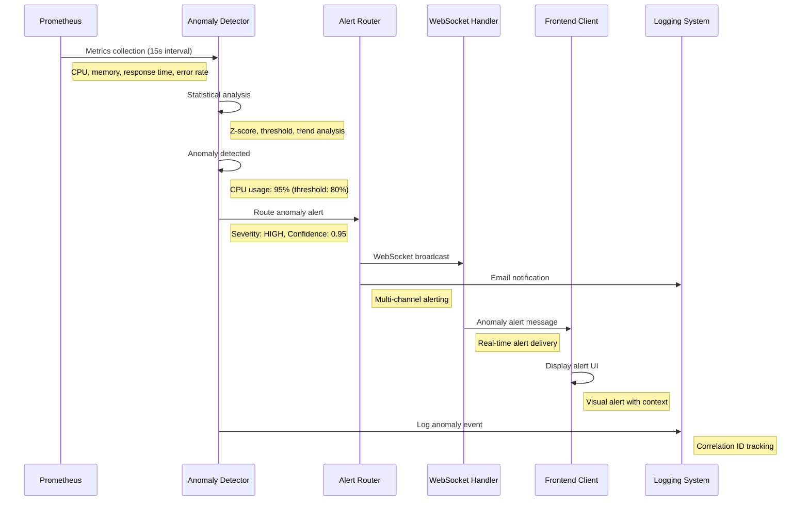
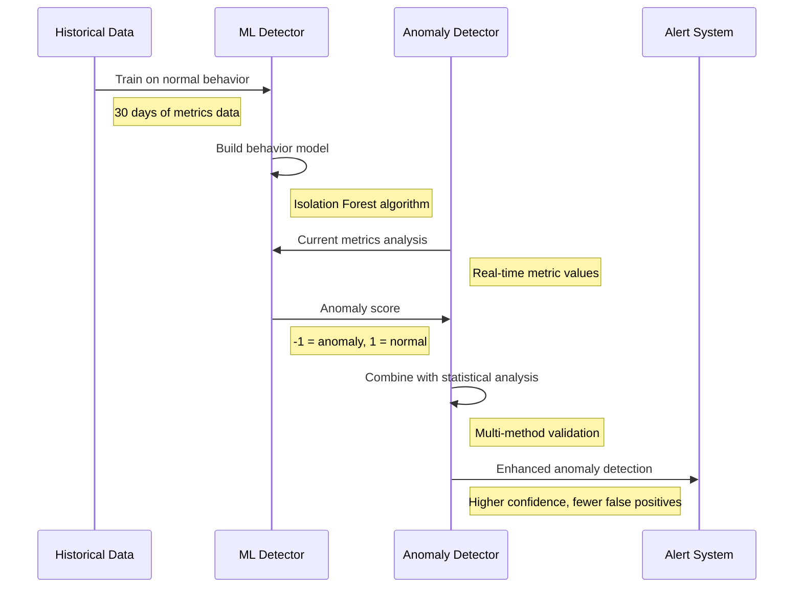

# Anomaly Detection Flow Documentation

## Overview

The anomaly detection flow provides real-time monitoring and alerting for system performance anomalies through integrated Prometheus metrics collection, detection algorithms, and WebSocket-based alert distribution. This workflow demonstrates the systematic approach to proactive system monitoring within the Beast Mode framework.

## Flow Architecture

### 1. Metrics Collection Layer

**Component**: Prometheus Server + ReflectiveModule Integration
**Location**: `localhost:9090`
**Collection Interval**: 15 seconds (configurable)

#### Metric Sources
```python
# ReflectiveModule automatic metrics registration
class MetricsSources:
    observatory_metrics = [
        "observatory_websocket_connections_total",
        "observatory_request_duration_seconds",
        "observatory_error_rate_percent",
        "observatory_memory_usage_bytes",
        "observatory_cpu_usage_percent"
    ]
    
    system_metrics = [
        "node_cpu_usage_percent",
        "node_memory_usage_percent", 
        "node_disk_usage_percent",
        "node_network_throughput_bytes"
    ]
    
    application_metrics = [
        "dag_execution_duration_seconds",
        "websocket_message_latency_ms",
        "redis_coordination_latency_ms",
        "tunnel_response_time_ms"
    ]
```

#### Prometheus Scrape Configuration
```yaml
# prometheus.yml - Anomaly Detection Targets
scrape_configs:
  - job_name: 'observatory-server'
    static_configs:
      - targets: ['localhost:8888']
    scrape_interval: 15s
    metrics_path: '/metrics'
    
  - job_name: 'reflective-modules'
    static_configs:
      - targets: ['localhost:8888', 'localhost:9090', 'localhost:3000']
    scrape_interval: 30s
    
  - job_name: 'system-metrics'
    static_configs:
      - targets: ['localhost:9100']  # Node exporter
    scrape_interval: 15s
```

### 2. Anomaly Detection Engine

**Component**: Observatory Anomaly Detector
**Location**: `src/observatory_infrastructure/anomaly_detector.py`
**Algorithm**: Statistical analysis with machine learning enhancement

#### Detection Algorithms

**Statistical Anomaly Detection**:
```python
@dataclass
class AnomalyDetectionConfig:
    # Statistical thresholds
    z_score_threshold: float = 3.0  # Standard deviations from mean
    percentile_threshold: float = 95.0  # 95th percentile threshold
    window_size_minutes: int = 30  # Rolling window for analysis
    
    # Performance thresholds
    response_time_threshold_ms: float = 1000.0
    error_rate_threshold_percent: float = 5.0
    cpu_usage_threshold_percent: float = 80.0
    memory_usage_threshold_percent: float = 85.0
    
    # WebSocket specific thresholds
    websocket_latency_threshold_ms: float = 500.0
    connection_drop_rate_threshold: float = 0.1
    message_queue_size_threshold: int = 1000

class AnomalyDetector(ReflectiveModule):
    """Detects performance anomalies using statistical analysis."""
    
    def __init__(self, config: AnomalyDetectionConfig):
        super().__init__()
        self.module_id = "AnomalyDetector"
        self._config = config
        self._metric_history = {}
        self._anomaly_cache = {}
        
    async def analyze_metrics(self, metrics: Dict[str, float]) -> List[Anomaly]:
        """Analyze metrics for anomalies using multiple detection methods."""
        anomalies = []
        
        for metric_name, current_value in metrics.items():
            # Statistical analysis
            z_score_anomaly = self._detect_z_score_anomaly(metric_name, current_value)
            if z_score_anomaly:
                anomalies.append(z_score_anomaly)
            
            # Threshold analysis
            threshold_anomaly = self._detect_threshold_anomaly(metric_name, current_value)
            if threshold_anomaly:
                anomalies.append(threshold_anomaly)
            
            # Trend analysis
            trend_anomaly = self._detect_trend_anomaly(metric_name, current_value)
            if trend_anomaly:
                anomalies.append(trend_anomaly)
        
        return anomalies
```

**Machine Learning Enhancement**:
```python
class MLAnomalyDetector:
    """Machine learning-based anomaly detection for complex patterns."""
    
    def __init__(self):
        self._isolation_forest = IsolationForest(contamination=0.1)
        self._trained = False
        
    def train_on_historical_data(self, historical_metrics: pd.DataFrame):
        """Train ML model on historical normal behavior."""
        self._isolation_forest.fit(historical_metrics)
        self._trained = True
        
    def detect_anomalies(self, current_metrics: np.array) -> float:
        """Return anomaly score (-1 = anomaly, 1 = normal)."""
        if not self._trained:
            return 1  # Default to normal if not trained
        
        return self._isolation_forest.decision_function([current_metrics])[0]
```

### 3. Alert Classification and Routing

**Component**: Alert Manager Integration
**Location**: `src/observatory_infrastructure/alert_manager.py`

#### Anomaly Classification
```python
@dataclass
class Anomaly:
    anomaly_id: str
    metric_name: str
    current_value: float
    expected_range: Tuple[float, float]
    severity: AnomalySeverity  # LOW, MEDIUM, HIGH, CRITICAL
    detection_method: str  # z_score, threshold, trend, ml
    confidence_score: float  # 0.0-1.0
    timestamp: datetime
    correlation_id: str
    metadata: Dict[str, Any]

class AnomalySeverity(Enum):
    LOW = "low"          # Minor deviation, informational
    MEDIUM = "medium"    # Moderate deviation, monitoring required
    HIGH = "high"        # Significant deviation, action recommended
    CRITICAL = "critical" # Severe deviation, immediate action required
```

#### Alert Routing Logic
```python
class AlertRouter:
    """Routes anomaly alerts based on severity and type."""
    
    def __init__(self):
        self._routing_rules = {
            AnomalySeverity.CRITICAL: [
                "websocket_broadcast",
                "email_notification", 
                "slack_alert",
                "pager_duty"
            ],
            AnomalySeverity.HIGH: [
                "websocket_broadcast",
                "email_notification",
                "slack_alert"
            ],
            AnomalySeverity.MEDIUM: [
                "websocket_broadcast",
                "email_notification"
            ],
            AnomalySeverity.LOW: [
                "websocket_broadcast"
            ]
        }
    
    async def route_anomaly(self, anomaly: Anomaly):
        """Route anomaly alert through appropriate channels."""
        channels = self._routing_rules.get(anomaly.severity, [])
        
        for channel in channels:
            await self._send_alert(channel, anomaly)
```

### 4. WebSocket Alert Broadcasting

**Component**: Observatory WebSocket Handler
**Endpoint**: `ws://localhost:8888/ws/anomalies`
**Message Format**: JSON with anomaly details

#### WebSocket Message Structure
```json
{
  "type": "anomaly_alert",
  "anomaly": {
    "id": "cpu_spike_20250103_103000",
    "metric": "observatory_cpu_usage_percent",
    "current_value": 95.5,
    "expected_range": [10.0, 70.0],
    "severity": "high",
    "detection_method": "threshold",
    "confidence": 0.95,
    "timestamp": "2025-01-03T10:30:00Z"
  },
  "context": {
    "correlation_id": "anomaly-uuid-correlation",
    "affected_services": ["observatory", "websocket_handler"],
    "recommended_actions": [
      "Check process CPU usage",
      "Review recent deployments",
      "Monitor memory usage"
    ]
  },
  "metadata": {
    "detection_latency_ms": 150,
    "historical_context": "CPU usage typically 20-40%",
    "related_metrics": ["memory_usage", "request_rate"]
  }
}
```

#### Broadcasting Implementation
```python
class AnomalyWebSocketHandler(ReflectiveModule):
    """Handles WebSocket broadcasting of anomaly alerts."""
    
    def __init__(self):
        super().__init__()
        self.module_id = "AnomalyWebSocketHandler"
        self._connected_clients = set()
        self._alert_history = deque(maxlen=1000)
        
    async def broadcast_anomaly(self, anomaly: Anomaly):
        """Broadcast anomaly alert to all connected WebSocket clients."""
        message = self._format_anomaly_message(anomaly)
        
        # Add to history
        self._alert_history.append(message)
        
        # Broadcast to all connected clients
        disconnected_clients = set()
        for client in self._connected_clients:
            try:
                await client.send(json.dumps(message))
            except websockets.exceptions.ConnectionClosed:
                disconnected_clients.add(client)
        
        # Clean up disconnected clients
        self._connected_clients -= disconnected_clients
        
        # Log broadcast
        self._logger.info(
            f"Broadcasted anomaly {anomaly.anomaly_id} to {len(self._connected_clients)} clients",
            extra={"correlation_id": anomaly.correlation_id}
        )
```

## Operational Sequence

### Normal Anomaly Detection Flow



### Machine Learning Enhancement Flow



## Configuration Management

### Detection Thresholds
```yaml
# docs/operational-workflows/anomaly-detection-config.yml
anomaly_detection:
  statistical:
    z_score_threshold: 3.0
    percentile_threshold: 95.0
    window_size_minutes: 30
    
  performance_thresholds:
    response_time_ms: 1000
    error_rate_percent: 5.0
    cpu_usage_percent: 80.0
    memory_usage_percent: 85.0
    
  websocket_thresholds:
    latency_ms: 500
    connection_drop_rate: 0.1
    message_queue_size: 1000
    
  machine_learning:
    enabled: true
    training_data_days: 30
    contamination_rate: 0.1
    retrain_interval_hours: 24

alert_routing:
  channels:
    websocket:
      enabled: true
      endpoint: "/ws/anomalies"
    email:
      enabled: true
      recipients: ["ops@example.com"]
    slack:
      enabled: false
      webhook_url: ""
```

### ReflectiveModule Integration
```python
class AnomalyDetectionOrchestrator(ReflectiveModule):
    """Orchestrates anomaly detection with systematic observability."""
    
    def get_health_status(self) -> Dict[str, Any]:
        """Health endpoint for anomaly detection system."""
        return {
            "status": "healthy",
            "active_detectors": len(self._detectors),
            "anomalies_detected_last_hour": self._get_recent_anomaly_count(),
            "ml_model_trained": self._ml_detector.is_trained(),
            "websocket_connections": len(self._websocket_handler.connected_clients)
        }
    
    def get_metrics(self) -> Dict[str, float]:
        """Prometheus metrics for anomaly detection."""
        return {
            "anomaly_detection_alerts_total": self._total_alerts,
            "anomaly_detection_false_positives": self._false_positives,
            "anomaly_detection_response_time_ms": self._avg_detection_time,
            "anomaly_detection_websocket_connections": len(self._websocket_handler.connected_clients)
        }
```

## Monitoring and Validation

### Health Checks
- **Prometheus Connectivity**: Verify metrics collection from all sources
- **Detection Engine**: Test anomaly detection algorithms with synthetic data
- **WebSocket Broadcasting**: Confirm alert delivery to connected clients
- **Alert Routing**: Validate multi-channel alert distribution

### Performance Metrics
- **Detection Latency**: Time from metric collection to anomaly detection
- **False Positive Rate**: Percentage of false anomaly alerts
- **Alert Delivery Time**: WebSocket message delivery latency
- **System Resource Usage**: CPU and memory usage of detection engine

### Validation Procedures
1. **Synthetic Anomaly Injection**: Test detection with known anomalous data
2. **Alert Delivery Verification**: Confirm WebSocket clients receive alerts
3. **Threshold Validation**: Verify detection thresholds are appropriate
4. **ML Model Performance**: Validate machine learning model accuracy
5. **End-to-End Testing**: Complete flow from metrics to alert delivery

## Integration Points

### Prometheus Integration
- **Metrics Collection**: Automated scraping of ReflectiveModule metrics
- **Alert Rules**: Prometheus alerting rules for critical thresholds
- **Historical Data**: Long-term storage for trend analysis

### Grafana Integration
- **Anomaly Dashboards**: Real-time visualization of detected anomalies
- **Alert Panels**: Visual representation of alert status and history
- **Correlation Analysis**: Multi-metric correlation visualization

### ACE Reporter Integration
- **Progress Updates**: Anomaly detection status in progress reports
- **Performance Metrics**: Detection engine performance reporting
- **Alert Summaries**: Aggregated anomaly reports

## Troubleshooting Guide

### Common Issues

**Missing Anomaly Detection**:
- Verify Prometheus metrics collection: `curl http://localhost:9090/api/v1/targets`
- Check detection thresholds in configuration
- Review anomaly detector logs for processing errors

**False Positive Alerts**:
- Adjust statistical thresholds (z-score, percentile)
- Review historical data for baseline establishment
- Fine-tune machine learning model parameters

**WebSocket Alert Delivery Failures**:
- Check WebSocket endpoint connectivity: `wscat -c ws://localhost:8888/ws/anomalies`
- Verify Observatory server health: `curl http://localhost:8888/health`
- Review WebSocket handler logs for connection issues

**Performance Issues**:
- Monitor detection engine resource usage
- Optimize metric collection intervals
- Review machine learning model complexity

### Recovery Procedures

1. **Restart Detection Engine**: `make dashboard-restart`
2. **Retrain ML Model**: Force retraining with recent historical data
3. **Reset Alert Thresholds**: Restore default configuration values
4. **Clear Alert History**: Administrative command to reset alert cache
5. **Validate Configuration**: Check anomaly detection configuration file

This anomaly detection flow provides comprehensive monitoring and alerting capabilities that integrate seamlessly with the Beast Mode framework's observability ecosystem, ensuring proactive identification and response to system performance issues.