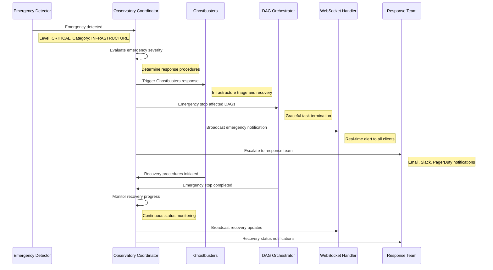

# Emergency Protocol Integration Documentation

## Overview

This document provides comprehensive documentation for emergency protocol integration within the Beast Mode framework, detailing how existing emergency systems coordinate with Observatory infrastructure to ensure systematic response to critical system failures and operational emergencies.

## Emergency Protocol Architecture

### 1. Emergency System Components

**Existing Emergency Systems**:
- **Beast Mode Emergency Protocols** - Systematic failure response procedures
- **Ghostbusters Framework** - Critical system triage and recovery
- **DAG Orchestration Emergency Stops** - Task execution emergency termination
- **ReflectiveModule Graceful Degradation** - Component-level emergency responses
- **Redis Coordination Failover** - Automatic coordination service recovery

**Observatory Emergency Integration**:
- **Emergency WebSocket Broadcasting** - Real-time emergency notifications
- **Emergency Health Monitoring** - Critical system status tracking
- **Emergency Metrics Collection** - Essential metrics during emergencies
- **Emergency Coordination Hub** - Central emergency response coordination

### 2. Emergency Classification System

```python
from enum import Enum
from dataclasses import dataclass
from datetime import datetime
from typing import Dict, List, Any, Optional

class EmergencyLevel(Enum):
    """Emergency severity levels with escalation procedures."""
    WATCH = "watch"          # Potential issue, monitoring required
    WARNING = "warning"      # Degraded performance, action recommended
    CRITICAL = "critical"    # Service disruption, immediate action required
    EMERGENCY = "emergency"  # System failure, all-hands response

class EmergencyCategory(Enum):
    """Emergency categories for response routing."""
    INFRASTRUCTURE = "infrastructure"  # Network, DNS, tunnel failures
    APPLICATION = "application"       # Service crashes, memory leaks
    SECURITY = "security"            # Security breaches, unauthorized access
    DATA = "data"                   # Data corruption, backup failures
    COORDINATION = "coordination"    # Redis, WebSocket, communication failures

@dataclass
class EmergencyEvent:
    """Emergency event with comprehensive context."""
    emergency_id: str
    level: EmergencyLevel
    category: EmergencyCategory
    title: str
    description: str
    affected_components: List[str]
    detection_time: datetime
    correlation_id: str
    source_system: str
    metadata: Dict[str, Any]
    escalation_path: List[str]
    recovery_procedures: List[str]
    estimated_impact: str
    estimated_recovery_time: Optional[str] = None
```

### 3. Emergency Detection Integration

```python
class EmergencyDetectionOrchestrator(ReflectiveModule):
    """Orchestrates emergency detection across all Beast Mode systems."""
    
    def __init__(self):
        super().__init__()
        self.module_id = "EmergencyDetectionOrchestrator"
        self._detection_sources = {}
        self._emergency_thresholds = {}
        self._active_emergencies = {}
        
    def register_detection_source(self, source_id: str, detector):
        """Register emergency detection source."""
        self._detection_sources[source_id] = {
            'detector': detector,
            'last_check': None,
            'emergency_count': 0,
            'false_positive_count': 0
        }
        
        self._logger.info(f"Registered emergency detection source: {source_id}")
    
    async def run_emergency_detection_cycle(self) -> List[EmergencyEvent]:
        """Run comprehensive emergency detection across all sources."""
        detected_emergencies = []
        
        for source_id, source_info in self._detection_sources.items():
            try:
                detector = source_info['detector']
                
                # Run detection
                emergencies = await detector.detect_emergencies()
                
                for emergency in emergencies:
                    # Validate and enrich emergency event
                    validated_emergency = self._validate_emergency_event(emergency, source_id)
                    
                    if validated_emergency:
                        detected_emergencies.append(validated_emergency)
                        
                        # Update source statistics
                        source_info['emergency_count'] += 1
                        source_info['last_check'] = datetime.now()
                
            except Exception as e:
                self._logger.error(f"Emergency detection failed for {source_id}: {e}")
                
                # Create emergency for detection system failure
                detection_failure_emergency = EmergencyEvent(
                    emergency_id=f"detection_failure_{source_id}_{int(time.time())}",
                    level=EmergencyLevel.WARNING,
                    category=EmergencyCategory.INFRASTRUCTURE,
                    title=f"Emergency Detection Failure: {source_id}",
                    description=f"Emergency detection system {source_id} failed: {str(e)}",
                    affected_components=[source_id, "emergency_detection"],
                    detection_time=datetime.now(),
                    correlation_id=str(uuid.uuid4()),
                    source_system="emergency_detection_orchestrator",
                    metadata={"error": str(e), "source_id": source_id},
                    escalation_path=["ops_team", "emergency_coordinator"],
                    recovery_procedures=["restart_detection_source", "validate_configuration"],
                    estimated_impact="Reduced emergency detection capability"
                )
                detected_emergencies.append(detection_failure_emergency)
        
        return detected_emergencies
```

## Emergency Response Coordination

### 1. Observatory Emergency Coordination Hub

```python
class ObservatoryEmergencyCoordinator(ReflectiveModule):
    """Central emergency coordination hub within Observatory."""
    
    def __init__(self):
        super().__init__()
        self.module_id = "ObservatoryEmergencyCoordinator"
        self._active_emergencies = {}
        self._response_teams = {}
        self._escalation_rules = {}
        self._recovery_procedures = {}
        
    async def coordinate_emergency_response(self, emergency: EmergencyEvent):
        """Coordinate comprehensive emergency response."""
        self._logger.critical(
            f"Emergency response initiated: {emergency.emergency_id}",
            extra={"correlation_id": emergency.correlation_id}
        )
        
        # 1. Immediate Response Actions
        await self._execute_immediate_response(emergency)
        
        # 2. Notification and Escalation
        await self._execute_notification_escalation(emergency)
        
        # 3. System Stabilization
        await self._execute_system_stabilization(emergency)
        
        # 4. Recovery Coordination
        await self._coordinate_recovery_procedures(emergency)
        
        # 5. Monitoring and Validation
        await self._monitor_emergency_resolution(emergency)
    
    async def _execute_immediate_response(self, emergency: EmergencyEvent):
        """Execute immediate emergency response actions."""
        immediate_actions = {
            EmergencyLevel.EMERGENCY: [
                "activate_emergency_mode",
                "isolate_affected_components", 
                "enable_graceful_degradation",
                "preserve_critical_data"
            ],
            EmergencyLevel.CRITICAL: [
                "enable_graceful_degradation",
                "increase_monitoring_frequency",
                "prepare_failover_systems"
            ],
            EmergencyLevel.WARNING: [
                "increase_monitoring_frequency",
                "validate_backup_systems"
            ],
            EmergencyLevel.WATCH: [
                "increase_logging_verbosity",
                "monitor_trend_development"
            ]
        }
        
        actions = immediate_actions.get(emergency.level, [])
        
        for action in actions:
            try:
                await self._execute_emergency_action(action, emergency)
                self._logger.info(f"Executed immediate action: {action}")
            except Exception as e:
                self._logger.error(f"Failed to execute immediate action {action}: {e}")
    
    async def _execute_notification_escalation(self, emergency: EmergencyEvent):
        """Execute notification and escalation procedures."""
        # WebSocket broadcast to all connected clients
        await self._broadcast_emergency_notification(emergency)
        
        # Email notifications based on severity
        if emergency.level in [EmergencyLevel.CRITICAL, EmergencyLevel.EMERGENCY]:
            await self._send_email_notifications(emergency)
        
        # Slack/Teams notifications for high-priority emergencies
        if emergency.level == EmergencyLevel.EMERGENCY:
            await self._send_chat_notifications(emergency)
        
        # PagerDuty/on-call escalation for critical emergencies
        if emergency.level == EmergencyLevel.EMERGENCY:
            await self._trigger_oncall_escalation(emergency)
    
    async def _broadcast_emergency_notification(self, emergency: EmergencyEvent):
        """Broadcast emergency notification via WebSocket."""
        message = {
            'type': 'emergency_notification',
            'emergency': {
                'id': emergency.emergency_id,
                'level': emergency.level.value,
                'category': emergency.category.value,
                'title': emergency.title,
                'description': emergency.description,
                'affected_components': emergency.affected_components,
                'detection_time': emergency.detection_time.isoformat(),
                'estimated_impact': emergency.estimated_impact,
                'recovery_time_estimate': emergency.estimated_recovery_time
            },
            'response_actions': {
                'immediate_actions_taken': self._get_immediate_actions_taken(emergency),
                'escalation_status': self._get_escalation_status(emergency),
                'recovery_procedures_initiated': self._get_recovery_procedures_initiated(emergency)
            },
            'metadata': {
                'correlation_id': emergency.correlation_id,
                'source_system': emergency.source_system,
                'broadcast_time': datetime.now().isoformat()
            }
        }
        
        # Broadcast to emergency WebSocket endpoint
        await self._websocket_handler.broadcast_to_endpoint('/ws/emergency', message)
        
        # Also broadcast to general observatory endpoint for visibility
        await self._websocket_handler.broadcast_to_endpoint('/ws/observatory', message)
```

### 2. Integration with Existing Emergency Systems

```python
class BeastModeEmergencyIntegration:
    """Integration with existing Beast Mode emergency systems."""
    
    def __init__(self, observatory_coordinator: ObservatoryEmergencyCoordinator):
        self._observatory_coordinator = observatory_coordinator
        self._ghostbusters_integration = GhostbustersIntegration()
        self._dag_emergency_integration = DAGEmergencyIntegration()
        
    async def integrate_ghostbusters_emergency(self, ghostbusters_event: Dict[str, Any]):
        """Integrate Ghostbusters emergency event with Observatory coordination."""
        # Convert Ghostbusters event to Observatory emergency format
        emergency = EmergencyEvent(
            emergency_id=f"ghostbusters_{ghostbusters_event['event_id']}",
            level=self._map_ghostbusters_severity(ghostbusters_event['severity']),
            category=EmergencyCategory.INFRASTRUCTURE,
            title=f"Ghostbusters Emergency: {ghostbusters_event['title']}",
            description=ghostbusters_event['description'],
            affected_components=ghostbusters_event.get('affected_components', []),
            detection_time=datetime.fromisoformat(ghostbusters_event['timestamp']),
            correlation_id=ghostbusters_event.get('correlation_id', str(uuid.uuid4())),
            source_system="ghostbusters",
            metadata=ghostbusters_event,
            escalation_path=["ghostbusters_team", "infrastructure_team"],
            recovery_procedures=ghostbusters_event.get('recovery_procedures', []),
            estimated_impact=ghostbusters_event.get('impact_assessment', 'Unknown')
        )
        
        # Coordinate response through Observatory
        await self._observatory_coordinator.coordinate_emergency_response(emergency)
    
    async def integrate_dag_emergency_stop(self, dag_emergency: Dict[str, Any]):
        """Integrate DAG orchestration emergency stop with Observatory coordination."""
        emergency = EmergencyEvent(
            emergency_id=f"dag_emergency_{dag_emergency['dag_id']}_{int(time.time())}",
            level=EmergencyLevel.CRITICAL,
            category=EmergencyCategory.APPLICATION,
            title=f"DAG Emergency Stop: {dag_emergency['dag_id']}",
            description=f"Emergency stop triggered for DAG execution: {dag_emergency['reason']}",
            affected_components=dag_emergency.get('affected_tasks', []),
            detection_time=datetime.now(),
            correlation_id=dag_emergency.get('correlation_id', str(uuid.uuid4())),
            source_system="dag_orchestrator",
            metadata=dag_emergency,
            escalation_path=["dag_team", "ops_team"],
            recovery_procedures=["validate_dag_state", "restart_failed_tasks", "verify_dependencies"],
            estimated_impact="Task execution disruption",
            estimated_recovery_time="5-15 minutes"
        )
        
        await self._observatory_coordinator.coordinate_emergency_response(emergency)
```

### 3. Emergency Response Procedures



## Emergency Recovery Procedures

### 1. Systematic Recovery Orchestration

```python
class EmergencyRecoveryOrchestrator(ReflectiveModule):
    """Orchestrates systematic emergency recovery procedures."""
    
    def __init__(self):
        super().__init__()
        self.module_id = "EmergencyRecoveryOrchestrator"
        self._recovery_procedures = {}
        self._recovery_status = {}
        
    async def execute_recovery_procedure(self, emergency: EmergencyEvent) -> Dict[str, Any]:
        """Execute systematic recovery procedure for emergency."""
        recovery_id = f"recovery_{emergency.emergency_id}"
        
        self._logger.info(f"Starting recovery procedure: {recovery_id}")
        
        recovery_steps = self._get_recovery_steps(emergency)
        recovery_status = {
            'recovery_id': recovery_id,
            'emergency_id': emergency.emergency_id,
            'total_steps': len(recovery_steps),
            'completed_steps': 0,
            'failed_steps': 0,
            'current_step': None,
            'start_time': datetime.now(),
            'estimated_completion': None,
            'status': 'in_progress'
        }
        
        self._recovery_status[recovery_id] = recovery_status
        
        try:
            for step_index, step in enumerate(recovery_steps):
                recovery_status['current_step'] = step
                
                self._logger.info(f"Executing recovery step {step_index + 1}/{len(recovery_steps)}: {step['name']}")
                
                step_result = await self._execute_recovery_step(step, emergency)
                
                if step_result['success']:
                    recovery_status['completed_steps'] += 1
                    self._logger.info(f"Recovery step completed: {step['name']}")
                else:
                    recovery_status['failed_steps'] += 1
                    self._logger.error(f"Recovery step failed: {step['name']} - {step_result['error']}")
                    
                    # Check if step is critical
                    if step.get('critical', False):
                        recovery_status['status'] = 'failed'
                        recovery_status['failure_reason'] = step_result['error']
                        break
                
                # Update progress
                await self._broadcast_recovery_progress(recovery_status)
            
            # Determine final status
            if recovery_status['status'] != 'failed':
                if recovery_status['failed_steps'] == 0:
                    recovery_status['status'] = 'completed'
                else:
                    recovery_status['status'] = 'completed_with_warnings'
            
            recovery_status['end_time'] = datetime.now()
            recovery_status['duration_seconds'] = (recovery_status['end_time'] - recovery_status['start_time']).total_seconds()
            
            return recovery_status
            
        except Exception as e:
            recovery_status['status'] = 'failed'
            recovery_status['failure_reason'] = str(e)
            recovery_status['end_time'] = datetime.now()
            
            self._logger.error(f"Recovery procedure failed: {recovery_id} - {e}")
            return recovery_status
    
    def _get_recovery_steps(self, emergency: EmergencyEvent) -> List[Dict[str, Any]]:
        """Get recovery steps based on emergency type and severity."""
        base_steps = [
            {
                'name': 'validate_system_state',
                'description': 'Validate current system state and identify issues',
                'function': self._validate_system_state,
                'critical': True,
                'timeout_seconds': 30
            },
            {
                'name': 'isolate_affected_components',
                'description': 'Isolate affected components to prevent cascade failures',
                'function': self._isolate_affected_components,
                'critical': True,
                'timeout_seconds': 60
            }
        ]
        
        # Add category-specific recovery steps
        category_steps = {
            EmergencyCategory.INFRASTRUCTURE: [
                {
                    'name': 'restart_infrastructure_services',
                    'description': 'Restart affected infrastructure services',
                    'function': self._restart_infrastructure_services,
                    'critical': True,
                    'timeout_seconds': 120
                },
                {
                    'name': 'validate_network_connectivity',
                    'description': 'Validate network connectivity and DNS resolution',
                    'function': self._validate_network_connectivity,
                    'critical': True,
                    'timeout_seconds': 60
                }
            ],
            EmergencyCategory.APPLICATION: [
                {
                    'name': 'restart_application_services',
                    'description': 'Restart affected application services',
                    'function': self._restart_application_services,
                    'critical': True,
                    'timeout_seconds': 180
                },
                {
                    'name': 'validate_application_health',
                    'description': 'Validate application health and functionality',
                    'function': self._validate_application_health,
                    'critical': True,
                    'timeout_seconds': 120
                }
            ],
            EmergencyCategory.COORDINATION: [
                {
                    'name': 'restart_coordination_services',
                    'description': 'Restart Redis and coordination services',
                    'function': self._restart_coordination_services,
                    'critical': True,
                    'timeout_seconds': 90
                },
                {
                    'name': 'validate_coordination_connectivity',
                    'description': 'Validate coordination service connectivity',
                    'function': self._validate_coordination_connectivity,
                    'critical': True,
                    'timeout_seconds': 60
                }
            ]
        }
        
        # Combine base steps with category-specific steps
        recovery_steps = base_steps + category_steps.get(emergency.category, [])
        
        # Add final validation steps
        recovery_steps.extend([
            {
                'name': 'comprehensive_health_check',
                'description': 'Run comprehensive health check across all systems',
                'function': self._comprehensive_health_check,
                'critical': True,
                'timeout_seconds': 180
            },
            {
                'name': 'restore_normal_operations',
                'description': 'Restore normal operations and monitoring',
                'function': self._restore_normal_operations,
                'critical': False,
                'timeout_seconds': 120
            }
        ])
        
        return recovery_steps
```

## Monitoring and Validation

### Emergency System Health Monitoring

```python
def get_emergency_system_health(self) -> Dict[str, Any]:
    """Get comprehensive emergency system health status."""
    return {
        "emergency_detection": {
            "active_detectors": len(self._detection_sources),
            "detection_sources_healthy": self._get_healthy_detection_sources(),
            "last_detection_cycle": self._last_detection_cycle.isoformat() if self._last_detection_cycle else None
        },
        "emergency_coordination": {
            "active_emergencies": len(self._active_emergencies),
            "coordination_hub_healthy": self._is_coordination_hub_healthy(),
            "response_teams_available": self._get_available_response_teams()
        },
        "recovery_orchestration": {
            "active_recoveries": len(self._recovery_status),
            "recovery_success_rate": self._calculate_recovery_success_rate(),
            "average_recovery_time": self._calculate_average_recovery_time()
        },
        "integration_status": {
            "ghostbusters_integration": self._ghostbusters_integration.is_healthy(),
            "dag_integration": self._dag_emergency_integration.is_healthy(),
            "websocket_broadcasting": self._websocket_handler.is_healthy()
        }
    }
```

### Emergency Metrics

```python
def get_emergency_metrics(self) -> Dict[str, float]:
    """Get Prometheus metrics for emergency system."""
    return {
        "emergency_events_total": self._total_emergency_events,
        "emergency_events_by_level": self._get_emergency_events_by_level(),
        "emergency_response_time_seconds": self._avg_emergency_response_time,
        "emergency_recovery_time_seconds": self._avg_emergency_recovery_time,
        "emergency_recovery_success_rate": self._recovery_success_rate,
        "emergency_false_positive_rate": self._false_positive_rate
    }
```

## Troubleshooting Guide

### Common Emergency System Issues

**Emergency Detection Not Working**:
- Verify all detection sources are registered and healthy
- Check detection source configurations and thresholds
- Review detection source logs for errors

**Emergency Notifications Not Delivered**:
- Verify WebSocket connectivity to emergency endpoints
- Check email/chat notification configurations
- Review notification service health and connectivity

**Recovery Procedures Failing**:
- Check recovery procedure implementations for errors
- Verify system permissions for recovery actions
- Review recovery step timeout configurations

**Integration Issues with Existing Systems**:
- Verify Ghostbusters integration connectivity
- Check DAG orchestrator emergency stop functionality
- Review integration service health and logs

### Recovery Procedures

1. **Restart Emergency Detection**: Restart all emergency detection sources
2. **Reset Emergency State**: Clear active emergency state and restart coordination
3. **Validate Integrations**: Test all emergency system integrations
4. **Emergency System Health Check**: Run comprehensive emergency system health validation
5. **Escalate to Manual Response**: Escalate to manual emergency response procedures

This comprehensive emergency protocol integration ensures systematic coordination between Observatory infrastructure and existing Beast Mode emergency systems, providing robust emergency response capabilities across the entire framework ecosystem.