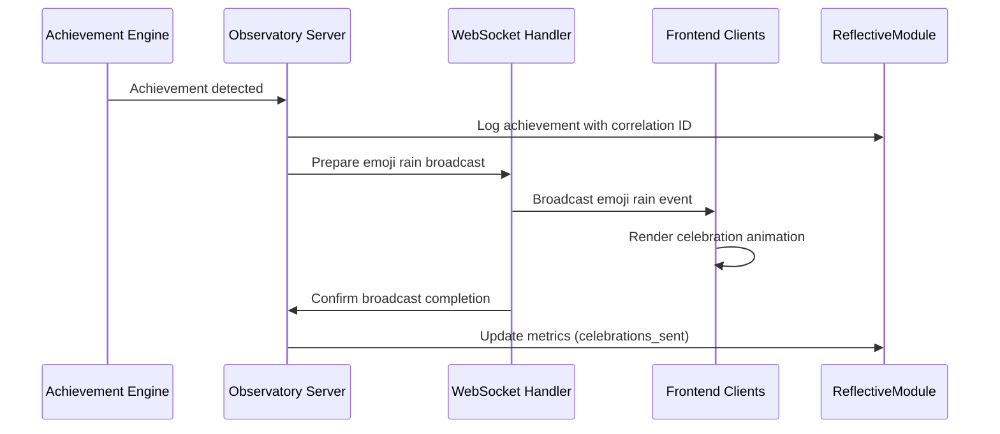

# Emoji Rain Celebration Workflow

## Overview
The emoji rain celebration workflow is triggered when significant achievements are detected in the system, creating a visual celebration effect through WebSocket broadcasting to connected frontend clients.

## Workflow Components

### 1. Achievement Detection Engine
**Location**: Observatory Server (`localhost:8888`)
**Endpoint**: `/ws/emoji-rain`
**Trigger Conditions**:
- Task completion milestones (Phase completions, major implementations)
- System health improvements (error rate reductions, performance gains)
- Integration successes (new component registrations, successful deployments)
- User interaction achievements (successful troubleshooting, system recovery)

### 2. Achievement Classification
**Classification Types**:
- **🎉 Major Milestone**: Phase completions, system deployments
- **✅ Task Success**: Individual task completions, bug fixes
- **🚀 Performance**: Speed improvements, optimization successes
- **🔧 Integration**: New component integrations, API connections
- **🏥 Health**: System recovery, error resolution

### 3. WebSocket Broadcasting Flow



### 4. Message Format
**WebSocket Message Structure**:
```json
{
  "type": "emoji_rain",
  "timestamp": "2025-01-30T10:30:00Z",
  "correlation_id": "celebration-uuid-12345",
  "achievement": {
    "type": "major_milestone",
    "title": "Phase 4 Documentation Complete",
    "description": "All operational workflows documented",
    "emoji": "🎉",
    "intensity": "high"
  },
  "animation": {
    "duration": 5000,
    "emoji_count": 50,
    "fall_speed": "medium",
    "colors": ["#FFD700", "#FF6B6B", "#4ECDC4"]
  }
}
```

### 5. Frontend Rendering Process
**Animation Parameters**:
- **Duration**: 3-7 seconds based on achievement importance
- **Emoji Count**: 20-100 emojis based on intensity
- **Fall Pattern**: Random distribution with physics simulation
- **Sound Effects**: Optional celebration sounds (configurable)

### 6. Error Handling and Fallbacks
**Connection Failures**:
- Store celebrations in Redis queue for retry
- Fallback to console logging if WebSocket unavailable
- Graceful degradation without blocking achievement detection

**Performance Considerations**:
- Rate limiting: Maximum 1 celebration per 10 seconds
- Client-side animation optimization for mobile devices
- Automatic cleanup of animation elements after completion

## Integration Points

### ReflectiveModule Integration
```python
from src.rm_ddd.core.unified_reflective_module import ReflectiveModule

class EmojiRainCelebrator(ReflectiveModule):
    def __init__(self):
        super().__init__()
        self.celebration_count = 0
        self.last_celebration = None
    
    def trigger_celebration(self, achievement_type: str, title: str):
        """Trigger emoji rain celebration with systematic logging."""
        correlation_id = self.generate_correlation_id()
        
        # Log achievement
        self.logger.info(f"Achievement detected: {title}", 
                        extra={"correlation_id": correlation_id})
        
        # Broadcast celebration
        self.broadcast_emoji_rain(achievement_type, title, correlation_id)
        
        # Update metrics
        self.celebration_count += 1
        self.last_celebration = datetime.utcnow()
```

### Observatory WebSocket Integration
**Endpoint Registration**:
```python
# WebSocket endpoint for emoji rain
@app.websocket("/ws/emoji-rain")
async def emoji_rain_websocket(websocket: WebSocket):
    await websocket.accept()
    # Register client for emoji rain broadcasts
    emoji_rain_clients.add(websocket)
    
    try:
        while True:
            # Keep connection alive
            await websocket.receive_text()
    except WebSocketDisconnect:
        emoji_rain_clients.remove(websocket)
```

## Operational Procedures

### Manual Celebration Trigger
```bash
# Trigger celebration via Observatory API
curl -X POST http://localhost:8888/api/celebrate \
  -H "Content-Type: application/json" \
  -d '{
    "type": "manual",
    "title": "Manual Test Celebration",
    "emoji": "🎉",
    "intensity": "medium"
  }'
```

### Monitoring and Metrics
**Prometheus Metrics**:
- `emoji_rain_celebrations_total`: Total celebrations triggered
- `emoji_rain_clients_connected`: Current WebSocket clients
- `emoji_rain_broadcast_duration_seconds`: Time to broadcast to all clients
- `emoji_rain_errors_total`: Failed celebration attempts

### Health Checks
**Celebration System Health**:
```bash
# Check emoji rain system status
curl -s http://localhost:8888/health/emoji-rain

# Expected response:
{
  "status": "healthy",
  "connected_clients": 3,
  "last_celebration": "2025-01-30T10:25:00Z",
  "celebrations_today": 15,
  "websocket_status": "active"
}
```

## Troubleshooting

### Common Issues
1. **No celebrations appearing**: Check WebSocket connection and client registration
2. **Performance lag**: Reduce emoji count or animation duration
3. **Missing celebrations**: Check achievement detection logic and triggers
4. **Client disconnections**: Implement reconnection logic with exponential backoff

### Debug Commands
```bash
# Check WebSocket connections
curl -s http://localhost:8888/debug/websocket-clients

# View celebration queue
redis-cli -h 192.168.1.119 -p 6379 LLEN celebration_queue

# Test celebration trigger
python -c "
from src.observatory.emoji_rain import EmojiRainCelebrator
celebrator = EmojiRainCelebrator()
celebrator.trigger_celebration('test', 'Debug Test Celebration')
"
```

## Configuration

### Environment Variables
```bash
# Emoji rain configuration
EMOJI_RAIN_ENABLED=true
EMOJI_RAIN_MAX_CLIENTS=100
EMOJI_RAIN_RATE_LIMIT=10  # seconds between celebrations
EMOJI_RAIN_DEFAULT_DURATION=5000  # milliseconds
EMOJI_RAIN_REDIS_QUEUE=celebration_queue
```

### Achievement Thresholds
```yaml
# achievement_config.yaml
achievements:
  task_completion:
    emoji: "✅"
    intensity: "low"
    duration: 3000
  
  phase_completion:
    emoji: "🎉"
    intensity: "high"
    duration: 7000
  
  system_recovery:
    emoji: "🏥"
    intensity: "medium"
    duration: 5000
  
  performance_improvement:
    emoji: "🚀"
    intensity: "medium"
    duration: 4000
```

## Success Metrics
- **Celebration Delivery Rate**: >99% successful broadcasts
- **Client Connection Stability**: <1% disconnection rate during celebrations
- **Animation Performance**: <100ms render time on standard devices
- **User Engagement**: Positive feedback on celebration timing and frequency

---

*This workflow ensures that system achievements are celebrated in a systematic, observable, and delightful way that enhances user experience while maintaining system performance.*