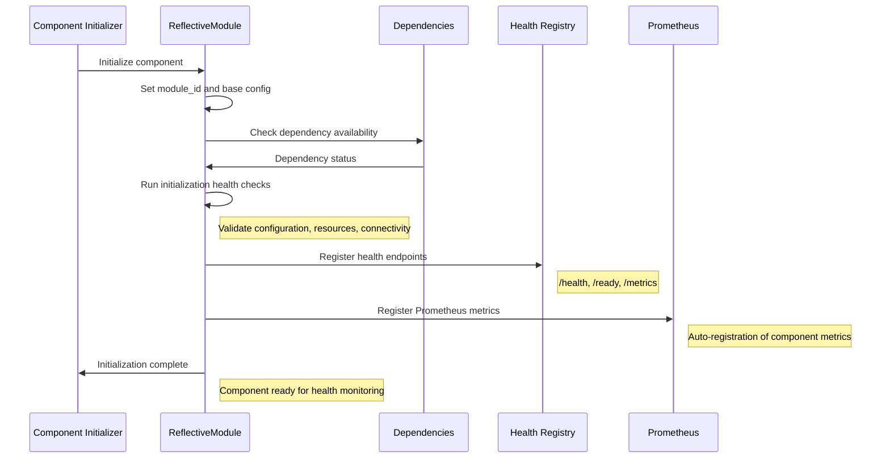
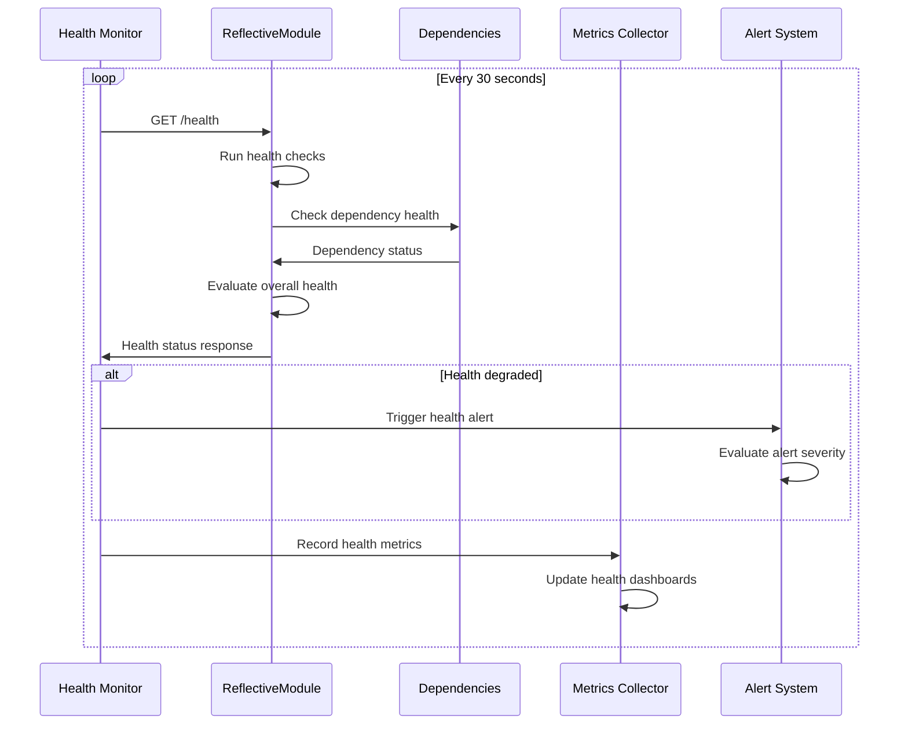
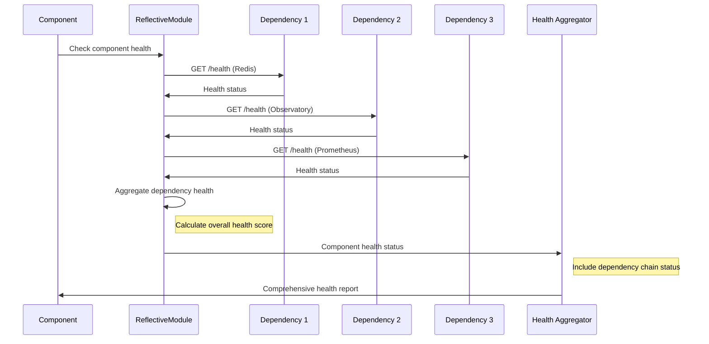

# ReflectiveModule Health Check Integration Documentation

## Overview

This document provides comprehensive documentation for ReflectiveModule health check sequences and integration patterns within the Beast Mode framework. It covers the systematic observability patterns, health endpoint implementations, and integration workflows that ensure consistent monitoring across all system components.

## ReflectiveModule Pattern Overview

### Core Health Endpoints

All ReflectiveModule-based components implement standardized health endpoints:

- **`/health`** - Basic health status and component availability
- **`/ready`** - Readiness for traffic and operational status  
- **`/metrics`** - Prometheus-compatible metrics exposure

### Health Check Architecture

```python
from src.rm_ddd.core.unified_reflective_module import ReflectiveModule

class ExampleComponent(ReflectiveModule):
    """Example component demonstrating ReflectiveModule health integration."""
    
    def __init__(self):
        super().__init__()
        self.module_id = "ExampleComponent"
        self._startup_time = datetime.now()
        self._health_checks = {}
        
    def get_health_status(self) -> Dict[str, Any]:
        """Implement health status reporting."""
        return {
            "status": "healthy",
            "module_id": self.module_id,
            "uptime_seconds": (datetime.now() - self._startup_time).total_seconds(),
            "dependencies": self._check_dependencies(),
            "resource_usage": self._get_resource_usage(),
            "last_error": self._get_last_error(),
            "health_checks": self._run_health_checks()
        }
    
    def get_readiness_status(self) -> Dict[str, Any]:
        """Implement readiness status reporting."""
        return {
            "ready": self._is_ready_for_traffic(),
            "initialization_complete": self._initialization_complete,
            "dependencies_available": self._check_dependency_availability(),
            "configuration_valid": self._validate_configuration(),
            "resources_available": self._check_resource_availability()
        }
    
    def get_metrics(self) -> Dict[str, float]:
        """Implement Prometheus metrics exposure."""
        return {
            f"{self.module_id.lower()}_requests_total": self._total_requests,
            f"{self.module_id.lower()}_errors_total": self._total_errors,
            f"{self.module_id.lower()}_response_time_seconds": self._avg_response_time,
            f"{self.module_id.lower()}_memory_usage_bytes": self._get_memory_usage(),
            f"{self.module_id.lower()}_cpu_usage_percent": self._get_cpu_usage()
        }
```

## Health Check Sequences

### 1. Component Initialization Health Sequence



### 2. Periodic Health Check Sequence



### 3. Dependency Chain Health Validation



## Health Check Implementation Patterns

### 1. Basic Health Check Implementation

```python
class BasicHealthChecker:
    """Basic health check implementation for ReflectiveModule components."""
    
    def __init__(self, component: ReflectiveModule):
        self._component = component
        self._health_checks = {
            'memory_usage': self._check_memory_usage,
            'cpu_usage': self._check_cpu_usage,
            'disk_space': self._check_disk_space,
            'network_connectivity': self._check_network_connectivity,
            'dependency_availability': self._check_dependencies
        }
    
    def run_all_health_checks(self) -> Dict[str, Any]:
        """Run all configured health checks."""
        results = {}
        overall_healthy = True
        
        for check_name, check_function in self._health_checks.items():
            try:
                result = check_function()
                results[check_name] = result
                
                if not result.get('healthy', False):
                    overall_healthy = False
                    
            except Exception as e:
                results[check_name] = {
                    'healthy': False,
                    'error': str(e),
                    'check_time': datetime.now().isoformat()
                }
                overall_healthy = False
        
        return {
            'overall_healthy': overall_healthy,
            'checks': results,
            'check_timestamp': datetime.now().isoformat()
        }
    
    def _check_memory_usage(self) -> Dict[str, Any]:
        """Check memory usage health."""
        import psutil
        
        memory = psutil.virtual_memory()
        usage_percent = memory.percent
        
        return {
            'healthy': usage_percent < 85.0,
            'usage_percent': usage_percent,
            'available_mb': memory.available / (1024 * 1024),
            'threshold_percent': 85.0,
            'check_time': datetime.now().isoformat()
        }
    
    def _check_cpu_usage(self) -> Dict[str, Any]:
        """Check CPU usage health."""
        import psutil
        
        cpu_percent = psutil.cpu_percent(interval=1)
        
        return {
            'healthy': cpu_percent < 80.0,
            'usage_percent': cpu_percent,
            'threshold_percent': 80.0,
            'check_time': datetime.now().isoformat()
        }
    
    def _check_dependencies(self) -> Dict[str, Any]:
        """Check dependency availability."""
        dependencies = getattr(self._component, '_dependencies', [])
        dependency_status = {}
        all_healthy = True
        
        for dep in dependencies:
            try:
                status = self._check_dependency_health(dep)
                dependency_status[dep] = status
                
                if not status.get('healthy', False):
                    all_healthy = False
                    
            except Exception as e:
                dependency_status[dep] = {
                    'healthy': False,
                    'error': str(e)
                }
                all_healthy = False
        
        return {
            'healthy': all_healthy,
            'dependencies': dependency_status,
            'check_time': datetime.now().isoformat()
        }
```

### 2. Advanced Health Check with Circuit Breaker

```python
class AdvancedHealthChecker(BasicHealthChecker):
    """Advanced health checker with circuit breaker pattern."""
    
    def __init__(self, component: ReflectiveModule):
        super().__init__(component)
        self._circuit_breakers = {}
        self._health_history = deque(maxlen=100)
        
    def run_health_check_with_circuit_breaker(self, check_name: str) -> Dict[str, Any]:
        """Run health check with circuit breaker protection."""
        circuit_breaker = self._get_circuit_breaker(check_name)
        
        if circuit_breaker.is_open():
            return {
                'healthy': False,
                'circuit_breaker_open': True,
                'last_failure': circuit_breaker.last_failure_time,
                'failure_count': circuit_breaker.failure_count
            }
        
        try:
            result = self._health_checks[check_name]()
            
            if result.get('healthy', False):
                circuit_breaker.record_success()
            else:
                circuit_breaker.record_failure()
            
            return result
            
        except Exception as e:
            circuit_breaker.record_failure()
            return {
                'healthy': False,
                'error': str(e),
                'circuit_breaker_triggered': True
            }
    
    def get_health_trend_analysis(self) -> Dict[str, Any]:
        """Analyze health trends over time."""
        if len(self._health_history) < 10:
            return {'insufficient_data': True}
        
        recent_health = [h['overall_healthy'] for h in list(self._health_history)[-10:]]
        health_percentage = sum(recent_health) / len(recent_health) * 100
        
        return {
            'health_trend_percentage': health_percentage,
            'trend_direction': self._calculate_trend_direction(),
            'stability_score': self._calculate_stability_score(),
            'recommendation': self._get_health_recommendation(health_percentage)
        }
```

### 3. Observatory Integration Health Checks

```python
class ObservatoryHealthIntegration(ReflectiveModule):
    """Observatory-specific health check integration."""
    
    def __init__(self):
        super().__init__()
        self.module_id = "ObservatoryHealthIntegration"
        self._websocket_health = {}
        self._endpoint_health = {}
        
    def get_observatory_health_status(self) -> Dict[str, Any]:
        """Get comprehensive Observatory health status."""
        return {
            "observatory_server": self._check_observatory_server_health(),
            "websocket_endpoints": self._check_websocket_endpoints_health(),
            "metrics_collection": self._check_metrics_collection_health(),
            "integration_points": self._check_integration_points_health(),
            "coordination_services": self._check_coordination_services_health()
        }
    
    def _check_observatory_server_health(self) -> Dict[str, Any]:
        """Check Observatory server health."""
        try:
            response = requests.get('http://localhost:8888/health', timeout=5)
            
            if response.status_code == 200:
                health_data = response.json()
                return {
                    'healthy': True,
                    'response_time_ms': response.elapsed.total_seconds() * 1000,
                    'server_status': health_data,
                    'check_time': datetime.now().isoformat()
                }
            else:
                return {
                    'healthy': False,
                    'status_code': response.status_code,
                    'error': 'Non-200 response from health endpoint'
                }
                
        except Exception as e:
            return {
                'healthy': False,
                'error': str(e),
                'check_time': datetime.now().isoformat()
            }
    
    def _check_websocket_endpoints_health(self) -> Dict[str, Any]:
        """Check WebSocket endpoints health."""
        endpoints = ['/ws/observatory', '/ws/emoji-rain', '/ws/anomalies', '/ws/doctor-status']
        endpoint_health = {}
        
        for endpoint in endpoints:
            try:
                # Test WebSocket connection
                websocket_url = f'ws://localhost:8888{endpoint}'
                
                # Use websocket client to test connection
                health_status = self._test_websocket_connection(websocket_url)
                endpoint_health[endpoint] = health_status
                
            except Exception as e:
                endpoint_health[endpoint] = {
                    'healthy': False,
                    'error': str(e),
                    'check_time': datetime.now().isoformat()
                }
        
        all_healthy = all(status.get('healthy', False) for status in endpoint_health.values())
        
        return {
            'all_endpoints_healthy': all_healthy,
            'endpoints': endpoint_health,
            'total_endpoints': len(endpoints),
            'healthy_endpoints': sum(1 for status in endpoint_health.values() if status.get('healthy', False))
        }
    
    async def _test_websocket_connection(self, websocket_url: str) -> Dict[str, Any]:
        """Test WebSocket connection health."""
        try:
            import websockets
            
            start_time = time.time()
            
            async with websockets.connect(websocket_url, timeout=5) as websocket:
                # Send ping and wait for pong
                await websocket.ping()
                
                connection_time = (time.time() - start_time) * 1000
                
                return {
                    'healthy': True,
                    'connection_time_ms': connection_time,
                    'check_time': datetime.now().isoformat()
                }
                
        except Exception as e:
            return {
                'healthy': False,
                'error': str(e),
                'check_time': datetime.now().isoformat()
            }
```

## Integration Patterns

### 1. Health Check Orchestration

```python
class HealthCheckOrchestrator(ReflectiveModule):
    """Orchestrates health checks across multiple ReflectiveModule components."""
    
    def __init__(self):
        super().__init__()
        self.module_id = "HealthCheckOrchestrator"
        self._registered_components = {}
        self._health_check_schedule = {}
        
    def register_component(self, component: ReflectiveModule, check_interval: int = 30):
        """Register a component for health monitoring."""
        component_id = component.module_id
        
        self._registered_components[component_id] = {
            'component': component,
            'check_interval': check_interval,
            'last_check': None,
            'health_history': deque(maxlen=100)
        }
        
        self._logger.info(f"Registered component {component_id} for health monitoring")
    
    async def run_orchestrated_health_checks(self) -> Dict[str, Any]:
        """Run health checks for all registered components."""
        results = {}
        overall_healthy = True
        
        for component_id, component_info in self._registered_components.items():
            try:
                component = component_info['component']
                
                # Run health check
                health_status = component.get_health_status()
                readiness_status = component.get_readiness_status()
                
                # Combine health and readiness
                combined_status = {
                    'health': health_status,
                    'readiness': readiness_status,
                    'overall_healthy': self._evaluate_component_health(health_status, readiness_status),
                    'check_time': datetime.now().isoformat()
                }
                
                results[component_id] = combined_status
                
                # Update history
                component_info['health_history'].append(combined_status)
                component_info['last_check'] = datetime.now()
                
                if not combined_status['overall_healthy']:
                    overall_healthy = False
                    
            except Exception as e:
                results[component_id] = {
                    'healthy': False,
                    'error': str(e),
                    'check_time': datetime.now().isoformat()
                }
                overall_healthy = False
        
        return {
            'overall_system_healthy': overall_healthy,
            'components': results,
            'total_components': len(self._registered_components),
            'healthy_components': sum(1 for r in results.values() if r.get('overall_healthy', False)),
            'orchestration_time': datetime.now().isoformat()
        }
```

### 2. Health Check Integration with WebSocket Broadcasting

```python
class HealthWebSocketBroadcaster(ReflectiveModule):
    """Broadcasts health status updates via WebSocket."""
    
    def __init__(self, orchestrator: HealthCheckOrchestrator):
        super().__init__()
        self.module_id = "HealthWebSocketBroadcaster"
        self._orchestrator = orchestrator
        self._websocket_clients = set()
        
    async def broadcast_health_updates(self):
        """Continuously broadcast health updates to WebSocket clients."""
        while True:
            try:
                # Get current health status
                health_status = await self._orchestrator.run_orchestrated_health_checks()
                
                # Create WebSocket message
                message = {
                    'type': 'health_update',
                    'timestamp': datetime.now().isoformat(),
                    'system_health': health_status,
                    'correlation_id': str(uuid.uuid4())
                }
                
                # Broadcast to all connected clients
                await self._broadcast_to_clients(message)
                
                # Wait for next update cycle
                await asyncio.sleep(30)  # 30-second intervals
                
            except Exception as e:
                self._logger.error(f"Error in health broadcast: {e}")
                await asyncio.sleep(5)  # Short delay on error
    
    async def _broadcast_to_clients(self, message: Dict[str, Any]):
        """Broadcast message to all connected WebSocket clients."""
        if not self._websocket_clients:
            return
        
        message_json = json.dumps(message)
        disconnected_clients = set()
        
        for client in self._websocket_clients:
            try:
                await client.send(message_json)
            except websockets.exceptions.ConnectionClosed:
                disconnected_clients.add(client)
        
        # Remove disconnected clients
        self._websocket_clients -= disconnected_clients
```

## Monitoring and Alerting

### Health Check Metrics

```python
def get_health_check_metrics(self) -> Dict[str, float]:
    """Get Prometheus metrics for health check system."""
    return {
        "health_checks_total": self._total_health_checks,
        "health_checks_failed_total": self._failed_health_checks,
        "health_check_duration_seconds": self._avg_health_check_duration,
        "components_healthy_total": self._get_healthy_component_count(),
        "components_unhealthy_total": self._get_unhealthy_component_count(),
        "health_check_orchestration_duration_seconds": self._orchestration_duration
    }
```

### Alert Integration

```python
class HealthAlertManager(ReflectiveModule):
    """Manages health-based alerting."""
    
    def __init__(self):
        super().__init__()
        self.module_id = "HealthAlertManager"
        self._alert_thresholds = {
            'component_unhealthy': 1,  # Alert if any component unhealthy
            'system_health_percentage': 80.0,  # Alert if system health < 80%
            'consecutive_failures': 3  # Alert after 3 consecutive failures
        }
    
    def evaluate_health_alerts(self, health_status: Dict[str, Any]) -> List[Dict[str, Any]]:
        """Evaluate health status and generate alerts."""
        alerts = []
        
        # Check overall system health
        if not health_status.get('overall_system_healthy', True):
            alerts.append({
                'type': 'system_health_degraded',
                'severity': 'high',
                'message': 'Overall system health is degraded',
                'affected_components': self._get_unhealthy_components(health_status)
            })
        
        # Check individual component health
        for component_id, component_status in health_status.get('components', {}).items():
            if not component_status.get('overall_healthy', True):
                alerts.append({
                    'type': 'component_health_degraded',
                    'severity': 'medium',
                    'component': component_id,
                    'message': f'Component {component_id} health is degraded',
                    'details': component_status
                })
        
        return alerts
```

## Troubleshooting Guide

### Common Health Check Issues

**Health Endpoint Not Responding**:
- Verify component is properly initialized with ReflectiveModule
- Check if health endpoint is registered correctly
- Review component logs for initialization errors

**Dependency Health Check Failures**:
- Verify dependency services are running and accessible
- Check network connectivity between components
- Review dependency health endpoint implementations

**High Health Check Latency**:
- Monitor resource usage during health checks
- Optimize health check implementations
- Consider circuit breaker patterns for external dependencies

**Inconsistent Health Status**:
- Review health check logic for race conditions
- Implement proper error handling in health checks
- Add correlation ID tracking for health check debugging

### Recovery Procedures

1. **Restart Unhealthy Component**: Use component-specific restart procedures
2. **Reset Health Check State**: Clear health check history and circuit breakers
3. **Validate Dependencies**: Ensure all dependencies are healthy before restart
4. **Monitor Recovery**: Continuous monitoring during recovery process
5. **Update Health Thresholds**: Adjust thresholds based on observed behavior

This comprehensive ReflectiveModule health check integration ensures systematic observability and monitoring across all Beast Mode framework components.