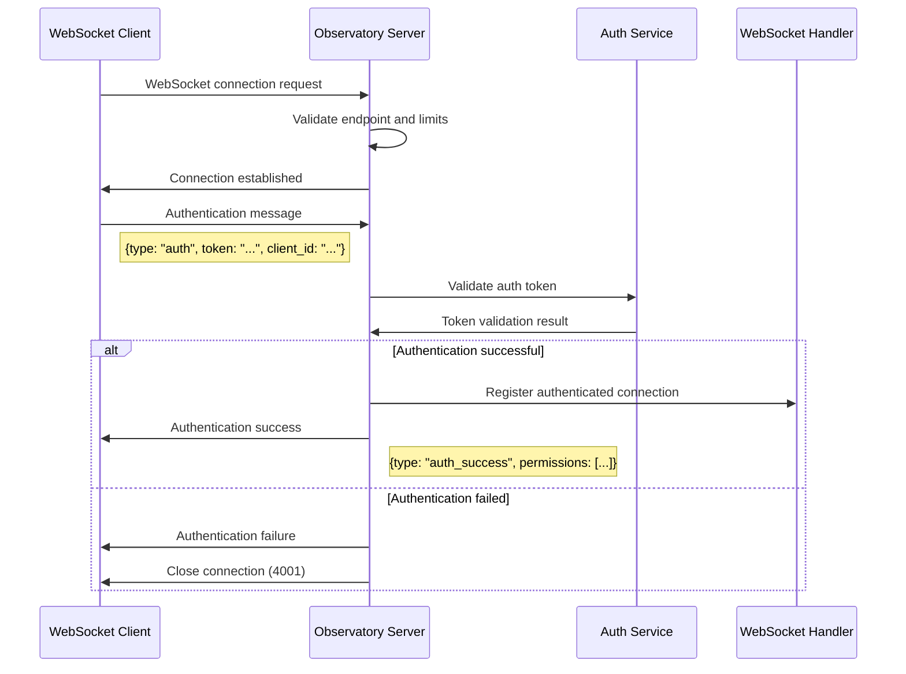

# WebSocket Connection Management Procedures

## Overview

This document provides comprehensive procedures for managing WebSocket connections within the Observatory server ecosystem. It covers connection establishment, authentication, health monitoring, recovery procedures, and integration with the Beast Mode framework's systematic observability patterns.

## WebSocket Endpoints Overview

### Active Endpoints
- **`/ws/observatory`** - Main observatory events and system status
- **`/ws/emoji-rain`** - Real-time emoji rain celebrations and achievements
- **`/ws/anomalies`** - Performance anomaly alerts and monitoring
- **`/ws/doctor-status`** - System health monitoring and diagnostics

### Endpoint Configuration
```python
# Observatory WebSocket endpoint configuration
WEBSOCKET_ENDPOINTS = {
    "/ws/observatory": {
        "handler": "ObservatoryWebSocketHandler",
        "max_connections": 250,
        "message_types": ["system_event", "status_update", "coordination"],
        "authentication_required": False,
        "rate_limit_per_minute": 100
    },
    "/ws/emoji-rain": {
        "handler": "EmojiRainWebSocketHandler", 
        "max_connections": 100,
        "message_types": ["achievement", "celebration", "animation"],
        "authentication_required": False,
        "rate_limit_per_minute": 20
    },
    "/ws/anomalies": {
        "handler": "AnomalyWebSocketHandler",
        "max_connections": 50,
        "message_types": ["anomaly_alert", "threshold_breach", "recovery"],
        "authentication_required": True,
        "rate_limit_per_minute": 60
    },
    "/ws/doctor-status": {
        "handler": "HealthWebSocketHandler",
        "max_connections": 25,
        "message_types": ["health_update", "diagnostic", "service_status"],
        "authentication_required": True,
        "rate_limit_per_minute": 30
    }
}
```

## Connection Establishment Procedures

### 1. Client Connection Initiation

**Standard WebSocket Handshake**:
```javascript
// Client-side connection establishment
const websocketUrl = 'ws://localhost:8888/ws/observatory';
const connection = new WebSocket(websocketUrl);

connection.onopen = function(event) {
    console.log('WebSocket connection established');
    // Send initial authentication if required
    if (requiresAuth) {
        connection.send(JSON.stringify({
            type: 'auth',
            token: authToken,
            client_id: generateClientId()
        }));
    }
};

connection.onmessage = function(event) {
    const message = JSON.parse(event.data);
    handleWebSocketMessage(message);
};

connection.onerror = function(error) {
    console.error('WebSocket error:', error);
    initiateReconnection();
};

connection.onclose = function(event) {
    console.log('WebSocket connection closed:', event.code, event.reason);
    if (!event.wasClean) {
        initiateReconnection();
    }
};
```

**Server-side Connection Handling**:
```python
class WebSocketConnectionManager(ReflectiveModule):
    """Manages WebSocket connections with systematic observability."""
    
    def __init__(self):
        super().__init__()
        self.module_id = "WebSocketConnectionManager"
        self._connections = {}  # endpoint -> set of connections
        self._connection_metadata = {}  # connection_id -> metadata
        
    async def handle_new_connection(self, websocket, path):
        """Handle new WebSocket connection with validation."""
        connection_id = self._generate_connection_id()
        endpoint = self._extract_endpoint(path)
        
        # Validate endpoint
        if endpoint not in WEBSOCKET_ENDPOINTS:
            await websocket.close(code=4004, reason="Invalid endpoint")
            return
        
        # Check connection limits
        if self._is_connection_limit_exceeded(endpoint):
            await websocket.close(code=4003, reason="Connection limit exceeded")
            return
        
        # Register connection
        self._register_connection(connection_id, websocket, endpoint)
        
        try:
            await self._handle_connection_lifecycle(connection_id, websocket, endpoint)
        except websockets.exceptions.ConnectionClosed:
            self._logger.info(f"Connection {connection_id} closed normally")
        except Exception as e:
            self._logger.error(f"Connection {connection_id} error: {e}")
        finally:
            self._unregister_connection(connection_id, endpoint)
```

### 2. Authentication Procedures

**Token-Based Authentication** (for protected endpoints):
```python
class WebSocketAuthenticator:
    """Handles WebSocket authentication for protected endpoints."""
    
    def __init__(self):
        self._auth_cache = {}  # connection_id -> auth_status
        self._auth_timeout = 30  # seconds
        
    async def authenticate_connection(self, connection_id: str, auth_message: Dict) -> bool:
        """Authenticate WebSocket connection."""
        try:
            token = auth_message.get('token')
            client_id = auth_message.get('client_id')
            
            if not token or not client_id:
                return False
            
            # Validate token (integrate with existing auth system)
            is_valid = await self._validate_auth_token(token)
            
            if is_valid:
                self._auth_cache[connection_id] = {
                    'authenticated': True,
                    'client_id': client_id,
                    'auth_time': datetime.now(),
                    'permissions': self._get_permissions(token)
                }
                return True
            
            return False
            
        except Exception as e:
            self._logger.error(f"Authentication error for {connection_id}: {e}")
            return False
    
    def is_authenticated(self, connection_id: str) -> bool:
        """Check if connection is authenticated."""
        auth_info = self._auth_cache.get(connection_id)
        if not auth_info:
            return False
        
        # Check authentication timeout
        auth_time = auth_info['auth_time']
        if datetime.now() - auth_time > timedelta(seconds=self._auth_timeout * 60):
            del self._auth_cache[connection_id]
            return False
        
        return auth_info['authenticated']
```

**Authentication Flow**:


### 3. Connection Health Monitoring

**Heartbeat Implementation**:
```python
class WebSocketHealthMonitor(ReflectiveModule):
    """Monitors WebSocket connection health with systematic observability."""
    
    def __init__(self):
        super().__init__()
        self.module_id = "WebSocketHealthMonitor"
        self._heartbeat_interval = 30  # seconds
        self._heartbeat_timeout = 10  # seconds
        self._connection_health = {}  # connection_id -> health_status
        
    async def start_heartbeat_monitoring(self, connection_id: str, websocket):
        """Start heartbeat monitoring for connection."""
        while True:
            try:
                # Send ping
                await websocket.ping()
                ping_time = time.time()
                
                # Wait for pong with timeout
                try:
                    await asyncio.wait_for(websocket.pong(), timeout=self._heartbeat_timeout)
                    pong_time = time.time()
                    latency = (pong_time - ping_time) * 1000  # ms
                    
                    # Update health status
                    self._connection_health[connection_id] = {
                        'status': 'healthy',
                        'last_ping': datetime.now(),
                        'latency_ms': latency,
                        'consecutive_failures': 0
                    }
                    
                except asyncio.TimeoutError:
                    # Ping timeout
                    self._handle_ping_timeout(connection_id)
                
                await asyncio.sleep(self._heartbeat_interval)
                
            except websockets.exceptions.ConnectionClosed:
                break
            except Exception as e:
                self._logger.error(f"Heartbeat error for {connection_id}: {e}")
                break
    
    def _handle_ping_timeout(self, connection_id: str):
        """Handle ping timeout for connection."""
        health = self._connection_health.get(connection_id, {})
        failures = health.get('consecutive_failures', 0) + 1
        
        self._connection_health[connection_id] = {
            'status': 'degraded' if failures < 3 else 'unhealthy',
            'last_ping': datetime.now(),
            'latency_ms': None,
            'consecutive_failures': failures
        }
        
        if failures >= 3:
            # Connection is unhealthy, initiate cleanup
            self._logger.warning(f"Connection {connection_id} marked unhealthy after {failures} ping failures")
```

**Health Status Reporting**:
```python
def get_connection_health_status(self) -> Dict[str, Any]:
    """Get comprehensive WebSocket connection health status."""
    total_connections = sum(len(conns) for conns in self._connections.values())
    healthy_connections = sum(
        1 for health in self._connection_health.values() 
        if health.get('status') == 'healthy'
    )
    
    return {
        "total_connections": total_connections,
        "healthy_connections": healthy_connections,
        "degraded_connections": sum(
            1 for health in self._connection_health.values()
            if health.get('status') == 'degraded'
        ),
        "unhealthy_connections": sum(
            1 for health in self._connection_health.values()
            if health.get('status') == 'unhealthy'
        ),
        "endpoints": {
            endpoint: {
                "active_connections": len(connections),
                "max_connections": WEBSOCKET_ENDPOINTS[endpoint]["max_connections"],
                "utilization_percent": (len(connections) / WEBSOCKET_ENDPOINTS[endpoint]["max_connections"]) * 100
            }
            for endpoint, connections in self._connections.items()
        },
        "average_latency_ms": self._calculate_average_latency(),
        "last_health_check": datetime.now().isoformat()
    }
```

## Recovery Procedures

### 1. Automatic Reconnection (Client-Side)

**Exponential Backoff Reconnection**:
```javascript
class WebSocketReconnector {
    constructor(url, options = {}) {
        this.url = url;
        this.maxRetries = options.maxRetries || 10;
        this.baseDelay = options.baseDelay || 1000; // 1 second
        this.maxDelay = options.maxDelay || 30000; // 30 seconds
        this.retryCount = 0;
        this.connection = null;
        this.reconnectTimer = null;
    }
    
    connect() {
        try {
            this.connection = new WebSocket(this.url);
            this.setupEventHandlers();
        } catch (error) {
            console.error('WebSocket connection failed:', error);
            this.scheduleReconnection();
        }
    }
    
    setupEventHandlers() {
        this.connection.onopen = (event) => {
            console.log('WebSocket connected successfully');
            this.retryCount = 0; // Reset retry count on successful connection
            this.onConnectionEstablished(event);
        };
        
        this.connection.onclose = (event) => {
            console.log('WebSocket connection closed:', event.code, event.reason);
            if (!event.wasClean && this.retryCount < this.maxRetries) {
                this.scheduleReconnection();
            }
        };
        
        this.connection.onerror = (error) => {
            console.error('WebSocket error:', error);
        };
    }
    
    scheduleReconnection() {
        if (this.retryCount >= this.maxRetries) {
            console.error('Max reconnection attempts reached');
            return;
        }
        
        const delay = Math.min(
            this.baseDelay * Math.pow(2, this.retryCount),
            this.maxDelay
        );
        
        console.log(`Scheduling reconnection attempt ${this.retryCount + 1} in ${delay}ms`);
        
        this.reconnectTimer = setTimeout(() => {
            this.retryCount++;
            this.connect();
        }, delay);
    }
    
    disconnect() {
        if (this.reconnectTimer) {
            clearTimeout(this.reconnectTimer);
        }
        if (this.connection) {
            this.connection.close(1000, 'Client disconnect');
        }
    }
}
```

### 2. Server-Side Connection Recovery

**Connection Pool Management**:
```python
class WebSocketConnectionPool(ReflectiveModule):
    """Manages WebSocket connection pool with recovery capabilities."""
    
    def __init__(self):
        super().__init__()
        self.module_id = "WebSocketConnectionPool"
        self._connection_pools = {}  # endpoint -> connection pool
        self._recovery_tasks = {}  # endpoint -> recovery task
        
    async def recover_endpoint_connections(self, endpoint: str):
        """Recover connections for a specific endpoint."""
        self._logger.info(f"Starting connection recovery for endpoint: {endpoint}")
        
        # Get unhealthy connections
        unhealthy_connections = self._get_unhealthy_connections(endpoint)
        
        for connection_id, websocket in unhealthy_connections:
            try:
                # Attempt graceful close
                await websocket.close(code=1001, reason="Server recovery")
            except Exception:
                pass  # Connection may already be closed
            
            # Remove from pool
            self._remove_connection(connection_id, endpoint)
        
        # Update metrics
        self._update_recovery_metrics(endpoint, len(unhealthy_connections))
        
        self._logger.info(f"Recovered {len(unhealthy_connections)} connections for {endpoint}")
    
    async def emergency_restart_endpoint(self, endpoint: str):
        """Emergency restart of all connections for an endpoint."""
        self._logger.warning(f"Emergency restart initiated for endpoint: {endpoint}")
        
        connections = self._connection_pools.get(endpoint, set())
        
        # Close all connections
        for connection_id, websocket in list(connections):
            try:
                await websocket.close(code=1012, reason="Server restart")
            except Exception:
                pass
            
            self._remove_connection(connection_id, endpoint)
        
        # Clear endpoint pool
        self._connection_pools[endpoint] = set()
        
        self._logger.info(f"Emergency restart completed for {endpoint}")
```

### 3. Graceful Degradation

**Service Degradation Handling**:
```python
class WebSocketDegradationHandler(ReflectiveModule):
    """Handles graceful degradation of WebSocket services."""
    
    def __init__(self):
        super().__init__()
        self.module_id = "WebSocketDegradationHandler"
        self._degradation_levels = {
            'normal': {'rate_limit_multiplier': 1.0, 'max_connections_multiplier': 1.0},
            'degraded': {'rate_limit_multiplier': 0.5, 'max_connections_multiplier': 0.7},
            'limited': {'rate_limit_multiplier': 0.2, 'max_connections_multiplier': 0.4},
            'emergency': {'rate_limit_multiplier': 0.1, 'max_connections_multiplier': 0.2}
        }
        self._current_level = 'normal'
        
    def set_degradation_level(self, level: str, reason: str):
        """Set system degradation level."""
        if level not in self._degradation_levels:
            raise ValueError(f"Invalid degradation level: {level}")
        
        old_level = self._current_level
        self._current_level = level
        
        # Apply degradation settings
        self._apply_degradation_settings(level)
        
        # Log degradation change
        self._logger.warning(
            f"WebSocket degradation level changed from {old_level} to {level}. Reason: {reason}"
        )
        
        # Notify connected clients
        self._notify_clients_of_degradation(level, reason)
    
    def _apply_degradation_settings(self, level: str):
        """Apply degradation settings to WebSocket endpoints."""
        settings = self._degradation_levels[level]
        
        for endpoint, config in WEBSOCKET_ENDPOINTS.items():
            # Adjust rate limits
            new_rate_limit = int(config['rate_limit_per_minute'] * settings['rate_limit_multiplier'])
            self._update_rate_limit(endpoint, new_rate_limit)
            
            # Adjust connection limits
            new_max_connections = int(config['max_connections'] * settings['max_connections_multiplier'])
            self._update_connection_limit(endpoint, new_max_connections)
    
    async def _notify_clients_of_degradation(self, level: str, reason: str):
        """Notify all connected clients of degradation."""
        message = {
            'type': 'service_degradation',
            'level': level,
            'reason': reason,
            'timestamp': datetime.now().isoformat(),
            'expected_impact': self._get_degradation_impact(level)
        }
        
        # Broadcast to all endpoints
        for endpoint in WEBSOCKET_ENDPOINTS.keys():
            await self._broadcast_to_endpoint(endpoint, message)
```

## Monitoring and Metrics

### Connection Metrics
```python
def get_websocket_metrics(self) -> Dict[str, float]:
    """Get Prometheus metrics for WebSocket connections."""
    return {
        "websocket_connections_total": self._get_total_connections(),
        "websocket_connections_active": self._get_active_connections(),
        "websocket_messages_sent_total": self._total_messages_sent,
        "websocket_messages_received_total": self._total_messages_received,
        "websocket_connection_duration_seconds": self._get_average_connection_duration(),
        "websocket_message_latency_ms": self._get_average_message_latency(),
        "websocket_reconnections_total": self._total_reconnections,
        "websocket_authentication_failures_total": self._auth_failures
    }
```

### Health Monitoring
```python
def get_health_status(self) -> Dict[str, Any]:
    """ReflectiveModule health status for WebSocket system."""
    return {
        "status": "healthy" if self._is_system_healthy() else "degraded",
        "websocket_endpoints": {
            endpoint: {
                "status": "active",
                "connections": len(self._connections.get(endpoint, set())),
                "health_score": self._calculate_endpoint_health(endpoint)
            }
            for endpoint in WEBSOCKET_ENDPOINTS.keys()
        },
        "degradation_level": self._current_level,
        "last_recovery": self._last_recovery_time.isoformat() if self._last_recovery_time else None
    }
```

## Troubleshooting Guide

### Common Connection Issues

**Connection Refused**:
- Verify Observatory server is running: `curl http://localhost:8888/health`
- Check WebSocket endpoint availability: `wscat -c ws://localhost:8888/ws/observatory`
- Review server logs for connection errors

**Authentication Failures**:
- Verify authentication token validity
- Check client authentication message format
- Review authentication service connectivity

**High Latency**:
- Monitor network connectivity between client and server
- Check server resource usage (CPU, memory)
- Review WebSocket message queue sizes

**Frequent Disconnections**:
- Check heartbeat/ping configuration
- Monitor network stability
- Review connection timeout settings

### Recovery Procedures

1. **Restart WebSocket Handler**: `make dashboard-restart`
2. **Clear Connection Pool**: Administrative command to reset all connections
3. **Reset Authentication Cache**: Clear authentication cache and force re-auth
4. **Adjust Degradation Level**: Temporarily reduce connection limits
5. **Emergency Endpoint Restart**: Restart specific WebSocket endpoints

This comprehensive WebSocket connection management system ensures reliable, scalable, and observable real-time communication within the Beast Mode framework ecosystem.# WebSocket Connection Management Procedures

## Overview

The WebSocket connection management system provides comprehensive procedures for establishing, maintaining, and recovering WebSocket connections across all Observatory endpoints. This system ensures reliable real-time communication between the Observatory server and connected clients, with robust error handling and automatic recovery mechanisms.

## WebSocket Endpoints Architecture

```mermaid
graph TD
    Client[Client Applications] --> LoadBalancer[Connection Load Balancer]
    LoadBalancer --> WSManager[WebSocket Manager]
    
    WSManager --> Observatory[/ws/observatory<br/>System Events]
    WSManager --> EmojiRain[/ws/emoji-rain<br/>Celebrations]
    WSManager --> Anomalies[/ws/anomalies<br/>Alert System]
    WSManager --> DoctorStatus[/ws/doctor-status<br/>Health Monitoring]
    
    WSManager --> |ReflectiveModule Health| HealthMonitor[Health Monitor]
    WSManager --> |Connection Pool| ConnectionPool[Connection Pool Manager]
    WSManager --> |Authentication| AuthManager[Authentication Manager]
    
    ConnectionPool --> |Metrics| Prometheus[Prometheus Metrics]
    HealthMonitor --> |Status Updates| Observatory
```

## WebSocket Endpoint Specifications

### 1. `/ws/observatory` - System Events Endpoint
**Purpose:** Primary system event coordination and status updates  
**Max Connections:** 250 concurrent  
**Message Types:** `system_event`, `status_update`, `coordination_message`

```javascript
// Connection establishment
const observatoryWS = new WebSocket('ws://localhost:8888/ws/observatory');

// Message handling
observatoryWS.onmessage = function(event) {
    const message = JSON.parse(event.data);
    switch(message.type) {
        case 'system_event':
            handleSystemEvent(message);
            break;
        case 'status_update':
            updateSystemStatus(message);
            break;
        case 'coordination_message':
            handleCoordination(message);
            break;
    }
};
```

### 2. `/ws/emoji-rain` - Celebration Events Endpoint
**Purpose:** Real-time celebration and achievement broadcasting  
**Max Connections:** 250 concurrent  
**Message Types:** `emoji_rain_celebration`, `achievement_notification`, `celebration_control`

```javascript
// Celebration event handling
const emojiRainWS = new WebSocket('ws://localhost:8888/ws/emoji-rain');

emojiRainWS.onmessage = function(event) {
    const celebration = JSON.parse(event.data);
    if (celebration.type === 'emoji_rain_celebration') {
        renderCelebration(celebration);
    }
};
```

### 3. `/ws/anomalies` - Alert System Endpoint
**Purpose:** Real-time anomaly alerts and system warnings  
**Max Connections:** 100 concurrent  
**Message Types:** `anomaly_alert`, `system_warning`, `recovery_notification`

```javascript
// Anomaly alert handling
const anomaliesWS = new WebSocket('ws://localhost:8888/ws/anomalies');

anomaliesWS.onmessage = function(event) {
    const alert = JSON.parse(event.data);
    if (alert.severity === 'critical') {
        displayCriticalAlert(alert);
    }
};
```

### 4. `/ws/doctor-status` - Health Monitoring Endpoint
**Purpose:** Real-time health status updates and diagnostic information  
**Max Connections:** 50 concurrent  
**Message Types:** `health_update`, `diagnostic_result`, `component_status`

```javascript
// Health monitoring
const doctorStatusWS = new WebSocket('ws://localhost:8888/ws/doctor-status');

doctorStatusWS.onmessage = function(event) {
    const healthData = JSON.parse(event.data);
    updateHealthDashboard(healthData);
};
```

## Connection Establishment Procedures

### 1. Initial Connection Setup
**Duration:** 1-3 seconds  
**Components:** WebSocket Client, Authentication Manager, Connection Pool

#### Step-by-Step Process:

##### Step 1: Pre-Connection Validation
```python
class WebSocketConnectionManager:
    def __init__(self):
        self.connection_pool = {}
        self.auth_manager = AuthenticationManager()
        self.health_monitor = HealthMonitor()
    
    async def establish_connection(self, endpoint: str, client_id: str) -> WebSocketConnection:
        """Establish WebSocket connection with full validation."""
        
        # 1. Validate endpoint availability
        if not await self.validate_endpoint_availability(endpoint):
            raise ConnectionError(f"Endpoint {endpoint} not available")
        
        # 2. Check connection limits
        if self.get_connection_count(endpoint) >= self.get_max_connections(endpoint):
            raise ConnectionError(f"Connection limit reached for {endpoint}")
        
        # 3. Authenticate client
        auth_token = await self.auth_manager.authenticate_client(client_id)
        if not auth_token:
            raise AuthenticationError("Client authentication failed")
        
        # 4. Establish WebSocket connection
        connection = await self.create_websocket_connection(endpoint, auth_token)
        
        # 5. Register connection in pool
        self.connection_pool[connection.id] = connection
        
        return connection
```

##### Step 2: WebSocket Handshake
```python
async def create_websocket_connection(self, endpoint: str, auth_token: str) -> WebSocketConnection:
    """Create WebSocket connection with proper handshake."""
    
    headers = {
        'Authorization': f'Bearer {auth_token}',
        'X-Client-Version': '1.0.0',
        'X-Supported-Protocols': 'json,msgpack'
    }
    
    try:
        websocket = await websockets.connect(
            f"ws://localhost:8888{endpoint}",
            extra_headers=headers,
            ping_interval=30,  # Send ping every 30 seconds
            ping_timeout=10,   # Wait 10 seconds for pong
            close_timeout=10   # Wait 10 seconds for close
        )
        
        # Send initial subscription message
        subscription = {
            "type": "subscribe",
            "events": self.get_endpoint_events(endpoint),
            "client_id": auth_token.client_id
        }
        await websocket.send(json.dumps(subscription))
        
        # Wait for subscription confirmation
        response = await asyncio.wait_for(websocket.recv(), timeout=5.0)
        confirmation = json.loads(response)
        
        if confirmation.get("status") != "subscribed":
            raise ConnectionError("Subscription failed")
        
        return WebSocketConnection(
            id=generate_connection_id(),
            websocket=websocket,
            endpoint=endpoint,
            client_id=auth_token.client_id,
            established_at=datetime.now()
        )
        
    except Exception as e:
        logger.error(f"WebSocket connection failed: {e}")
        raise
```

### 2. Connection Authentication
**Duration:** 200-500 milliseconds  
**Components:** Authentication Manager, Token Validator, Access Control

#### Authentication Flow:
```python
class WebSocketAuthenticationManager:
    def __init__(self):
        self.token_validator = TokenValidator()
        self.access_control = AccessControlManager()
    
    async def authenticate_websocket_connection(self, headers: Dict[str, str], endpoint: str) -> AuthResult:
        """Authenticate WebSocket connection request."""
        
        # 1. Extract authentication token
        auth_header = headers.get('Authorization', '')
        if not auth_header.startswith('Bearer '):
            return AuthResult(success=False, error="Missing or invalid authorization header")
        
        token = auth_header[7:]  # Remove 'Bearer ' prefix
        
        # 2. Validate token
        token_validation = await self.token_validator.validate_token(token)
        if not token_validation.valid:
            return AuthResult(success=False, error="Invalid authentication token")
        
        # 3. Check endpoint access permissions
        client_permissions = await self.access_control.get_client_permissions(token_validation.client_id)
        if endpoint not in client_permissions.allowed_endpoints:
            return AuthResult(success=False, error=f"Access denied to endpoint {endpoint}")
        
        # 4. Rate limiting check
        if await self.check_rate_limits(token_validation.client_id, endpoint):
            return AuthResult(success=False, error="Rate limit exceeded")
        
        return AuthResult(
            success=True,
            client_id=token_validation.client_id,
            permissions=client_permissions,
            token_expires_at=token_validation.expires_at
        )
```

## Connection Maintenance Procedures

### 1. Heartbeat and Keep-Alive
**Interval:** 30 seconds  
**Timeout:** 10 seconds  
**Components:** Heartbeat Manager, Connection Monitor

#### Heartbeat Implementation:
```python
class WebSocketHeartbeatManager:
    def __init__(self):
        self.heartbeat_interval = 30  # seconds
        self.heartbeat_timeout = 10   # seconds
        self.active_heartbeats = {}
    
    async def start_heartbeat(self, connection: WebSocketConnection):
        """Start heartbeat monitoring for connection."""
        
        async def heartbeat_loop():
            while connection.is_active:
                try:
                    # Send ping
                    await connection.websocket.ping()
                    
                    # Wait for pong with timeout
                    pong_waiter = await connection.websocket.ping()
                    await asyncio.wait_for(pong_waiter, timeout=self.heartbeat_timeout)
                    
                    # Update last heartbeat time
                    connection.last_heartbeat = datetime.now()
                    
                    # Wait for next heartbeat interval
                    await asyncio.sleep(self.heartbeat_interval)
                    
                except asyncio.TimeoutError:
                    logger.warning(f"Heartbeat timeout for connection {connection.id}")
                    await self.handle_heartbeat_failure(connection)
                    break
                except Exception as e:
                    logger.error(f"Heartbeat error for connection {connection.id}: {e}")
                    await self.handle_heartbeat_failure(connection)
                    break
        
        # Start heartbeat task
        heartbeat_task = asyncio.create_task(heartbeat_loop())
        self.active_heartbeats[connection.id] = heartbeat_task
    
    async def handle_heartbeat_failure(self, connection: WebSocketConnection):
        """Handle heartbeat failure and initiate recovery."""
        logger.info(f"Initiating connection recovery for {connection.id}")
        
        # Mark connection as failed
        connection.status = ConnectionStatus.FAILED
        
        # Trigger automatic reconnection
        await self.connection_manager.initiate_reconnection(connection)
```

### 2. Connection Pool Management
**Max Pool Size:** 1000 connections  
**Cleanup Interval:** 60 seconds  
**Components:** Connection Pool Manager, Resource Monitor

#### Pool Management:
```python
class WebSocketConnectionPool:
    def __init__(self):
        self.connections = {}
        self.endpoint_limits = {
            "/ws/observatory": 250,
            "/ws/emoji-rain": 250,
            "/ws/anomalies": 100,
            "/ws/doctor-status": 50
        }
        self.cleanup_interval = 60  # seconds
    
    async def add_connection(self, connection: WebSocketConnection) -> bool:
        """Add connection to pool with limit checking."""
        
        endpoint_connections = self.get_endpoint_connections(connection.endpoint)
        if len(endpoint_connections) >= self.endpoint_limits[connection.endpoint]:
            logger.warning(f"Connection limit reached for {connection.endpoint}")
            return False
        
        self.connections[connection.id] = connection
        logger.info(f"Added connection {connection.id} to pool")
        return True
    
    async def remove_connection(self, connection_id: str):
        """Remove connection from pool."""
        if connection_id in self.connections:
            connection = self.connections[connection_id]
            await connection.close()
            del self.connections[connection_id]
            logger.info(f"Removed connection {connection_id} from pool")
    
    async def cleanup_stale_connections(self):
        """Clean up stale and inactive connections."""
        current_time = datetime.now()
        stale_connections = []
        
        for connection_id, connection in self.connections.items():
            # Check for stale connections (no activity for 5 minutes)
            if (current_time - connection.last_activity).total_seconds() > 300:
                stale_connections.append(connection_id)
            
            # Check for failed connections
            elif connection.status == ConnectionStatus.FAILED:
                stale_connections.append(connection_id)
        
        # Remove stale connections
        for connection_id in stale_connections:
            await self.remove_connection(connection_id)
        
        logger.info(f"Cleaned up {len(stale_connections)} stale connections")
```

## Connection Recovery Procedures

### 1. Automatic Reconnection
**Retry Attempts:** 5 maximum  
**Backoff Strategy:** Exponential (1s, 2s, 4s, 8s, 16s)  
**Components:** Reconnection Manager, Backoff Calculator

#### Reconnection Logic:
```python
class WebSocketReconnectionManager:
    def __init__(self):
        self.max_retry_attempts = 5
        self.base_backoff_seconds = 1
        self.max_backoff_seconds = 30
        self.active_reconnections = {}
    
    async def initiate_reconnection(self, failed_connection: WebSocketConnection):
        """Initiate automatic reconnection for failed connection."""
        
        if failed_connection.id in self.active_reconnections:
            logger.info(f"Reconnection already in progress for {failed_connection.id}")
            return
        
        reconnection_task = asyncio.create_task(
            self.reconnection_loop(failed_connection)
        )
        self.active_reconnections[failed_connection.id] = reconnection_task
    
    async def reconnection_loop(self, failed_connection: WebSocketConnection):
        """Execute reconnection attempts with exponential backoff."""
        
        attempt = 0
        while attempt < self.max_retry_attempts:
            attempt += 1
            
            # Calculate backoff delay
            backoff_delay = min(
                self.base_backoff_seconds * (2 ** (attempt - 1)),
                self.max_backoff_seconds
            )
            
            logger.info(f"Reconnection attempt {attempt} for {failed_connection.id} in {backoff_delay}s")
            await asyncio.sleep(backoff_delay)
            
            try:
                # Attempt reconnection
                new_connection = await self.connection_manager.establish_connection(
                    failed_connection.endpoint,
                    failed_connection.client_id
                )
                
                # Restore subscription state
                await self.restore_subscription_state(failed_connection, new_connection)
                
                logger.info(f"Successfully reconnected {failed_connection.id}")
                
                # Clean up old connection
                await self.connection_pool.remove_connection(failed_connection.id)
                
                # Remove from active reconnections
                del self.active_reconnections[failed_connection.id]
                return
                
            except Exception as e:
                logger.warning(f"Reconnection attempt {attempt} failed: {e}")
        
        # All reconnection attempts failed
        logger.error(f"Failed to reconnect {failed_connection.id} after {self.max_retry_attempts} attempts")
        await self.handle_reconnection_failure(failed_connection)
    
    async def restore_subscription_state(self, old_connection: WebSocketConnection, new_connection: WebSocketConnection):
        """Restore subscription state after reconnection."""
        
        # Restore event subscriptions
        if old_connection.subscribed_events:
            subscription = {
                "type": "subscribe",
                "events": old_connection.subscribed_events,
                "client_id": new_connection.client_id
            }
            await new_connection.websocket.send(json.dumps(subscription))
        
        # Restore any client-specific state
        if old_connection.client_state:
            state_restore = {
                "type": "restore_state",
                "state": old_connection.client_state
            }
            await new_connection.websocket.send(json.dumps(state_restore))
```

### 2. Error Handling and Recovery
**Error Types:** Connection timeout, authentication failure, protocol error  
**Recovery Actions:** Reconnect, re-authenticate, protocol reset  
**Components:** Error Handler, Recovery Coordinator

#### Error Handling:
```python
class WebSocketErrorHandler:
    def __init__(self):
        self.error_handlers = {
            websockets.exceptions.ConnectionClosed: self.handle_connection_closed,
            websockets.exceptions.ProtocolError: self.handle_protocol_error,
            asyncio.TimeoutError: self.handle_timeout_error,
            json.JSONDecodeError: self.handle_json_error
        }
    
    async def handle_websocket_error(self, connection: WebSocketConnection, error: Exception):
        """Handle WebSocket errors with appropriate recovery actions."""
        
        error_type = type(error)
        handler = self.error_handlers.get(error_type, self.handle_generic_error)
        
        logger.error(f"WebSocket error on {connection.id}: {error}")
        
        # Execute specific error handler
        recovery_action = await handler(connection, error)
        
        # Execute recovery action
        await self.execute_recovery_action(connection, recovery_action)
    
    async def handle_connection_closed(self, connection: WebSocketConnection, error: Exception) -> RecoveryAction:
        """Handle connection closed errors."""
        
        # Check if close was graceful
        if hasattr(error, 'code') and error.code in [1000, 1001]:  # Normal closure
            return RecoveryAction.NONE
        
        # Unexpected closure - initiate reconnection
        return RecoveryAction.RECONNECT
    
    async def handle_protocol_error(self, connection: WebSocketConnection, error: Exception) -> RecoveryAction:
        """Handle WebSocket protocol errors."""
        
        # Protocol errors usually require full reconnection
        return RecoveryAction.RECONNECT_WITH_RESET
    
    async def handle_timeout_error(self, connection: WebSocketConnection, error: Exception) -> RecoveryAction:
        """Handle timeout errors."""
        
        # Check if connection is still alive
        if await self.test_connection_liveness(connection):
            return RecoveryAction.CONTINUE
        
        # Connection appears dead - reconnect
        return RecoveryAction.RECONNECT
```

## Integration with ReflectiveModule Pattern

All WebSocket management components implement ReflectiveModule:

```python
class WebSocketConnectionManager(ReflectiveModule):
    def __init__(self):
        super().__init__()
        self.module_id = "WebSocketConnectionManager"
        
    def get_health_status(self) -> Dict[str, Any]:
        return {
            "status": "healthy",
            "total_connections": len(self.connection_pool.connections),
            "connections_by_endpoint": self.get_connections_by_endpoint(),
            "failed_connections_last_hour": self.get_failed_connections_count(),
            "average_connection_duration": self.calculate_average_connection_duration(),
            "reconnection_success_rate": self.calculate_reconnection_success_rate()
        }
    
    def get_metrics(self) -> Dict[str, float]:
        return {
            "websocket_connections_total": len(self.connection_pool.connections),
            "websocket_connection_failures_total": self.total_connection_failures,
            "websocket_reconnections_total": self.total_reconnections,
            "websocket_messages_sent_total": self.total_messages_sent,
            "websocket_messages_received_total": self.total_messages_received
        }
```

## Monitoring and Observability

### Key Metrics:
- **Connection Count**: Active connections per endpoint
- **Connection Duration**: Average connection lifetime
- **Reconnection Rate**: Successful reconnections per hour
- **Message Throughput**: Messages sent/received per second
- **Error Rate**: Connection failures per hour

### Health Checks:
- **Endpoint Availability**: Verify all WebSocket endpoints are accessible
- **Connection Pool Health**: Monitor pool size and cleanup efficiency
- **Authentication System**: Verify auth manager responsiveness
- **Heartbeat System**: Monitor heartbeat success rates

## Success Criteria

### Functional Requirements:
- ✅ Support 1000+ concurrent WebSocket connections
- ✅ Maintain <1% connection failure rate
- ✅ Achieve <3 second reconnection time
- ✅ Handle authentication for all connection requests
- ✅ Provide real-time health monitoring for all connections

### Performance Requirements:
- ✅ Process 10,000+ messages per minute across all endpoints
- ✅ Maintain <100ms message delivery latency
- ✅ Support automatic reconnection with exponential backoff
- ✅ Handle graceful degradation during high load

### Integration Requirements:
- ✅ ReflectiveModule pattern compliance for all components
- ✅ Integration with Observatory health monitoring
- ✅ Coordination with emergency protocol systems
- ✅ Prometheus metrics export for all connection metrics

This WebSocket connection management system provides robust, scalable, and reliable real-time communication infrastructure for the Beast Mode framework, ensuring seamless connectivity between the Observatory server and all connected clients.